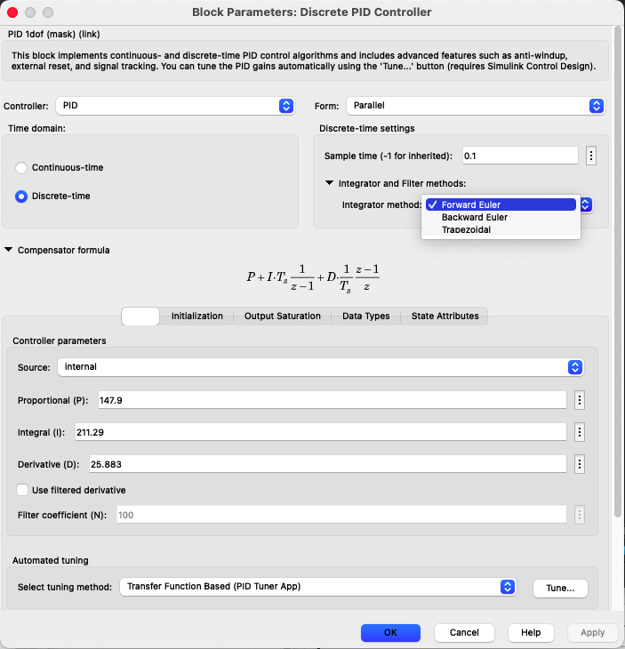

# Projeto de PID

Recuperando dados das aulas passadas:

```matlab
>> load planta
>> zpk(BoG)

  0.00012224 (z+2.747) (z+0.1903)
  --------------------------------
  (z-0.9048) (z-0.8187) (z-0.3679)
 
Sample time: 0.1 seconds
Discrete-time zero/pole/gain model.

>> zpk(G)

          1
  ------------------
  (s+10) (s+2) (s+1)
 
Continuous-time zero/pole/gain model.

>>
```

Para descobrir de forma rápida o *Ultimate Gain*, $K_u$ que poderia ser adotado nesta planta, podemos apelar para o gráfico do *Root-Locus*:

```matlab
>> rlocus(BoG)
>> axis([0 1.1 -0.2 1.1])   % zoom na região de interesse
```

E obtemos o gráfico:


O *Ultimate gain* fica em: $195 < K_u < 258$. Temos que agora, ir variando o valor do ganho proporcional dentro desta faixa para descobrir por tentativa e erro (sem usar o método de Yuri), um bom valor para $K_u$.

Tentando descobrir o valor de $K_u$...

```matlab
>> Ku=246;
>> ftmf_Ku=feedback(Ku*BoG,1);
>> figure; step(ftmf_Ku)
```


```matlab
>> Ku=246.5;
>> ftmf_Ku=feedback(Ku*BoG,1);
>> figure; step(ftmf_Ku)
>> title('Ku = 246.5')
```


Realizando "zoom" no gráfico anterior para inferir o valor de $T_u$ (período de oscilação).

```matlab
>> axis([355 385 -0.1 2.1])
```


Do gráfico anterior:

```matlab
>> Tu=(384-356)/20
Tu =
          1.4
```

Entrando numa tabela de Ziegler-Nichols, ZH: "classic PID", à partir de:
[https://en.wikipedia.org/wiki/Ziegler–Nichols\_method](https://en.wikipedia.org/wiki/Ziegler–Nichols_method) e supondo PID na arquitetura paralela:

```matlab
>>Kp=0.6*Ku
Kp =
        147.9
>> Ki=1.2*Ku/Tu
Ki =
       211.29
>> Kd=0.075*Ku*Tu
Kd =
       25.883
```

Simulando o PID usando Simulink:


Arquivo: [PID_paralelo.slx.r2019b](PID_paralelo.slx.r2019b) ou [PID_paralelo.mdl](PID_paralelo.mdl).

A eq. do PID Discreto do Matlab/Simulink é:

$C(z)=K_p+K_i \cdot T \cdot \dfrac{1}{(z-1)} + K_d \cdot \dfrac{1}{T} \cdot \left( \dfrac{z-1}{z} \right)$

Separando a ação integral teríamos:

$I(z)=K_i \cdot T \cdot \left( \dfrac{1}{z-1} \right)=\dfrac{U(z)}{E(z)}$

reescrevendo na notação de expoentes negativos em $z$ teremos:

$\dfrac{U(z)}{E(z)}=\dfrac{K_i \cdot T}{(z-1)} \cdot \dfrac{z^{-1}}{z^{-1}}$

$\dfrac{U(z)}{E(z)}=\dfrac{K_i \cdot T \cdot z^{-1}}{1-z^{-1}}$

$U(z)\left( 1 - z^{-1}\right) = K_i \cdot T \cdot z^{-1}E(z)$

$U(z)=z^{-1}U(z) + K_i \cdot T \cdot z^{-1}E(z)$

$u[k]=u[k-1]+K_i \cdot T \cdot e[k-1]$

então concluímos que este $K_i$ já corresponde ao ganho para ação integral na versão discreta do PID. Notar que a própria eq. da ação integral já contempla o termo $T$ para calculo da área (neste caso, integração retangular).

Já a ação derivativa corresponde à:

$D(z)=K_d \cdot \dfrac{1}{T} \left( \dfrac{z-1}{z} \right)=\dfrac{U(z)}{E(z)}$

$\dfrac{U(z)}{E(z)}=\dfrac{K_d(z-1)}{T \cdot z} \cdot \dfrac{z^{-1}}{z^{-1}}$

$\dfrac{U(z)}{E(z)}=\dfrac{K_d(1-z^{-1})}{T}$

$U(z)=K_d \left( \dfrac{E(z) - z^{-1}E(z)}{T}\right)$

$u[k]=K_d \left( \dfrac{e[k] - e[k-1]}{T} \right)$

note que: 

$\dot{e}(t) \cong \dfrac{e[k]-e[k-1]}{\Delta t}$ 

E assim, de forma similar ao que ocorre com a ação integral, a parte da equação relacionada com a ação derivativa já leva em conta o período de amostragem $T$.

Sendo assim, os ganho que devem ser adotados para este PID (ciciar  $2 \times$ sobre o bloco PID Discrete para abrir a caixa de Propriedades):



Simulando o sistema com estes valores obtermos a seguinte resposta:


E então percebemos um $\%OS=54,6\%$ (em $t_p=0,791$) e um $t_s=2,961$ segundos (lembrar que o degrau iniciou no instante $t=1$ segundo).

Percebe-se que falta realizar uma sintonia fina sobre estes valores iniciais para os parâmetros no PID.

Se forem usados os valores:

$PID \begin{cases} K_p=90\\K_i=70\\K_d=50 \end{cases}$

obtemos a seguinte resposta:


E agora obtermos melhores resultados: $\%OS=8,8\%$ (em $t_p=0,523$) e $t_s=1,376$.

Fim

---

<script language="JavaScript">
<!-- Hide JavaScript...
var LastUpdated = document.lastModified;
document.writeln ("Fernando Passold, atualizado em " + LastUpdated); // End Hiding -->
</script>