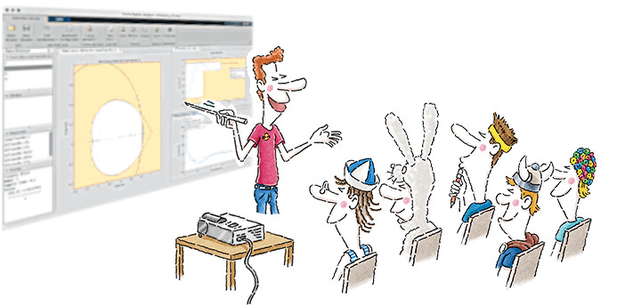

# Projeto de Controladores

Aulas de 2024/1:

*  [aula de 27/03/2024](aula_27032024.html) - controladores Proporcionais; 
*  [aula de 03/04/2024](aula_03042024.html) - controladores I, PI, Lag;
*  [aula de 10/04/2024](aula_10042024.html) - teoria de PD com filtro derivativo, projetos de PD;
*  Controlador Deadbeat - [teste #1](deadbeat.html).
*  [Aula de 17/04/2024](aula_17042024.html) - Controlador Deadbeat na planta do estudo de caso.
*  [Aula de 24/04/2024](aula_24042024.html) - melhorando projeto de controlador Deadbeat.
*  [Aula de 29/05/2024](aula_29052024.html): PID Paralelo com sintonização usando ZH.

Arquivo de dados  [planta.mat](planta.mat)  (usado nas aulas).

----

