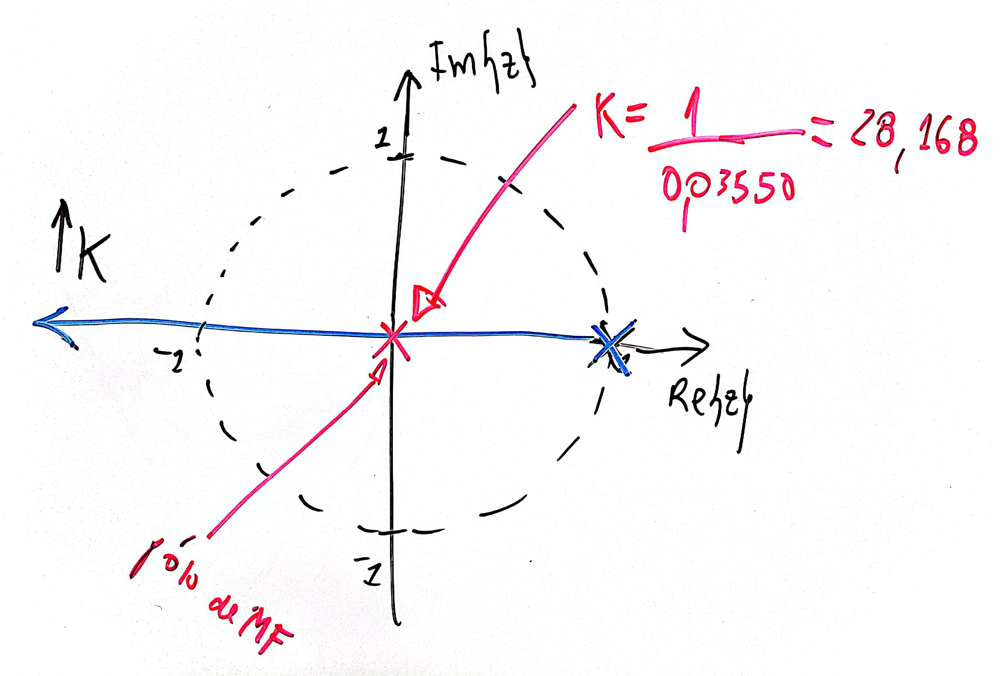
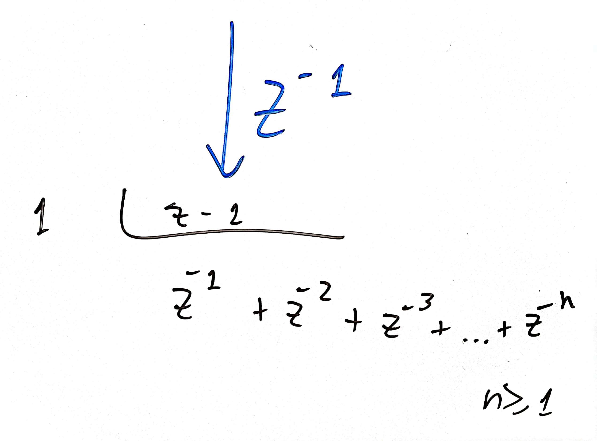
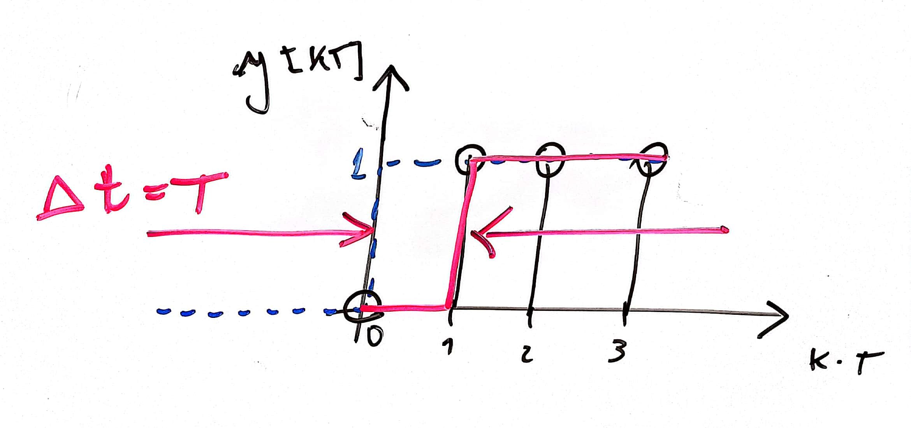
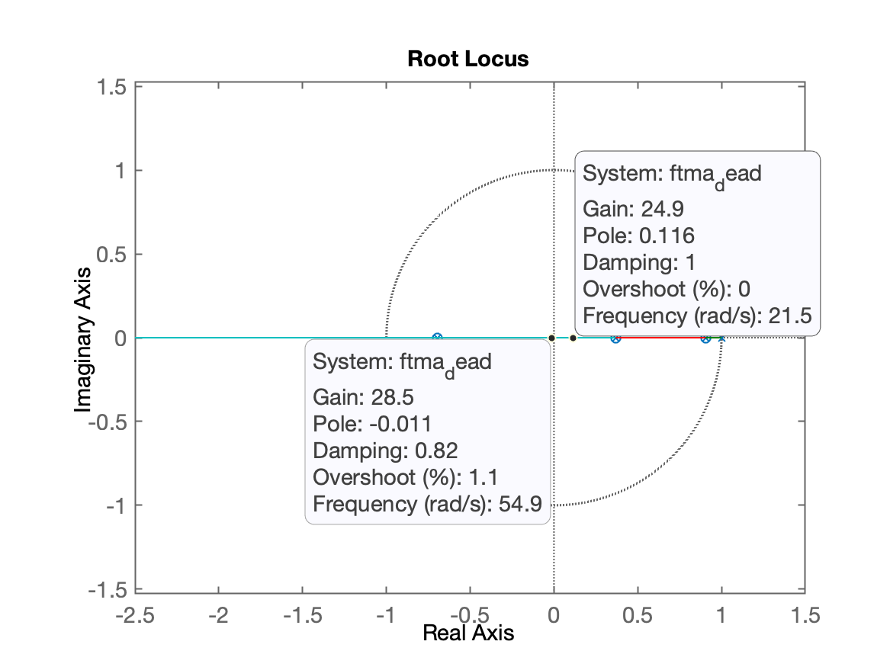
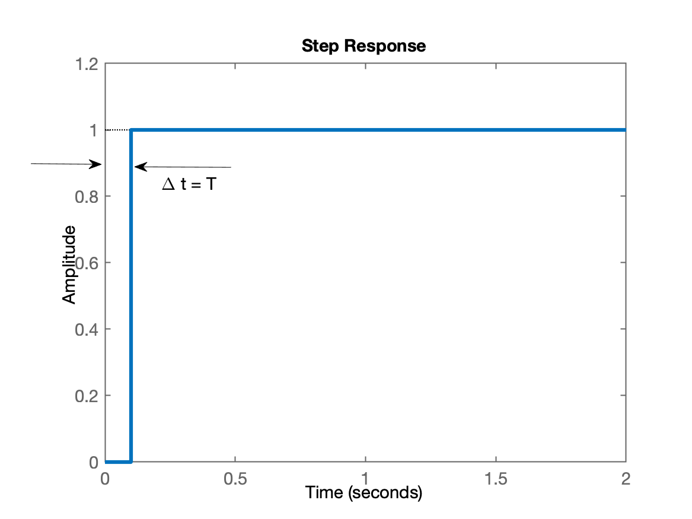

# Controlador Deadbeat

Aula de 17/04/2024.

Suponha a seguinte planta:

$G(s)=\dfrac{10}{(s+1)(s+10)}$

que será amostrada à $T=0.1$:

```matlab
>> T=0.1;
>> G=tf(10,poly([-1 -10]));
>> zpk(G)

ans =

       10
------------
  (s+10) (s+1)

Continuous-time zero/pole/gain model.

>> BoG=c2d(G,T);
>> zpk(BoG)

ans =

   0.035501 (z+0.6945)
  ---------------------
  (z-0.9048) (z-0.3679)

Sample time: 0.1 seconds
Discrete-time zero/pole/gain model.

```

Suponha que a eq. do controlado seja:

 $C(z)=\dfrac{K(z-0.9048) (z-0.3679)}{(z+0.6945)(z-p_1)}$

Note que necessitamos acrescentar um pólo ao controlador, em $z=p_1$. Se este pólo for um integrador, garantimos
$e_{\text{Step}}[\infty]=0$, então:

$C(z)=\dfrac{K(z-0.9048) (z-0.3679)}{(z+0.6945)(z-1)}$

Neste caso, repare que a $FTMA(z)$ fica:

$FTMA(z)=\dfrac{ K \cdot 0.035501 \cancel{(z+0.6945)} \cdot \cancel{(z-0.9048)} \cancel{(z-0.3679)}}{\cancel{(z-0.9048)} \cancel{(z-0.3679)} \cdot \cancel{(z+0.6945)} (z-1)}$

$FTMA(z)=\dfrac{K \cdot 0.035501}{(z-1)}$

Repare que se:

$FTMA(z)=\dfrac{1}{(z-1)}$

vamos ter:

$FTMF(z)=\dfrac{FTMA(z)}{1+FTMA(z)}=\dfrac{ \dfrac{1}{z-1} }{ 1 + \dfrac{1}{z-1}}$

$FTMF(z)=\dfrac{ \dfrac{1}{ \cancel{(z-1)}}}{ \dfrac{z-1+1}{ \cancel{(z-1)} } }=\dfrac{1}{z}$.

repare no pólo de MF em $z=0$.

Ou seja, deliberadamente queremos:



Neste caso, a resposta do sistema para entrada degrau fica:

$Y(z)=\underbrace{R(z)}_{\text{Degrau}} \cdot FTMF(z)$

$Y(z)=\dfrac{ \cancel{z} }{(z-1)} \cdot \dfrac{1}{ \cancel{z} }=\dfrac{1}{z-1}$

Calculando $y[kT]=\mathbb{Z}^{-1}\left\{ Y(z) \right\}$, pelo método da divisão longa:



$y[kT]=z^{-1}+z^{-2}+z^{-3}+\ldots+z^{-n}$

O que graficamente resulta em:



Ou seja: um degrau deslocado exatamente de 1 período de amostragem.

Note que o ganho do controlador, neste caso, deveria ser:

$K \cdot 0.035501 = 1 \quad \therefore \quad K=\dfrac{1}{0.035501}$

Confirmando:

```matlab
>> C_dead=tf(poly(polos_BoG),poly(zeros_BoG), T);
>> zpk(BoG)

ans =
 
   0.035501 (z+0.6945)
  ---------------------
  (z-0.9048) (z-0.3679)
 
Sample time: 0.1 seconds
Discrete-time zero/pole/gain model.

>> Integrador=tf(1,[1 -1],T)

Integrador =
 
    1
  -----
  z - 1
 
Sample time: 0.1 seconds
Discrete-time transfer function.

>> C_dead = C_dead*Integrador;
>> zpk(C_dead)

ans =
 
  (z-0.9048) (z-0.3679)
  ---------------------
    (z-1) (z+0.6945)
 
Sample time: 0.1 seconds
Discrete-time zero/pole/gain model.

>> ftma_dead=C_dead*BoG;
>> zpk(ftma_dead)

ans =
 
  0.035501 (z+0.6945) (z-0.9048) (z-0.3679)
  -----------------------------------------
   (z+0.6945) (z-0.9048) (z-1) (z-0.3679)
 
Sample time: 0.1 seconds
Discrete-time zero/pole/gain model.

>> ftma_dead2=minreal(ftma_dead);
>> zpk(ftma_dead2)

ans =
 
  0.035501
  --------
   (z-1)
 
Sample time: 0.1 seconds
Discrete-time zero/pole/gain model.

>> rlocus(ftma_dead)
>> axis equal
```

Temos o RL:



O ganho do controlador está próximo de $K=28,5$ ou mais exatamente:

```matlab
>> K=1/0.035501
K =
       28.168
>> ftmf=feedback(K*ftma_dead,1);
>> zpk(ftmf)
 
        (z+0.6945) (z-0.9048) (z-0.3679)
  ---------------------------------------------
  (z+0.6945) (z-0.9048) (z-0.3679) (z-1.17e-05)
 
Sample time: 0.1 seconds
Discrete-time zero/pole/gain model.

>> minreal(ftmf)
 
       1
  ------------
  z - 1.17e-05
 
Sample time: 0.1 seconds
Discrete-time transfer function.

>>        
```

Repare, praticamente $FTMF(z)=\dfrac{1}{z-0}$.

A resposta ao degrau fica:

```matlab
>> figure; step(ftmf)
```

Resultando no seguinte gráfico:



---

:point_right: Aplicando ao caso da nossa planta --> ver [aula de 17/04/2024](aula_17042024.html).

---

Fernando Passold, em 17/04/2024.

