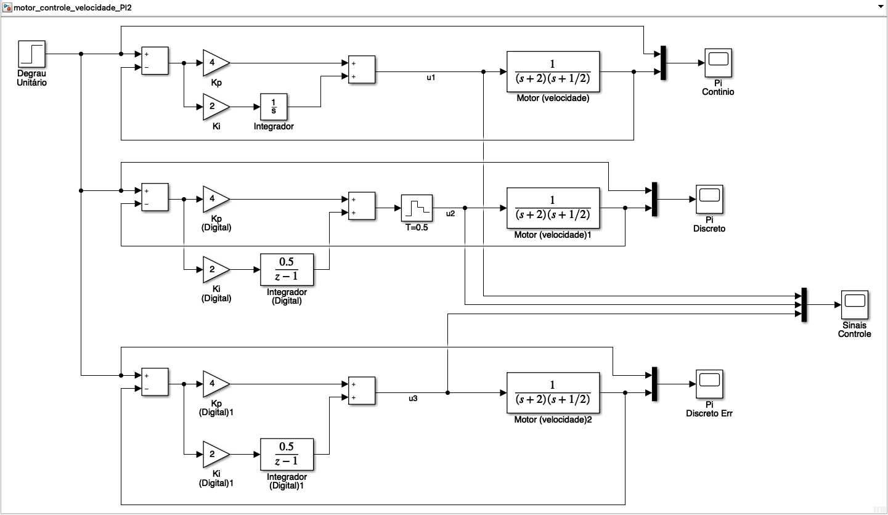
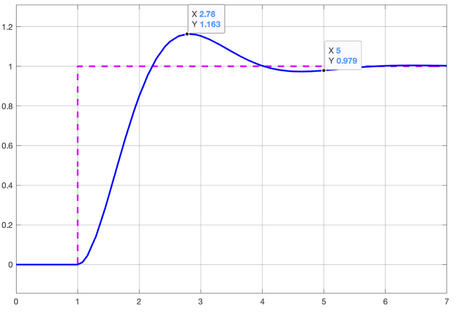
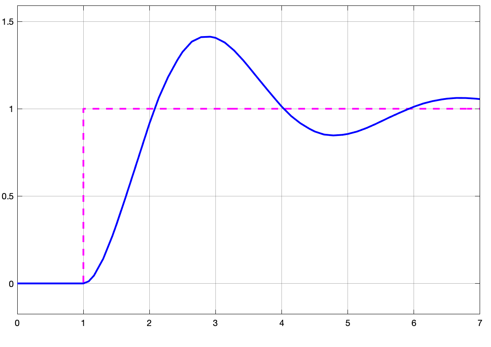

# Impacto do BoG(z)

Neste documento se tenta mostrar o papel do sustentando de ordem-zero dentro da modelagem de um controle digital. A primeira visa, qualquer saída de conversor D/A (de Digital para Analógico), "sustenta" a amplitude gerada entre instantes de amostragem (ou entre os instantes nos quais foi comandado).

Desconsiderar a falta desta "sustentação" na amplitude de um sinal entre instantes de amostragem implica que um conversor D/A pudesse gerar impulsos na amplitude desejada, mas sem sustentar o sinal no período entre instantes de amostragem. Motivo pelo qual, é importante incluir na modelagem de um sistema contínio para o sistema discreto ou digital.

Vamos supor que queremos fechar uma malha de controle de velocidade de um simples motor CC com 2 constante de tempo: $\tau_1=0,5$ segundos (da parte elétrica) e $\tau_2=$ 2 segundos da parte mecânica. Vamos supor ainda que este modelo está "normalizado", isto é, que se ingressamos com um sinal de amplitude unitária, a saída (RPM ou rad/s) também será unitário (relação que simplesmente se denomina "ganho DC"). Neste caso, o o ganho DC deste sistema seria unitário. Ingressando estes dados no Matlab para posterior simulação obtemos:

```matlab
>> p1=1/2			% polo associado a cte2 (mais lenta, parte mecânica)
p1 =
          0.5
>> p2=1/0.5		% polo associado a cte1 (mais rápida, elétrica)
ans =
     2
>> G=tf(1,poly([-0.5 -2]));	% montando a tf do motor/velocidade
>> zpk(G)
ans =
 
        1
  -------------
  (s+2) (s+0.5)
 
Continuous-time zero/pole/gain model.

>> dcgain(G)	% verificando ganho DC desta planta
ans =
     1
>>
```

Este é um sistema do tipo 0, o que significa erro não nulo para entrada degrau. Então vamos acrescentar um controlador PI ao mesmo no momento de fechar sua malha.

Depois de algumas simples tentativas e erro, descobrimos que $K_p=4$ e $K_i=2$ permitem alcançar um bom resultado: $t_s \cong$ 4 segundos com $\%OS \cong$ 16,3% em $t_p \cong$ 0,163 segundos. Isto pode ser observado num diagrama em blocos simulado usando Simulink.

Vamos aproveitar a acrescentar ao diagrama de blocos anterior, uma versão digital do controlador (considerando o sustentando de ordem zero, com é o correto), e uma outra versão, onde o sustentador é " esquecido" e vamos observar os resultados obtidos.

Obs.: A versão digital do integrador fica:

```matlab 
>> I=tf(1,[1 0])

I =
 
  1
  -
  s
 
Continuous-time transfer function.

>> Id=c2d(I,0.5,'matched')	% convertendo do plano-s para plano-z usando definição de transformada-Z

Id =
 
  0.5003
  ------
  z - 1
 
Sample time: 0.5 seconds
Discrete-time transfer function.

>> 
```

Diagrama em blocos usado para as simulações no Simulink (arquivo: [motor_controle_velocidade_PI2.slx](motor_controle_velocidade_PI2.slx)):



Note na figura anterior, que a primeira malha-fechada corresponde a um controle puramente analógico (usando PI analógico). 

O bloco central, representa uma versão digital do mesmo controlador PI anterior. Note o bloco Sustentandor de ordem-zero. Tanto este bloco, quanto o bloco do integrador trabalham com período de amostragem $T=0,5$ segundos. Na prática deveriámos estar trabalhando com 200 ms  para garantir melhores resultados. Mas a idéia neste caso é ascentuar o que ocorre se nos "esquecemos" do bloco sustentador, que é o que ocorre na último bloco (de MF) mostrado na figura anterior.

Se obervamos as saídas geradas (respostas do sistema entre os 3 diferentes modelos), temos:

| Saída sistema contínuo    | Saída PI Digital          | Saída Modelo Incorreto    |
| ------------------------- | ------------------------- | ------------------------- |
|  |  |  |

Até este ponto, a diferença não aparenta ser grande, mas observe como o sinal de controle é diferente nos 3 modelos:


onde $u_1=$ sinal gerado pelo PI analóigico; $u_2=$ sinal (discreto) gerado pelo PI Digital e $u_3=$ sinal gerado pelo PI digital mau incorporado à modelagem.

Note que o sinal $u_3$ **não é** sustentando entre instantes de amostragem, e que o período de amostragem adotado permite perceber que a planta reage de forma livre entre instantes de amostragem à este tipo de sinal. A planta (no terceiro bloco) se comporta como se estivesse recebendo uma sequencia de trem de impulsos e não entradas defrau com nova amplitude a cada instante de amostragem como é o caso de $u_2$.

----

Fernando Passold, em 19/05/2023.

