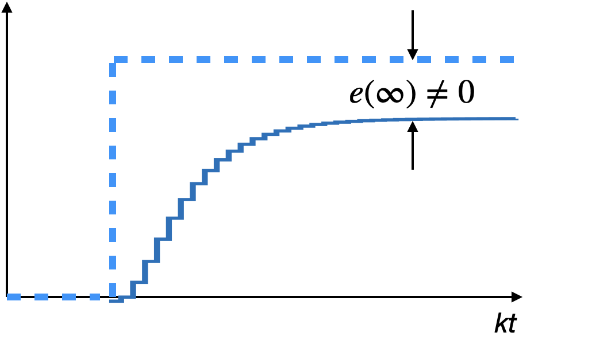
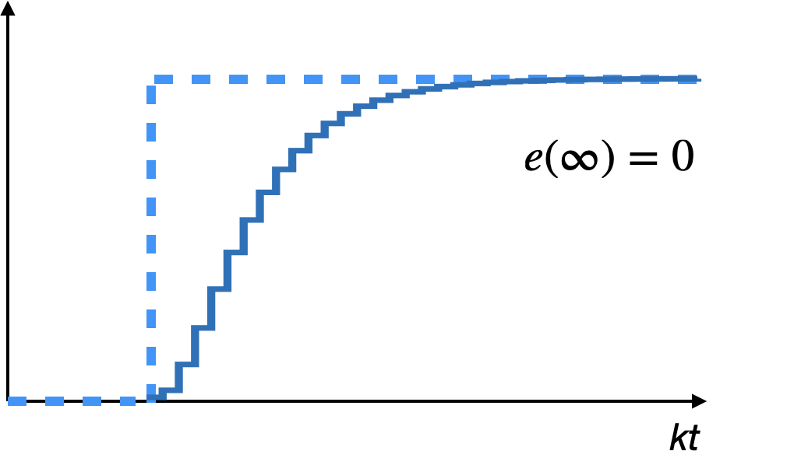
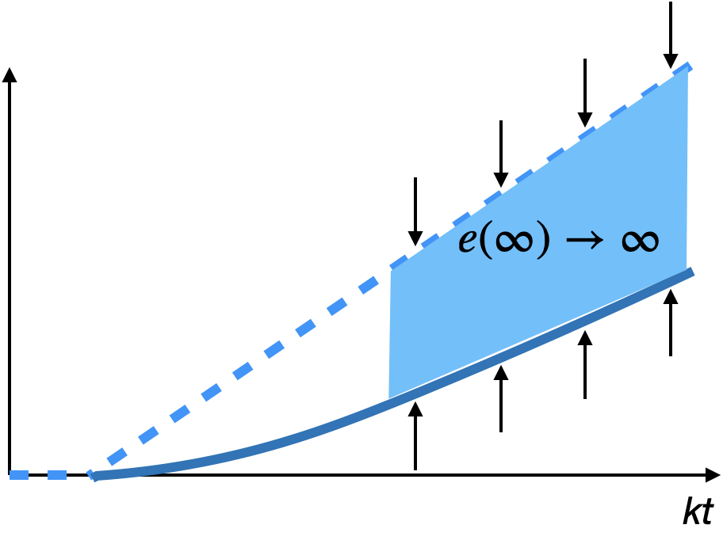
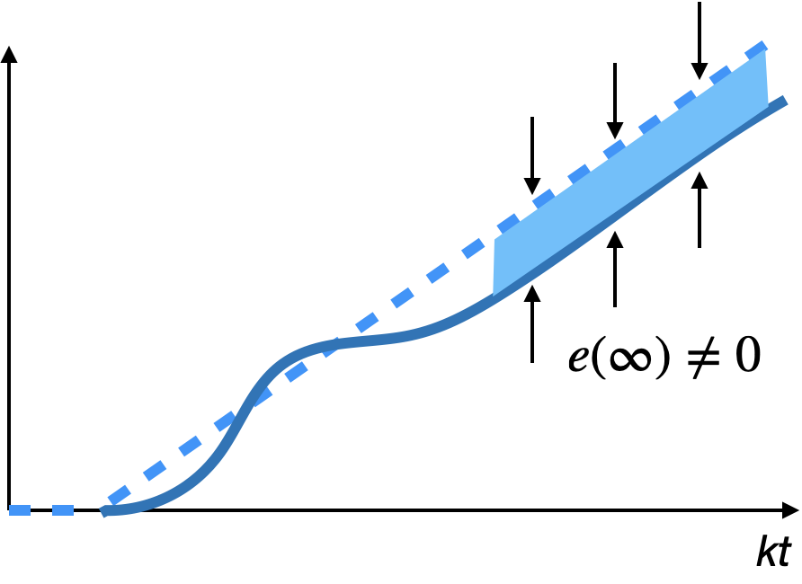
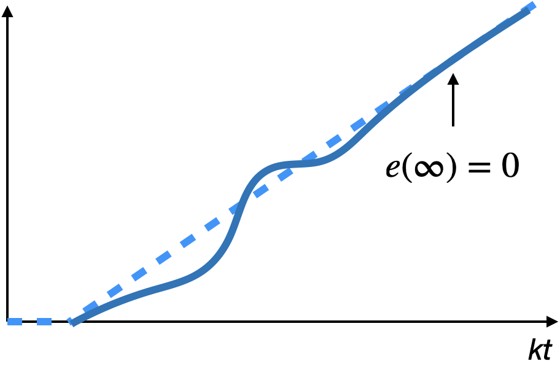
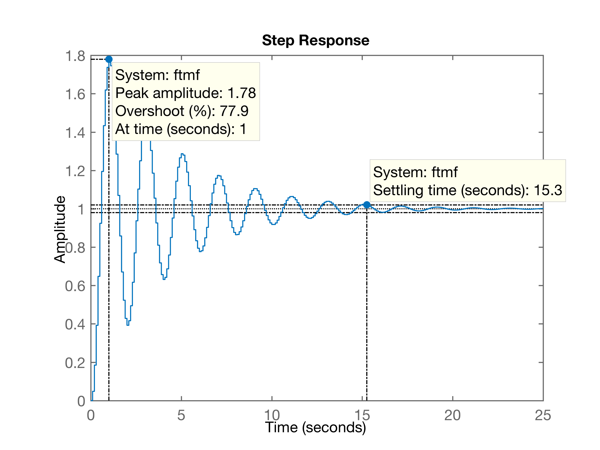
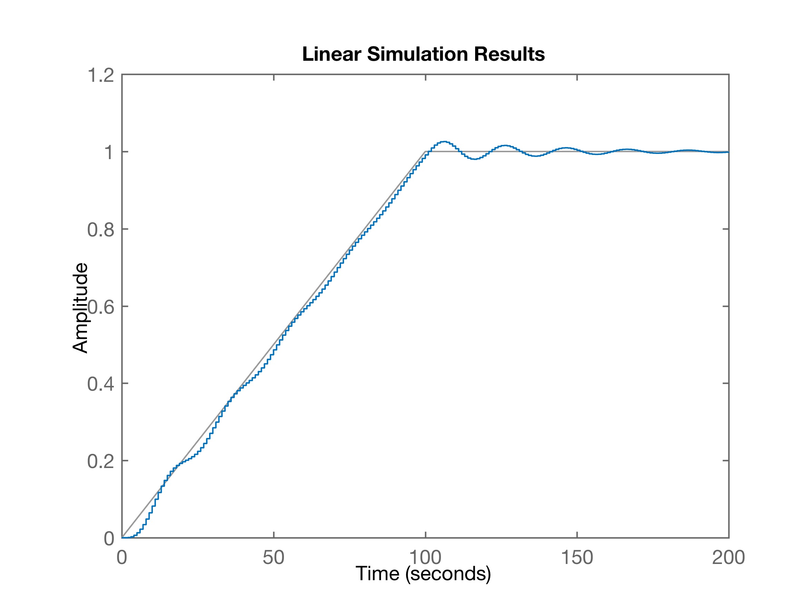
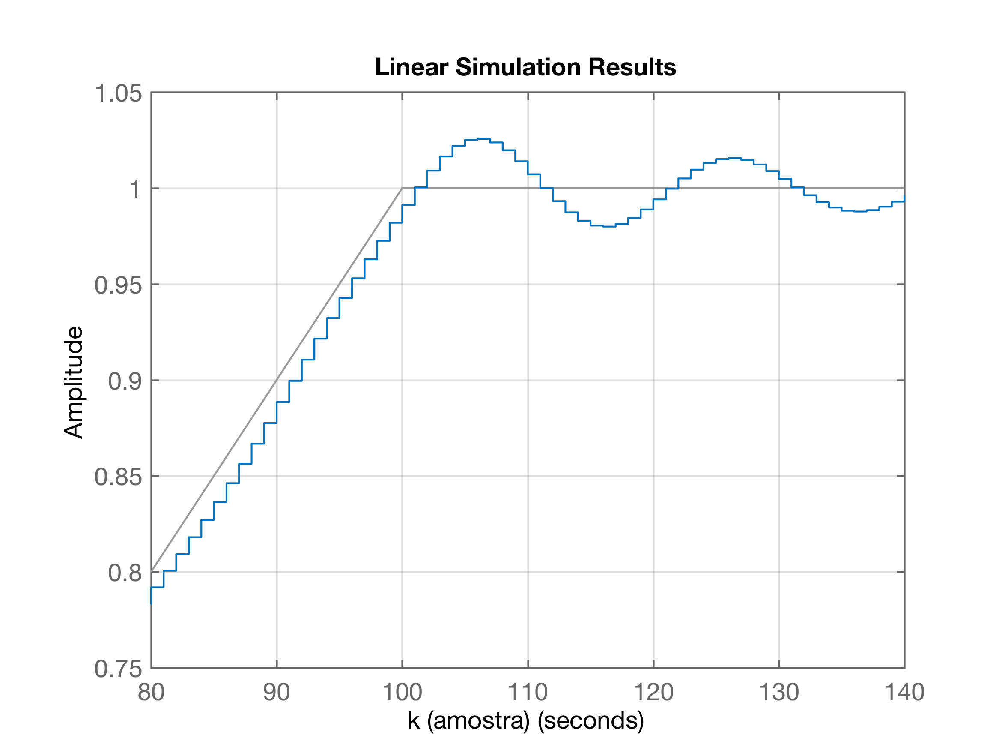

# Resumo Teoria do Erro (ou da Precisão)

<!--Tópico explorado nesta aula:-->

<!--* Cap 4) Teoria do Erro (da Apostila)-->

## Considerações principais

Uma malha de controle típica de "controle digital":


Que completamente retratada no plano-z resulta em:


A eq. que define a relação existente entre a entrada $Y_r(t)$ e a saída deste sistema $y(t)$ é dada por:

$\dfrac{Y(z)}{R(z)}=\dfrac{C(z) \; BoG(z)}{1+C(z)\;BoG(z)}$

ou:

$\dfrac{Y(z)}{R(z)}=\dfrac{FTMA(z)}{1+FTMA(z)}$

Quando isolamos o sinal do Erro a equação fica:

$E(z)=\left[ \dfrac{1}{1+FTMA(z)} \right] \; R(z)$	(eq. (1))

ou seja, o erro só depende de:

* da $FTMA(z)$ e;
* do sinal de referência adotado, $R(Z)$; ou simplesmente: $E=\mathcal{f}\left( R, FTMA\right)$.

Supondo diferentes tipos de sistemas para a $FTMA(z)$ e diferentes sinais de referência $R(z)$ teremos:

$FTMA(z)$ : pode ser um sistema do tipo $n$, onde:

* $n=0$: sistema tipo 0, sistema sem integrador;
* $n=1$: sistema tipo 1 (com 1 integrador);
* tipo $n$ ($n$ integradores).

De modo geral podemos escrever a $FTMA(z)$ como:
$$
FTMF(z)=\dfrac{N(z)}{D(z)}=\dfrac{K(z-z_1)(z-z_2)\cdots(z-zi)}{(z-1)^n(z-p_1)(z-p_2)\cdots(z-p_j)}
$$
onde: $K$ é um “ganho”; num sistema com $i$ zeros, $j$ pólos e eventualmente $n$ integradores.

A questão agora é: **— Como identificar um integrador** (ou mais) dentro de uma $FTMA(z)$ (no plano-z) ?

## Ação Integral

NUm sistema discreto, podemos sintetizar uma ação integral fazendo:

* integração numérica retangular:
  

Tentando generalizar (extrair) uma equação no plano-z para um processo de integração numérica retangular, percebemos que:

Desenvolvendo as equações, supondo que estamos interessados em integrar o erro de malha-fechada de um sistema, $e[k]$ ou $E(z)$, teremos:

> em $k=0 \quad \therefore \quad i[0]=0$
>
> em $k=1 \quad \therefore \quad i[1]=i[0]+T \cdot e[0]$
>
> em $k=2 \quad \therefore \quad i[2]=i[1]+T \cdot e[1]$
>
> e assim por diante, então podemos generalizar esta processe/equação para:
>
> $i[k] = i[k-1]+T \cdot e[k-1]$
>
> A eq. anteior está no formato de “equação de diferenças”, sua transformada $\mathcal{Z}$ rede:
>
> $I(z)=z^{-1}I(z)+T\; z^{-1} \; E(z)$
>
> melhorando a expressão acima:
>
> $I(z)\left[ 1-z^{-1}\right]=T\;z^{-1}\;E(z)$
>
> e finalmente temos que:
>
> $I(z)=\left( \dfrac{T\;z^{-1}}{1-z^{-1}} \right) E(z)$
>
> ou:

$I(z)=\dfrac{T}{ \textcolor{blue}{(z-1)} } \cdot E(z)$

onde $E(z)$ é o sinal que está sendo integrado (o erro do sistema) e $I(z)$ é o resultado da integração. 

Note o pólo em $z=1$, o **Integrador**.

* no caso de uma integração numérica trapezoidal:
  

Desenvolvendo as equações para este caso resulta:

> Lembrando do cálculo da área de um trapézio:
> 
> $A=\left( \dfrac{B+b}{2} \right) \cdot h$
> 
> onde: $B=$ base maior; $b=$ base menor; $h=$ "altura" do trapézio. Neste caso, as "bases" correspondem aos valores dos erros amostrados e a "altura" corresponde a passagem de tempo, ou período de amostragem adotado, $T$.
> 
> Então:
> 
> em $k=0 \quad \therefore \quad i[0]=0$
>
> em $k=1 \quad \therefore \quad i[1]=i[0]+T \left( \dfrac{e[1]+e[0]}{2} \right)$
>
> em $k=2 \quad \therefore \quad i[2]=i[1]+ \dfrac{T}{2} \cdot \left( e[2] + e[1] \right)$
>
> e assim por diante, então podemos generalizar este processo/equação para:
>
> $i[k] = i[k-1]+ \dfrac{T \left( e[k] + e[k-1] \right)}{2}$
>
> A eq. anteior está no formato de “equação de diferenças”, sua transformada $\mathcal{Z}$ rede:
>
> $I(z)=z^{-1}I(z)+ \dfrac{T}{2} E(z) \left( 1 + z^{-1} \right)$
>
> melhorando a expressão acima:
>
> $I(z)\left[ 1-z^{-1}\right]=\dfrac{T}{2}E(z)\left( 1 + z^{-1} \right)$
>
> e finalmente temos que:
>
> $I(z)=\dfrac{T}{2 }\cdot \dfrac{(1+z^{-1})}{(1-z^{-1})} \cdot E(z)$
>
> ou:

E assim chegaremos à:

$I(z)=\dfrac{T}{2} \cdot \dfrac{(z+1)}{\textcolor{blue}{(z-1)}} \cdot E(z)$

**Note que**: Nos 2 casos, sempre surge um __pólo em $z=1$__. 

**Conclusão final**: Um pólo em $z=1$ caracteriza o que chamamos de __ação integral__.

## Determinando o erro

Lembrando da eq. (1), temos que:

$E(z)=\left[ \dfrac{1}{1+FTMA(z)} \right] \; R(z)$

Usando da **Propriedade da Transformada-$\mathbb{Z}$: Valor final**, temos que:

$e(\infty) = \mathop {\lim }\limits_{k \to \infty} \; e(kT) = \mathop {\lim }\limits_{z \to 1} \;\; (z-1) \cdot \left( \dfrac{1}{1+FTMA(z)} \right) \cdot R(z)$

Notamos que erro só depende do sinal referência, $R(z)$, e da função transferência de malha direta, $FTMA(z)$. Ou seja, ele pode variar com o tipo de sinal de referência aplicado num sistema e pode ser modificado se a $FTMA(z|)$ for convenientemente alterada através de um cuidadoso projeto do controlador da malha, $C(z)$, lembrando que:

$FTMA(s)=C(z)\cdot BoG(z)$

Para continuar podemos considerar diferentes sinais de referência e tentar prever o valor do erro.

### Sinais de referência típicos

| Entrada:    | Domínio tempo:                                               | Tranformada $\mathcal{Z}$                                    | Gráfico                       |
| ----------- | ------------------------------------------------------------ | ------------------------------------------------------------ | ----------------------------- |
| Degrau:     | $$u(t) = \left\{ \begin{array}{ll}0, & t<0\\ \textcolor{blue}{A} \cdot 1, & t \ge 0	\end{array} \right.$$ | ${ U(z)=\dfrac{\textcolor{blue}{A} \; z}{z-1} }$             |                               |
| Rampa:      | $r(t) = \left\{ \begin{array}{ll} 0, & t<0\\ \textcolor{blue}{A} \cdot t, & t \ge 0 \\ \end{array} \right.$ | $R(z)= \dfrac{\textcolor{blue}{A} \cdot T \, z}{(z-1)^2}$    |        |
| Parabólica: | $r(t) = \left\{ \begin{array}{ll} 0, & t<0\\ \textcolor{blue}{A} \cdot \frac{1}{2} \, t^2, & t \ge 0 \\ \end{array} \right.$ | $R(z)=  \dfrac{\textcolor{blue}{A} \; T^2 \, z(z+1)}{2 \, (z-1)^3}$ |  |

Analisando alguns casos...

### Erro para Entrada Degrau

Erro para entrada degrau:

$e_{step}(\infty)=\displaystyle\lim_{z \to 1} (z-1) \cdot \dfrac{1}{(1+FTMA(z)} \cdot \underbrace{\dfrac{z}{(z-1)}}_{\text{Degrau}}$

$e_{step}(\infty)=\displaystyle\lim_{z \to 1} \cancel{(z-1)} \cdot \dfrac{1}{(1+FTMA(z)} \cdot \dfrac{z}{ \cancel{(z-1)} }$

$e_{step}(\infty)= \dfrac{1}{1 + \displaystyle\lim_{z \to 1} FTMA(z)}$

Temos que agora analisar para diferentes tipos de sistemas (para a $FTMA(z)$).

#### Erro para Entrada Degrau e Sistema tipo 0

Se a $FTMA(z)$ corresponde à um sistema do tipo 0 (sem integrador), então:

$FTMA(z)=\dfrac{N(z)}{D(z)}=\dfrac{K(z-z_1) \cdots (z-z_n)}{(z-p_1)\cdots(z-p_m)}$

Teremos então que:

$\displaystyle\lim_{z \to 1} FTMA(z)=\displaystyle\lim_{z \to 1} \dfrac{K(z-z_1) \cdots (z-z_n)}{(z-p_1)\cdots(z-p_m)}=\dfrac{K(z_1)\cdots(z_n)}{(p_1)\cdots(p_m)}=\dfrac{cte_1}{cte_2}=cte_3$

e assim:

$e_{step}(\infty)= \dfrac{1}{1 + \displaystyle\lim_{z \to 1} FTMA(z)} = \dfrac{1}{1 + cte_3}=cte_4 \quad \ne \quad 0$

Algo como mostrado na próxima figura:



ou seja, concluímos que leva à um erro constante diferente de zero (não nulo), mas constante (limitado).

Note que a constante $cte_3$ é chamada de "==constante de posição==" (ou constante do erro estático de posição), e assim esta equação fica generalizada para:

$e_{step}(\infty)=\dfrac{1}{1+\displaystyle\lim_{z \to 1} FTMA(z)}=\dfrac{1}{(1+K_P)}$ 

Onde: $K_p=\displaystyle\lim_{z \to 1} FTMA(z)$.

#### Erro para entrada degrau e sistema tipo 1

Se a $FTMA(z)$ corresponde à um sistema do tipo 1 (com 1 integrador), então:

$FTMA(z)=\dfrac{N(z)}{D(z)}=\dfrac{K(z-z_1) \cdots (z-z_n)}{ \textcolor{blue}{(z-1)} \cdots(z-p_m)}$

Teremos então que:

$K_p = \displaystyle\lim_{z \to 1} FTMA(z) = \displaystyle\lim_{z \to 1} \dfrac{K(z-z_1) \cdots (z-z_n)}{ \textcolor{blue}{(z-1)} \cdots(z-p_m)} = \dfrac{K(z_1)\cdots(z_n)}{ \underbrace{(z-1)}_{\to 0} \cdots (p_m) }=\dfrac{cte_1}{ \underbrace{(z-1)}_{\to 0} \cdot cte_2} = \dfrac{cte_1}{\to 0}=\infty$, 

o que implica em:

$e_{step}(\infty)= \dfrac{1}{1 + \infty} = \dfrac{1}{\infty}= 0$

Algo como:



ou seja, o erro tende à zero, isto significa que a saída converge para o mesmo valor da rampa (sem erro em regime permanente).

#### Entrada degrau e sistemas tipo $>1$

Podemos repetir o raciocínio da entrada degrau para sistemas maiores que 1 e também vamos concluir que neste caso, para entrada degrau, basta um integrador presente na malha-direta para que $e(\infty)=0$.

### Erro para entrada Rampa

Neste caso, a equação do erro fica:

$e_{Ramp}(\infty)=\displaystyle\lim_{z \to 1} \cancel{(z-1)} \left[ \dfrac{1}{1+FTMA(z)}\right] \cdot \dfrac{T\;z}{ (z-1)^{\textcolor{blue}{\cancel{2}^1} } }$

$e_{Ramp}(\infty)=\dfrac{T}{ \displaystyle\lim_{z \to 1} \; (z-1) \; FTMA(z) }=\dfrac{T}{K_v}$

Neste caso, surge a ==constante de velocidade==, $K_v$ (constante do erro estático de velocidade):

$K_v=\displaystyle\lim_{z \to 1} \; (z-1) \cdot FTMA(z)$

#### Erro para Entrada Rampa e sistema tipo 0

Neste caso, a $FTMA(z)$ é do tipo:

$FTMA(z)=\dfrac{N(z)}{D(z)}=\dfrac{K(z-z_1) \cdots (z-z_n)}{(z-p_1)\cdots(z-p_m)}$

A constante de velocidade fica:

$K_v=\displaystyle\lim_{z \to 1} \; (z-1) \cdot FTMA(z) = \overbrace{(z-1)}^{\to 0} \cdot \dfrac{K(z_1)\cdots(z_n)}{(p_1)\cdots(p_m)} = 0$

E então:

$e_{Ramp}(\infty)=\dfrac{T}{ \displaystyle\lim_{z \to 1} \; (z-1) \; FTMA(z) }=\dfrac{T}{K_v}=\dfrac{T}{\to 0} \to \infty$

Algo do tipo:



ou seja, a saída do sistema não converge (não consegue acompanhar a rampa) e o erro é cada vez maior, ou tendendo ao $\infty$.

#### Erro para Entrada Rampa e sistema tipo 1

Neste caso, a $FTMA(z)$ é do tipo:

$FTMA(z)=\dfrac{N(z)}{D(z)}=\dfrac{K(z-z_1) \cdots (z-z_n)}{ \textcolor{blue}{(z-1)} \cdots(z-p_m)}$

A constante de velocidade fica:

$K_v=\displaystyle\lim_{z \to 1} \; (z-1) \cdot FTMA(z)$

$K_v=\displaystyle\lim_{z \to 1} \dfrac{ \cancel{(z-1)} \cdot K(z-z_1) \cdots (z-z_n)}{ \cancel{(z-1)} \cdots (z-p_m)}$

$K_v=\dfrac{K(z_1)\cdots(z_n)}{(p_1)\cdots(p_m)}=\dfrac{cte_1}{cte_2}=cte_3$.

E então:

$e_{Ramp}(\infty)=\dfrac{T}{K_v}=\dfrac{T}{cte_3} = cte_4$

Ou algo como:



ou seja, a saída do sistema converge para determinado valor, um valor não nulo, ou seja, um erro em regime permanente. Isto significa que passado um certo período de tempo (o período transitório), a saída do sistema acompanha a rampa de forma "paralela", mantendo um erro constante.

#### Erro para Entrada Rampa e sistema tipo 2

Neste caso, a $FTMA(z)$ é do tipo:

$FTMA(z)=\dfrac{N(z)}{D(z)}=\dfrac{K(z-z_1) \cdots (z-z_n)}{ \textcolor{blue}{(z-1)^2} \cdots (z-p_m)}$

A constante de velocidade fica:

$K_v=\displaystyle\lim_{z \to 1} \; (z-1) \cdot FTMA(z)$

$K_v=\displaystyle\lim_{z \to 1} \dfrac{ \cancel{(z-1)} \cdot K(z-z_1) \cdots (z-z_n)}{ (z-1)^{ \cancel{\textcolor{blue}{2}}^1 } (z-p_1) \cdots (z-p_m)}$

$K_v=\dfrac{cte_1}{ \underbrace{\displaystyle\lim_{z \to 1}(z-1)}_{\to 0} \cdot cte_2}=\dfrac{cte_1}{\to0}=\infty$.

E então:

$e_{Ramp}(\infty)=\dfrac{T}{K_v}=\dfrac{T}{\infty}=0$

Numa figura:



ou seja, a saída do sistema converge para o mesmo valor da rampa, ou seja, irá acompanhar a rampa sem nenhum erro.

### Erro para Entrada Parabólica

Neste caso, a equação do erro fica:

$e_{Parabola}(\infty)=\displaystyle\lim_{z \to 1} \cancel{(z-1)} \left[ \dfrac{1}{1+FTMA(z)}\right] \cdot \dfrac{T^2\;z(z+1)}{ 2(z-1)^{\textcolor{blue}{\cancel{3}^2} } }$

$e_{Ramp}(\infty)=\dfrac{T}{ \displaystyle\lim_{z \to 1} \; (z-1) \; FTMA(z) }=\dfrac{T}{K_v}$

$e_{Parabola}(\infty)=\dfrac{T^2}{ \displaystyle\lim_{z \to 1} \; (z-1)^2 \; FTMA(z) }=\dfrac{T^2}{K_a}$

Onde: $K_a=\displaystyle\lim_{z \to 1} \; (z-1)^2 \; FTMA(z)$.

$K_a$ se refere à ==constante de aceleração== (ou constante do erro estático de aceleração).

#### Erro Entrada Rampa para Sistemas

Obedecendo aos raciocínios anteriores, vamos perceber que só vamos começar a limitar o erro para uma entrada parabólica quando a malha-direta do sistema contiver 2 integradores (sistema tipo 2). 

Para sistemas menores que 2 (1 integrador ou menos), o erro nunca vai convergir, isto é, é $\infty$, significando que o sistema nunca vai conseguir acompanhar a parábola.


Por fim, podemos resumir as conclusões numa "Tabela Resumo de Erros":

## Tabela resumo de erros


Isto significa que:

* Sistemas tipo 0 ($FTMA(z)$ sem pólo em $z=1$, sem integrador), sempre resultarão em algum erro ($cte \ne 0$) para entrada degrau; felizmente um erro constante que não aumenta com o passar do tempo (mas que também não diminui). Isto é válido independente do ganho (de malha fechada) adotado para o sistema.

* Sistemas tipo 0 se submetidos à entradas de mais alta ordem (rampa ou parábola), não vão conseguir acompanhar a referência. Ou seja, a medida que o tempo passa, o erro só aumenta; ele não convege ($e_{Ramp}(\infty)=\infty$ e $e_{Parab.}(\infty)=\infty$). 
  
  


---

## Exemplo

Seja uma planta definida no mundo contínuo como:

$G(s)=\dfrac{10}{s(s+1)}$

Suponha que queremos verificar como este sistema se comporta em MF para entradas degrau e rampa, fechando a malha com um simples controlador proporcional (com ganho unitário).

Ingressando estes dados no Matlab para calcular $BoG(z)$:

```matlab
>> G=tf(10, poly([0 -1]) );
>> zpk(G)

    10
-------
  s (s+1)

Continuous-time zero/pole/gain model.

>> % Digitalizando sistema, calculando $BoG(z)$:
>> 
>> T=0.1; % informando periodo de amostragem na varivel T
>> BoG = c2d( G, T);
>> zpk(BoG)

  0.048374 (z+0.9672)
  -------------------
   (z-1) (z-0.9048)

Sample time: 0.1 seconds
Discrete-time zero/pole/gain model.
```

### Calculando erros:

Usando o Matlab… Note que a função `dcgain()` do Matlab é capaz de trabalhar com argumentos de entrada sendo *transfer functions* tanto no plano-s quanto no plano-z. Ela realiza:

| Plano-s                                                      | Plano-z                                                      |
| ------------------------------------------------------------ | ------------------------------------------------------------ |
| `dcgain(FTMA(s))`=<br/>$=\mathop {\lim }\limits_{s \to 0} FTMA(s)$ | `dcgain(FTMA(z))`=<br/>$=\mathop {\lim }\limits_{z \to 1} FTMA(z)$ |

Então podemos usar esta função para calcular os ganhos (dos erros estáticos) de erro:

```matlab
>> Kp= dcgain(BoG)
>> Kp =
   Inf
>> BoGKv= BoG*tf([1 -1], 1, T); % acrescentando numerador (z-1)
>> zpk(BoGKv)

  0.048374 (z-1) (z+0.9672)
  -------------------------
      (z-1) (z-0.9048)

Sample time: 0.1 seconds
Discrete-time zero/pole/gain model.

>> Kv=dcgain(BoGKv)
>> Kv =
    1.0000
>> erro_degrau=1/(1+Kp)
>> erro_degrau =
     0
>> erro_rampa=T/Kv
>> erro_rampa =
    0.1000
```

### Simulando resposta em  MF para entrada degrau

Fechando a malha e verificando resposta do sitema:

No Matlab:

```matlab
ftmf=feedback(1*BoG, 1);
figure; step(ftmf)
```

Obtendo a figura:



Conforme esperado, nota-se que a saída converge para o mesmo valor da referência, ou seja, o erro em regime permanente é nulo. Mas também se percebe que a resposta é um tanto oscilatória e com *overshoot* elevado, o que significa que mesmo adotar gannho unitário é algo elevado para este sistema.

### Simulando MF com entrada rampa

Usando Matlab:

```matlab
>> t=0:T:20; % cria vetor tempo com amostras espaçadas de T segundos
>> r=0.1*t;  % cria o vetor rampa (ou referência)
>> figure; plot(t, r) % pode ser usado para comprovar o gráfico da rampa
>> % Mas queremos "trucar" rampa a partir de t=10 segundos
>> 10/T
ans =
   100
>> % Isto ocorre na amostra de número 100
>> r(100) % verificando amplitude da rampa para indice=100
ans =
    0.9900
>> r(101) % indice=101 corresponde a amostra k=100
ans =
     1
>> size(r) % comprovando tamanho do vetor r
ans =
     1   201
>> r(101:201)=1; % truncando rampa a partir de t=10 segundos, em amplitude=1
>> plot(t,r) % pode ser usado para comprovar o gráfico da rampa truncada
```

Fechando a malha, mas para versão contínua do sistema (à título de comparação)

```matlab
>> ftmf_c=feedback(1*G, 1); % note que variável 'ftmf'= MF versão digital!
>> zpk(ftmf_c)

        10
--------------
  (s^2 + s + 10)

Continuous-time zero/pole/gain model.

>> % comparando com versão digital da FTMF:
>> zpk(ftmf) 

    0.048374 (z+0.9672)
-----------------------
  (z^2 - 1.856z + 0.9516)

Sample time: 0.1 seconds
Discrete-time zero/pole/gain model.

>> figure; lsim(ftmf_c, r, t); % simulando sistema para referencia r customizada
```

A próxima figura mostra a resposta para entrada rampa truncada para sistema $G(s)$ em malha-fechado usando simples controlador Proporcional com ganho unitário:


Simulando a resposta mas a versão “digitalizada do sistema”… Neste caso, usando a variante "discreta" da função `lsim()`. Note que a função `dlsim()` ao contrário de `lsim`, não admite que argumento de entrada seja uma *transfer function*. Então necessitamos, "expandir" a *transfer function* digital para uma versão que contenha o polinômio (coeficientes) do numerador e denominador em variáveis separadas, usando a função `tfdata(<transfer_function>, ‘v’)` - note que o segundo argumento de entrada desta função deve ser `’v’` (de “verbouse”).

```matlab
>> help dlsim
 <strong>dlsim</strong>  Simulation of discrete-time linear systems.
    <strong>dlsim</strong>(A,B,C,D,U)  plots the time response of the discrete system:

        x[n+1] = Ax[n] + Bu[n]
        y[n]   = Cx[n] + Du[n]
     
    to input sequence U.  Matrix U must have as many columns as there
    are inputs, u.  Each row of U corresponds to a new time point.
    <strong>dlsim</strong>(A,B,C,D,U,X0) can be used if initial conditions exist.
     
    <strong>dlsim</strong>(NUM,DEN,U) plots the time response of the transfer function
    description  G(z) = NUM(z)/DEN(z)  where NUM and DEN contain the 
    polynomial coefficients in descending powers of z.  If 
    LENGTH(NUM)=LENGTH(DEN) then <strong>dlsim</strong>(NUM,DEN,U) is equivalent to 
    FILTER(NUM,DEN,U).  When invoked with left hand arguments,
        [Y,X] = <strong>dlsim</strong>(A,B,C,D,U)
        [Y,X] = <strong>dlsim</strong>(NUM,DEN,U)
    returns the output and state time history in the matrices Y and X.
    No plot is drawn on the screen.  Y has as many columns as there 
    are outputs and LENGTH(U) rows.  X has as many columns as there 
    are states and LENGTH(U) rows. 
     
    See also:  <a href="matlab:help lsim">lsim</a>, <a href="matlab:help step">step</a>, <a href="matlab:help impulse">impulse</a>, <a href="matlab:help initial">initial</a>.
```

Obtendo o numerador e denominador de $FTMF(z)$ em variáveis separadas:

```matlab
>> [numd,dend]=tfdata(ftmf,'v')
numd =
         0    0.0484    0.0468
dend =
    1.0000   -1.8565    0.9516
>> figure; dlsim(numd, dend, r)
```

E então finalmente se obtêm a resposta do sitema digitalizado, em malha fechada, usando controlador proporcional (ganho unitário):



Note que este gráfico é semelhante ao obtido para a $FTMF(s)$.

| Resposta $FTMF(s)$                                           | Resposta $FTMF(z)$                                           |
| ------------------------------------------------------------ | ------------------------------------------------------------ |
|  |  |


Fim.

---

Fernando Passold, em 07.04.2021 (revisado em 01/04/2024).