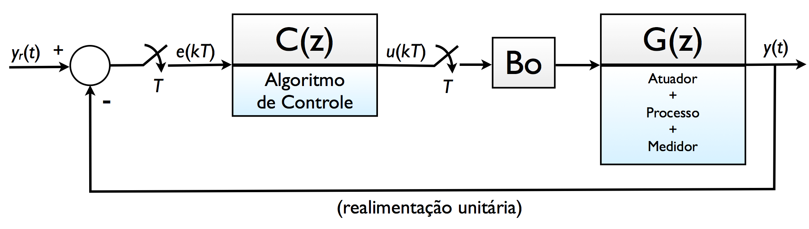
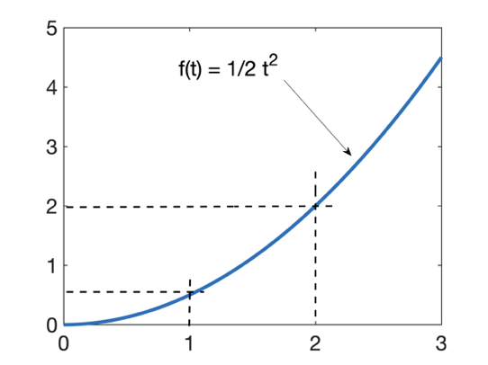

# Resumo Teoria do Erro (ou da Precisão)

Tópico explorado nesta aula:

* Cap 4) Teoria do Erro (da Apostila)

## Considerações principais

Uma malha de controle típica de "controle digital":

Que completamente retratada no plano-z resulta em:

A eq. que define a relação existente entre a entrada $Y_r(t)$ e a saída deste sistema $y(t)$ é dada por:

$\dfrac{Y(z)}{R(z)}=\dfrac{C(z) \; BoG(z)}{1+C(z)\;BoG(z)}$

ou:

$\dfrac{Y(z)}{R(z)}=\dfrac{FTMA(z)}{1+FTMA(z)}$

Quando isolamos o sinal do Erro a equação fica:

$E(z)=\left[ \dfrac{1}{1+FTMA(z)} \right] \; R(z)$

ou seja, o erro só depende de:

* da $FTMA(z)$ e;
* do sinal de referência adotado, $R(Z)$; ou simplesmente: $E=\mathcal{f}\left( R, FTMA\right)$.

Supondo diferentes tipos de sistemas para a $FTMA(z)$ e diferentes sinais de referência $R(z)$ teremos:

$FTMA(z)$ : pode ser um sistema do tipo:

* 0 (sem integrador);
* tipo 1 (1 integrador);
* tipo $n$ ($n$ integradores).

De modo geral podemos escrever a $FTMA(z)$ como:
$$
FTMF(z)=\dfrac{N(z)}{D(z)}=\dfrac{K(z-z_1)(z-z_2)\cdots(z-zi)}{(z-1)^n(z-p_1)(z-p_2)\cdots(z-p_j)}
$$
onde: $K$ é um “ganho”; num sistema com $i$ zeros, $j$ pólos e eventualmente $n$ integradores.

A questão agora é: **— Como distinguit um integrador** (ou mais) dentro de uma $FTMA(z)$ (no plano-z) ?

## Ação Integral

Um sistema com ação integral fica:

* no caso de integração numérica retangular:
  

Tentando generalizar (extrair) uma equação no plano-z para um processo de integração numérica retangular, percebemos que:

> em $k=0 \quad \therefore \quad i[0]=0$
>
> em $k=1 \quad \therefore \quad i[1]=i[0]+T \cdot g[0]$
>
> em $k=2 \quad \therefore \quad i[2]=i[1]+T \cdot g[1]$
>
> e assim por diante, então podemos generalizar esta processo/equação para:
>
> $i[k] = i[k-1]+T \cdot g[k-1]$
>
> A eq. anteior está no formato de “equação de diferenças”, sua transformada $\mathcal{Z}$ rede:
>
> $I(z)=z^{-1}I(z)+T\; z^{-1} \; G(z)$
>
> melhorando a expressão acima:
>
> $I(z)\left[ 1-z^{-1}\right]=T\;z^{-1}\;G(z)$
>
> e finalmente temos que:
>
> $I(z)=\left( \dfrac{T\;z^{-1}}{1-z^{-1}} \right) G(z)$
>
> ou:

$I(z)=\dfrac{T}{(z-1)} \cdot G(z)$

onde $G(z)$ é o sinal que está sendo integrado e $I(z)$ é o resultado da integração. Note o pólo em $z=1$, o **Integrador**.

* no caso de integração numérica trapezoidal:
  

Desenvolvendo as equações chegaremos à:

$I(z)=\dfrac{T}{2} \cdot \dfrac{(z+1)}{(z-1)} \cdot G(z)$

**Note que**: Nos 2 casos, sempre surge um __pólo em $z=1$__. 

Um pólo em $z=1$ caracteriza o que chamamos de __ação integral__.

## Sinais de referência típicos

| Entrada:    | Domínio tempo:                                               | Tranformada $\mathcal{Z}$                                    | Gráfico                       |
| ----------- | ------------------------------------------------------------ | ------------------------------------------------------------ | ----------------------------- |
| Degrau:     | $$u(t) = \left\{ \begin{array}{ll}0, & t<0\\ \textcolor{blue}{A} \cdot 1, & t \ge 0	\end{array} \right.$$ | ${ U(z)=\dfrac{\textcolor{blue}{A} \; z}{z-1} }$             |                               |
| Rampa:      | $r(t) = \left\{ \begin{array}{ll} 0, & t<0\\ \textcolor{blue}{A} \cdot t, & t \ge 0 \\ \end{array} \right.$ | $R(z)= \dfrac{\textcolor{blue}{A} \cdot T \, z}{(z-1)^2}$    |        |
| Parabólica: | $r(t) = \left\{ \begin{array}{ll} 0, & t<0\\ \textcolor{blue}{A} \cdot \frac{1}{2} \, t^2, & t \ge 0 \\ \end{array} \right.$ | $R(z)=  \dfrac{\textcolor{blue}{A} \; T^2 \, z(z+1)}{2 \, (z-1)^3}$ |  |

## Determinando o erro

A eq. geral para erro de regime permanente fica:

$E=\mathcal{f}\left( R, FTMA\right)$, no plano-z:

$E(z)=\left[ \dfrac{1}{1+FTMA(z)} \right] \; R(z)$

Usando Teorema do Valor final temos:

$e(\infty) = \mathop {\lim }\limits_{k \to \infty} \; e(kT) = \mathop {\lim }\limits_{z \to 1} \;\; (z-1) \cdot \left( \dfrac{1}{1+FTMA(z)} \right) \cdot R(z)$

O erro agora depende de $R(Z)$ e $FTMA(z)$.

## Tabela resumo de erros

Ou seja:

* Sistemas tipo 0 ($FTMA(z)$ sem pólo em $z=1$, sem integrador), sempre resultarão em algum erro ($cte \ne 0$) para entrada degrau; felizmente um erro constante que não aumenta com o passar do tempo (mas que também não diminui). Isto é válido independente do ganho (de malha fechada) adotado para o sistema.

* Sistemas tipo 0 se submetidos à entradas de mais alta ordem (rampa ou parábola), não vão conseguir acompanhar a referência. Ou seja, a medida que o tempo passa, o erro só aumenta; ele não convege ($e_{Ramp}(\infty)=\infty$ e $e_{Parab.}(\infty)=\infty$). 
  
  

* Erro para entrada degrau depende da constante $K_p$:
  
  $e_{step}(\infty)=\lim_{z \to 1} (z-1) \cdot \dfrac{1}{(1+FTMA(z))} \cdot \underbrace{\dfrac{z}{(z-1)}}_{\text{Degrau}}$
  
  $e_{step}(\infty)=\dfrac{1}{1+\lim_{z \to 1} FTMA(z)}=\dfrac{1}{(1+K_P)}$ 
  
  
  
* Para sistemas tipo 0,  $K_p \ge 0$:
  
  
  
  $K_p=\lim_{z \to 1} \dfrac{K(z-z_1)\cdots(z-z_n)}{(z-p_1)\cdots(z-p_m)}=cte_1$
   ou seja, um ganho de erro estático de posição, não nulo. E como $e_{Degrau}(\infty)=\dfrac{1}{1+K_p}=cte_2$, isto resulta em:
   $e_{Degrau}(\infty) \ge 0$   sempre!
  
  

* Para zerar (anular) o erro para uma entrada degrau, se faz necessário ao menos 1 integrador na malha de realimentação. Neste caso:
  
  
  
  $K_P=\lim_{z \to 1} FTMA(z)$
  
  $K_p=\lim_{z \to 1} \dfrac{K(z-z_1) \cdots (z-z_n)}{\underbrace{(z-1)^\textcolor{blue}{1}}_{\text{integrador}}(z-p_1)\cdots(z-p_m)}$
  
  $K_p=\dfrac{cte_1}{ \underbrace{(z-1)}_{\to 0} \cdot cte_2} = \dfrac{cte_1}{\to 0}=\infty$
  
  $e_{step}=\dfrac{1}{1+Kp}=\dfrac{1}{\infty}=0$

  

* Para zerar o erro para entrada rampa, são necessários __2__ integradores:

* O erro para entrada rampa é definido como:
  
  $e_{Ramp}(\infty)=\lim_{z \to 1} \cancel{(z-1)} \left[ \dfrac{1}{1+FTMA(z)}\right] \cdot \dfrac{T\;z}{ (z-1)^{\textcolor{blue}{\cancel{2}^1} } }$
  
  $e_{Ramp}(\infty)=\dfrac{T}{ \lim_{z \to 1} \; (z-1) \; FTMA(z) }=\dfrac{T}{K_v}$
  
  onde $K_v$ se refere ao ganho do erro estático de velocidade.

* Se a $FTMA(z)$ possui __2__ integradores, então:
  
  $K_v=\lim_{z \to 1} \; (z-1) \cdot FTMA(z)$  fica:
  
  $K_v=\lim_{z \to 1} \dfrac{ \cancel{(z-1)} \cdot K(z-z_1) \cdots (z-z_n)}{ (z-1)^{ \cancel{\textcolor{blue}{2}}^1 } (z-p_1) \cdots (z-p_m)}$
  
  $K_v=\dfrac{cte_1}{ \underbrace{\lim_{z \to 1}(z-1)}_{\to 0} \cdot cte_2}=\dfrac{cte_1}{\to0}=\infty$.
  
  $e_{Ramp}(\infty)=\dfrac{T}{K_v}=\dfrac{T}{\infty}=0$
  
  

* Se a $FTMA(z)$ possui 1 integrador, este erro fica:
  
  $K_v=\lim_{z \to 1} \dfrac{ \cancel{(z-1)} \cdot (z-z_1)\cdots(z-z_n)}{\cancel{(z-1)}^{\textcolor{blue}{1}}(z-p_1)\cdots(z-p_n)}$
  
  $K_v=\dfrac{cte_1}{cte_2}=cte_3$
  
  ou seja: $K_v \ge 0$, e então:
  
  $e_{Ramp}(\infty)=\dfrac{T}{K_v}=\dfrac{T}{cte_3}=cte_4$, ou seja, não é nulo (__mas limitado__).
  
  

Fim

---

Prof. Fernando Passold
