# Usando APP Control System Designer

Reparar que no Matlab version R2016b já está disponível o APP Control System Designer. Para tanto, e necessário acessá-lo na aba "APPS":
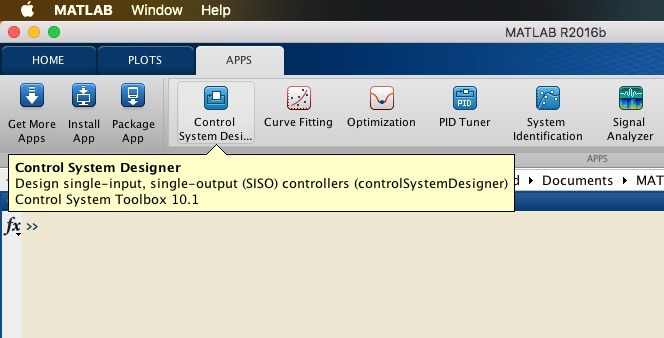

Suponha que você já carregou ou têm disponível um conjunto de plantas para realizar tesets ou projetar controladores usando este APP:
```matlab
>> load testes_trabalhoII_2018_2.mat
​```matlab
No caso, já estão disponíveis algumas variáveis:
​```matlab
>> who

Your variables are:

FTMF_teste    OS            polosMF       teste5        teste8b       
FTMF_teste8   T             teste         teste5b       u_teste       
FTMF_teste8b  ans           teste2        teste6        u_teste8b     
K_teste       aux           teste3        teste7        zeta          
K_teste8      erro          teste4        teste8        

>> 
```

Suponha que vamos trabalhar com a planta 'teste':
```matlab
>> zpk(teste)

ans =
 
  0.020833 (z-0.2) (z+0.1)
  ------------------------
  (z-0.9) (z-0.7) (z-0.4)
 
Sample time: 0.1 seconds
Discrete-time zero/pole/gain model.

>> 
​```matlab
Notamos que esta planta possui pólos em:
​```matlab
>> pole(teste)
ans =
    0.9000
    0.7000
    0.4000
>> 
```
e zeros em:
```matlab
>> zero(teste)
ans =
    0.2000
   -0.1000
>> 
```
e possui um ganho DC em Malha-aberta aproximadamente igual à 1:
```matlab
>> dcgain(teste)
ans =    1.0185
>> 
```

Para carregar esta planta no APP devemos fazer;

1. Executar o APP: deve-se abrir uma janela como:
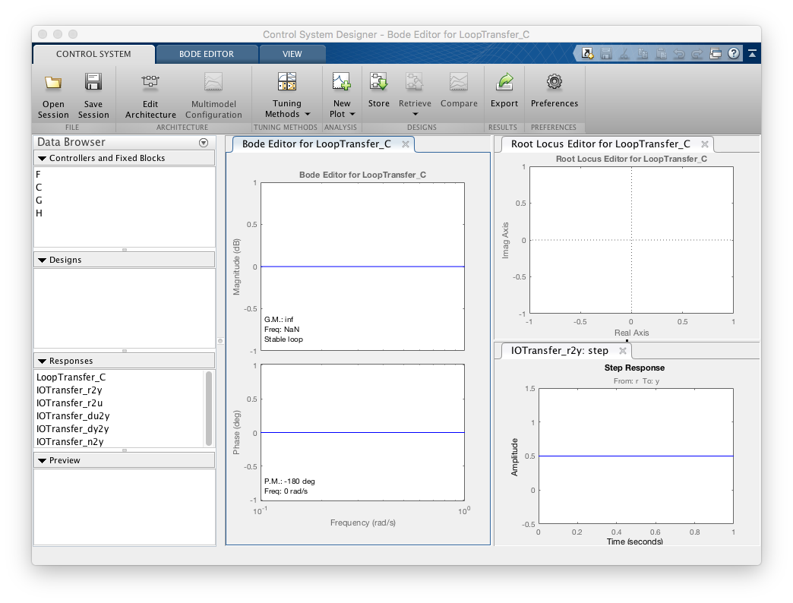

2. Selecionar a opção **Edit Architecture**: deve-se abrir uma janela como:


3. Nesta nova janela, manter selecionado o primeiro modelo de arquitetura (como mostrado da figura anterior) e despois localizar o campo **G** (plant), e completar com o nome da variável que contenha a _tranfer funcion_ desejada, no caso **teste**:
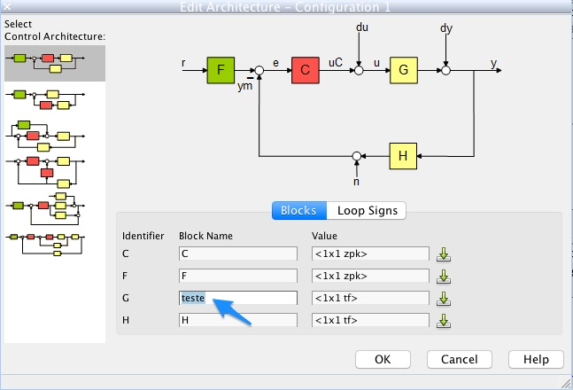

Ou clicar na parte referente à **G** no **botão com a seta para baixo**. Deve-se abrir uma outra janela para importação de dados à partir do _Workspace_, neste caso, selecionar a _tf_ teste -- ver próxima figura:
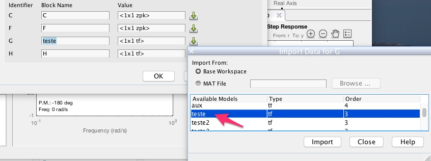

Uma vez selecionada a _tf_ desejada, ciclar no botão **Import**. E voltando à janela anterior (janela da "*Edit Architecture _ Configuration 1*"), clicar sobre o botão "**Ok**". Se tudo deu certo, a janela "*Control System Designer - Bode..*" deve ter se modificado para:
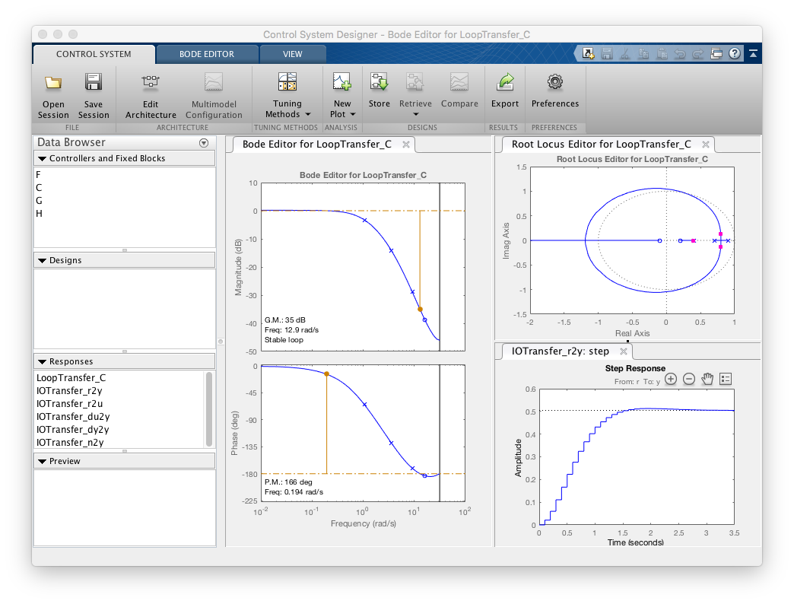
Note que o diagrama do Lugar das Raízes (RL) foi atualizado.


4. O detalhe é que este APP está preferencialmente ajustado para realizar projetos usando a ferramenta de Diagramas de Bode. No nosso em caso em particular, vamos preferir usar a ferramenta RL. Para tanto, teremos que modificar as preferências, clicando na opção **Preferences**:


Uma nova janela se abre:
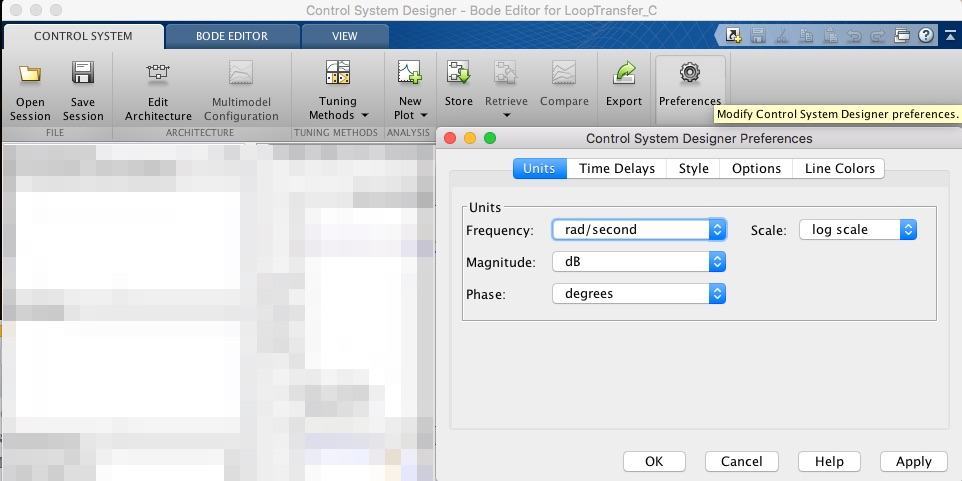

Nesta janela, selecionar a aba **Options** e mudar o **Compensator Format** do valor inicial **Time Constant** para **Zero/pole/gain**. Clicar depois no botão "**Apply**":
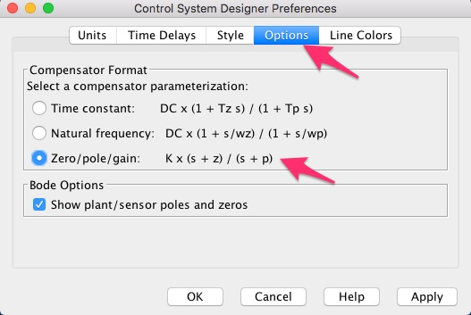

Você pode aproveitar também e modificar outras preferências associadas com o **tamanho das fontes** usadas originalmente nos gráficos mostrados no _Control System Designer_. Originalmente:
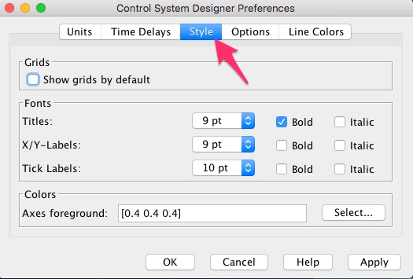

Poderia ser modificado para:
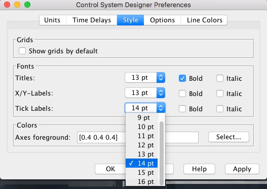
Obs.: Não esquecer de clicar em "**Apply**" ao final.


5. A seguir, modificamos a forma com vamos projetar o controlador, no nosso caso, usando a ferramenta de RL. Para tanto, localizar a opção "**Tuning_Methods**" e mudar para: "**Root Locus Editor**":
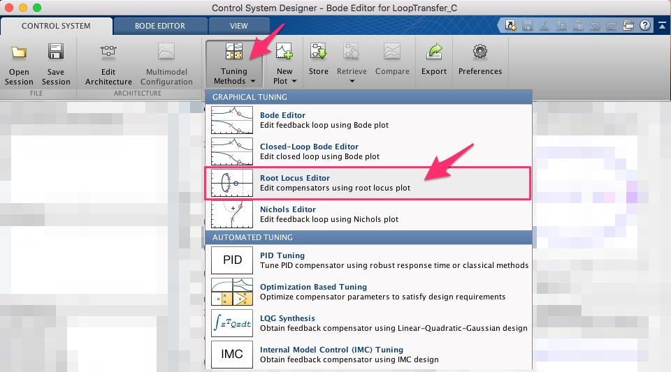
Uma nova janela se abre:
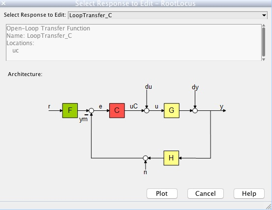
Simplemente cliclar em "Plot".

Notar então que a última janela se fecha e que o quadro que antes continha diagramas de Bode foi substituído por "_Root Locus Editor or Loop Transfer C_":
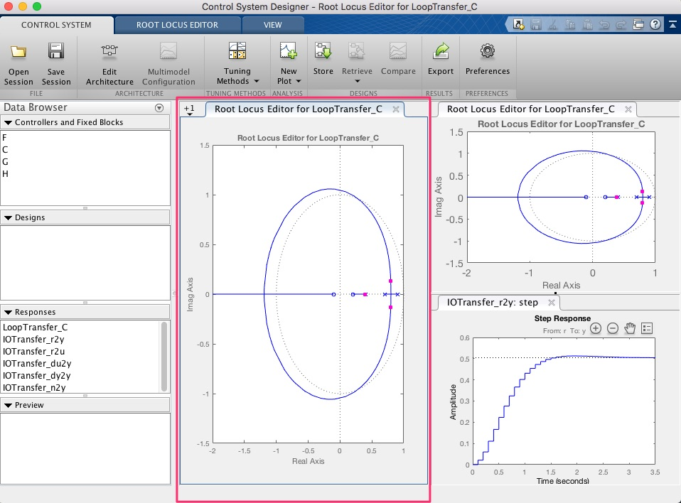


6. Podemos ainda modificar/acrescentar um novo gráfico de resposta, selecionando o quadro que queremos modificar no APP. No caso, suponha que queremos modificar o quadro **Root Locus Editor for LoopTransfer_C** (canto direito superior) para um gráfico que mostre as amplitudes desenvolvidas pela ação de controle. Para tanto, primeiramente selecionamos este quadro (**clicar sobre ele** para atrair o foco para este quadro):
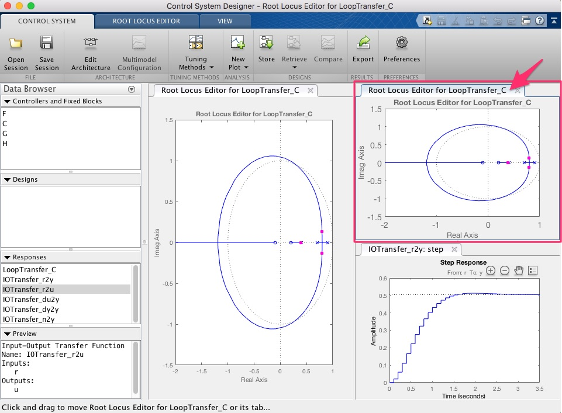

Uma vez tendo selecionado este quadro, clicar em **New Plot** e a seguir selecionar **New Step**:
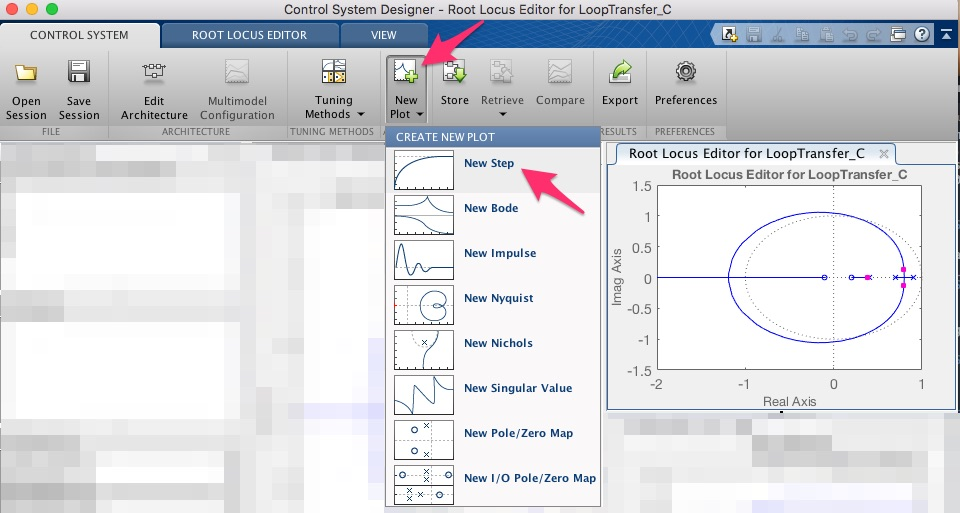

Na nova janela que se abre, selecione agora **IOTransfer_r2u**:


Não se esqueça de clicar em "**Plot**" para efetivar a seleção e fechar esta janela.


7. Agora estamos quase prontos para iniciar o projeto do nosso controlador. Mas antes, seria interessante incorporar no gráfico do RL, ao menos a **linha guia com fator de amortecimento desejável** (requisitos para nosso controlador). Para tanto, clicar com o **botão direito do mouse** sobre o **quadro do RL**. selecionar **Design Requirements** e **New**:


Na nova janela que se abre, clicar em **Percent overshoot**:
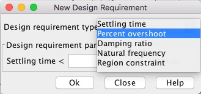

E informar o novo valor desejado para _Percent overshoot_ (no caso: **5**%):
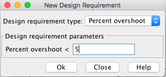

Clicar sobre o botão "**Ok**" para fechar esta janela.

Note que o RL (quadro do RL) se modifica para:
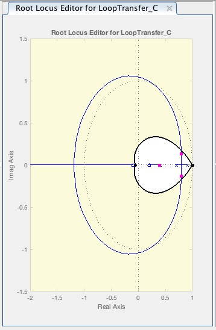

Notar que **outros requerimentos podem ser informados**. Por exemplo, **no quadro *IOTransfer_r2y:step* ** podemos informar os requerimentos de **overshoot** e **tempo de asentamento** desejáveis. Neste caso, repetir um procedimento igual ao adotado anteriormente, mas neste caso, com **foco no quadro *IOTransfer_r2y:step* **:
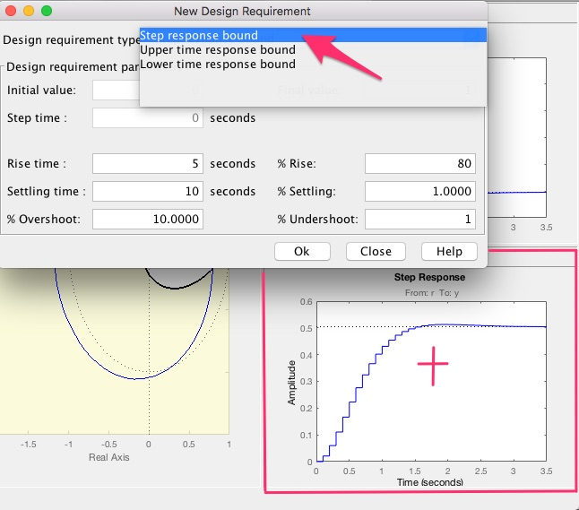

No caso, estes valores foram ajustados para:
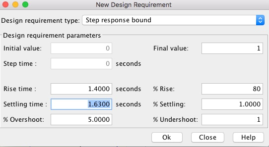

Naturalmente, não esquecer de clicar no botão "**Ok**" ao final. Notar que o quadro *IOTransfer_r2y:step* é agora atualizado para:
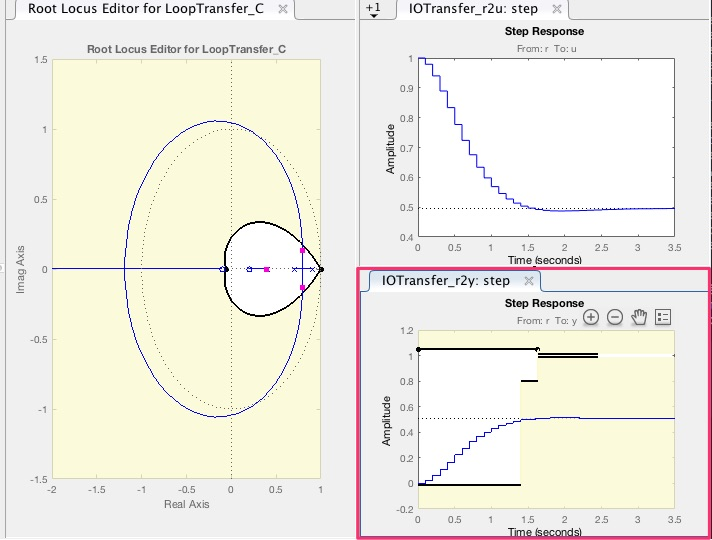

Obs.1: Reparar que o MATLAB não deixa que o valor informado no campo _Settling time_ seja menor que o valor informado no campo _Rise Time_.
Obs.2: Notar que no nosso caso, no _WorkSpace_ já há as variáveis _zeta_ e _OS_:
```matlab
>> zeta
zeta =    0.5912

>> OS
OS =    10
```


8. Até o momento, nosso "controlador" é simplesmente proporcional com ganho unitário. A idéia é acrescentar pólos e zeros ao mesmo. Suponha que queremos realizar um **PI+Zero**. Para tanto, atraímos o **foco** do MATLAB para o **quadro *Root Locus Editor for LoopTransfer_C* ** e clicamos com o **botão direito do mouse** sobre ele (reparar que deve ser dentro da região de interesse, área branca):


Selecionar na janela que se abre, a opção **Edit Compensator** e então:
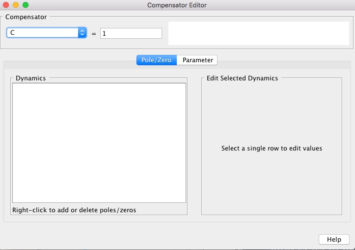

Ou pode ser mais fácil, acrescentar de cara um integrador: botão direito do mouse sobre o RL e selecionar **Add Pole/Zero >> Integrator**:
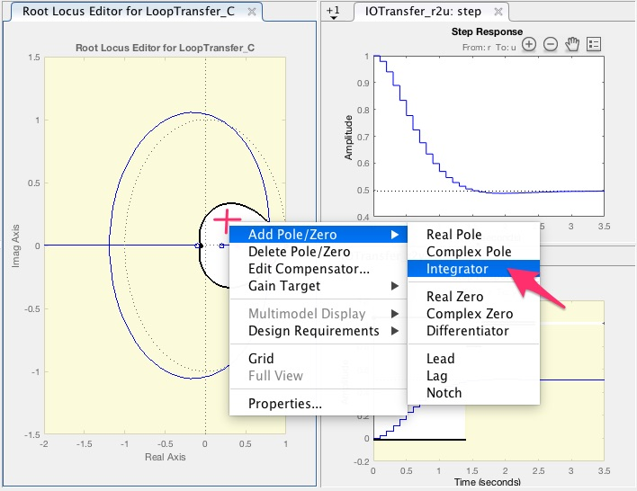

Notar que o RL e outros gráficos já se modificam retratanto o impacto causado pela introdução de um integrador (pólo em z=1) ao RL anterior:
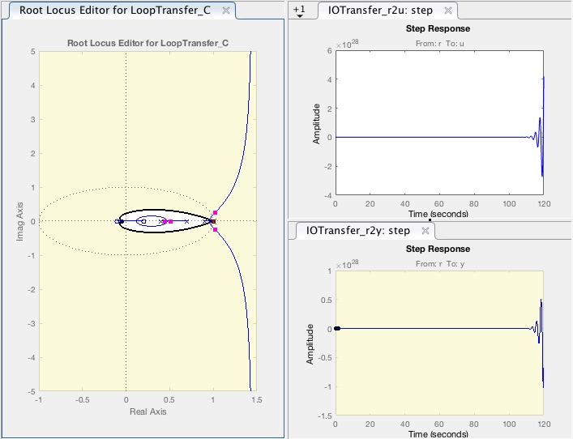

**Mas** faltou acrescentar o zero do controlador. Para tanto, clicar novamente com o **botão direito do mouse** sobre o **quadro do RL** e selecinar **Edit Compensator**:
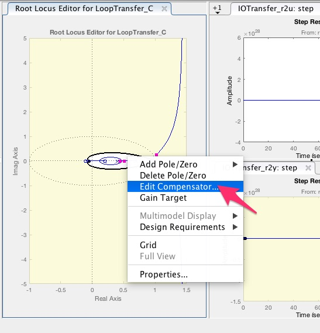

Na nova janela que se abre, clique com o **botão direito do mouse** sobre o **quadro *Dynamics***, selecione **Add Pole/Zero** e depois **Real Zero**:
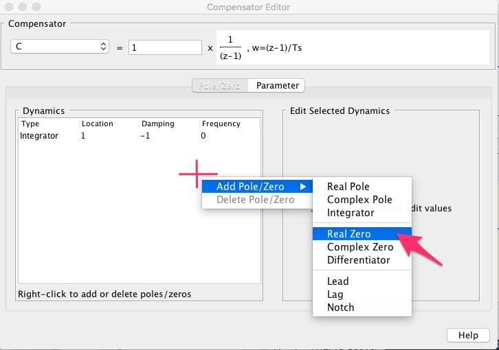

Note o MATLAB vai sugerir um valor (no caso: 0.905), mas este pode ser facilmente modificado clicando sobre a linha do **Real Zero** (no quadro *Dynamics*) e depois na caixa ao lado **Edit Selected Dynamics**, o valor pode ser facilmente editado:
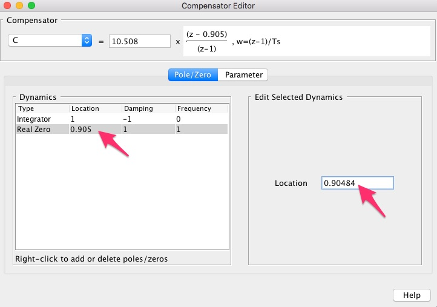

Se percebe que novamento o gráfico do RL e das respostas ao degrau foram atualizados:
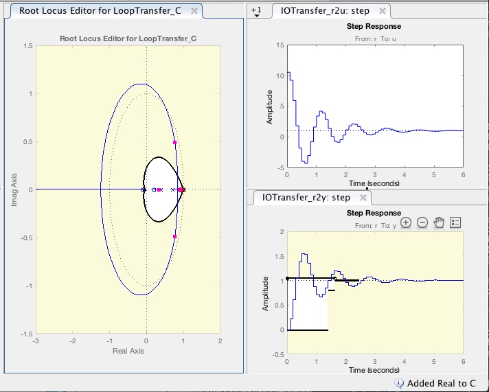

Mas eventualmente a **resolução dos gráficos** pode não ser a desejável para permitir visualizações ou manipulações. Para tanto, você pode clicar na **aba superior** do ***Control System Designer***, chamada ***ROOT LOCUS EDITOR*** (justamente a que ativamos antes) e então a janela do APP se modifica um pouco para:
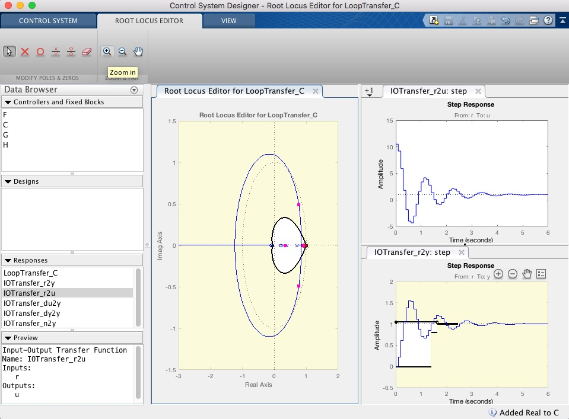

Um "Zoom" sobre o gráfico anterior resulta em:
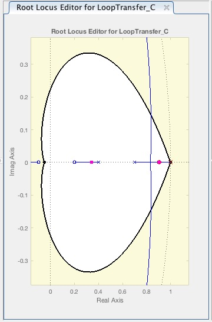


Lembrando os dados da planta:
```matlab
>> zpk(teste)

ans =
 
  0.020833 (z-0.2) (z+0.1)
  ------------------------
  (z-0.9) (z-0.7) (z-0.4)
 
Sample time: 0.1 seconds
Discrete-time zero/pole/gain model.

>> 
```

E "lembrando" da equação do nosso controlador, clicando na janela do **Control System Designer**, no **quadro *Controllers and Fixed Blocks*** (canto superior esquerdo), clicamos em "**C**" (Controller) e então percebemos que no quadro **Preview** aparecem os dados do contolador:
```
Name: C
Sample Time: 0.1
Value:  
  10.508 (z-0.9048)
  -----------------
        (z-1)
```

Notar que o valor do ganho do controlador pode ser modificado no RL (tentar mover o pólo de MF indicado no RL como um marcador magenta quadrado -- sim, eventualmente ele pode ser difícil de ser distinguido de dentro do RL) ou abrindo a janela de edição do controlador (botão direito do mouse sobre o RL selecionando *Edit Compensator*):
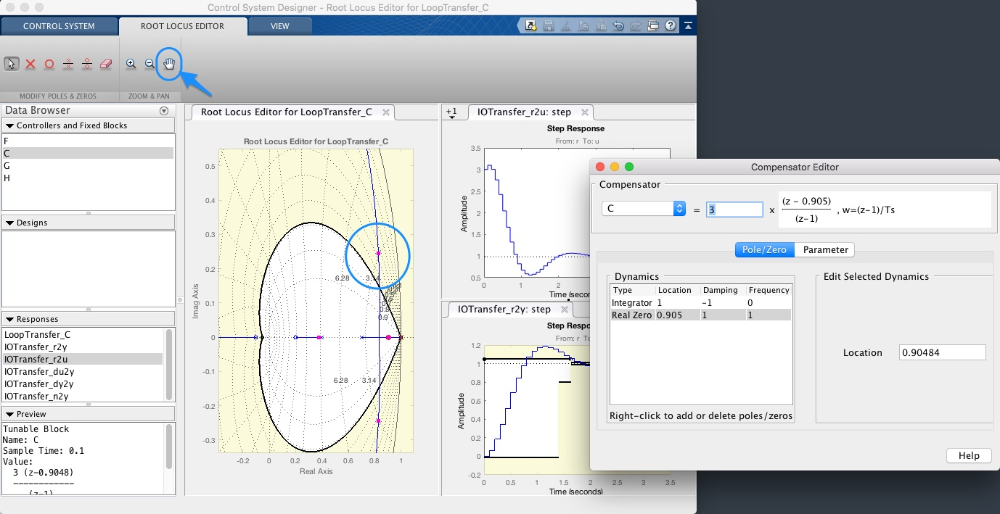

E então aqui aparece a parte mais interessante e interativa deste APP: a ferramenta da "mão" (*Pan*) na **aba *ROOT LOCUS EDITOR*** permite editar a posição de pólos de MF e vizualizar **interativamente**, seu efeito sobre o sistema em malha fechada:

<a href="http://www.youtube.com/watch?feature=player_embedded&v=cNXUY-9hoNA
" target="_blank"></a>

(Arquivo fonte original: uso_control_system_designer.mp4, 960 x 734, H.264, 00:23, 2.1 Mbytes ou no [Youtube](https://youtu.be/cNXUY-9hoNA)):


Prof. Fernando Passold, em 08 Oct 2018.

