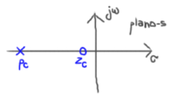
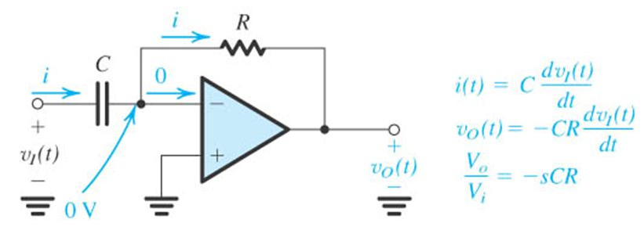
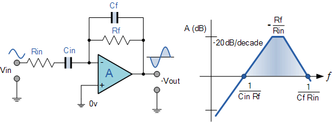
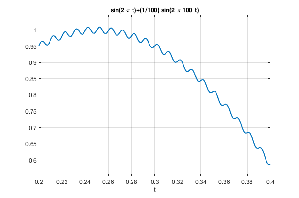
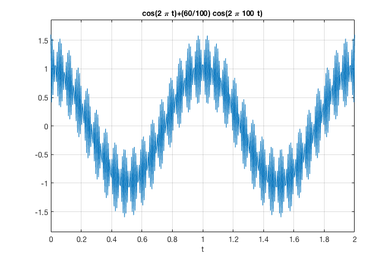
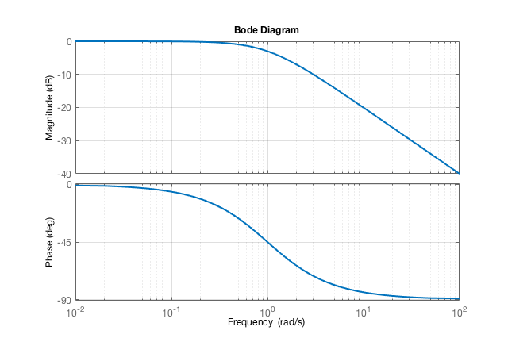

# Controle com Ação Derivativa

<font size="1px">
> Arquivo fonte: /Volumes/Macintosh_HD/Users/fernandopassold/Documents/UPF/Controle\_Auto\_3/Derivador/Controle\_Acao\_Derivativa.md (24/04/2018)
> </font>

## Derivador "Puro"

Seja: $y(t)=\dfrac{du(t)}{dt}$, sua aproximação numérica pode ser realizada simplesmente como:

$
y(t)=\dfrac{du(t)}{dt} \cong \dfrac{u[k]-u[k-1]}{\Delta t}
$

no nosso caso, $\Delta t=T$ (período de amostragem).

A equação acima leva à:

$
Y(z)=\dfrac{U(z)-z^{-1} \cdot U(z)}{T} \cdot \dfrac{z^1}{z^1} = \dfrac{U(z)(\cdot z -1)}{T \cdot z}
$

ou:

$
\dfrac{Y(z)}{U(z)} = \dfrac{1}{T} \cdot \dfrac{(z-1)}{z}
$

que rende: __zero em $z=1$__  (e um pólo na origem em $z=0$).

Note que o Derivador Puro possui alguma similaridade com o controlador por avanço de fase :

|No plano-s:|No plano-z:|
|:---:|:---:|
|  |  |

O problema é que um ação derivativa pura leva à:

$
D(s)=s
$

que resulta no seguinte diagrama de Bode:

```matlab
>> bode([1 0], 1)
```


Ou seja, repare que o ganho só aumenta (e tende à $\infty$) à medidade que a frequência aumenta (ou seja, onde está o ruído). Note também que esta última função transferência é irealizável. 

* * *

## Amplificador Derivador

Na prática, um circuito derivador puro se poderia tentar realizar através do seguinte circuito usando amplificador operacional:



Fonte: [The op-amp Differentiator - ppt video online download](http://slideplayer.com/slide/2521182/), [Operational amplifier applications - WikiVisually](https://wikivisually.com/wiki/Operational_amplifier_applications#Differential_amplifier_(difference_amplifier))

Em frequencias baixas a impedância do capacitor é praticametne $\infty$ e então o ganho é mínimo ($-\infty$). Mas à medida que a frequencia aumenta, $X_c \approx 0$ e então o ganho tende à $+\infty$ e neste caso o amp.op. não funciona mais porque atura e entra em oscilação.

Já um circuito realizável seria algo como:



> Ref.: [Differentiator Amplifier - The Op-amp Differentiator](https://www.electronics-tutorials.ws/opamp/opamp_7.html)

* * *

## Efeito de Derivada sobre Sinal Ruidoso

Suponha que o seguinte sinal está sendo amostrado:

$
x(t) = \underbrace{1 \cdot \sin (2 \pi \; 1 \; t)}_{\text{Sinal esperado (1 Hz)}} + \underbrace{ \frac{1}{100} \cdot \sin (2 \pi \; 60 \; t) }_{ \text{Ruído sobreposto} }
$

Note na eq. anteriror que o ruído ocorre na frequência da rede elétrica e corresponde à apenas 1% da amplitude do sinal esperado -- o que significa que a princípio ele é praticamente negligenciável (imperceptível) -- veja gráfico à seguir:

```matlab
>> ezplot( 'sin(2*pi*t)+(1/100)*sin(2*pi*100*t)',[0 2] ) % 2 ciclos do sinal esperado
>> grid
```


Um "zoom" sobre o sinal anterior permite visualizar o erro:

```matlab
>> ezplot( 'sin(2*pi*t)+(1/100)*sin(2*pi*100*t)',[0.2 0.4] ) % zoom sobre o sinal anterior
>> grid
```



Note porém que derivada deste sinal rende:

$
y(t)=\dfrac{\text{d}x(t)}{\text{d}t} = \cos(2\pi \;t) + \underbrace{ \dfrac{1}{100} \cdot 60 \cdot \cos (2\pi \; 60 \; t) }_{\text{Derivada do Ruído}}
$

Note agora que a amplitude do sinal derivado, amplificou (**ressaltou**) o ruído presente no sinal. A amplitudade do ruído que antes estava na faixa de 0,01 Vp agora passou para 0,6 Vp (ou seja, aumentou $60 \times$).

Um gráfico do sinal deraivado $y(t)$ rende:

```matlab
>> ezplot( 'cos(2*pi*t)+(60/100)*cos(2*pi*100*t)',[0 2] )
>> grid
```



Um "zoom" sobre a figura anterior permite "contemplar" melhor o efeito da derivada sobre um sinal ruidoso:

```matlab
>> t=0.4:0.001:0.6; % zoom sobre a parte interessada
>> x=sin(2*pi.*t)+(1/100)*sin(2*pi*100.*t); % sinal + ruido
>> y=cos(2*pi.*t)+(60/100)*cos(2*pi*100.*t);  % derivada do sinal com ruido 
>> y2=cos(2*pi.*t); % derivada apenas do sinal esperado
>> figure;
>> plot(t,y,'b-', t,y2,'m--')
>> legend('d\dt Sinal com ruído', 'd/dt Sinal sem ruído')
```


Conforme esperado, o próprio diagrama de Bode um um derivador puro indica que a amplitude de sinais de alta frequência será elevada proporcionalmente à sua frequência.

### Derivador Puro Numérico

Mesmo usando um algoritmo digital para implementar a derivada, resulta em:

$
y[k] \approx K_d \cdot \dfrac{x[k]-x[k-1]}{T}
$

onde $K_d$ corresponderia ao ganho derivativo.

Simulando sobre o sinal anterior, resulta em:

```matlab
T=8E-4; % período de amostragem - Note que 1/(20*60) = 0.0008333
t=0:T:1; % zoom sobre a parte interessada
x=sin(2*pi.*t)+(1/100)*sin(2*pi*100.*t); % sinal + ruido
y=cos(2*pi.*t)+(60/100)*cos(2*pi*100.*t);  % derivada do sinal com ruido 
y2=cos(2*pi.*t); % derivada apenas do sinal esperado
% Simulando uma derivada numerica no vetor y3
u=length(t);    % retorna qtdade de pontos do vetor t (amostras)
y3=zeros(1,u);  % inicializando vetor da derivada numerica
for i = 2:u
    y3(i) = ( x(i) - x(i-1) ) / T;
end
figure;
plot(t,y,'b-', t,y2,'m--', t,y3,'go-')
legend('d\dt Sinal com ruído', 'd/dt Sinal sem ruído',...
    'Derivada Numerica')

```


Um "zoom" sobre a figura anterior rende:


O resultado está londe do esperado. E piora se considerarmos que sobre o resutlado do gráfico falta aplicar o ganho Derivativo $\mathbf{K_d}$.Note a baixa precisão nesta aproximação numérica para uma derivada.

__Solução: ?__

* * *

## Uso de Filtro Passa Baixas

Notamos que não é interessante derivar a parte de frequencias elevadas (ruído) de um sinal. Então a solução é aplicar um Filtro Passa Baixas, __antes__ de derivar o sinal desejado.


A equação diferencial de um filtro passa-baixas (FPB) de 1a-ordem é dada por:

$
\tau_F \cdot \dfrac{\text{d}y(t)}{\text{d}t} + y(t) = x(t)
$

onde $\tau_F$ corresponde à constante de tempo do filtro. Então:

$
f_c = \dfrac{1}{2\pi \; \tau_F} \quad \text{(Hz)}
$

Para $\tau_F < 3$ segundos, o filtro pode ser passivo, constituído por um simples circuito RC.

Na prática sugere-se $\tau_F < 0,1 \cdot \tau_{\text{máx}}$ (ou seja, com frequencia de corte uma década abaixo); $\tau_\text{máx}$ corresponde à constante de tempo dominante (maior) do sistema.

> Note que o emprego de FPB numa malha de controle, inevitavelmente implica na introdução de um significativo atraso dinâmico (no tempo).

A função transferência do filtro seria:

$
G(j\omega) = \dfrac{1}{\tau_F \; j \omega + 1}
$

ou como $s=j\omega$:

$
G(s)=\dfrac{1}{\tau_F \; s + 1}
$

A amplitude fica caracterizada por:

$
|G(j\omega)|=\sqrt{ \left( \frac{1}{\omega^2 \; \tau_F^2 +1} \right)^2 + \left( \frac{-\omega \; \tau_F}{\omega^2 \; \tau_F^2+1}\right)^2}
$

$
|G(j\omega)|=\sqrt{ \frac{( 1+\omega^2\; \tau_F^2)}{(\omega^2 \; \tau_F^2+1 )} }
$

$
|G(j\omega)|=\dfrac{1}{ \sqrt{\omega^2 \; \tau_F^2 + 1} }
$

e a fase é caracterizada por:

$
\phi=\angle{G(j\omega)}=\tan^{-1}{(-\omega \; \tau_F)} = - \tan^{-1}{(\omega \; \tau_F)}
$

Se $\tau_F=1,0$ (segundo), então: $\omega_F = 1 / \tau_F = 1,0$ (rad/s). A função transferência deste filtro ficaria como:

$
G(s)=\dfrac{1}{s+1}
$

O que rende os seguintes diagramas de Bode:

```matlab
>> figure; bode(1, [1 1]); grid
```



Por exemplo:

```matlab
>> 20*log10(0.1)
ans =
   -20
>> 
```

### Filtro Passa-Baixas RC

Um simples filtro passa-baixas RC é mostrado na próxima figura:


Para este circuito:

$
f_c = \dfrac{1}{2\pi \; R \; C}
$

A frequência do filtro deveria esta na faixa: $\omega_{\text{máx}} < \omega_F < \omega_N$; onde: $\omega_F=1 / \tau_F$, $\omega_{\text{máx}}=1/\tau_{\text{máx}}$ e onde $\tau_{\text{máx}}$ corresponde a mair constante de tempo (a dominante) do processo e $\omega_N$ corresponde à frequência do ruído (rad/s). É esperado que $\omega_F < \omega_N$.

* * *

### Filtro Exponencial Digital 

Seja um filtro do tipo:


Uma derivada numérica simples se consegue através de:

$
\dfrac{\text{d}y(t)}{\text{d}t} \approx \dfrac{y[n]-y[n-1]}{\Delta t}
$

Note que se aproxima da equação do filtro analógico de 1a-ordem:

$
\tau_F \cdot \dfrac{\text{d}y(t)}{\text{d}t} + y(t) = x(t)
$

que resultaria neste caso em:

$
\tau_F \cdot \dfrac{(y[n]-y[n-1])}{\Delta t} + y[n] = x[n]
$

trabalhando a equação anterior à fim de isolar $y[n]$ (FPB sobre o sinal $x[k]$), teremos:

$
\begin{array}{rcl}
\dfrac{\tau_F \; y[n]}{\Delta t} - \dfrac{\tau_F \; y[n-1]}{\Delta t} + y[n] & = & x[n] \\
& & \\
y[n] \left( 1+\dfrac{\tau_F}{\Delta t} \right) &=& x[n] + \dfrac{\tau_F \; y[n-1]}{\Delta t} \\
& & \\
y[n] & = & \dfrac{ \dfrac{x[n]}{1} }{ 1 + \dfrac{\tau_f}{\Delta t} } + \dfrac{ \dfrac{\tau_F \; y[n-1]}{\Delta t} }{ 1 + \dfrac{\tau_F}{\Delta t} }\\
& & \\
y[n] & = & \dfrac{ \dfrac{x[n]}{1} }{ 1 + \dfrac{\Delta t + \tau_F}{\Delta t} } + \dfrac{ \dfrac{\tau_F \; y[n-1]}{\Delta t} }{ \dfrac{\Delta t + \tau_F}{\Delta t}} \\
& & \\
y[n] & = & \left( \dfrac{\Delta t}{\tau_F + \Delta t} \right) \cdot x[n] + \left( \dfrac{\tau_F}{\tau_F + \Delta t} \right) \cdot y[n-1] \\
\end{array}
$

Podemos criar a variável $\alpha$ tal que:

$
\alpha = \dfrac{1}{ \dfrac{\tau_F}{\Delta t} + 1}
$

e então:

$
(1-\alpha) = 1 - \dfrac{1}{ \dfrac{\tau_F}{\Delta t} + 1 } = \dfrac{\tau_F}{\tau_F + \Delta t}
$

e assim chegamos a um formato mais simples de equação para o filtro digital exponencial de 1a-ordem:

$
y[n] = \alpha \; x[n] + (1 - \alpha) \; y[n-1]
$

onde: $0 < \alpha < 1$. Tipicamente é empregado o valor $\alpha = 0,1$.

|**Note que:** | | |
|:---|:---|:---|:---|
| Se $\alpha = 1$ | $\rightarrow$ **não existe filtragem** | $\rightarrow \quad y[n] = x[n]$. |
| Se $\alpha = 0$ | $\rightarrow$ **Sinal original é ignorado** | $\rightarrow \quad y[n] = 0$. |

* * *

### Filtro exponencial duplo (ou de 2a-ordem)

Pode ser formado pelo cascateamento de 2 filtros de 1a-ordem:


Derivando as equações, teremos:

$
\begin{array}{rcl}
\bar{y}[n] & = & \gamma \; y[n] + (1 - \gamma) \; \bar{y}[n-1] \\
& & \\
\bar{y}[n] & = & \gamma \; \alpha \; x[n] + \gamma (1 - \alpha) y[n-1] + (1 - \gamma) \; \bar{y}[n-1] \\
& & \\
\bar{y}[n-1] & = & \gamma \; y[n-1] + (1 - \gamma) \; y[n-2] \\
& & \\
y[n-1] & = & \dfrac{1}{\gamma} \; \bar{y}[n-1] - \dfrac{(1 - \gamma)}{\gamma} \; \bar{y}[n-2]\\
& & \\
\bar{y}[n] & = & \gamma \; \alpha \; x[n] + (2 - \gamma - \alpha) \; \bar{y}[n-1] - (1-\alpha)(1-\gamma)\; \bar{y}[n-2]
\end{array}
$

Se $\gamma = \alpha$, este filtro resulta em:

$
\bar{y}[n] = \alpha^2 \; x[n] + 2(1-\alpha)\; \bar{y}[n-1] - (1-\alpha)^2 \; \bar{y}[n-2]
$

Note que existe uma vantagem deste filtro sobre o anterior de 1a-ordem: este filtro atenua mais fortemente ruídos de alta frequencia, especialmetne se $\gamma = \alpha$.

Este filtro resulta em algo semelhante à:

$
G(s) = \dfrac{1}{(s+1)^2}
$

Cujo diagrama de Bode resulta:

```matlab
>> figure; bode(1, conv( [1 1], [1 1] ) ); grid
```


Note: corte de 40 db/déc!

```matlab
>> 20*log10(0.01/1)
ans =
   -40

```

* * *
### Filtro de Média Móvel

Neste caso se aplica simplesmente a equação:

$
y[n] = \dfrac{1}{J} \; \sum_{i=n-J+1}^{n}{x[i]}
$

que representa a média dos últimos $J$ pontos soobre o sinal de entrada $x[n]$

Esta equação pode ser reescrita como:

$
y[n-1] = \dfrac{1}{J} \; \sum_{i=n-J}^{n-1}{}x[i]
$

mesclando as 2 últimas equações obtemos:

$
y[n] = y[n-1] + \dfrac{1}{J} \; \left( x[n] - x[n-J] \right)
$
que resulta num comportamento semelhante à um filtro passa-baixas, servindo também para eliminar componentes (ruídos) de alto frequência.

* * *

### Problema Sugerido

Os 3 filtros anteriores poderiam ser aplicados sobre este tipo de sinal:


- uma onda quadrada (sinal esperado) oscilando entre 0,0 e 1,0 Volts à frequência de $f=1/3$, acompanhado de um ruído (senoide) oscilando na frequência de 9 Hz com amplitude de 0,25 Vp.
Simular alguns casos:
* Filtro analógico de 1a-ordem com $\tau_F = 0,1$ minutos;
* Filtro analógico de 1a-ordem com $\tau_F = 0,4$ minutos;
* Filtro digital exponencial de 1a-ordem com $\tau_F = 0,1$ minutos; e usando período de amostragem $T = 0,05$ minutos;
* Filtro digital exponencial de 1a-ordem com $\tau_F = 0,1$ minutos; e usando período de amostragem $T = 0,1$ minutos;
* Filtro de média móvel com $J=3$ (ainda se deve perceber ruído);
* Filtro de média móvel com $J=7$ (o ruído praticamente some).

Script adotado no MATLAB para gerar figura anterior:

```matlab
% Problema sugerido - controladores ação derivativa
% Fernando Passold, 24/04/2018
T1=1/(0.05*60) % 1o-periodo de amostragem
T2=1/(0.1*60)   % 2o-periodo de amostragem
% Simulando os primeiros 2 ciclos de uma onda
% quadrada, f = 1/3 (Hz)
% amostrar este sinal 20 x f
disp('Onda quadrada oscilando à:')
f = 1/3
fs = 20*20;
T_square = 1/f;
T = 1/fs;
k=0:T:2*T_square;
u=length(k); % qtadade de amostras geradas
square=zeros(1, u);
for i=1:u
    t = k( i );    % calculando tempo real em segundos
    if ( t > T_square/2 )&&( t < T_square)
        square(1, i) = 1;
    end
    if ( t > (T_square + T_square/2) )&&( t < 2*T_square)
        square(1, i) = 1;
    end
end
% Sobrepondo a senoide (ruido) de 0,25 Vp, freq = 9 Hz
f_N = 9;
T_N = 1/f_N;
for i=1:u
    t = k( i );
    noise( i ) = 0.25*sin(2*pi*f_N*t);
    signal( i ) = square( i ) + noise( i );
end
plot(k, signal,'m-', k, square)
legend('Sinal com ruido','Sinal sem ruido')
grid
```

* * * 

#### Observações finais:

|  | Documento gerado usando metalinguagem [**markdown**](https://github.com/adam-p/markdown-here/wiki/Markdown-Cheatsheet) usando editor [**BoostNote**](https://boostnote.io), free, multiplataforma (Windwos, Mac, Linux, iOS, Android). |
|:---:|:---|

O que é MarkDown? [Boost your productivity using Markdown. – Hacker Noon](https://hackernoon.com/boost-your-productivity-using-markdown-b8a84fc2a089)

"Cheat Sheet" desta linguagem clicle aqui: [Cheat Sheet | Markdown Guide](https://www.markdownguide.org/cheat-sheet).

Esta linguagem permite criar rapidamente documentos texto que podem ser salvos como arquivos .txt ou .md ou .html e permite incluir rapidamente e com facilidade, equações, figuras e partes de código.

Para a edição das equações entre novatos do $\LaTeX$ se recomendam os seguintes editores on-line:
* [Online LaTeX Equation Editor - LaTeX4technics](https://www.latex4technics.com)
* [Online Latex Equation Editor - Sciweavers](http://www.sciweavers.org/free-online-latex-equation-editor)
* [Editor Online de Equações LaTeX - crie, integre e baixe](https://www.codecogs.com/latex/eqneditor.php?lang=pt-br)
* [EqualX - LaTeX Equation Editor](http://equalx.sourceforge.net)

Para "descobrir" o código para caracteres especiais ou caracteres gregos no padrão $\LaTeX$ existe a ferramenta on-line: [Detexify LaTeX handwritten symbol recognition](http://detexify.kirelabs.org/classify.html) , que é capaz de reconhecer o desenho do caracter desejado e convertê-lo para o correspondente código $\LaTeX$.

Para editar tabelas no formato $\LaTeX$ podem ser usadas as ferramentas on-line:
* [LaTeX Tables Editor](http://www.latex-tables.com)
* [Create LaTeX tables online](https://www.tablesgenerator.com)
* [Table Editor - BETA](http://truben.no/table/) (Este parece ser mais interessante para converter uma tabela entre HTML <--> LaTeX <--> Comma Separated Values <--> Markdown <--> reStructuredText <--> SQL) 

Desenhos criados usando software:

|  | [Flowchart Maker & Online Diagram Software](https://www.draw.io) do Google -- ferramenta on-line. |
|:---:|:---|
|  | [Free Software for Students & Educators | SketchBook | Autodesk](https://www.autodesk.com/education/free-software/sketchbook). Versão educacional (livre) --> Você deve se registrar usando sua conta de email da UPF! |

---
<font size="1px">
> Arquivo fonte: /Volumes/Macintosh_HD/Users/fernandopassold/Documents/UPF/Controle\_Auto\_3/Derivador/Controle\_Acao\_Derivativa.md (Abril/2018) 
</font>