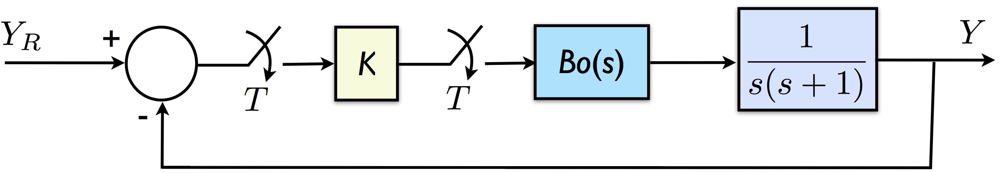
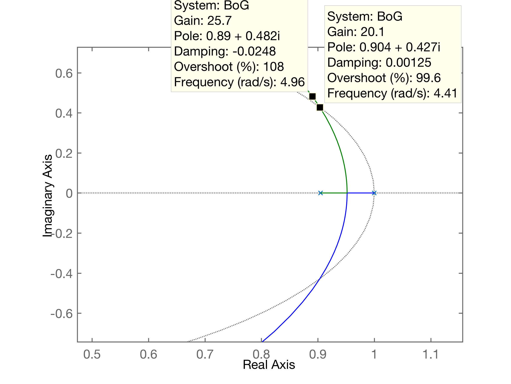
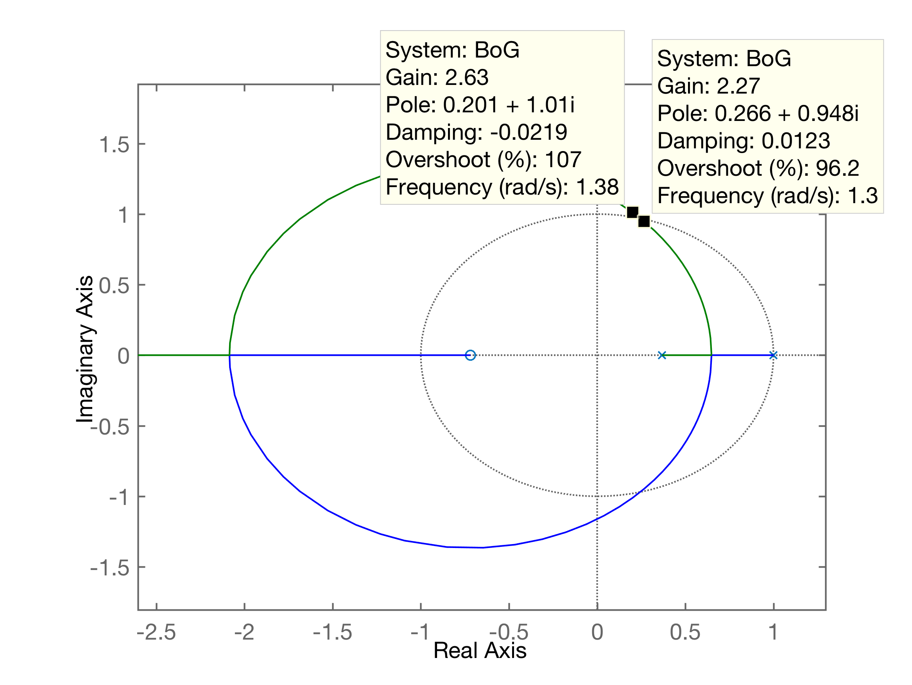

Photo by [Petar Petkovski](https://unsplash.com/@saturn5k?utm_source=unsplash&utm_medium=referral&utm_content=creditCopyText) on [Unsplash](https://unsplash.com/@saturn5k?utm_source=unsplash&utm_medium=referral&utm_content=creditCopyText)

## 5.5) Aplicação do Método de Jury (Determinação de $K_{max}$)

**Problema/Exemplo**:

Seja a planta: $G(s)=\dfrac{K}{s(s+1)}$

Considere: a) $T=0,1$; b) $T=1,0$

Suponha que esta planta será incorporada numa malha-fechada com Controlador Proporcional:



Determine $K_{max}=?$ para os 2 casos de períodos de amostragem.

----

*Resolução*:

Primeiro deve-se calcular $BoG(z)$ (ver “apostila.pdf”):

$BoG(z)=\dfrac{K(b_1 z + b_0)}{(z-1)(z-a)}$

$a=e^{-1\cdot T}$; $b_1=T+e^{-T}-1$; $b_0=1-Te^{-T}-e^{-T}$.

De posse da $FTMA(z)$ ou $BoG(z)$ que é o caso aqui, se determina a $EC(z)$:

$EC(z)=1+BoG(z)=0$

$\vdots$

$EC(z)=a_2 z^2 + a_1 z^1 + a_0 z^0$

$EC(z)=1 z^2 + (Kb_1-a-1)z^1 + (Kb_0+a)$

Aplicando os 3 pré-requisitos referentes ao método de Jury (análise de Estabilidade), temos que:

(1) $EC(1)>0 \quad \therefore \quad K>0$.

(2) $EC(-1)>0 \quad \therefore \quad K < \dfrac{2(1+a)}{(b_0-b_1)}$; $\quad$Obs: $(b_0-b_1)>0$.

(3) $|a_0|<a_2 \quad \therefore \quad K < \dfrac{1-a}{b_0}$; $\quad$ Obs: $b_0>0$.

Resolvendo numericamente usando Matlab:

a) $T=0,1$

```matlab
>> T=0.1;
>> a=exp(-T)
a =
    0.9048
>> b1=exp(-T)+T-1
b1 =
    0.0048
>> b0=1-exp(-T)-T*exp(-T)
b0 =
    0.0047
>> BoG=tf( [b1 b0], poly([ 1 a ]), T ); % não esquecer de informar 3o-parametro: periodo amostragem, senão Matalb supõe que esta 'tf' seja no plano-s
>> zpk(BoG)

  0.0048374 (z+0.9672)
  --------------------
    (z-1) (z-0.9048)
    
Sample time: 0.1 seconds
Discrete-time zero/pole/gain model.

>> 
```

Outra maneira de determinar $BoG(z)$:

```matlab
>> % Outra maneira
>> G = tf( 1, [1 1 0] );
>> zpk(G)

     1
  -------
  s (s+1)
 
Continuous-time zero/pole/gain model.

>> BoG = c2d (G, T); % usando função 'c2d' para calcular BoG(z)
>> zpk(BoG)

  0.0048374 (z+0.9672)
  --------------------
    (z-1) (z-0.9048)

Sample time: 0.1 seconds
Discrete-time zero/pole/gain model.

>>
```

Aplicando os critérios de Jury sobre esta $EC(z)$:

```matlab
>> T
T =
    0.1000
>> % Continuando com cálculo de EC(z):
>> a2=1;
>> % pré-requisito (2):
>> K = 2*(1+a)/(b0-b1)
K =
  -2.4024e+04
>> % pré-requisito (3):
>> K = (1-a)/b0
K =
   20.3389
>> (b0-b1)
ans =
  -1.5858e-04
>> 
```

**Conclusão**: com $T=0,1 \quad \Rightarrow \quad K<20,3389$.

b) $T=1,0$:

```matlab
>> T=1;
>> a=exp(-T)
a =
    0.3679
>> b1 = exp(-T)+T-1
b1 =
    0.3679
>> b0=1-exp(-T)-T*exp(-T)
b0 =
    0.2642
>> BoG=tf( [b1 b0], poly([ 1 a ]) , T); % não esquecer de informar 3o-parametro: periodo amostragem, senão Matalb supõe que esta 'tf' seja no plano-s
>> zpk(BoG)

  0.36788 (z+0.7183)
  ------------------
   (z-1) (z-0.3679)
   
Sample time: 1 seconds
Discrete-time zero/pole/gain model.

>> 
```

Aplicando os critérios de Jury sobre esta $EC(z)$:

```matlab
>> % pré-requisito (2):
>> K = 2*(1+a)/(b0-b1)
K =
  -26.3972
>> % pré-requisito (3):
>> K = (1-a)/b0
K =
    2.3922
```

**Conclusão**: com $T=1 \quad \Rightarrow \quad K<2,3922$.

Comparando resultados:

| a) $T=0,1$                                                   | b) $T=1$                                                |
| ------------------------------------------------------------ | ------------------------------------------------------- |
| $BoG(z)=\dfrac{0.0048374 (z+0.9672)}{(z-1) (z-0.9048)}$      | $BoG(z)=\dfrac{0.36788 (z+0.7183)}{(z-1) (z-0.3679)}$   |
| $K < 20.3389$                                                | $ K < 2.3922$                                           |
| rlocus($BoG(z)$):<br /> | locus($BoG(z)$):<br /> |

**Conclusão final**:

Nota-se que a medida que aumenta o período de amostragem T, se é obrigado a abaixar o ganho K do controlador, para manter a estabilidade do sistema, ou:
$$
T \uparrow \quad \Rightarrow \quad K \downarrow
$$
Fim.

---

Fernando Passold, 14.04.2021