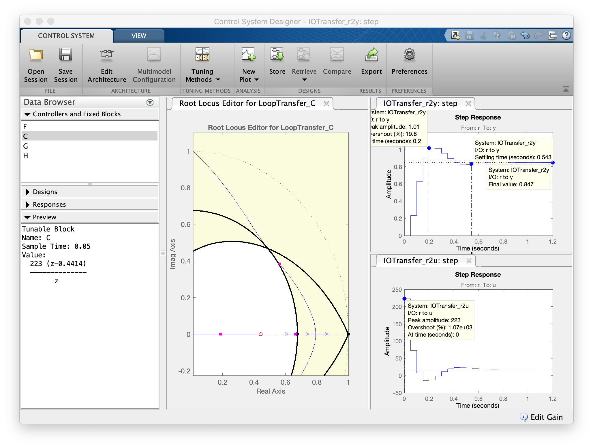

# Aulas Controle 3 (2023/2)

* Aula de [15/09/2023](2023_2/aula_15092023.html); 
  *(Nova planta para estudo de caso, projeto controladores proporcionais)*
* Aula de [22/09/2023](2023_2/aula_22092023.html); 
  *(Projeto controladores com Ação Integral)*
* Aula de [29/09/2023](2023_2/aula_29092023.html); 
  *(Projeto de PI, Melhorias no PI, Projeto de Lag, Usando App Control System Designer)*
* Aula de [20/10/2023](2023_2/aula_20out2023.html); 
  *(Projetos Controladores Ação Derivativa, PD, Usando App Control System Designer)*

&nbsp;

:arrow_backward: [Voltar](index.html) a página principal da disciplina.

---

 Fernando Passold, em 23/10/2023 
