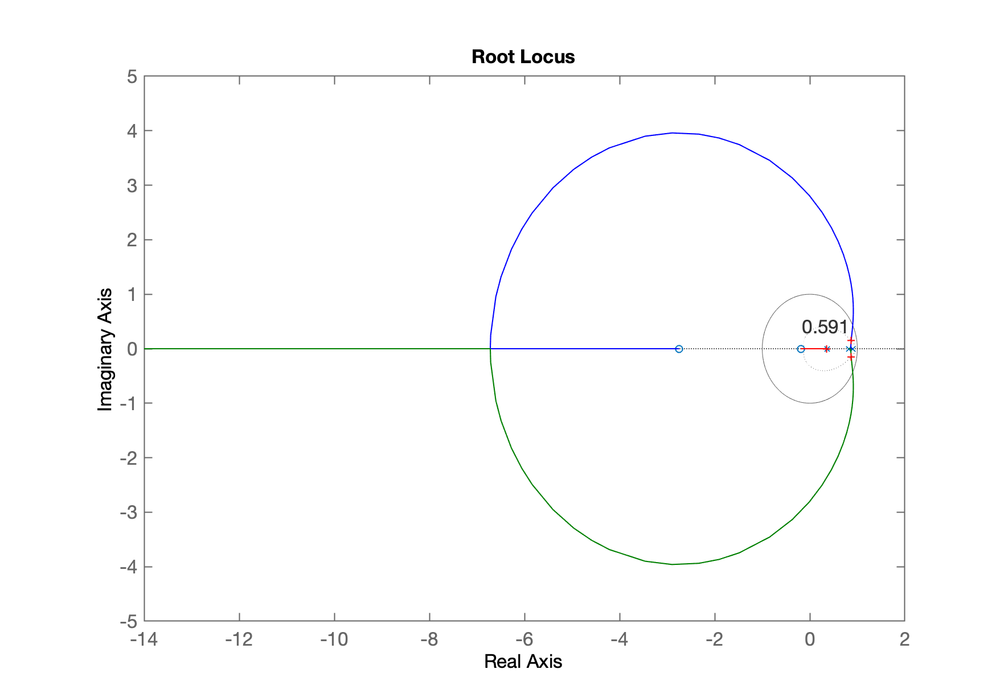
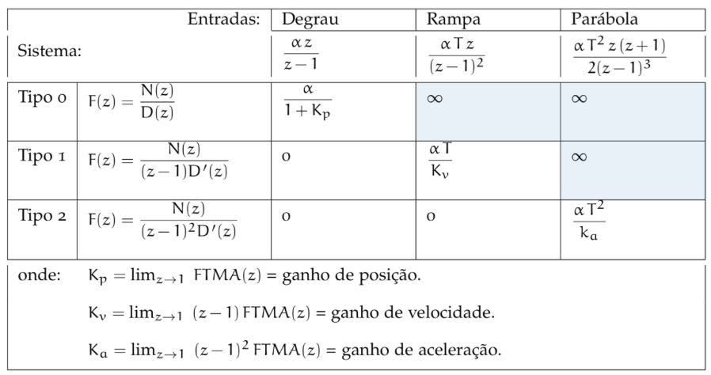
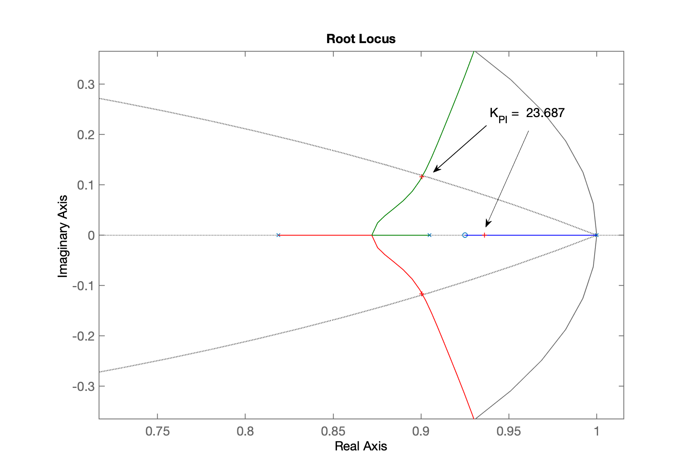

# Controle Automático III

> **:video_camera: Vídeo** da 1a-parte da aula: [Controle 3 (Estudo Dirigido) (2023-05-19 19:34 GMT-3)](https://drive.google.com/file/d/1emtK8NYp2e6IUL21JDTXWqpZhI18doO8/view) -- provavelmente será necessário realizar loogin no Google Drive usando sua conta na UPF ou mesmo no [Googele Sala de Aula da Disciplina](https://classroom.google.com/c/NTQzMDM3ODI2Njc2?cjc=5btpgcs).
>
> **:video_camera: Vídeo** da 2a-parte da aula: [Controle III (extra) (2023-05-19 21:19 GMT-3)](https://drive.google.com/file/d/1grqvxRjLhmr-tGisBNhG4Z0h5U07yxI7/view)  -- provavelmente será necessário realizar loogin no Google Drive usando sua conta na UPF ou mesmo no [Googele Sala de Aula da Disciplina](https://classroom.google.com/c/NTQzMDM3ODI2Njc2?cjc=5btpgcs).
>
> [:file_folder: Arquivos gerados nesta aula](controle_3_2023_1.zip) $\leftarrow$ descompactar e usar `>> load projeto`.
>
> Aula de 19/05/2023

## Planta Usada

Planta usada para projeto de controladores:
$$
G(s)=\dfrac{1}{(s+1)(s+2)(s+10)}
$$
Esta planta será controlada de forma digital, adotando período de amostragem de $T=$ 0,1 segundos.

No Matlab:

```matlab
>> G=tf([1],poly([-1 -2 -10]))

G =
 
             1
  ------------------------
  s^3 + 13 s^2 + 32 s + 20
 
Continuous-time transfer function.

>> zpk(G)

ans =
 
          1
  ------------------
  (s+10) (s+2) (s+1)
 
Continuous-time zero/pole/gain model.

>> T=0.1;
>> BoG = c2d(G,T)

BoG =
 
  0.0001222 z^2 + 0.0003591 z + 6.391e-05
  ---------------------------------------
    z^3 - 2.091 z^2 + 1.375 z - 0.2725
 
Sample time: 0.1 seconds
Discrete-time transfer function.

>> zpk(BoG)

ans =
 
  0.00012224 (z+2.747) (z+0.1903)
  --------------------------------
  (z-0.9048) (z-0.8187) (z-0.3679)
 
Sample time: 0.1 seconds
Discrete-time zero/pole/gain model.

>>
```

Continuando...

## Projeto Controlador Proporcional

Equação do Controlador:

$$
C(z)=K_P
$$

Requisitos de controle:

* $\%OS \le $ 10%;
* $e(\infty) \le $ 10%.


Comandos usados no Matlab para realizar o projeto;

```matlab
>> OS=10;
>> zeta=(-log(OS/100))/(sqrt(pi^2+(log(OS/100)^2)))
zeta =
      0.59116
>> rlocus(BoG)
>> hold on;
>> zgrid(zeta,0)	% sobrepondo linha guia do \zeta para %OS desejado
>> axis equal			% apenas para círculo unitário parecer um círculo
>> [Kp,polosMF]=rlocfind(BoG)
Select a point in the graphics window
selected_point =
      0.87148 +    0.14768i
Kp =
       26.257
polosMF =
      0.87035 +     0.1478i
      0.87035 -     0.1478i
      0.34754 +          0i
>> ftmf=feedback(Kp*BoG,1)

ftmf =
 
  0.00321 z^2 + 0.009428 z + 0.001678
  -----------------------------------
  z^3 - 2.088 z^2 + 1.384 z - 0.2709
 
Sample time: 0.1 seconds
Discrete-time transfer function.

```

Até o momento, temos os gráficos:

RL da planta + controlador proporcional:



RL com zoom, destacando pontos de interesse:


Resposta ao degrau obtido quando $K_p=26,257$:


Note que o erro em regime permanente resultou bem elevado:

```matlab
>> dcgain(ftmf)
ans =
      0.56763
>> erro=((1-dcgain(ftmf))/1)*100
erro =
       43.237
```

### Calculando valor de K para garantir erro desejado

Podemos prever o valor do ganho do controlador para tentar garantir erro abaixo de 10%.

Lembrando da teoria do erro:

* https://classroom.google.com/c/NTQzMDM3ODI2Njc2/m/NjA0Mjk4NDYzODgy/details
* Página WEB: https://fpassold.github.io/Controle_3/4_teoria_erros/resumo_teoria_erro.html



Neste caso, temos um sistema tipo 0 (sem integrador; sem pólo em $z=1$), então:


Usando Matlab para isto:

```matlab
>> % Calculando o limite usando Matlab
>> help polyval
 polyval Evaluate polynomial.
    Y = polyval(P,X) returns the value of a polynomial P evaluated at X. P
    is a vector of length N+1 whose elements are the coefficients of the
    polynomial in descending powers.
 
        Y = P(1)*X^N + P(2)*X^(N-1) + ... + P(N)*X + P(N+1)
>> % A função polyval não aceita tf como argumento de entrada
>> % se faz necessário separar os polinomions do numerador e denominador:
>> [num_d,den_d]=tfdata(BoG,'v')
num_d =
            0   0.00012224   0.00035906   6.3905e-05
den_d =
            1      -2.0914       1.3749     -0.27253
>> % Verificando/comparando:
>> BoG

BoG =
 
  0.0001222 z^2 + 0.0003591 z + 6.391e-05
  ---------------------------------------
    z^3 - 2.091 z^2 + 1.375 z - 0.2725
 
Sample time: 0.1 seconds
Discrete-time transfer function.

>> % Calculando o limite:
>> lim=polyval(num_d,1)/polyval(den_d,1)
lim =
         0.05
>> % Calculando o novo valor de ganho (K2)
>> K2=9/lim
K2 =
          180
>> ftmf2=feedback(K2*BoG,1);
>> figure; step(ftmf2)
>> grid
```

A resposta ao degrau fica agora:


Notamos que agora $e(\infty) \cong$ 10%, mas com $\%OS =$ 58% e $t_s$ bastante aumentado (devido as oscilações) para: $t_s=$ 13 segundos.

**:video_camera: Vídeo** disponível em: [Controle 3 (Estudo Dirigido) (2023-05-19 19:34 GMT-3)](https://drive.google.com/file/d/1emtK8NYp2e6IUL21JDTXWqpZhI18doO8/view) -- provavelmente será necessário realizar loogin no Google Drive usando sua conta na UPF ou mesmo no [Googele Sala de Aula da Disciplina](https://classroom.google.com/c/NTQzMDM3ODI2Njc2?cjc=5btpgcs).

[:musical_note:](https://youtu.be/3OnnDqH6Wj8)

----

## Projeto de Controlador PI

Uma integração numérica vai implicar num termo como:

$$
I(s)=K_i \cdot \dfrac{1}{(z-1)}
$$

ou seja, um pólo em $z=$ 1, não impota o método de integração usado.

> Revisar [Teoria do Erro](https://fpassold.github.io/Controle_3/4_teoria_erros/resumo_teoria_erro.html) no caso de querer entender a origem do denominador: $(z-1)$.

Quando em paralelo com a ação integradora, temos ainda a ação Proporcional, temos como resultado a equação:

$$
\begin{array}{rcl}
C_{PI} &=& K_p+K_i \left( \dfrac{1}{z-1}\right)\\
 &=& K_p \left[ z - \left( 1 - \dfrac{K_i}{K_p} \right) \right]\\
 &=& \dfrac{K(z-z_{PI})}{(z-1)}
\end{array}
$$

Então, nossas únicas incógnitas para o projeto deste controlador são seu ganho $K$, que é fácil descobrir usando o Rool Lucus e o local do seu zero ($z_{PI}$).

> A página [Controle 3](https://fpassold.github.io/Controle_3/controle_3.html) >> [**Aula de 05/05/2021**](https://fpassold.github.io/Controle_3/2021_1/aula_05_05_2021.html) mostra de forma mais detalhada a dedução da eq. do PI.

Poderíamos testar vários locais para o zero do PI, mas por limitações de tempo, vamos alocar o zero numa posição "boa", entre o pólo do integrador ($z=1$) e o pólo mais lento da nossa planta em $z=$ 0.9048, deixando o mesmo mais próximo do pólo mais lento da planta, ou de forma algo arbitrária em $z=0,925$.

> A página [Controle 3](https://fpassold.github.io/Controle_3/controle_3.html)  >> [**Aula de 23/09/2021**](https://fpassold.github.io/Controle_3/Controle3_2021_2/aula_1.html) mostra um estudo envolvendo esboços do Root Locus para diferente posições de zero que poderiam ser adotadas na equação do PI, acompanhado de uma breve discussão sobre o impacto no RL e resposta do sistema para cada posição diferente de zero. 
> Um método mais determinístico para o zero do PI, seria usar **Contribuição Angular**. Mas por hora, vamos nos abtesrde realizar cálculos aritméticos.

Então:

```matlab
>> C_PI = tf([1 -0.925],[1 -1],T)

C_PI =
 
  z - 0.925
  ---------
    z - 1
 
Sample time: 0.1 seconds
Discrete-time transfer function.

>> ftma_PI=C_PI*BoG		% determinando a eq. de malha-direta

ftma_PI =
 
  0.0001222 z^3 + 0.000246 z^2 - 0.0002682 z - 5.911e-05
  ------------------------------------------------------
      z^4 - 3.091 z^3 + 3.466 z^2 - 1.647 z + 0.2725
 
Sample time: 0.1 seconds
Discrete-time transfer function.

>> zpk(ftma_PI)				% mostrando eq. em formato mais "amigável"

ans =
 
  0.00012224 (z+2.747) (z-0.925) (z+0.1903)
  -----------------------------------------
   (z-1) (z-0.9048) (z-0.8187) (z-0.3679)
 
Sample time: 0.1 seconds
Discrete-time zero/pole/gain model.

>> figure; rlocus(ftma_PI)
>> hold on; zgrid(zeta,0)
>> [K_PI,polosMF_PI]=rlocfind(ftma_PI)	% encontrando o valor do ganho
Select a point in the graphics window
selected_point =
      0.90109 +    0.11602i
K_PI =
       23.687
polosMF_PI =
      0.93609 +          0i
       0.9006 +     0.1161i
       0.9006 -     0.1161i
      0.35127 +          0i
>> ftmf_PI=feedback(K_PI*ftma_PI,1);		% fechando a malha
>> figure; step(ftmf_PI)
>> zpk(C_PI)			% lembrando da eq. do nosso PI sem seu ganho

ans =
 
  (z-0.925)
  ---------
    (z-1)
 
Sample time: 0.1 seconds
Discrete-time zero/pole/gain model.

>> save projeto		% lembrando de quardar dados para uso posterior
```

RL para este PI:


"Zoom" no RL na zona de interesse, destando pontos de interesse:



Resposta ao degrau unitário obtida para este PI:


```matlab
>> stepinfo(ftmf_PI)
ans = 
  struct with fields:

        RiseTime: 1.3
    SettlingTime: 3.3
     SettlingMin: 0.90018
     SettlingMax: 1.0317
       Overshoot: 3.1685
      Undershoot: 0
            Peak: 1.0317
        PeakTime: 2.8
>> 
```

Lembrando que outros valores poderiam ser adotados para o valor do PI. Eventualmente um local melhor para o zero do PI poderia ter sido adotado.

**:video_camera: Vídeo** desta parte da aula: [Controle III (extra) (2023-05-19 21:19 GMT-3)](https://drive.google.com/file/d/1grqvxRjLhmr-tGisBNhG4Z0h5U07yxI7/view)  -- provavelmente será necessário realizar loogin no Google Drive usando sua conta na UPF ou mesmo no [Googele Sala de Aula da Disciplina](https://classroom.google.com/c/NTQzMDM3ODI2Njc2?cjc=5btpgcs).

[:file_folder: Arquivos gerados nesta aula](controle_3_2023_1.zip) $\leftarrow$ descompactar e usar `>> load projeto`.

[:musical_note:](https://youtu.be/fbafd6UV3w4)


----

Fernando Passold, em 19/05/2023

