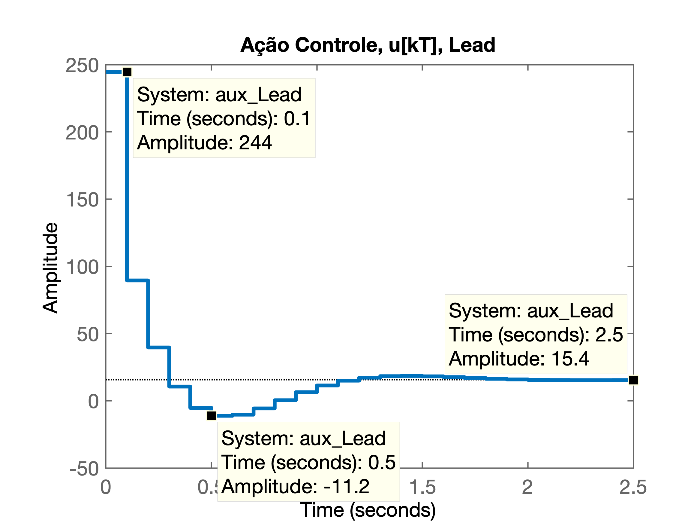
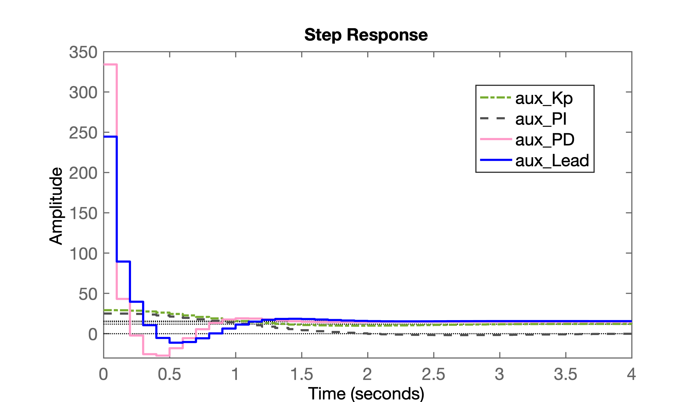
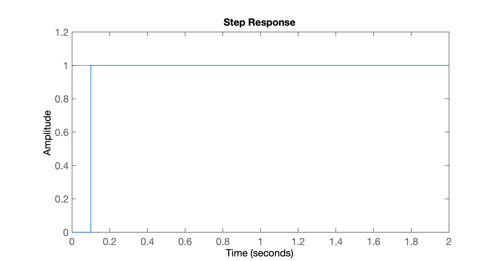
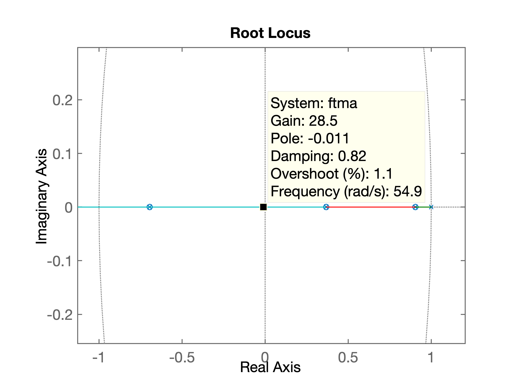
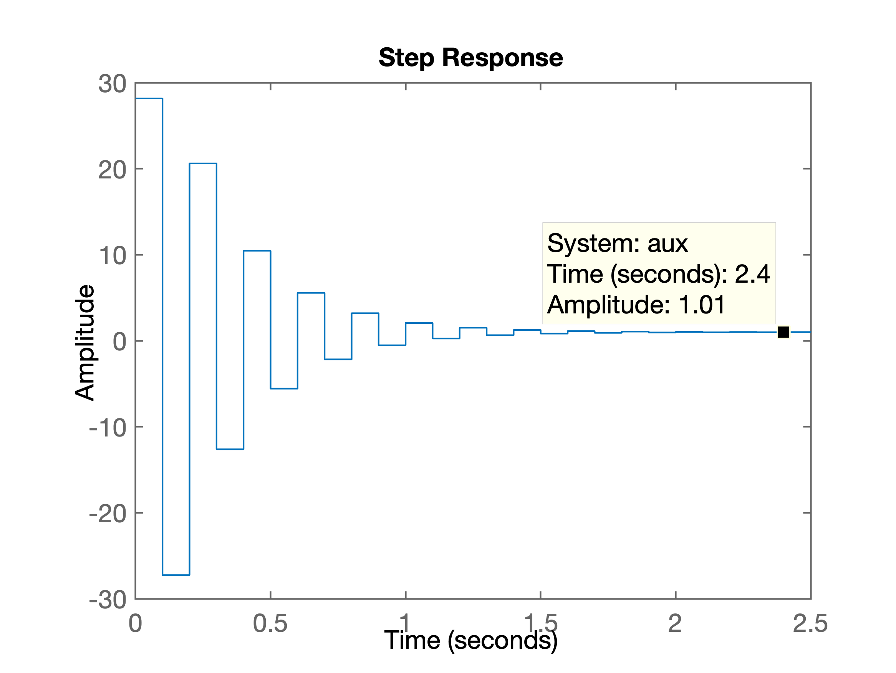
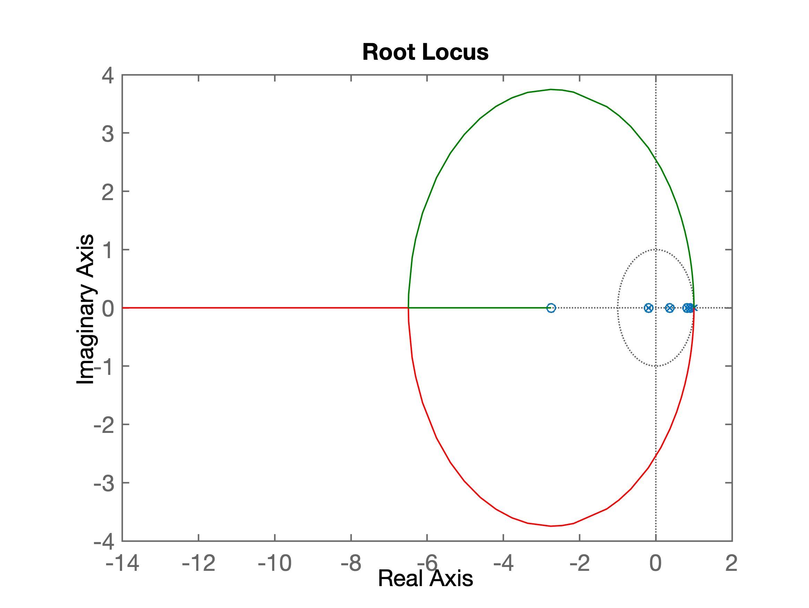
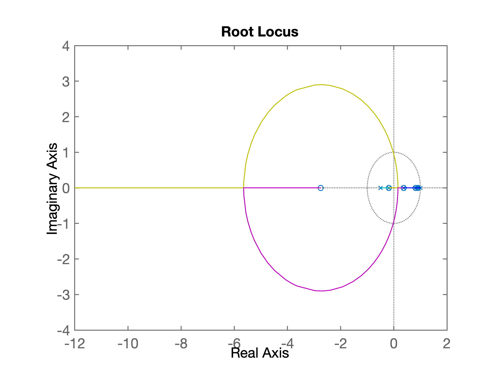
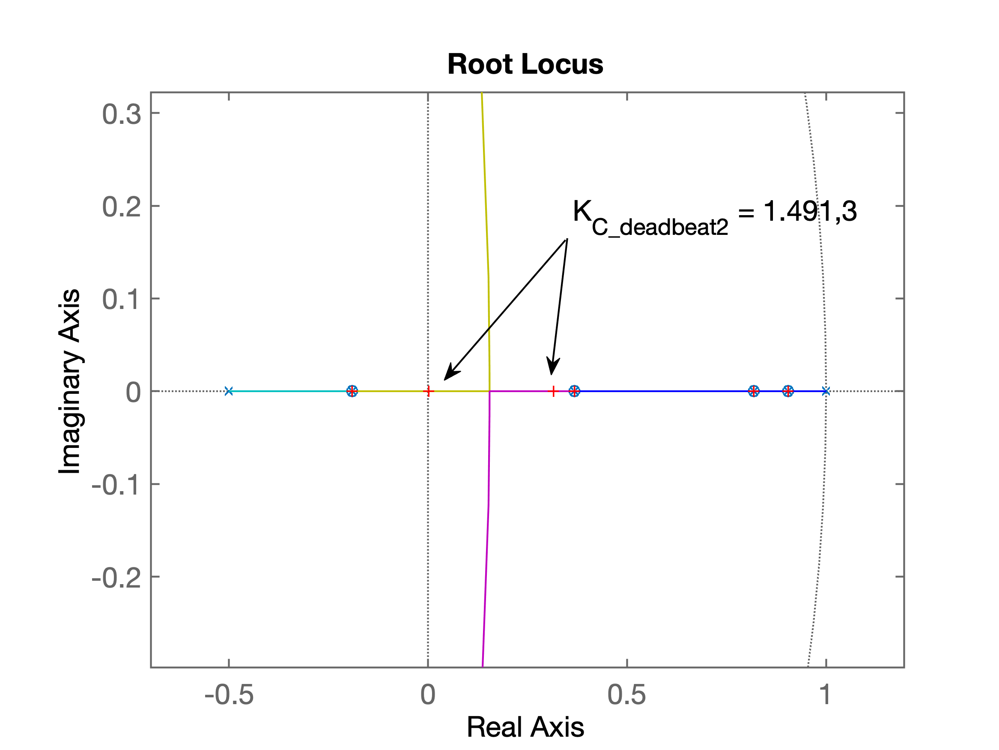
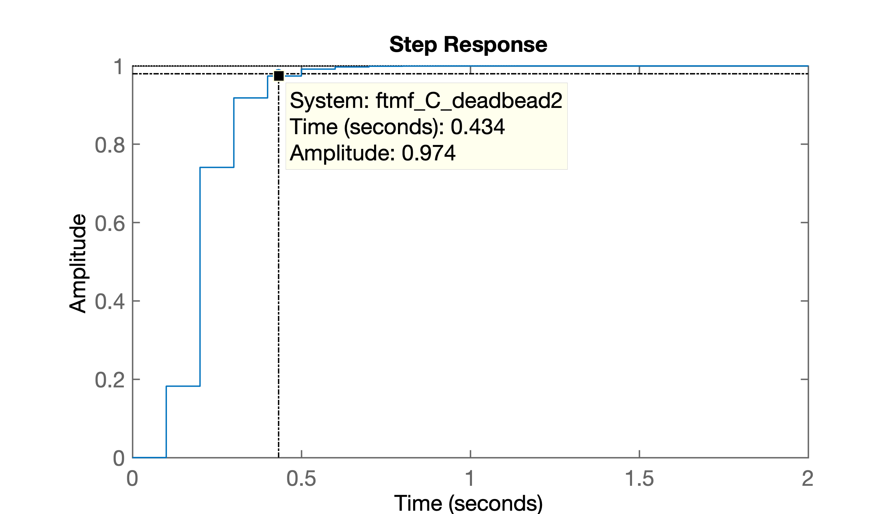

# Controlador Deadbeat

> Aula originalmente administrada em 08/10/2019.

## Amplitudes das Ações de Controle

Vamos verificas as amplitudes desenvolvidas pelas ações de controle, principalmente com Ação Derivativa (ou Lead).

Recuperando dados de aula passada:

```matlab
>> diary aula_08_out_2019.md % gerando arquivo de registro desta aula
>> clear all % limpando todas as variáveis
>> close all % fechando todas as janelas gráficos
>> what      % listando arquivos compatíveis com Matlab

MATLAB Code files in the current folder /Users/fernandopassold/Documents/UPF/Controle_Auto_3/6_Controle_Digital

angulos2      arc           createfigure  

MAT-files in the current folder /Users/fernandopassold/Documents/UPF/Controle_Auto_3/6_Controle_Digital

controlador2             planta_instavel_ex_1     
controlador_dead_beat_1  
planta                   

MDL-files in the current folder /Users/fernandopassold/Documents/UPF/Controle_Auto_3/6_Controle_Digital

controlador_tempo_minimo   dead_beat_example_2_NPTEL  
controlador_tempo_minimo2  planta_instavel_exemplo_1  
controle_tempo_minimo_1    
dead_beat_2                

SLX-files in the current folder /Users/fernandopassold/Documents/UPF/Controle_Auto_3/6_Controle_Digital

controlador_dead_beat_3_6_2_example_2                  
controlador_dead_beat_3_6_2_example_2_with_saturation  
planta_2a_ordem_cancela_imperf                         
planta_2a_ordem_cancela_imperf2                        

>> load planta % recuperando dados da última aula
>> zpk(C_Lead) % verificando equação do Lead:

ans =
 
  (z-0.7541)
  ----------
   (z-0.15)
 
Sample time: 0.1 seconds
Discrete-time zero/pole/gain model.

>> K_Lead
K_Lead =
  244.4570
>>
```

Podemos "forçar" o `Matlab` à gerar um gráfico de $u[kT]$ para uma referência de entrada degrau. Para tanto, lembramos que:

$$
U(z) = \underbrace{ \left[ \dfrac{C(z)}{1+C(z) \cdot BoG(z)} \right] }_{\text{'aux'}} \cdot R(z)
$$

O gráfico de $u[kT]$ pode ser obtido pelo próprio `Matlab` via comando `step(.)`:

$$
\texttt{step (aux) }=\mathcal{L}^{-1} \left\{ \texttt{aux} \cdot \underbrace{R(z)}_{\text{Degrau}} \right\}
$$

Verificando amplitudes geradas para ação de controle do **Controlador Lead**:

```matlab  
>> aux_Lead=K_Lead*C_Lead/(1+K_Lead*C_Lead*BoG);
>> step(aux_Lead)
>> title('Ação Controle, u[kT], Lead')
```

O controlador Lead gera as seguintes amplitudes para a ação de controle:



Como esperado, este controlador gera picos transitórios inciais de amplitude bastante elevada.

### Comparando com Ações de Controle de outros controladores

```matlab
>> % Das aulas passadas temos recuperado do arquivo planta.mat, vários dados:
>> figure; step(aux_Kp, aux_PI, aux_PD, aux_Lead)
>> axis([0 4 -30 350]) % realizando um "zoom" numa região de interesse
>> % Figura salva como: acoes_controladores.png
```

A figura abaixo mostra as ações de controle executadas por 4 controladores diferentes:

* Proporcional (Kp);
* PI;
* PD;
* Lead



Percebe-se que o **PD** e o **Lead** são os mais "agressivos" com a planta. Sendo que o PD é o que gera as maiores amplitudes para o sinal de controle.

---

# Controlador Dead-beat

## Exemplo 1)

Seja a planta:

$$
G(s)=\dfrac{10}{(s+10)(s+1)}
$$

O projeto e teste do controlador no `Matlab` fica:

```matlab
>> save planta % salvando todo o workspace anterior (estudo de caso)
>> clear all   % limpando todas as variáveis
>> clsoe all   % fechando todas as janelas gráficas
>> %
>> % Recomeçando do zero...
>> %
>> % ## Teste do Controalador Dead-beat
>> %
>> G=tf(10,poly([-1 -10]));
>> zpk(G)

ans =
 
       10
  ------------
  (s+10) (s+1)
 
Continuous-time zero/pole/gain model.

>> T=0.1;
>> BoG=c2d(G, T);
>> zpk(BoG)

ans =
 
   0.035501 (z+0.6945)
  ---------------------
  (z-0.9048) (z-0.3679)
 
Sample time: 0.1 seconds
Discrete-time zero/pole/gain model.
```

O controlador dead-beat deve seguir então a equação:

$$
C(z)=\dfrac{K \cdot (z-0.9048) (z-0.3679)}{(z+0.6945) \underbrace{(z+1)}_{\text{Integrador}} }
$$

De forma que:

$$
FTMA(z)=C(z) \cdot BoG(z)=\dfrac{1}{(z+1)}
$$

e a malha-fechada resulte em:

$$
FTMF(z)=\dfrac{FTMA(z)}{1+FTMA(z)}=\ldots=\dfrac{1}{z}
$$

O que significa que o RL deste sistema resulta bastante simples: só existe um pólo de MA em $z=1$ e quando a malha é fechada ($K>0$), este se "move" de $z=1$ até $z=-\infty$ passando sobre a origem do plano-*z*. Ocorre que quanto mais próximo um pólo de MF estiver da origem do plano-*z*, mais rápida será sua resposta a um degrau. No caso do pólo de MF ficar localizado justamente sobre $z=0$, coincide que temos a função transferência da entrada degrau ($=1/z$) deslocado de um período de amostragem, ou seja, se conseguirmos posicionar o pólo de MF justamente sobre a origem do plano-*z*, faremos com que o sistema convirja para o regime permanente, sem erro, sem *overshoot* no instante de tempo igual à $t \ge T$ (ou seja, na amostra $k=1$).

"Forçando" o `Matlab` para compor o $C(z)$ conforme desejado:

```matlab
>> num_BoG=poly(zero(BoG)) % separando os zeros de BoG(z)
num_BoG =
    1.0000    0.6945
>> den_BoG=poly(pole(BoG)) % separando os pólos de BoG(z)
den_BoG =
    1.0000   -1.2727    0.3329
>> % Falta incluir integrador no denominador do C_deadbeat
>> den_C_deadbeat=conv(num_BoG,[1 -1])
den_C_deadbeat =
    1.0000   -0.3055   -0.6945
>> % outra forma de obter den_C_deadbeat
>> den_C_deadbeat2=poly([1 zero(BoG)])
den_C_deadbeat2 =
    1.0000   -0.3055   -0.6945
>> C_deadbeat=tf(den_BoG, den_C_deadbeat,T) % montando C(z)

C_deadbeat =
 
  z^2 - 1.273 z + 0.3329
  -----------------------
  z^2 - 0.3055 z - 0.6945
 
Sample time: 0.1 seconds
Discrete-time transfer function.

>> zpk(C_deadbeat) % colocando C(z) num formato mais "agradável"

ans =
 
  (z-0.9048) (z-0.3679)
  ---------------------
    (z-1) (z+0.6945)
 
Sample time: 0.1 seconds
Discrete-time zero/pole/gain model.
```

Percebemos que determinanmos o $C(z)$ conforme o desejado. Resta agora determinar $FTMA(z)$ e $FTMF(z)$:

```matlab
>> ftma=C_deadbeat*BoG;
>> zpk(ftma)

ans =
 
  0.035501 (z+0.6945) (z-0.9048) (z-0.3679)
  -----------------------------------------
   (z+0.6945) (z-0.9048) (z-1) (z-0.3679)
 
Sample time: 0.1 seconds
Discrete-time zero/pole/gain model.
```

Note que vários termos se cancelam (com excessão do termo `0.035501`).
 
Notamos que quase temos $FTMA(z)$ da forma desejada: $FTMA(z)=1/(z-1)$, bastando acrescentar o ganho adequado para $C(z)$:

```matlab
>> K_C_deadbeat=1/0.035501
K_C_deadbeat =
   28.1682
>> figure; rlocus(ftma)
>> ftmf=feedback(K_C_deadbeat*ftma, 1);
>> figure; step(ftmf)
>> % grafico salvo como: step_dead_beat_teste.png
```

Finalmente temos o gráfico com a resposta ao degrau para este controlador:



Note que foi possível fazer a planta entrar em regime permanente a partir do instante de amostragem $k=1% em $t=T=0,1$.

Segue o diagrama de RL que comprova o que foi realizado:



Reparr que tentamos posicionar o mouse o tanto que for possível sobre a origem do plano-*z*, o que fez surgir o *DataTip* com o dado `K=28.5` (mas neste caso, repare que o pólo de MF se encontra em $z=-0,011$). 

O valor calculado para o ganho do controlador seria: $K_{\text{Deadbeat}}=1/0.035501=28.1682$.

Apesar de garantir que a planta convergiu muito rapidamente para o valor desejado (entrada degrau, $y[kT]=1$ para $k \ge 0$), é bom perceber que isto foi às custas de consideráveis amplitudes geradas para o sinal de controle logo nos primeiros instantes de amostragem. Comprovando isto com a ajuda do `Matlab`: 

```matlab
>> %
>> % Mas.... Verificando ação de controle...
>> %
>> aux=K_C_deadbeat*C_deadbeat/(1+K_C_deadbeat*C_deadbeat*BoG);
>> figure; step(aux)
```

Segue figura mostrando as amplitudades geradas para a ação de controle deste controlador:


 
Note as amplitudes iniciais variando próximo de $\pm 30$. Mas $u[kT]$ em regime permanente tende à 1,0.


## Aplicando Dead-beat na planta do estudo de caso

```matlab
>> clear all % limpando memória com dados antigos
>> close all % fechando janelas gráficas
>> load planta % recuperando dados da planta e controladores estudo caso
```

Especificando o controlador dead-beat

```matlab
>> zpk(BoG) % recordando expressão da planta, BoG(z)

ans =
 
  0.00012224 (z+2.747) (z+0.1903)
  --------------------------------
  (z-0.9048) (z-0.8187) (z-0.3679)
 
Sample time: 0.1 seconds
Discrete-time zero/pole/gain model.
```

Separando os componentes necessários para o *deadbeat* a partir dos dados de $BoG(z)$:

```matlab
>> zero(BoG)
ans =
   -2.7471
   -0.1903
>> % Existe um zero instável (em z = -2.7471)
>> zeros_BoG=zero(BoG)
zeros_BoG =
   -2.7471
   -0.1903
>> zeros_BoG(2)
ans =
   -0.1903
>> den_C_deadbeat=poly(zeros_BoG(2)) % só considero zero em z = -0.1903
den_C_deadbeat =
    1.0000    0.1903
>> num_C_deadbeat=poly(polo(BoG)) % separando pólos de BoG(z)
Undefined function or variable 'polo'. 
>> num_C_deadbeat=poly(pole(BoG)) % separando pólos de BoG(z)
num_C_deadbeat =
    1.0000   -2.0914    1.3749   -0.2725
>> % incluindo integrador no C_deadbeat:
>> den_C_deadbeat=poly([zeros_BoG(2)   1])
den_C_deadbeat =
    1.0000   -0.8097   -0.1903
>> C_deadbeat=tf(num_C_deadbeat, den_C_deadbeat, T);
>> zpk(C_deadbeat)

ans =
 
  (z-0.9048) (z-0.8187) (z-0.3679)
  --------------------------------
          (z-1) (z+0.1903)
 
Sample time: 0.1 seconds
Discrete-time zero/pole/gain model.

```

Para compatibilizar o grau do numerador com o grau no denominador de $C(z)$, se faz necessário acrescentar + 1 pólo. Inicialmente acrescentando um segundo integrador:

```matlab
>> % Acrescentando + 1 integrador, grau(den)=grau(num)
>> den_C_deadbeat=poly([zeros_BoG(2)   1  1]);
>> C_deadbeat=tf(num_C_deadbeat, den_C_deadbeat, T);
>> zpk(C_deadbeat)

ans =
 
  (z-0.9048) (z-0.8187) (z-0.3679)
  --------------------------------
         (z-1)^2 (z+0.1903)
 
Sample time: 0.1 seconds
Discrete-time zero/pole/gain model.

>> ftma_C_deadbeat=C_deadbeat*BoG;
>> zpk(ftma_C_deadbeat)   % Verificando FTMA(z) resultante:

ans =
 
                                                                
  0.00012224 (z+2.747) (z-0.9048) (z-0.8187) (z-0.3679) (z+0.1903)
  --------------------------------------------------------------
       (z+0.1903) (z-0.3679) (z-0.8187) (z-0.9048) (z-1)^2
                                                          
 
Sample time: 0.1 seconds
Discrete-time zero/pole/gain model.
```

O `Matlab` não cancela automaticamente os termos comuns presentes numa “transfer function”, diferente do que uma pessoa faria resolvendo o problema analiticamente. Mas é possível usar a função **`minreal(.)`** para **forçar o cancelamento** de termos:

```matlab
>> ftma_C_deadbeatR=minreal(ftma_C_deadbeat,1E-4);
>> zpk(ftma_C_deadbeatR)

ans =
 
  0.00012224 (z+2.747)
  --------------------
        (z-1)^2
 
Sample time: 0.1 seconds
Discrete-time zero/pole/gain model.
```

Desta forma, verifica-se que os cancelamentos pretendidos foram realizados. Resta verificar como fica o **RL** desta função transferência em malha-aberta:

```matlab
>> figure; rlocus(ftma_C_deadbeat)
>> % Figura salva como: RL_deadbeat_integrador_duplo.png
```

O RL resultante aparece na próxima figura:



**Conclusão**: Pelo RL percebe-se que qualquer ganho não-nulo positivo ($K >ge 0$) deixa o sistema instável em MF. Isto significa que, para o caso desta planta, não é possível usar um duplo integrador. O pólo extra, necessário para $C(z)$, terá que ser alocado em outra posição.

### Versão 2 do Deadbeat

Como não foi possível introduzir um integrador duplo em $C(z)$ e com base no traçado do RL anterior, percebemos que é melhor (mais conveniente) introduzir o pólo extra na região real negativa do plano-*z* para forçar o deslocamento do pólo de MF de $z=1$ até $z=p_c$, fazendo o mesmo passar sobre a origem do plano-*z*. Se o $p_c$ ficar no eixo real positivo do plano-*z* o pólo de MF não passará sobre a origem no plano-*z* e consequentemente não será possível atingir a resposta em regime permanente no menor tempo possível (preferencialmente em $k=1$). Por isto o $p_c$, neste caso, fica localizado na parte negativa real do plano-*z*. 

Até este ponto só sabemos que este pólo extra deve estar na parte negativa real (e estável) do plano-*z*, mas não sabemos exatamente onde. Poderia ser adotado o método da contribuição angular para encontrar precisamente o local de $p_c$. Mas por hora, nos contentaremos em colocar o $p_c$ em $z=-0,5$ e veremos o que sucede.

Então:

```matlab
>> den_C_deadbeat2=poly([zeros_BoG(2)   1  -0.5]);
>> % acrescentei um pólo em z = -0,5
>> C_deadbeat2=tf(num_C_deadbeat, den_C_deadbeat2, T);
>> zpk(C_deadbeat2)    % verificando a eq. final de C(z)

ans =
 
  (z-0.9048) (z-0.8187) (z-0.3679)
  --------------------------------
      (z-1) (z+0.5) (z+0.1903)
 
Sample time: 0.1 seconds
Discrete-time zero/pole/gain model.

>> % Determinando a nova FTMA(z):
>> ftma_C_deadbeat2=C_deadbeat2*BoG;
>> ftma_C_deadbeat2R=minreal(ftma_C_deadbeat2,1e-4);
>> zpk(ftma_C_deadbeat2R)

ans =
 
  0.00012224 (z+2.747)
  --------------------
     (z-1) (z+0.5)
 
Sample time: 0.1 seconds
Discrete-time zero/pole/gain model.

>> % Verificando agora como ficou o RL:
>> figure; rlocus(ftma_C_deadbeat2)
>> % figura salva como: RL_deadbeat_versao2.png
```

Segue a figura do RL para esta versão do controlador:



```matlab
>> % Opções: 3a-versão do Deadbeat: "recuar" ainda mais o pólo em z = -0,5
>> % Problema: - quanto devo recuar? Solução: calcular o ponto de partida do RL
>> % para ocorrer na origem do plano-z....
>> %
>> % Outra opção: mantenho esta versão e sintonizo um dos pólos de MF para
>> % ocorrer sobre a origem do plano-z
>> %
>> [K_C_deadbeat2,polosMF]=rlocfind(ftma_C_deadbeat2)
Select a point in the graphics window
selected_point =
   0.0024 + 0.0009i
K_C_deadbeat2 =
   1.4913e+03
polosMF =
    0.9048
    0.8187
    0.3679
    0.3153
   -0.1903
    0.0024
>> % RL salvo como: RL_deadbeat_versao2_sintonizado.png
```

O RL para este controlador sintonizado é mostrado a seguir:



Fechando a malha:

```matlab
>> ftmf_C_deadbead2=feedback(K_C_deadbeat2*ftma_C_deadbeat2, 1);
>> figure; step(ftmf_C_deadbead2)
>> % figura salva como: step_deadbead2.png
```

Segue figura mostrando resultado obtido em malha-fechada:



---

Fim. Não esquecer:

```matlab
>> save planta
>> diary off
>> quit
```

a dopo.
