# Teste de Controladores com Ação Derivativa

> Aula de 24/10/2019, depois da teoria sobre [Ação Derivativa](../Controle_Acao_Derivativa.html)
> Material revisado em 06/05/2024.

## Fechando malha com Derivador Analógico Puro:

Testando derivador analóriogo puro - arquivo:  [derivador_puro.slx](derivador_puro.slx)  ou  [derivador_puro.mdl](derivador_puro.mdl) :

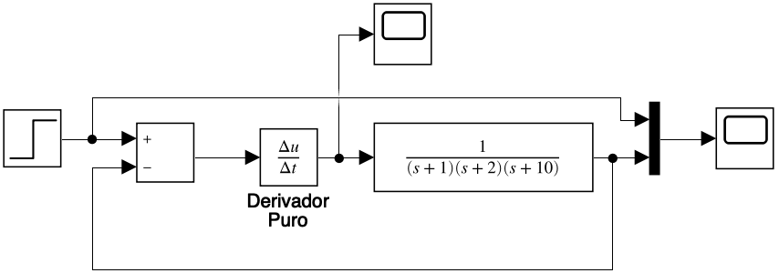

Resulta em:

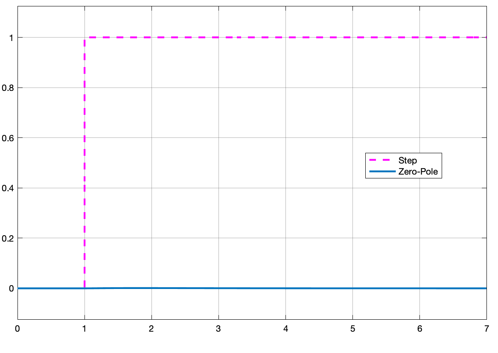

## Fechando malha com Derivador Puro Discretizado (Numérico)

Avaliando sua versão digital - arquivo:   [derivador_purot_digital.slx](derivador_purot_digital.slx)  ou   [derivador_purot_digital.mdl](derivador_purot_digital.mdl) :

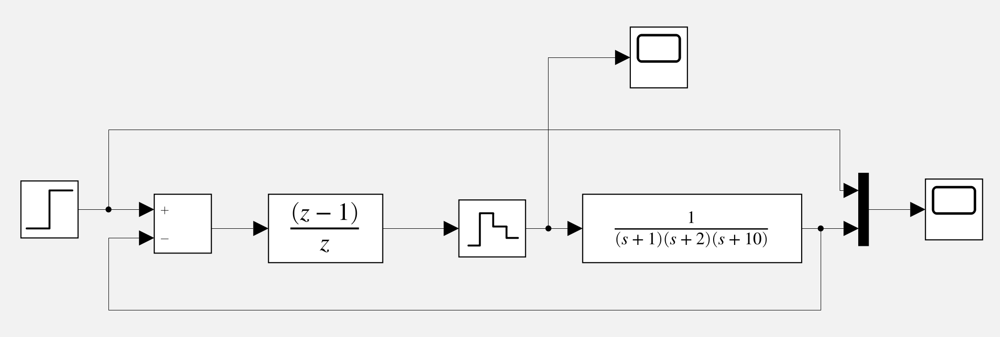

Resulta em:

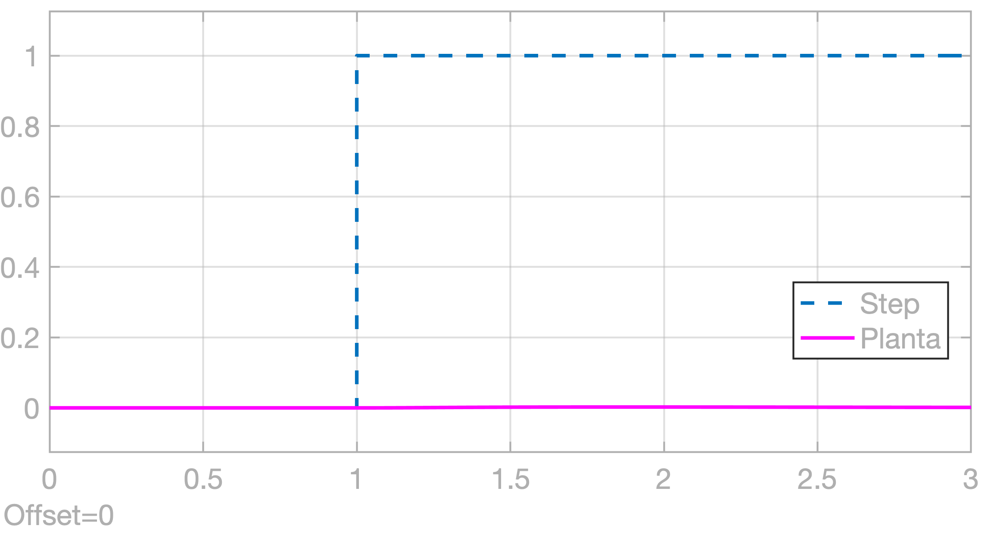

Saída gerada pela seguinte ação de controle:

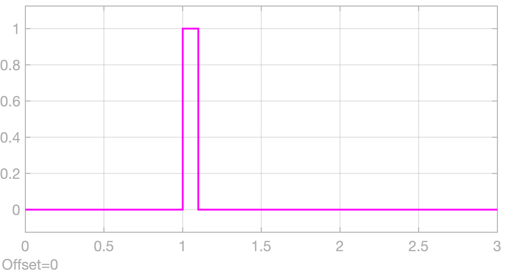

## Fechando a malha com P+D

Simulando um controlador PD (Proporcional + Derivativo) - arquivo:  [PD_digital.slx](PD_digital.slx) ou  [PD_digital.mdl](PD_digital.mdl) :

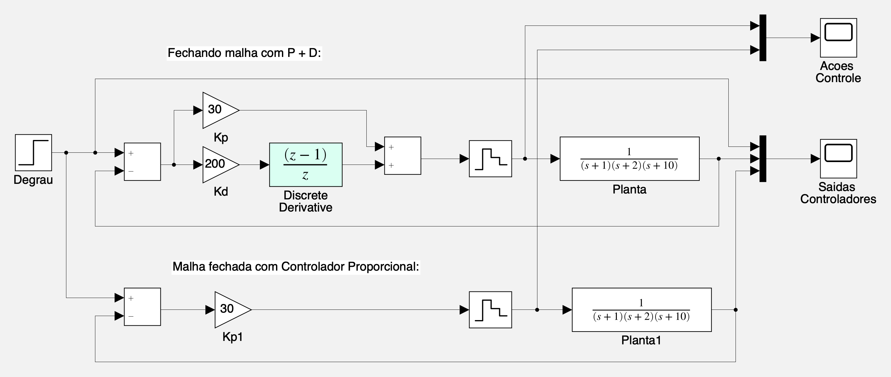

A planta acima está trabalando com ganho proporcional, $K_p=30$ e ganho derivatico de $K_d=200$.

Esta planta responde da forma mostrada na figura à seguir:

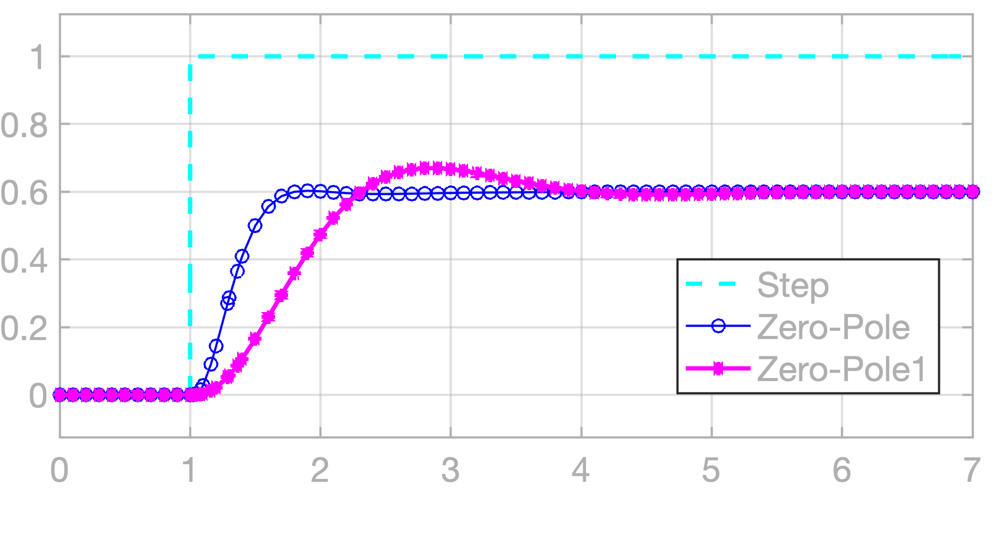

Note que:

- A parte (ação) derivativa não influencia o erro em regime permanente. Você pode aumentar ainda mais $K_d$ e $erro(\infty)$ continua estacionado no mesmo valor. A ação derivativa **não** influencia o valor do erro em regime permanete, apenas atua acelerando a resposta do sitema.
- O erro ($erro(\infty)$) só diminui se $K_p$ (ganho proporcional) aumenta -- obedecendo a teoria de erro para sistemas do tipo 0. Mas como falta ação integral e este sistema é do tpo 0, e erro nunca será anulado.
- Note que controlador PD gera ações de controle de amplitudes bastante elevadas (no caso, o valor inicial, de pico, é diretamente proporcional à: $K_p+K_d$. Estes expressivos valores iniciais para a ação de controle, na prática, saturam o driver de potência, ou seja, o controlador pode até tentar impor elevadas amplitudes na entrada da planta, **mas** a planta não têm condições de absorver estes altos valores, porque o driver de potência não consegue gerar estas amplitudades tão elevadas. Na prática o driver de potência satura à partir de determinado valor. Veja a próxima figura:

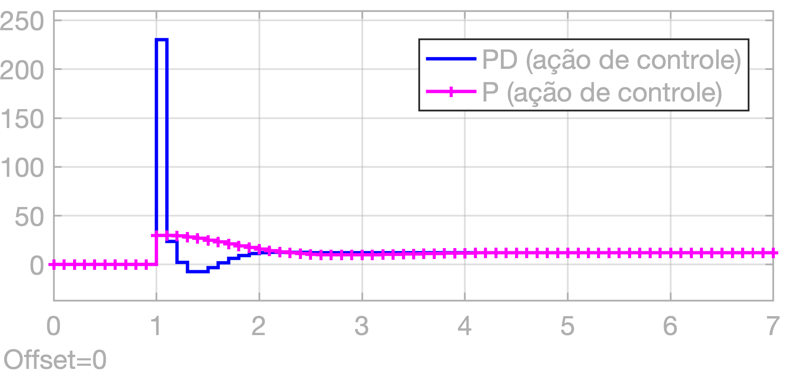

## Controlador PD com Bloco Saturador (Limitador)

Acrescentado o bloco de saturação ajustado para limitar valores à faixa de $1 \le u[kT] \le 100\%$ (supondo que este sinal de controle é repassado para um gerador PWM ponte H completa) -- arquivo:  [PD_digital_saturacao.slx](PD_digital_saturacao.slx)  ou  [PD_digital_saturacao.mdl](PD_digital_saturacao.mdl) :

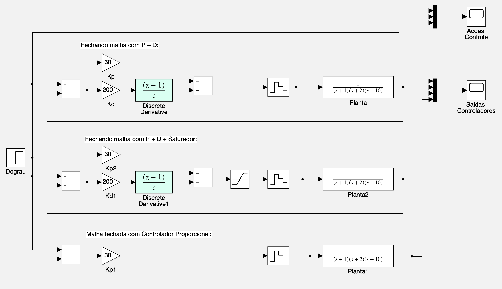

A seguinte resposta será obtida:

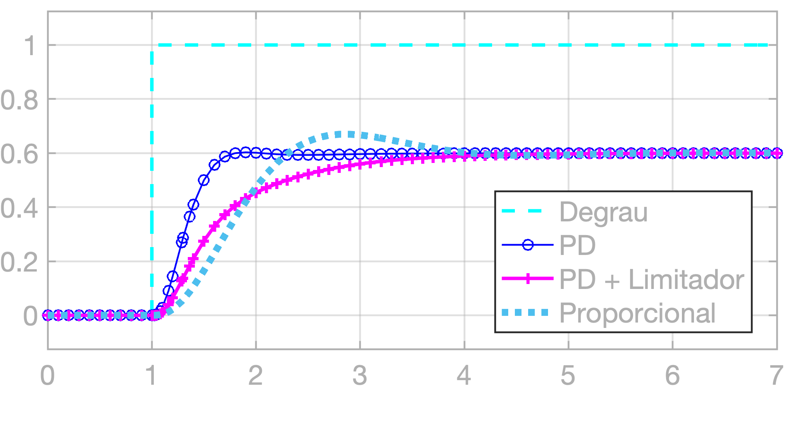

Note na próxima figura como as amplitudes elevadas para ação de controle foram "truncadas":

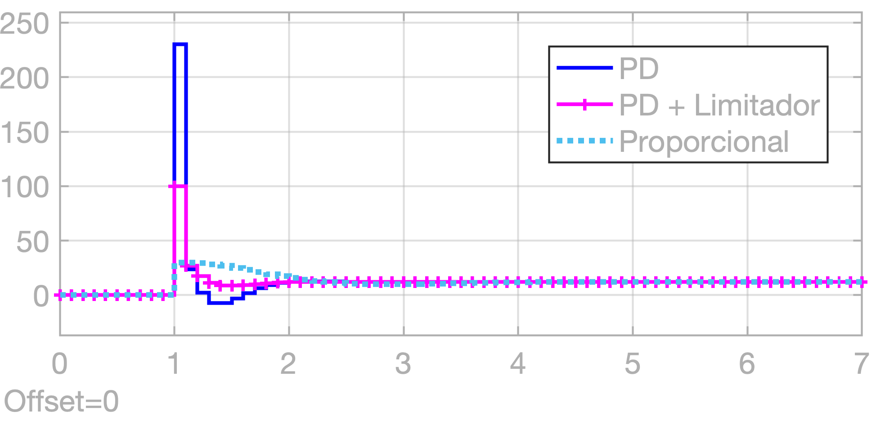

---
**Obs.:** para transformar numa figura, um diagrama de blocos do Simulink, realizar o seguinte comando na janela de comandos do `matlab':

```matlab
>> % Salvando diagrama em blocos como figura .jpg:
>> print('-sModelName', '-djpeg', 'model.jpg')
>> print('-sModelName', '-dpng', 'model.png'); % gera figura png
>> print('-sModelName', '-depsc2S', 'model.eps') % formato próprio para LaTeX
>> % Exemplo:
>> print('-sderivador_puro', '-r150', '-dpng', 'derivador_puro.slx.png'); % a opção -r é para aumentar a resolução (em dpi)
```

Em caso de **Problemas para abrir arquivo .SLX**, tente fazer:

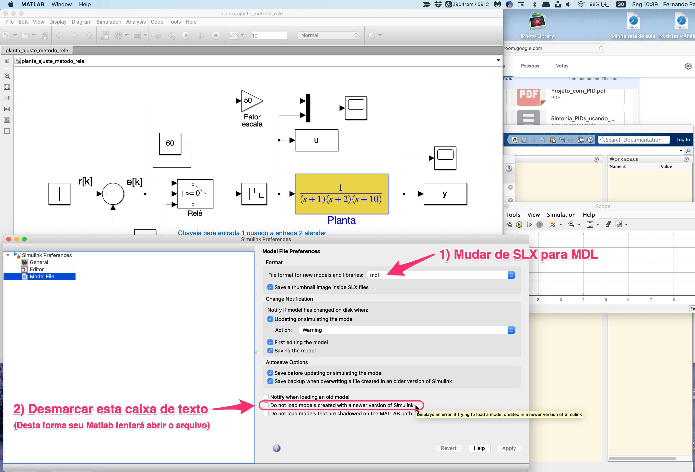

---

Fernando Passold (2024/1)
