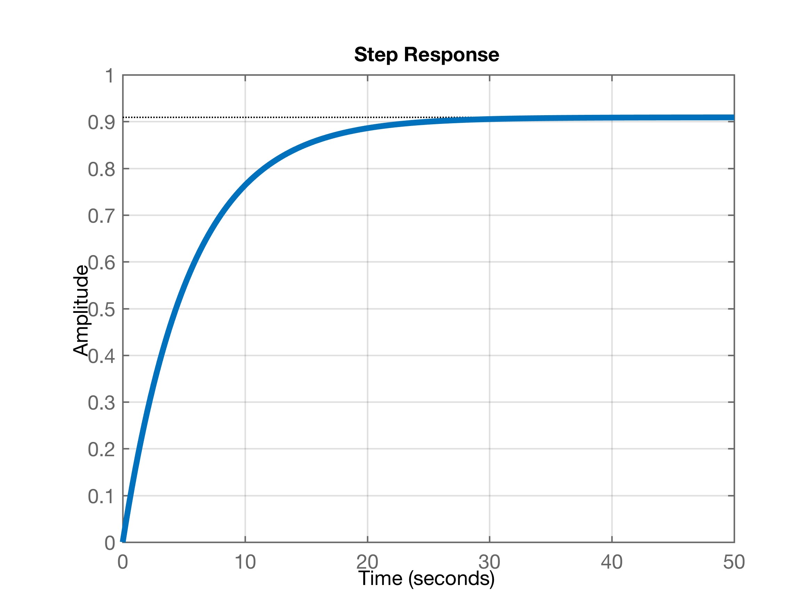
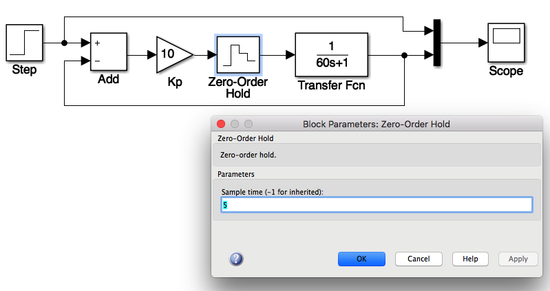
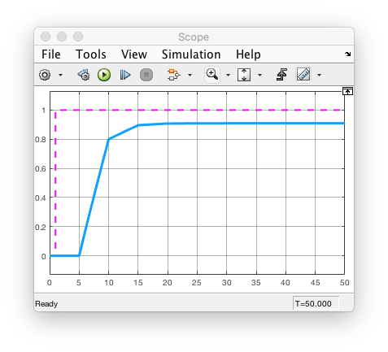

# Intro a Sistemas Amostrados

Seja um sistema de 1a-ordem do tipo:
$$
G(s)=\dfrac{K}{(1+\tau s)}
$$
Este processo incorporado numa malha digital de controle deve incluir o sustentador de ordem zero (ou Z.O.H. = Zero Holder Order), através da equação:
$$
BoG(z)=(1-z^{-1})\mathcal{Z}\left\{ \dfrac{G(s)}{s} \right\}
$$
o que neste caso resulta:

$ BoG(z)=K(1-z^{-1}) \mathcal{Z}\left\{ \dfrac{1}{s(1+\tau s)} \right\}$

Resolvendo a parte $\dfrac{1}{s(1+\tau s)}$ por frações parciais temos:

$\dfrac{1}{s(1+\tau s)} = \dfrac{A}{s} + \dfrac{B}{(s+\tau s)}$

onde:

$A={\dfrac{1}{(1+\tau s)}}\Big|_{s=0} = 1$

$B={\dfrac{1}{s}}\Big|_{s=1/(-\tau)} = -\tau$

Ou seja:

$\dfrac{1}{s(1+\tau s)} = \dfrac{A}{s} + \dfrac{B}{(s+\tau s)}=\dfrac{1}{s}-\dfrac{1}{1/\tau+s}$

Voltando ao cálculo de $\mathcal{Z}\left\{ \dfrac{1}{s(1+\tau s)} \right\}$, e consultando uma tabela de transformadas $\mathcal{Z}$ teremos:

$\mathcal{Z}\left\{ \dfrac{1}{s(1+\tau s)} \right\}=\dfrac{z}{z-1}-\dfrac{z}{z-e^{-T/\tau}}$

ou:

$\mathcal{Z}\left\{ \dfrac{1}{s(1+\tau s)} \right\}=\dfrac{1}{1-z^{-1}}-\dfrac{1}{1-z^{-1}e^{-T/\tau}}$

Finalizando o cálculo de $BoG(z)$, teremos:

$BoG(z)=\dfrac{K(1-z^{-1})}{(1-z^{-1})}-\dfrac{K(1-z^{-1})}{1-z^{-1}e^{-T/\tau}}$

$BoG(z)=K-\dfrac{K(1-z^{-1})}{1-z^{-1}e^{-T/\tau}}=K-\dfrac{K(1-z^{-1})}{1-z^{-1}e^{-T/\tau}}\cdot \left( \dfrac{z^1}{z^1}  \right)$

$BoG(z)=K-\dfrac{K(z-1)}{z-e^{-T/\tau}}$

$BoG(z)=\dfrac{K(z-e^{-T/\tau})-K(z-1)}{(z-e^{-T/\tau})}=\dfrac{\cancel{Kz} - Ke^{-T/\tau}-\cancel{Kz}+K}{(z-e^{-T/\tau})}$

$BoG(z)=\dfrac{K(1-e^{-T/\tau})}{(z-e^{-T/\tau})}$

Note que o termo: $e^{-T/\tau}=cte$, porque $T=$ período de amostragem (fixo) e $\tau=$ constante de tempo do sistema de 1a-ordem (fixo).

Se vamos supor um sistema de 1a-ordem com $K=1$ e constante de tempo de 1 minuto (= 60 segundos), teremos a princípio o sistema (em malha-aberta):

$G(s)=\dfrac{1}{60s+1}\cdot \left( \frac{1/60}{1/60} \right)=\dfrac{\frac{1}{60}}{s+\frac{1}{60}}$

No Matlab:

```matlab
>> tau=60;
>> G=tf(1,[tau 1]);
>> zpk(G)

   0.016667
  -----------
  (s+0.01667)
 
Continuous-time zero/pole/gain model.
>> 1/60
ans =
    0.0167
>> zpk(G)
 
   0.016667
  -----------
  (s+0.01667)
 
Continuous-time zero/pole/gain model.

>> 
```

O sistema anterior em malha-aberta com entrada degrau converge para $y(\infty)=1$, conforme pode ser visto na figura à seguir (ou seja, o ganho estático deste sistema é unitário).


Fechando a malha, ainda no mundo contínuo, com controlador Proporcional de ganho unitário resulta no sistema:

Simulando a resposta para entrada degrau unitário teremos:

```matlab
>> ftmf=feedback(1*G,1);
>> figure; step(ftmf); grid
```


Notamos que existe um erro de regime permanente de “apenas” 50%. Isto se deve a falta de um integrador na malha fechada capaz de garantir erro nulo em regime permanente. Este controlador (simples) não vai permitir anular o erro de regime permanente, apenas vamos reduzir o erro conforme aumentamos o valor do ganho do controlador Proporcional, mas nunca vamos zerar este erro.

A fim de reduzir o erro, vamos fechar a malha com ganho do controlador proporcional $K_p=10$:

```matlab
>> Kp=10;
>> ftmf10=feedback(Kp*G,1);
>> figure; step(ftmf10); grid
```

E então obtemos a figura:



E notamos visualmente que o erro em regime permanente baixa para uns 10%.

A simulação deste sistema [[sistema_1a_ordem_analogico.slx](sistema_1a_ordem_analogico.slx)] usando Simulink fica:


### Fechando malha digital de controle

Se for para passar o sistema contínuo anterior para o “mundo digital”, necessitamos calcular $BoG(z)$, incorporando o sustentador de ordem zero ($Bo(s)$).

Como nosso sistema é lento ($\tau=60$ segundos), digitalizar este sistema usando como período de amostragem 5 segundos para um bom valor ($T=5$), o que resulta numa frequência de amostragem de $f_s=0,0222$ Hz (suficiente para este processo).

As equações para este sistema digitalizado ficariam:

**Resolvendo analiticamente**:

De desenvolvimento no início deste documento:

$BoG(z)=\dfrac{K(1-e^{-T/\tau})}{(z-e^{-T/\tau})}$

substituindo valores teremos:

$BoG(z)=\dfrac{1(1-e^{-5/60})}{(z-e^{-5/60})}$

que resulta nos valores:

```matlab
>> exp(-5/60)
ans =
    0.9200
>> (1-exp(-5/60))
ans =
    0.0800
```

ou:

$BoG(z)=\dfrac{0,08}{z-0,92}$

O **Matlab** permite calcular diretamente $BoG(z)$ usando-se a função **cd2()**:

```matlab
>> T=5;
>> BoG=c2d(G,T);
>> zpk(BoG)
 
  0.079956
  --------
  (z-0.92)
 
Sample time: 5 seconds
Discrete-time zero/pole/gain model.

>> 
```

Note que foi criada um novo objeto *transfer function* `BoG` e o próprio Matlab já incorporou o valor do período amostragem adotado à própria *transfer function*. 

Esta planta pode ser simulada num sistema equivalente no mundo digital [[sistema_1a_ordem_digital.slx](sistema_1a_ordem_digital.slx)] ficando então:



**Obs.:** Note que é necessário informar o período de amostragem adotado, no bloco do ZOH, parâmetro “sampling time”.

A simulação deste sistema resulta em:



Que se assemelha ao resultado da simulação realizada anteriormente do sistema completamente analígico.

Note que este sistema pode ser simulado usando-se apenas a janela de comandos do Matlab (“CLI"):

```matlab
>> ftmf10d=feedback(Kp*BoG,1); % versão digital da MF
>> figure; step(ftmf10d); grid
```

E teríamos obtido o gráfico:


Os 2 sistemas, analógico e digital podem se simulados ao mesmo tempo [[sistema_1a_ordem_analogico_e_digital.slx](sistema_1a_ordem_analogico_e_digital.slx)]:


**- Mas o que acontece se esquecermos o Sustentador de Ordem Zero?**

Neste caso, em que a equação do controlador é a mesma no mundo analógico e digital (ainda náo foram incorporados nenhum pólo ou zero; nenhuma ação integral ou derivativa foi acrescentada ainda), não há forma de simular a falta do sustentador de ordem zero no Matlab/Simulink sem que o mesmo não “confunda” a simulação com um sistema puramente continuo. 

Mais tarde, quando nosso controlador começar a incorporar seus pólos e zeros, a falta ou esquecimento do bloco Z.O.H. poderá ser comprovada.

---

Fernando Passold, em 31.03.2021

[Easter egg](https://www.youtube.com/watch?v=CSJXle3LP_Q&list=RDxmOOGeZE-aE&index=11).