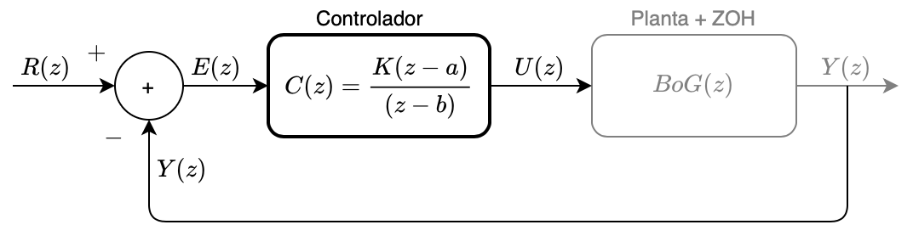
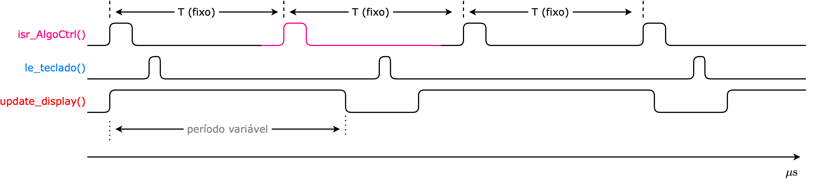

# Implementando rotinas de controle digital

Seja um controlador digital como o mostrado no diagrama a seguir:



onde a equação genérica seja dada por:

$C(z)=\dfrac{K(z-a)}{(z-b)} \quad$ (eq. 1)

O objetivo pretendido aqui é isolar a ação de controle $U(z)$ e descobrir como implementar esta lei de controle num algoritmo (spftware). Então, isolando termos:

$C(z)=\dfrac{U(z)}{E(z)}\quad$ (eq. 2)

Juntando eq. (1) com (2) temos:

$\dfrac{U(z)}{E(z)}=\dfrac{K(z-a)}{(z-b)}$

Passando para notação com termos negativos em $z$:

$\dfrac{U(z)}{E(z)}=\dfrac{K(z-a)}{(z-b)} \cdot \dfrac{z^{-1}}{z^{-1}}$

$\dfrac{U(z)}{E(z)}=\dfrac{K(1-a\cdot z^{-1})}{(1-b\cdot z^{-1})}$

Isolando o termo $U(z)$ (para mais tarde obter $u[k]$):

$U(z)(1-b\cdot z^{-1})=E(z)\cdot K(1-a\cdot z^{-1})$

$U(z)=E(z)\cdot K -K\cdot a \cdot z^{-1}E(z) +b\cdot z^{-1}U(z)$

Transformando eq. anterior em equações de diferenças obtemos:

$u[k]=K \cdot e[k] - K \cdot a \cdot e[k-1] + b \cdot u[k-1]$

Onde:<br>
    $u[k]$: sinal de controle atual $\quad \rightarrow$ variável (escalar: $1 \times 1$) `u`; <br> 
    $u[k-1]$: amostra passada do sinal de controle; $\rightarrow$ outra variável escalar `u1` (variável que guarda valor de 1 amostra passada de $u[k]$;<br>
    $e[k]$: sinal do erro (instantêneo) $\quad \rightarrow$ variável `e`;<br>
    $e[k-1]$: 1 amostra passada do erro $\quad \rightarrow$ variável `e1`.

Note que:<br> 
$e[k]=r[k]-y[k]$ $\quad \leftarrow$ calculado pelo $\mu$C: `e=r-y;`.

<br>
No $\mu$C (ou sistema embarcado dedicado), organizamos algumas rotinas separadas:

* Rontina de "Init()":<br>
    Função: inicializar variáveis associadas com amostras atradas + inicializar parâmetros (ganhos, pólos, zeros) do controlador. Resultaria algo como:

  ```c
  void Init(){
  	// inicializando amostras passadas
  	u1=0;
  	e1=0;
  	K=10000;
  	a=0.7654;
  	b=0.9867;
  }
  ```

* Rotina do Algoritmo de Controle:<br>
    Na realidade seria uma rotina associado com tratamento de interrupção por software (ou *ISR* = Rotina de Serviço de Interrupções). Ou seria uma "task síncrona" no caso de sistemas operacionais de tempo real -- RTOS. Esta rotina contêm **apenas** a lei de controle e forma de processá-la. Não deve incluir nenhuma função de imprimir mensagens ou dados. Esta rotina deve consumir o menor tempo possível de execução e processar unicamente o algoritmo de controle. Note que esta rotina **não é** disparada explicitamente através de nenhuma chamada. O que dispara esta rotina seria uma interrupção (por software, no caso, overflow de um temporizador do $\mu$C que gera a interrução e chamada a esta rotina). Esta rotina em si, seria algo como:

  ```c
  void isr_AlgoCtrl(){
      // Rotina do algoritmo de controle
  	 // Lê sensor da planta --> y[k]
  	 y = le_sensor(canal_AD);
  	 // calculando erro instântaneo
  	 e = r - y;
  	 u = K*e - K*a*e1 + b*u1;
  	 // saida_motor(u);
  	 set_pwm(u);
  	 // atualiza amostras atrasadas para próxima chamada
  	 u1 = u;
  	 e1 = e;
  }
  ```

    **Note que**: as variáveis: `r`, `K`, `a`, `b`, `u1` e `e1`  são **propostitalmente globais**. Isto é, a idéia é a de que os valores destas variáveis possam ser alteradas em qualquer outro ponto do programa (que constitui a aplicação sendo controlada). Naturalmente que isto é realizado de forma cuidadosa e controlada.

No $\mu$C seria ainda implementada dentro do algoritmo principal da aplicação, algo como: 

```c
void main(){
  // prepara variaveis 
  Init();
  // inicializa interrupção por software
  // associa um timmer do uC para gerar o meu "T" (periodo de amostragem)
  set_timmer0=20000; // gerar overflow a cada 100 ms
  isr_AlgoCtr(timmer0); // associo rotina de tratamento de interrupção com
  // overflow do timmer0
  start_isr_AlgoCtrl(); // efetivamente libera timmer0 e interrupção associada
  // para funcionar
  while(not("ESC")){
    // lê teclado
    tecla=le_teclado();
    if tecla=="↑" K++;
    if tecla=="↓" K--;
    if tecla=="r↑" r++;
    if tecla=="r↓" r--;
    // atualiza display
    update_display();
  }
  disable_isr_control(); /* desabilita interrupção do controle, "desliga" algoritmo de controle */
  set_pwm(0); // garante que o motor seja desacionado.
}
```

Onde:

* `start_isr_AlgoCtrl()`: seria a rotina associada com habilitar da forma correta a ocorrência de futuras interupções por software geradas por ocasião do estouro (overflow) de certo temporizador do $\mu$C. Note que neste caso, certo temporizador do $\mu$C em questão é reservado para gerar periodicamente as interrupções associadas com o período de amostragem previsto para ser adotado na aplicação. Isto implica, programar (calcular) **antes**, os valor que deve ser usado para carregar o temporizador inicialmente, de forma à que, uma vez liberada esta interrupção, este temporizador tenha seu conteúdo decrementado numa velocidade proporcional à frequência de Clock do $\mu$C. Isto garante que o algoritmo de controle que está sendo programado associado com o tratamento desta interrupção, respeite corretamente o período de amostragem especificado e poupa programação de cálculo de períodos de tempo passado deste à última chamada ao algoritmo de controle (técnica esta conhecida como "pooling"). Na medida do possível, na área de controle se usa interrupção por software ou tasks síncronas no caso de sistemas operacionais de tempo-real.

* `update_display()`: seria outra rotina encarregada de atualizar informações no display do equipamento (da aplicação). Pode ser um display LCD comum de 2 linhas $\times$ 16 caracteres ou 4 linhas $\times$ 16 caracteres ou mesmo um display gráfico. Notar que atualizar informações num display, envolve troca de dados entre o $\mu$C e a memória deste dispositivo, ou seja, é exigido um tempo para gravação (retenção) dos dados na memória do display. Esta tarefa leva tanto tempo mais quanto mais informações se deseja mostrar em "tempo-real". A execução desta tarefa normalmente consome mais tempo que a execução da rotina de controle (`isr_AlgoCtrl()`). E pode ocorrer que a execução desta rotina seja interrompida mais de 1 vez pelo algoritmo de controle. Conforme desejado, a prioridade na execução de rotinas num sistema embarcado de controle é executar de maneira confiável o algoritmo de controle e de maneira precisa, respeitando o período de amostragem, para o qual foi projetada a lei de controle.

* `disable_isr_control()`: seria a rotina (umas poucas linhas) que desabilita a interrupção de software associada com o overflow do temporizador do $\mu$C que foi reservado para gerar a cadência assiada com o período de amostragem sendo adotado.

* `set_pwm(<valor>)`: apenas envia o conteúdo \<valor> (normalmente uma variável int de 8 bits) para o motor, através de algum driver (software) associado com acionamento de um motor. Neste caso, supõe-se que \<valor> seja associado com o percentual do duty-cycle da ponte H de um motor elétrico, por exemplo. Note que a ponte H do motor pode ser completa (o sentido de rotação deste motor pode ser revertido); neste caso, \<valor> pode assumir um conteúdo negativo. Isto significa que internamente, a rotina `set_pwm(<valor>)`, testa o sinal da variável `<valor>` para determinar a forma como, por software, devem ser comandados os transístores associados com a ponte H para que o motor gire no sentido horário ou antihorário (reversão de corrente).

* `le_teclado()`: é uma rotina que simplesmente "varre" o teclado, ou seja, não fica esperando que o usuário pressione uma tecla como \<Enter> por exemplo. Mas apenas, no momento em que foi chamada, percebe se alguma tecla foi pressionada e retorna então um valoer $\ne 0$, correspondento ao código da tecla pressionada. Desta forma, nas linhas seguintes do código, pode ser percebido que de acordo com a tecla pressionada, o conteúdo de algumas variáveis globais possam ser atualizadas com a aplicação sendo executada (e o algoritmo de controle sendo disparado) e desta forma, alterações no ganho do controlador (variável `K`) ou mesmo na referência (variável `r`) possam ser imediatamente repassadas para o algoritmo de controle (assim que a mesma for executada atendendo as interupções.). 

* Note em particular que a variável `r` (referência) pode estar sendo atualizada em **outra** rotina de interrupção (ou "task") que calcula por exemplo, a posição (velocidade e aceleração) de uma junta de um robô ou CNC à cada dado instante de tempo. Neste caso, explicitamente o conteúdo da variável `r` seria atualizado por uma outra rotina de nome `Path_Generator()`, por exemplo.

Em termos de ciclos de processamento de um $\mu$C neste caso, se espera algo como:



---

Fernando Passold, em 28/10/2020