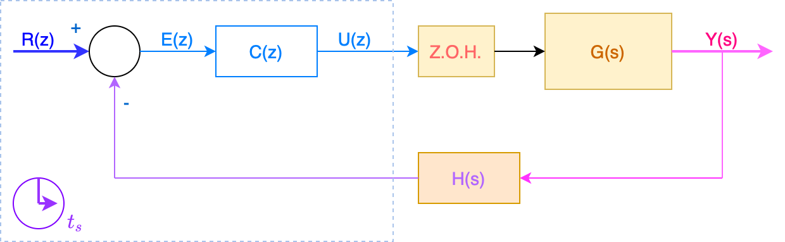
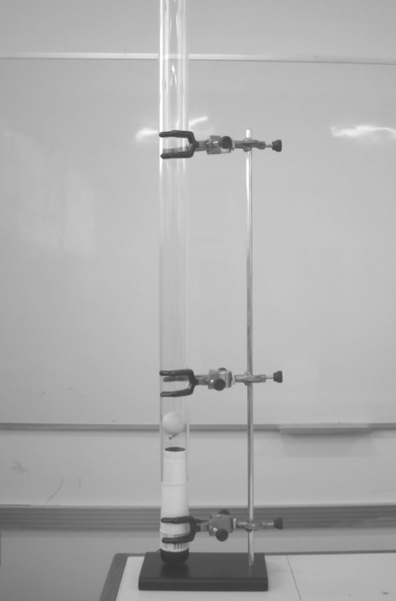
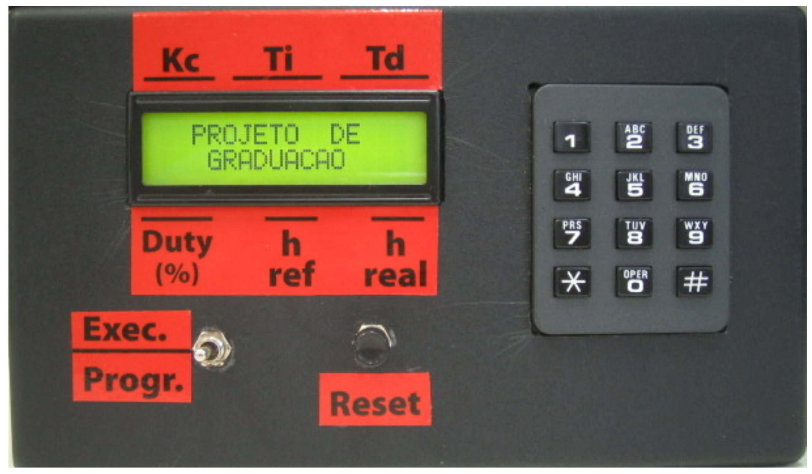
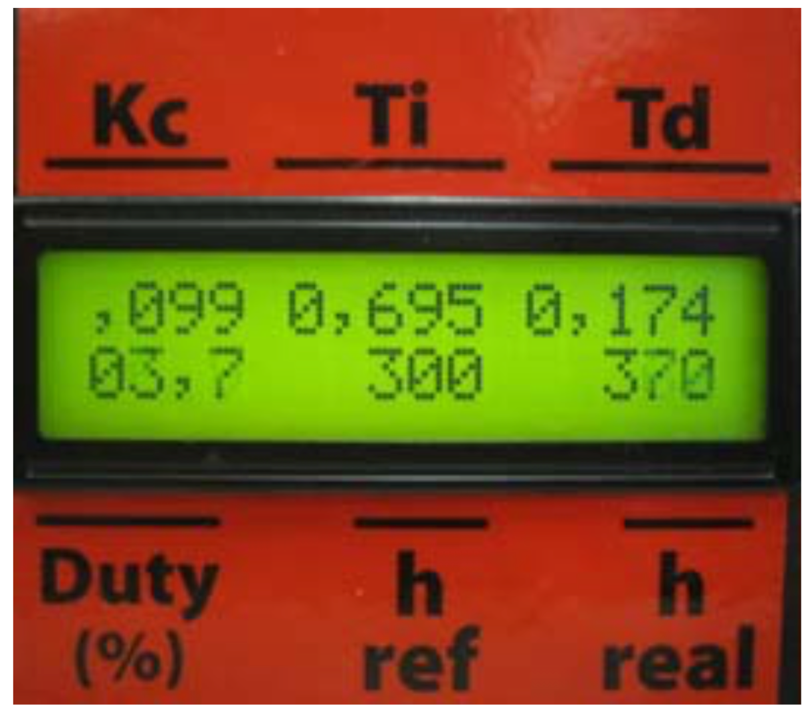
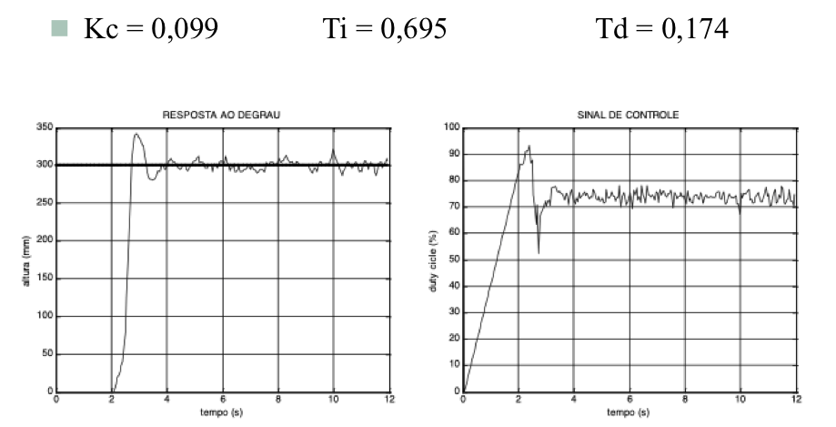

# Implementação de Controlador

Seja um controlador digital genérico que segue a equação:

$$
C(z)=\dfrac{K(z+a)}{(z+b)}
$$

Este controlador pode ser implementado da seguinte forma:

O mesmo se encontra dentro de uma malha como:



Extraíndo equações, obtemos:

$$
U(z)=E(z) \cdot C(z)
$$

ou

$$
\begin{array}{rcl}
\dfrac{U(z)}{E(z)} &=& C(z)\\
&=& \dfrac{K(z+a)}{(z+b)}\\
&=& \dfrac{K(z+a)}{(z+b)} \cdot \dfrac{z^{-1}}{z^{-1}}\\
&=& \dfrac{K(1+a z^{-1})}{(1+bz^{-1})}
\end{array}
$$

isolando o termo $U(z)$:

$$
U(z)(1+b z^{-1})= K(1+az^{-1}) \cdot E(z)
$$
$$
U(z)=K \cdot E(z) + K a \cdot \underbrace{z^{-1} E(z)}_{e[k-1]} - b \cdot \underbrace{z^{-1}U(z)}_{u[k-1]}
$$

o que permite escrever:

$$
u[k]=K \cdot e[k] + K a \cdot e[k-1] - b \cdot u[k-1] \qquad (1)
$$

onde:<br />

$u[k]$ corresponde ao sinal de controle atual;<br />
$u[k-1]$ corresponde ao sinal de controle calculado na amostragem anterior (uma amostra de atraso contra a atual);<br />
$e[k]$ corresponde ao sinal de erro atual, calculado como:
$$
e[k]=r[k]-y[k]
$$
$e[k-1]$ corresponde ao sinal de erro calculado na amostragem anterior (uma amostra de atraso);<br />
$r[k]$ sinal de referência atual;<br />
$y[k]$ resposta (saída) atual do processo.

Porém note que a eq. (1) não é diretamente incorporada num algoritmo de controle, pois da forma de está apresentada, implica uso de de vetores, e não temos como prever ou limitar o tamanho máximo de cada um dos vetores envolvidos nesta equação.

O que se realiza na prática é transforma cada um destes vetores numa variável escalar (dimensão $1 \times 1$), diferente. E assim o algoritmo final de controle fica como:

```c
/******************************************************************
***************** ROTINA DE CONTROLE (INTERRUPÇÃO) ****************
******************************************************************/
void cont1(void) interrupt 3 {
    y = ReadAD(canalSensor); // leitura da saída atual do processo
    e = r - y; // calculando sinal atual do erro
    u = K*e + K*a*e1 - b*u1; // sinal de controle atual
    Motor.out(u); // aplica sinal de controle no processo, via D/A ou PWM
    // segue atualização de variáveis para próximo ciclo de amostragem:
    u1 = u;
    e1 = 1;
}
```

Note que as variáveis `K`, `a`, `b` e `r` devem ser globais, isto é, propositalmente podendo ser alteradas em outra parte do código. Isto permite mudar a posição do zero do controlador ($a$) ou a posição do pólo deste controlador ($b$) e ajustar seu ganho ($K$) em outra parte do software que controla o processo, **mesmo com** o algoritmo de controle sendo edxecutado, em "tempo-real". Note que `r`, a referência, sendo global, também permite que o usuário varie o valor da referência com o algoritmo de controle sendo executado. E em alguns sistemas, `r` é calculado via "gerador de trajetórias" (caso de robôs industriais, ou máquinas CNC), usando outra rotina ativada por interupção que éexeccutada na mesma frequência com a qual é executada a rotina de controle.

As variáveis `u1` e `e1` devem ser inicializadas ANTES do algoritmo de controle ser executado. Para tanto podem ser incializadas com zero. Mas o melhor seria, no caso de sistemas que permitem transitar entre controle em autimático (em malha-fechada) e controle manual (em malha-aberta), atualizar estas variáveis, da seguinte forma quando passamos do controle manual para automático e antes de liberar a rotina (tratamente do interrupção anterior):

```c
u1 = // valor atual do sinal sendo enviado para planta;
e1 = r - y; // determinando atual valor do erro.
```

Esta atualização evita "saltos" (gaps) na resposta do sistema quando o usuário do sistema de controle comuta do modo manual para o automático.

O programa completo ficaria algo como:

```c
#include <ADuC832.h> // exemplo de rotina para ADuC 832
unsigned int leitura,h_ref,h_real,*sensor,*altura,*duty_saida;
int erro0,erro1,erro2;
float Kc,Ti,Td,Ts=0.047,u0,u1,nominal=70; 

// Note: Ts = periodo de amostragem adotado

...

void main(void)
{
	PLLCON=0x50;				//Define o clock - 16,78MHz, ciclo demaquina - 0.72us
	CFG831=0x41;		 		//Define o PWM na porta P3_3 e ativa o uso da XRAM interna
	TMOD=0x11;					//Configura os temporizadores T0 e T1 p/ 16 bits, modo 1
	TCLK=1;						//Configura o timer 2 para gerar a taxa de trasmissao serial
	SCON=0x40;  				//Configura o canal serial UART no modo 1
	RCAP2H=0xFF; RCAP2L=0xC9;	//Valor de recarga do timer 2 - Taxa de transmissao=9600bps
	PWM1L=200; PWM1H=0;	    	//Define a frequencia do PWM - f=21KHz
	grava_dados();				
	inicializa_display();	    
	inicio();                   //Telas inicias do projeto 				
	ajuste_manual();            //Ajuste inicial manual necessário		    
			
	while(1)
	{
		controle=0;				    //Define qual o controlador em funcionamento
		amostra=0;				    //Define os dados a serem trasmitidos
		escolha();				
		parametros_PID();			
		ADCCON1=0x8C;				//Ativa ADC p/ simples conversão e clock=2,1MHz
									//cada conversao demora 4 ciclos de clock do AD=2us
		PWMCON=0x17;				//Liga o PWM e define o sua frequencia - 20kHz
		IE=0x88;					//Liga a interrupção do timer 1
		TR1=1;					    //liga o timer 1  		
		atualiza_PID();				
		TR1=0;						//Desliga temporizador 1
		IE=0x00;				   	//Desativa interrupção do timer 1
 	    PWMCON=0x00;				//Desativa o funcionamento do PWM e define clock
		ADCCON1=0x00;				//Desativa ADC
		contador=0;
		transmite();				
	}
}

...

/******************************************************************
************ATUALIZA OS PARÂMETROS DURANTE O CONTROLE PID**********
* Esta rotina permite atualizar em "tempo real" parâmetros do sistema
* como referência e ganhos do controlador
* foram associadas teclas para ajustar cada parâmetro
******************************************************************/
void atualiza_PID(void)
{
	unsigned char tecla;
	unsigned int valor;
	
	do
	{
		//escreve Kc
		RS=0;
		DISPLAY=0x80; delay();
		RS=1;
		valor=Kc*1000;
		DISPLAY=','; delay();
		DISPLAY=(valor%1000)/100+48; delay();
		DISPLAY=(valor%100)/10+48; delay();
		DISPLAY=valor%10+48; delay();
		//escreve Ti
		if(controle=='1')	  //só apresenta Ti no display se for controle PID
		{
			RS=0;
			DISPLAY=0x85; delay();
			RS=1;
			valor=Ti*1000;
			DISPLAY=valor/1000+48; delay();
			DISPLAY=','; delay();
			DISPLAY=(valor%1000)/100+48; delay();
			DISPLAY=(valor%100)/10+48; delay();
			DISPLAY=valor%10+48; delay();
		}
		//escreve Td
		RS=0;
		DISPLAY=0x8B; delay();
		RS=1;
		valor=Td*1000;
		DISPLAY=valor/1000+48; delay();
		DISPLAY=','; delay();
		DISPLAY=(valor%1000)/100+48; delay();
		DISPLAY=(valor%100)/10+48; delay();
		DISPLAY=valor%10+48; delay();
	    //escreve h_ref
		RS=0;
		DISPLAY=0xC7; delay();
		RS=1;
		DISPLAY=h_ref/100+48; delay();
		DISPLAY=(h_ref%100)/10+48; delay();
		DISPLAY=(h_ref%100)%10+48; delay();
		DISPLAY=' '; delay(); DISPLAY=' '; delay();
		/*
		Lê teclado a atualiza variáveis globais
		(parâmetros do processo
		/*
		tecla=teclado();
		switch(tecla){
			case '1':
				if(Kc<=0.989) Kc+=0.01; break;
			case '4':
				if(Kc>=0.01) Kc-=0.01; break;
			
			case '2':
				if(Ti<=9.989) Ti+=0.01; break;
			case '5':
				if(Ti>=0.02) Ti-=0.01; break;
					
			case '3':
				if(Td<=9.989) Td+=0.01; break;
			case '6':	   
				if(Td>=0.01) Td-=0.01; break;

			case '8':
				if(h_ref<=390) h_ref+=10; break;
			case '0':
				if(h_ref>=60) h_ref-=10; break;
		}
	}while((tecla!='9') && (tecla!='#'));
}

...

/******************************************************************
******************ROTINA DE CONTROLE****INTERRUPÇÃO****************
******************************************************************/
void cont1(void) interrupt 3	  		
{
	SCONV=1;							//Ativa uma conversão simples pelo bit SCONV 						
	while(!ADCI);			   			//Espera pelo flag de fim de conversão
	ADCI=0;							    //reset no flag de fim de conversão
	leitura = ADCDATAH*256 + ADCDATAL;  //armazena o valor lido pelo AD
	leitura = leitura>>4; 				//converte a leitura de 12 para 8 bits
	h_real = 620-(*(sensor+leitura));	//converte a leitura do AD para milimetros
	erro0 = h_ref - h_real;				//calcula erro
	
	switch(controle){
   		case '1':  		//PID no formato de velocidade
			u0 = u1 + Kc*((erro0-erro1) +  (Ts/Ti)*erro0 + (Td/Ts)*(erro0-2*erro1+erro2));
   		    if (u0>99.99) u0=99.99;
			if (u0<0) u0=0;
			u1=u0;					    //passa os valores para amostras em atraso
			erro2=erro1;
		    erro1=erro0;				
			break;
		case '2':		//PD
			u0 = nominal + Kc*(erro0 + (Td/Ts)*(erro0-erro1));
			if (u0>99.99) u0=99.99;
			if (u0<0) u0=0;
			erro1=erro0;				//passa o valor para amostra em atraso
	}
	PWM0L=(int)(180-u0*1.8);			//muda a escala da para um valor reconhecivel pelo PWM
	PWM0H=0; 							//Atualiza o duty do PWM

	if(contador<10) contador++;			//sinaliza para apresentar o erro e duty no display
	if(amostra<255)
	{
		*(altura+amostra)=h_real;	    		//grava a altura real num vetor
		*(duty_saida+amostra)=(int)(u0*10); 	//grava o sinal de controle num vetor
		amostra++;
	}
}	
```

O código anteior (parte dele) foi incorporado no kit "Processo da Bola no Tubo": 



Este processo consiste em definir uma altura desejada para a bola dentro de um tubo (referência), cuja altura é mantida pelo "colchão de ar" criado por um ventilador localizado na base inferior do tubo. O controle desse ventilador acaba definindo a altura alcançada pela bola dentro do tubo.

A interface com o usuário é mostrada na figura abaixo:



Note que existem teclas reservadas para alteração de alguns parâmetros com o algoritmo de controle sendo executado:

* $K_c \uparrow$: tecla 1;
* $K_c \downarrow$: tecla 4;
* $T_i \uparrow$: tecla 2;
* $T_i \downarrow$: tecla 5;
* $T_d \uparrow$: tecla 3;
* $T_d \downarrow$: tecla 6;
* Altura da bola, $h_{ref} \uparrow$: tecla 8;
* Altura da bola, $h_{ref} \downarrow$: tecla 0;
* Teclas `*` ou `#` interrompdia processo.

A próxima figura mostra como ficava o display com o algoritmo de controle sendo executado:



Este processo permitia alterar seu algoritmo de controle via upload de novo firmware mas já trazia implementado e sintonizado um controlador PID no formato de velocidade:

$$
u_n = u_{n-1}+K_c \left[ (e_n - e_{n-1}) + \dfrac{T_s}{T_i}e_n + \dfrac{T_d}{T_s}(e_n - 2e_{n-1}+e_{n-2}) \right]
$$
$T_s$ corresponde ao perído de amostragem, que foi de 47 milisegundos.

Este controlador sintonizando usando Ziegler-Nichols permitiu alcançar os seguintes resultados:



---

**Referência Bibliográfica:**<br />
Robinson Caldart Vanz, Controlador digital para processo bola e tubo, TCC Eng Elétrica (UPF), Orientador: Fernando Passold, 114 pp., 2006.
