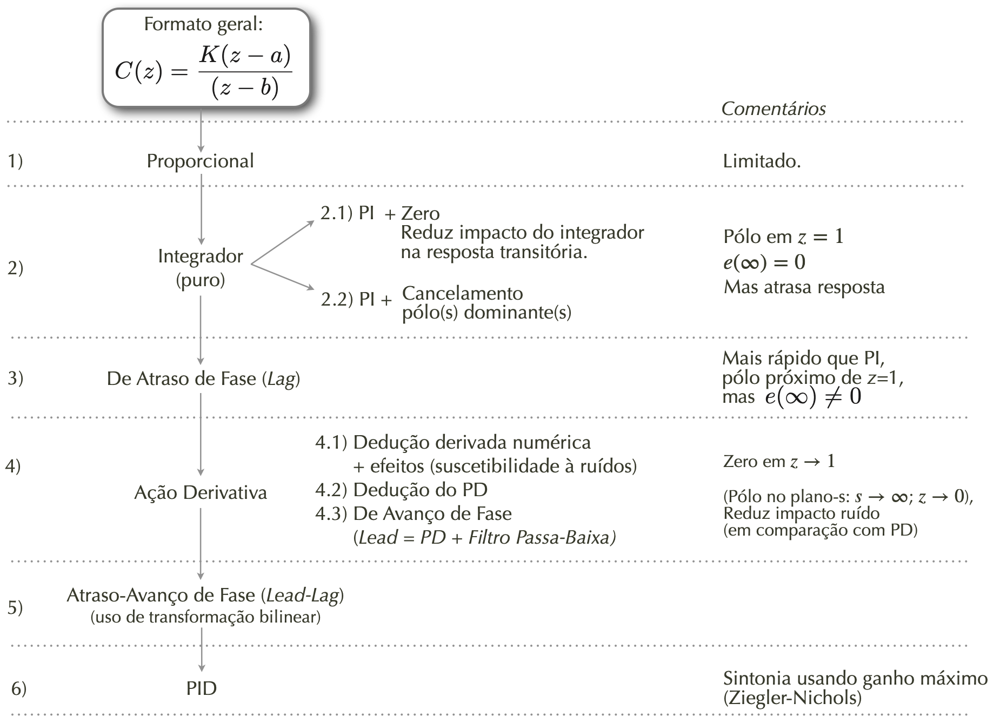
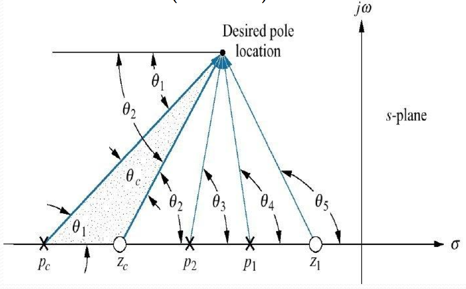
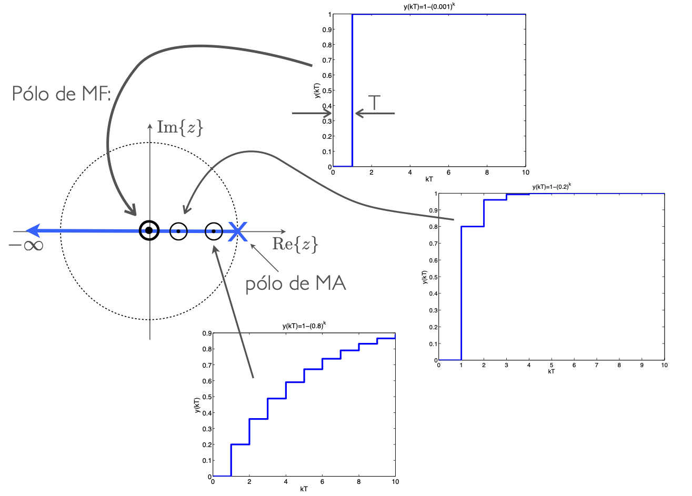
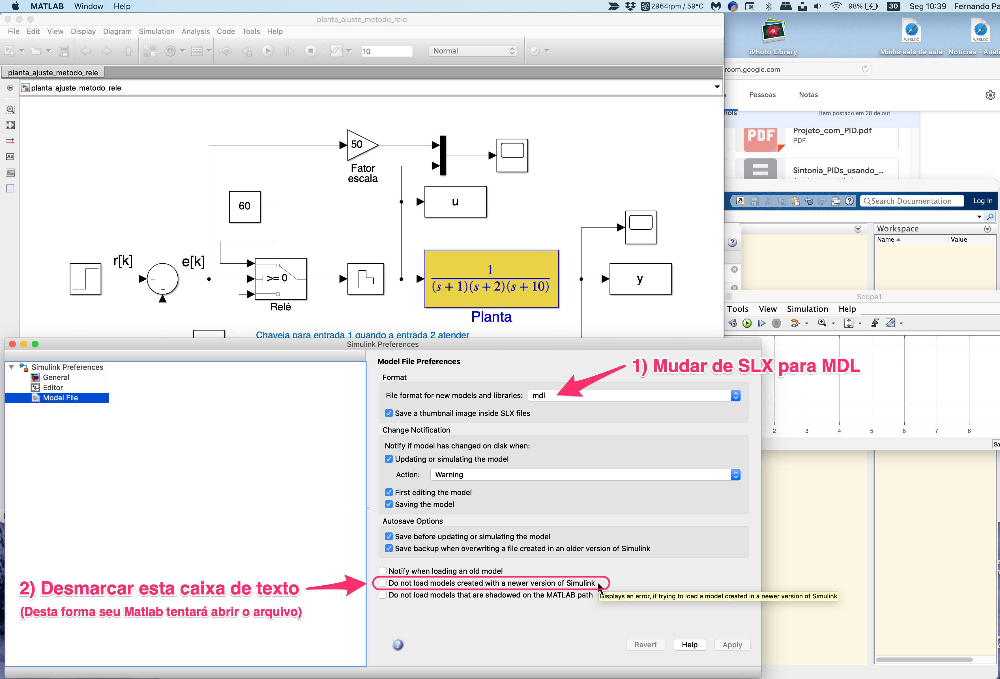

<!--title: Controle Automático 3 -->
# Curso de Controle Automático III

<!--

-->

**Tópicos:**

## 1. Introdução

* [Introdução à disciplina](1_intro/intro.pdf);
* [Sequência prevista para as aulas](1_intro/seq_aulas.html);
* Sugestão de **[instalação de MATLAB](instalacao_matlab.html)** para esta disciplina;

## 2. Teorema de Amostragem

* [Teoria Sistemas de Amostragem](2_sampling/01_Sistema_Amostrado_no_Tempo.pdf)
   > Modelagem do processo de amostragem;
      Diagramas espectrais

Resumo gráfico processo de amostragem de um sinal...

&nbsp;

* [Simulação demonstrando Teorema da Amostragem](Teste_Amost/teste_amostragem.html) 
  (*Amostrando uma onda dente-de-serra*)
  * [Síntese de Onda Quadrada usando Série de Fourier](estudo_dirigido/Síntese_Onda_Quadrada.html)
&nbsp;

* Material opcional:
  * [From Analog to Digital – Part 2/**The Conversion Process** | Nutaq | Nutaq.pdf](2_sampling/From%20Analog%20to%20Digital%20–%20Part%202:%20The%20Conversion%20Process%20|%20Nutaq%20|%20Nutaq.pdf)
  * [Wolfram Demonstrations Project: **Sampling Theorem**](https://demonstrations.wolfram.com/SamplingTheorem/)
  * [Wolfram Demonstrations Project: **Aliasing** in Time Series Analysis](https://demonstrations.wolfram.com/AliasingInTimeSeriesAnalysis/);  
&nbsp;

## 3. Transformada Z

* [Parte 1](3_transformada/transformada_Z.pdf): Definições, conceitos iniciais, primeiras transformadas;
* [Parte 2](3_transformada/transformada_Z_parte2.pdf): Transformadas de alguns sinais, Propriedades da Transformada Z;
* [Parte 3](3_transformada/transformada_Z_parte_3.pdf): Métodos de Transformada Inversa de Z;
* [Modelagem do Sustentador](3_transformada/3_BoG_Transformada_Z.pdf) de Ordem Zero (Z.O.H., ou $BoG(z)$).
* Incorporando o **Sustentador de Ordem Zero**, cálculo de $BoG(z)$ $\rightarrow$ [deduções e simulações](exemplo_1_BoG/intro_exemplo_1a_ordem.html)
   *(1o-exemplo de sistema de 1a-ordem digitalizado)*

* **[Resumo final Transformada Z](3_transformada/revisao_partes_importantes_transformada_Z.pdf)** (partes principais).

Malha típica de sistema de controle digital

&nbsp;

## 4. Teoria do Erro

* [**Teoria do Erro** (Papel do integrador)](4_teoria_erros/resumo_teoria_erro.html);

## 5. Estabilidade

* Estabilidade $\Rightarrow$ **Método de Jury**: [Aplicação](Exemplo_Jury/problema_1.html)
  

## 6. Projeto de Controladores: Estudo de Caso:

&nbsp;

1. **Controlador com Ação Proporcional**:
   
     * [Aula de 07/05/2020](aula_07_05_2020.html);
&nbsp;

2. **Controladores com Ação Integral**:

    * [Controlador Proporcional](Controle3_2021_2/aula_1.html) com ganho definido em função do $e(\infty)$, [aula de 23/09/2021](Controle3_2021_2/aula_1.html).
        (*Inclui Controlador I, PI (com estudos de opções de local para zero do controlador)*)

    * Controlador com **Ação Integral Pura** + Controlador **PI (c/dedução)** + **PI com cancelamento do pólo dominante**: [Aula de 14/05/2020](aula_14_05_2020.html);
    * Projeto de **PI = Controlador Proporcional + Integral Puro** ([aula de 07/10/2020](2020_2/aula_07_10_2020.html));

    * **Outro projeto** de [Controlador Ação Integral Pura e PI](2021_1/aula_05_05_2021.html), incluindo comparações (05/05/2021).
    * O que acontece quando se tenta acrescentar **+Integradores em Sistema tipo 1** ? [[aula de 07/10/2021](sis_tipo1/sis1_mais_integradores.html)];
   * **Projeto de Lag** (com teoria) ([PDF](estudo_caso/aula_controlador_Lag.pdf));
    * Projeto de Controlador **PI + Lag** ([aula de 14/10/2020](2020_2/aula_14_10_2020.html))
    * Controlador por Atraso da Fase (**Lag**): [Aula de 21/05/2020](controlador_Lag.html);
&nbsp;

3. **Controladores com Ação Derivativa**:
      * Teoria sobre **[Ação Derivativa + Filtros](Controle_Acao_Derivativa.html)**:
         

        * Derivador Puro
        * Amp.Op. como Derivador Ideal x Amp.Op. Derivador Realizável;
        * Efeito da Derivada sobre Sinal Ruidoso (simulações);
        * Uso de Filtro Passa Baixa (FPB);
        * Equação + Diagrama de Bode de simples filtro RC (1a-ordem);
        * Filtro Exponencial Digital de 1a-ordem;
        * Filtro Exponencial Duplo (de 2a-ordem);
        * Filtro de Média Móvel;

        

 
         

      * **[Dedução Controladores PD & Lead)](pd_plus_filtro.pdf)** (arquivo PDF; Aula de 21/05/2020);
      * [Projeto de PD (sem contribuição angular)](2020_2/aula_28_10_2020.html) (Aula de 28/10/2020)
      * [Projeto de Controlador PD](projeto_PD_lead_2020.html) (Aula de 28/05/2020): 
      *Avaliando diferentes posições para o zero do PD + Projeto de PD usando contribuição angular usando *script*s: [`angulos2.m`](arc.m) + [`arc.m`](arc.m).* 
      * [Projeto de Lead](lead/lead_ex1.html) (Aula de 11/11/2020);
      *(Usando Contribuição angular.)*
      * [Teste de Controladores com Ação Derivativa](estudo_caso/Teste_Controladores_Acao_Derivativa.html) (Simulink) 
         *(Simulaçãoes ressaltando elevadas ações de controle; **uso de bloco Saturador no Simulink**)*
      * Projeto de PD e melhorias usando **App Control System Designer** ([aula de 20/10/2023](2023_2/aula_20out2023.html)).

Revisando idéia geral sobre Contribuição Angular

&nbsp;

4. Controlador **Deadbeat** -- projeto(s): 
      * Teoria Controlador por Tempo Mínimo [(PDF)](PID/exemplo_tempo_minimo.pdf);

     * Amplitudes das ações de controle (Lead, Lead x outros),  Projeto de controlador deadbeat - [Aula de 04/06/2020](deadbeat_08out2019.html) ;
     * [Aula de 11/11/2020](deadbeat/deadbeat_exemplo_1.html);
     * [Aula de 09/06/2021](deadbeat_09062021/aula_deadbeat_09_06_2021.html).

Conceito geral por trás do Controlador deadbeat

&nbsp;

5. **Projeto de PID** (com ajuste por Ziegler-Nichols)

     * Ver parte final deste [PDF](estudo_caso/Estudo_Caso_Controladores_2020.pdf) 
      (arquivo original inicial do "Estudo de Caso", versão de 2020);
<!--     * Falta verificar arquivos (11/10/2023) -->
&nbsp;

6. Implementação Real de Controladores Digitais:
   * [Equações de Diferença $\times$ Controladores Digitais](PID/equacoes_diferenca_controlador.html) (dedução do algoritmo de controle);
   * [**Implementações** de algoritmos de controle digitais](implementacao_controlador_digital.html)
   * Exemplo de implementação real em laboratório: [**Processo da Bola no Tubo**](implementacao_controle_digital.html) (TCC de 2006).
&nbsp;

EXTRAs:

* Usando **==[App Control System Designer](/APP_Control_System_Designer/Intro_APP_Control_System_Designer.html)==** (pequeno Tutorial);
* Simulações de controladores Digitais **usando Simulik** ([PDF](estudo_caso/aula_12abr2017_uso_simulink_datatypes.pdf))
  *(Lidando com "Data types" das janelas Scope)*;
* Sugestão de **[instalação de MATLAB](instalacao_matlab.html)** para esta disciplina;

Como abrir arquivos SLX originados de diferentes versões do Matlab/Simulink

&nbsp;

* :black_nib: [Aulas de 2023/2](aulas_2023_2.html).

* :book: Versão 2020 da **["Apostila"](estudo_caso/apostila.pdf)** (quase livro) criada para esta disciplina (incompleta)

---

 (c) Fernando Passold, página atualiza em 28/05/2020, 04/06/2020, 11/11/2020, 07.04.2021, 11/03/2023, 04/08/2023, 16/10/2023. 