# Projeto Controladores Ação Derivativa

> Aula de 01/10/2019
> 
> <font size="1"> Diretório de trabalho: `\6_Controle_Digital`, arquivo: `projeto_PD_lead_2020.md`, figuras gravadas em: `\6_Controle_Digital\figuras_acao_der`. </font>


## Embasamento teórico

Ver arquivos:

* acao\_derivativa\_4a\_parte.html.pdf;
* pd\_plus\_filtro.pdf

## Resumo

| Controlador Derivativo *Puro* | Controlador PD (*P+D*) | Controlador PD+FPB (*Lead*) |
|:---|:---|:---|
| $C_D(z)=\dfrac{K_d}{T}\cdot\dfrac{(z-1)}{z}$ | $C_{PD}=K \left( \dfrac{z- \left( \frac{K_d/T}{K}\right)}{z} \right)$ | $C_{\text{PD+FPB}}=K \left( \dfrac{z-z_1}{z-p_1} \right)$ |
| Pólo na origem do plano-*z* e zero em z=1. | O pólo continua na origem do plano-*z* e p zero agora foi ligeiramente deslocado para dentro do plano-*z* (não está mais em z=1). | $z_1=f\left( K_p, K_d, \alpha, T\right)$ (agora está em $z < 1$); e pólo em $z=p_1$, mais especificamente, em $p_1=1-\alpha$;  ($\alpha$ = coef. filtro) |
| 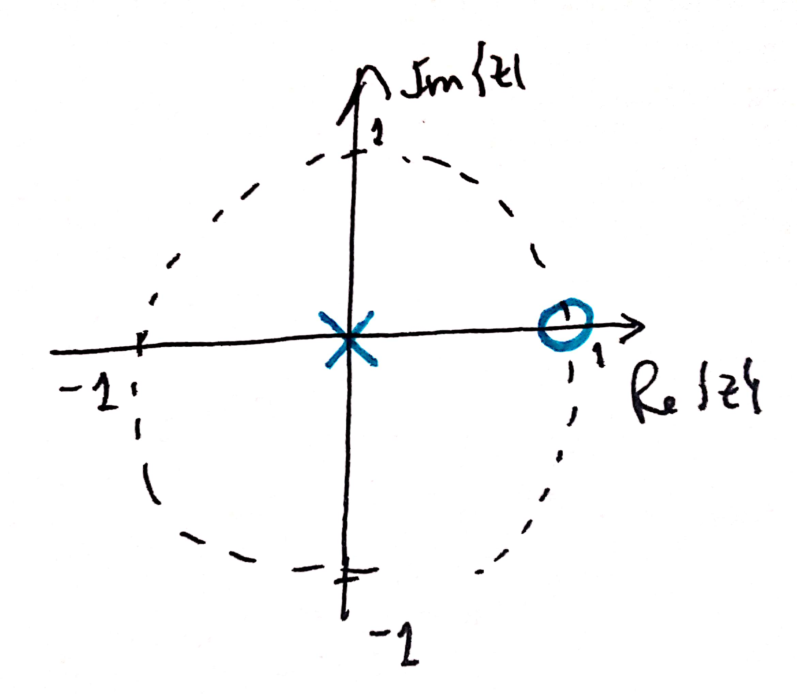 | 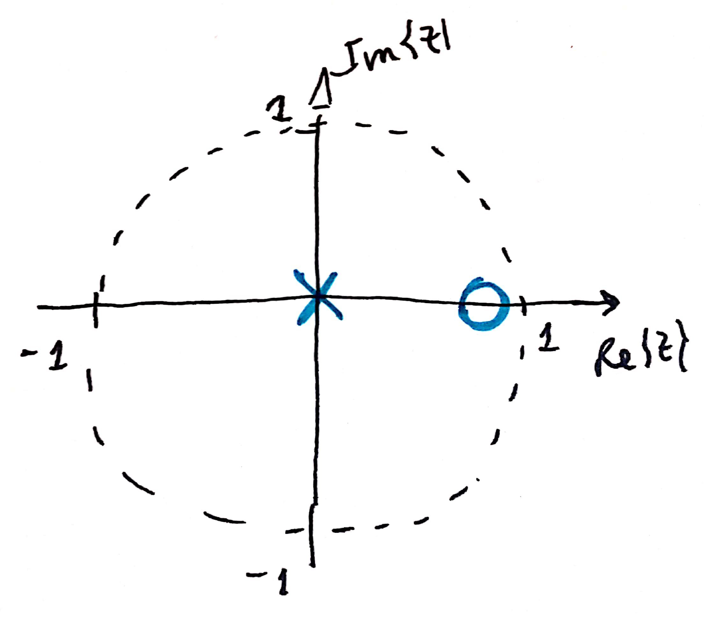 | 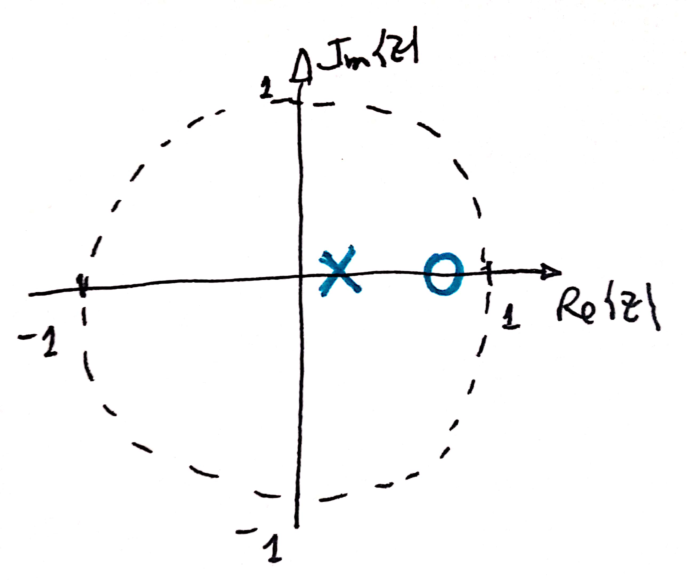 |


## Projeto de PD para Planta do Estudo de Caso

```matlab
>> load planta	% carregandando dados de aulas passadas
>> zpk(BoG) 		% verificando localização dos pólos e zeros da planta

ans =
 
  0.00012224 (z+2.747) (z+0.1903)
  --------------------------------
  (z-0.9048) (z-0.8187) (z-0.3679)
 
Sample time: 0.1 seconds
Discrete-time zero/pole/gain model.
>>
```

Avaliando opções para localização do zero do PD. Note que já temos certeza de que o pólo fica localizado em $z=0$, apenas necessitamos esclarescer um local adequado para o zero deste controlador.

Avaliando 3 opções, conforme mostra a próxima figura:

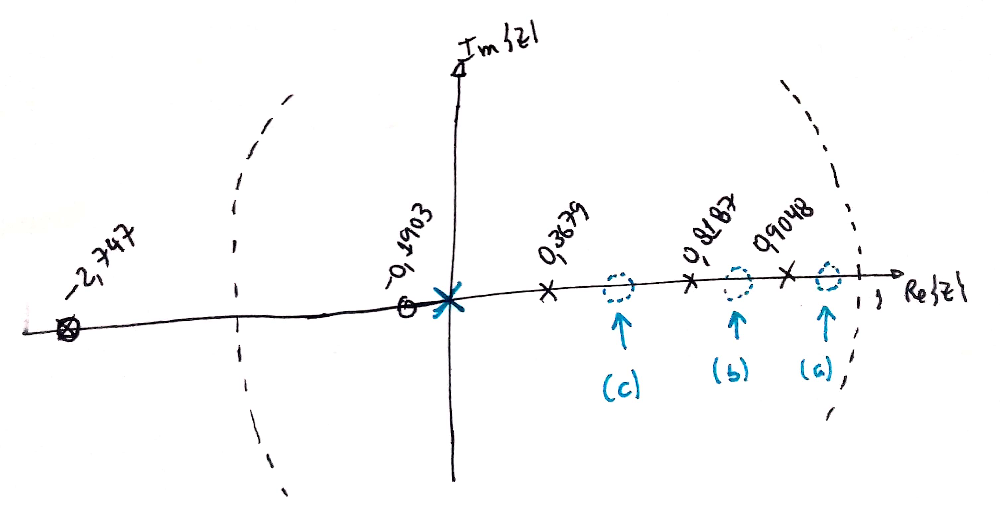

* **Opção (a)**: Zero em $0,9048 < z < 1$ (zero entre o pólo mais lento da planta e o círculo unitário). Esta opção nos leva ao seguinte RL:

	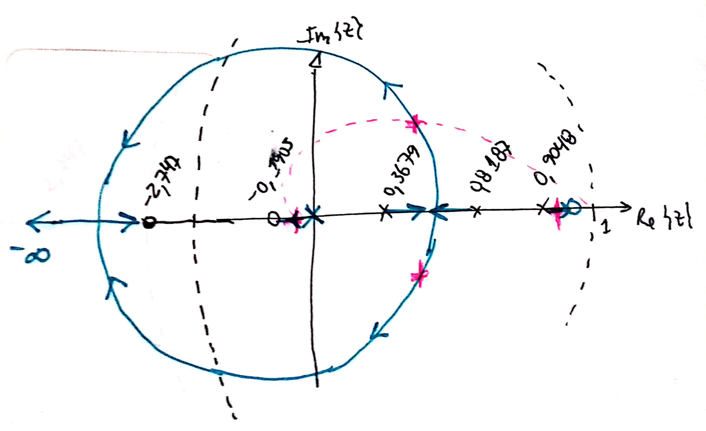

	Comentário: *Nesta opção o RL resultante fará surgir um pólo de MF real entre o zero do controlador e o pólo mais lento da planta, com um efeito indesejável, este pólo será atraído pelo zero do controlador localizado muito próximo da borda, o que implica um alto tempo de resposta -- provavelmente $t_s > t_{s, \text{Proporcional}}$.* 

* **Opção (b)**: Zero em $0,8187 < z < 0,9048$ (zero entre os 2 pólos mais lentos da planta). Esta opção nos leva a outro RL:

	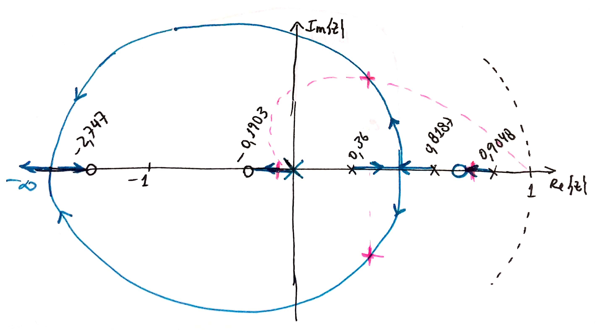

	Comentário: *Neste caso, resulta um RL semelhante à opção (a), mas o pólo real mais lento estará "caminhando" do pólo mais lento da planta, em $z=0,9048$, para a direção do zero do controlador (em $0,8187 < z < 0,9048$), o que resulta num $t_s < t_{s_{\text{Opção (a)}}}$.*
	
* **Opção (c )**: Zero em $z < 0,8187$ (zero menor que o segundo pólo mais lento da planta). Esta opção leva a outro RL.

Testando a opção (b):

### Opção (b):

```matlab
>> C_PD=tf( [1 -0.83], [1 0], T)	% Entrando com eq. do controlador


C_PD =
 
  z - 0.83
  --------
     z
 
Sample time: 0.1 seconds
Discrete-time transfer function.

>> ftma_PD=C_PD*BoG;	% determinando a FTMA c/este controlador
>> figure; rlocus(ftma_PD)	% avaliando o RL obtido
>> hold on;
>> zgrid(zeta,0)
>> [K_PD,polosMF_PD]=rlocfind(ftma_PD)
Select a point in the graphics window
selected_point =
   0.6321 + 0.3212i
K_PD =
  334.0261
polosMF_PD =
   0.8326 + 0.0000i
   0.6303 + 0.3212i
   0.6303 - 0.3212i
  -0.0425 + 0.0000i
>>
```

O RL obtido, já mostrando o ganho adotado é mostrado na próxima figura:

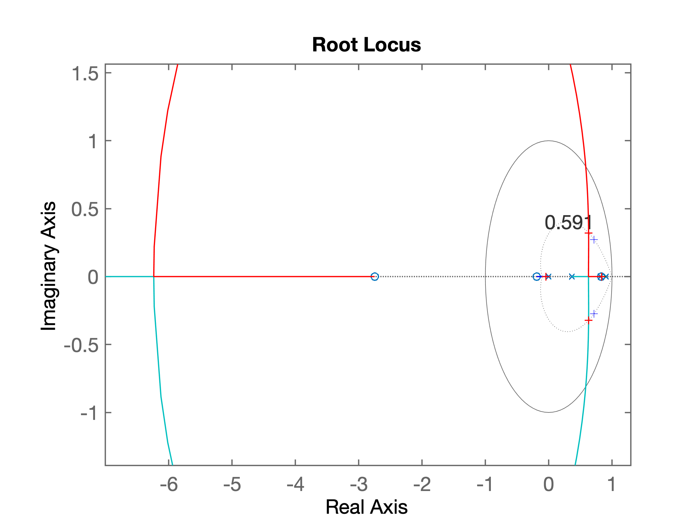

A próxima figura motra a zona de interesse do RL ("zoom na parte de interesse") já com o ganho ajustado:

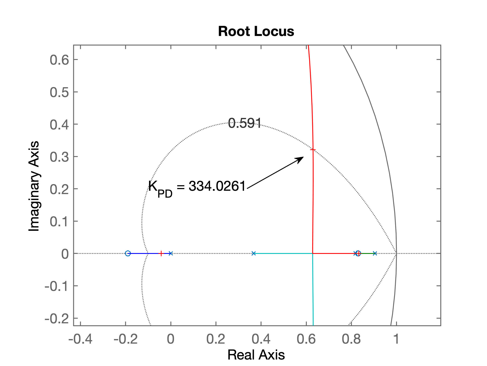

Fechando a malha:

```matlab
>> ftmf_PD=feedback(K_PD*ftma_PD, 1);
>> figure; step(ftmf, ftmf_PI, ftmf_PD)	% comparando a resposta de 3 controladores
>> % resposta salva em comparativo_PD.png
>> % gráfico do RL salvo como: RL_PD.png
```

A próxima figura mostra a saída obtida para o sistema em MF para 3 controladores:

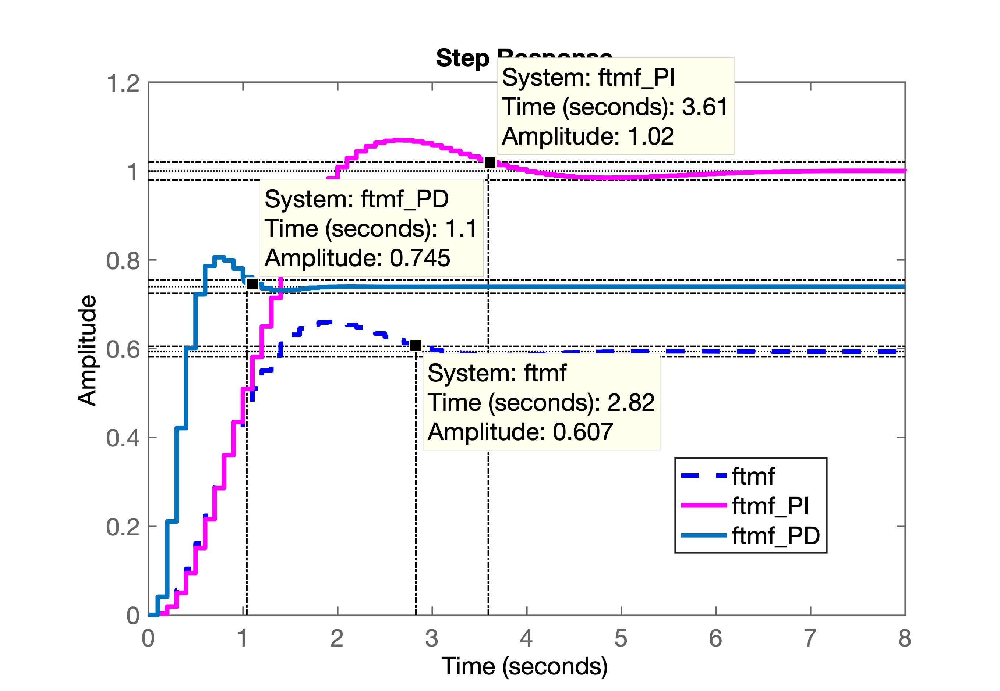

Note que o controlador PI, conforme esperado, anula o erro em regime permanente, mas é o que possui o maior tempo de assentamento.

Já o controlador Proporcional, apesar do tempo de assentamento menor que o do controlador PI, sofre com o erro em regime permanente em torno dos 40%.

E o PD, conforme esperado, foi o que o que mais acelerou a resposta da planta (menor $t_s$), mas note que este tipo de controlador não serve para zerar o erro de regimente que continua algo elevado ($\cong 25\%$), mas menor do que o do controlador Proporcional.

Mas... existe um "preço" à pagar para acelerar a plnta desta forma. Controladores do tipo PD ou Lead geram amplitutes bastante elevados para os valores da ação de controle. Verificando as amplitudes geradas pelas ações de controle dos 3 controladores comparados na figura anterior...

```matlab
>> aux_PD=K_PD*C_PD/(1+K_PD*ftma_PD);
>> zpk(aux_PD)

ans =
 
  334.03 z (z-0.9048) (z-0.83) (z-0.8187) (z-0.3679)
  --------------------------------------------------
   z (z-0.8326) (z+0.04252) (z^2 - 1.261z + 0.5004)
 
Sample time: 0.1 seconds
Discrete-time zero/pole/gain model.

>> figure; step(aux_PD)
>> % grafico acao controle salvo em acao_controle_PD.png
```

A próxima figura mostra as elevadas amplitudes iniciais geradas pelo nosso controlador PD no período transitório:

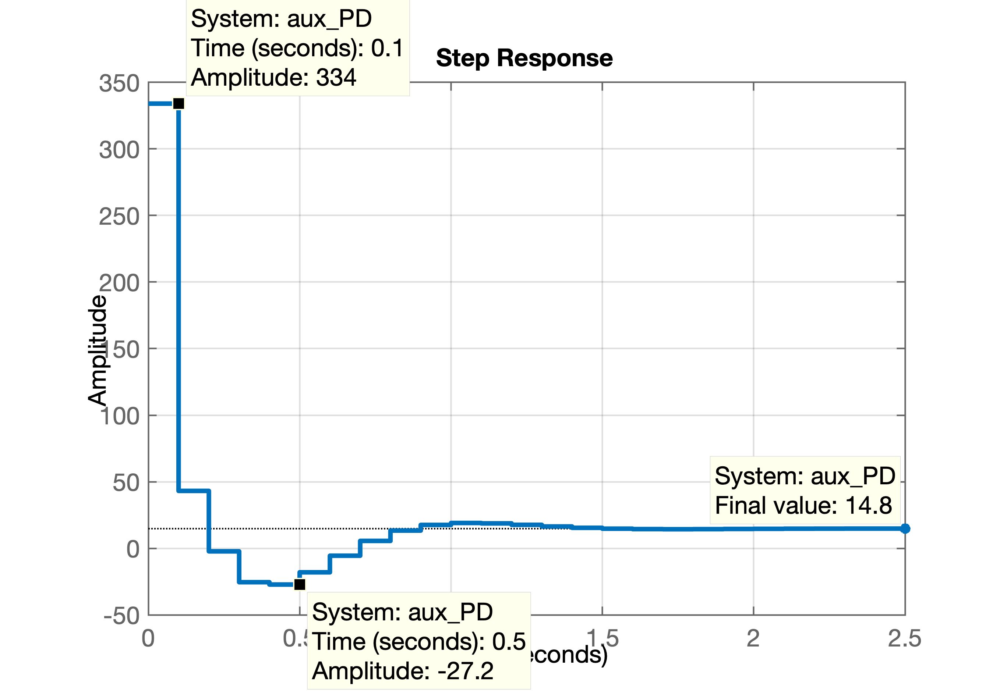

Comparando a ação de controle com os outros controladores:

```matlab
>> save planta
>> aux_Kp=K/(1+K*BoG);
>> aux_PI=K_PI/(1+K_PI*ftma_PI);
>> figure;
>> step(aux_Kp, aux_PI, aux_PD)
>> % Gráfico salvo como acoes_controle.png
>> save planta
```

A próxima figura permite comparar as amplitudes geradas por cada ação de controle:

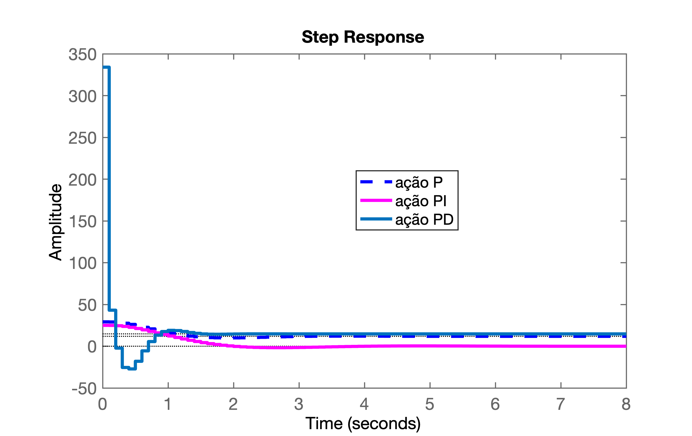

**Questão:** -- Existe outro método mais determinístico para projetar um controlador PD ou Lead (ou outro qualquer)?

**Resposta:** Pode-se usar o método da contribuição angular, que permite definir com precisão a posição de um pólo ou zero do controlador.


## Projeto de Controlador Lead (por Avanço de Fase) via Contribuição angular

Para este caso, foi desenvolvido um *script* (no `Matlab`) para determinação precisa do zero, usando contribuição angular. O usuário apenas necessita arbitrar a posição inicial do pólo deste controlador e repassar outras informações importantes para que este *script* consiga determinar o ponto desejado para o par de pólos complexos conjugados de MF para o sistema.

Neste caso, executar na CLI do `Matlab`, o *script* [`angulos2.m`](angulos2.m) (este *script* necessita a função [`arc.m`](arc.m), que deve estar previamente instalada no mesmo diretório do script anterior): 

```matlab
>> angulos2
Lead Controller Design
In this version you should arbitrate the initial position of the pole of C(z)

Plant (in s-plan) informed, G(s):
ans =
 
          1
  ------------------
  (s+10) (s+2) (s+1)
 
Continuous-time zero/pole/gain model.

Sampling time informed: T=0.1
Plant in discrete form, BoG(z):
ans =
 
  0.00012224 (z+2.747) (z+0.1903)
  --------------------------------
  (z-0.9048) (z-0.8187) (z-0.3679)
 
Sample time: 0.1 seconds
Discrete-time zero/pole/gain model.

Maximum overshoot desired (%OS), in %: ? 10
zeta (damping factor) should be: 0.5912
Enter desired settling time, t_s: ? 1.5

It results in the natural oscillation frequency, wn =  4.5109 (rad/s)
The MF poles (in the s-plane) should be located in:
2.6667 +/- j3.6383
Localization of MF poles in the z-plane should be:
z = 0.7158 +/- j0.2726

Enter the position of the controller pole (z-plane): ? 0
Working with the temporary FTMA(z)...
Open poles = 0
Open poles = 0.904837
Open poles = 0.818731
Open poles = 0.367879
Open zeros = -2.74711
Open zeros = -0.190308
Angular contribution of each pole in the z-plane:
 p1 = 0.0000 --> 20.85^o
 p2 = 0.9048 --> 124.74^o
 p3 = 0.8187 --> 110.69^o
 p4 = 0.3679 --> 38.08^o
Sum of angular contribution of poles: 294.36^o
Check the figure window -> Paused (enter to continue)...

Angular contribution of each zero in the z-plane:
 z1 = -2.7471 --> 4.50^o
 z2 = -0.1903 --> 16.74^o
Sum of angular contribution of zeros: 21.24^o
Final angle for the zero of C(z): 93.1152^o

Ok, determining the position for zero of C (z)...
Final position for the Lead zero: z_c=0.7306
Updating final RL graph...
The Lead controller final result is (variable C):
ans =
 
  (z-0.7306)
  ----------
      z
 
Sample time: 0.1 seconds
Discrete-time zero/pole/gain model.

>> 
```

Resultado dos cálculos de contribuição angular:

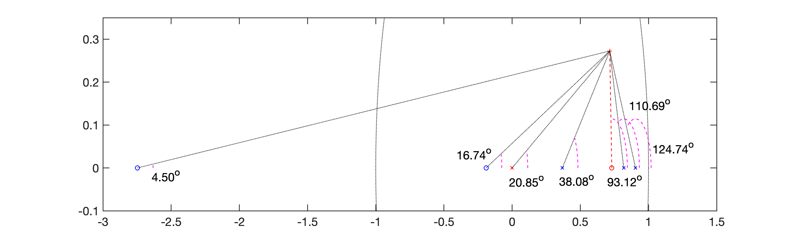

Note que o resultado da contribuição angular para o ângulo deo zero resultou em $\theta_{zero\_PD}=93.1152^o$, ou:

O somatório dos ângulos dos pólos resultou: $\sum{\theta_{\text{pólos}}}=294.36^o$. Pela regra de um ponto pertencente ao RL teremos:

$$
\underbrace{\theta_{z=-2,747}+\theta_{z=-0,1903}}_{21,24^o}+\theta_{\text{zero\_PD}}-\sum {\theta_{\text{pólos}}}= (2k+1)\cdot 180^o
$$

$$
\theta_{\text{zero\_PD}}=180^o + 294,36^o - 21.24^o = 453,12^o = 93.1152^o
$$

Resultado do RL obtido:

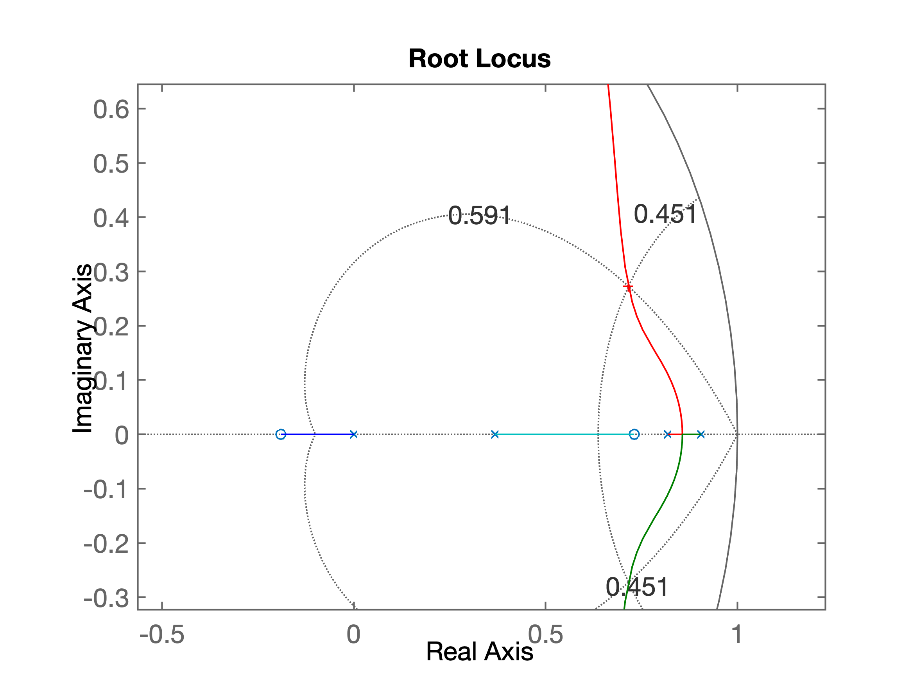

Resultado final para equação do PD:

$$
C_{PD}(z)=K_d \cdot  
\dfrac{(z-0.7306)}{z}
$$

Este PD garante $t_{s_d}<1,5$ (segundos).

__Exercício final__: mostrar resultado para entrada degrau unitário, calcular erro e comparar controladores.

---

<font size="1"> (c) Fernando Passold, em 28/05/2020 </font>