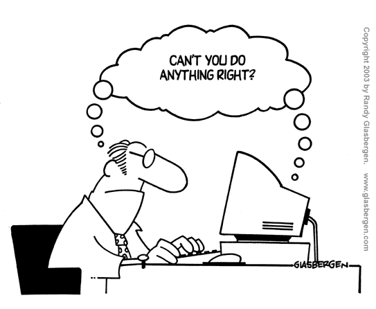
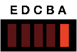
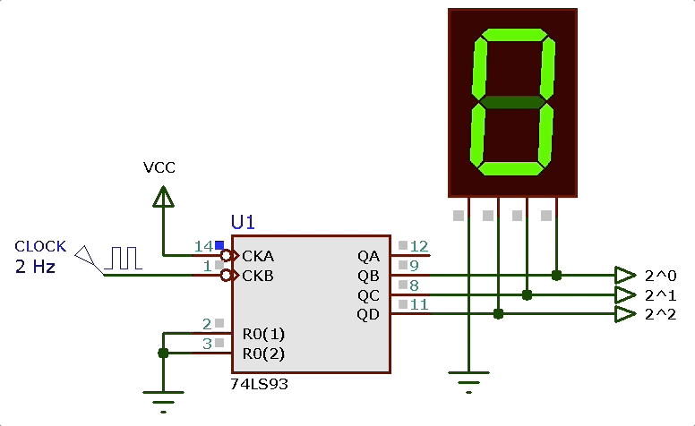
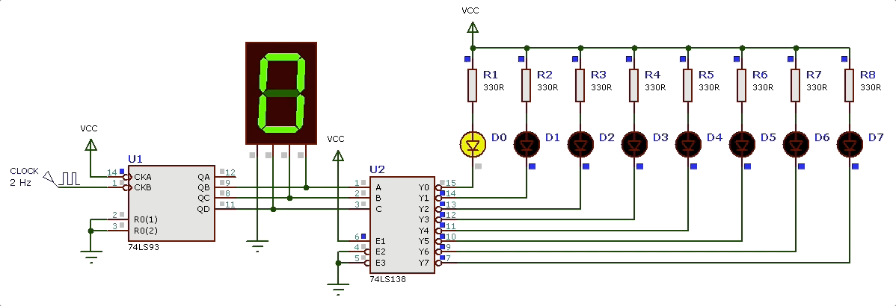
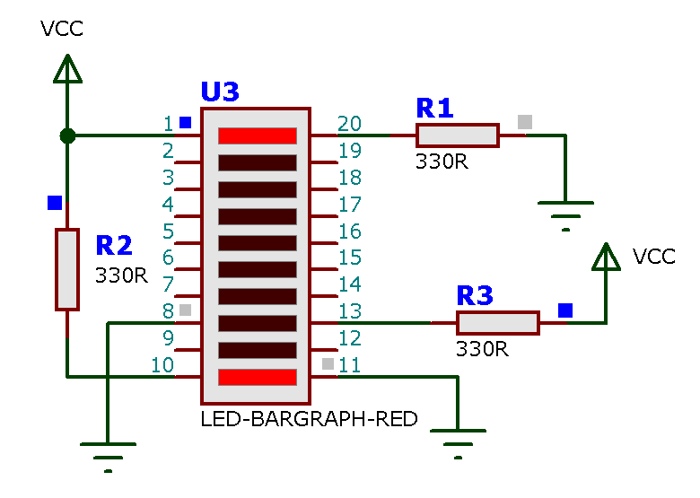
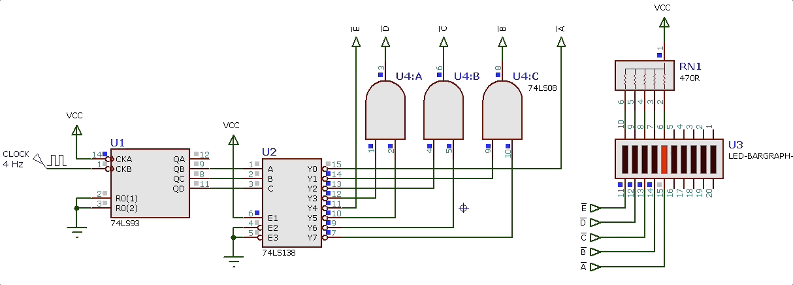

# Lab 9) Efeito Visual usando DEC 3/8...

Este laboratório explora o uso de DEC para síntese de funções lógicas.

Recordando como um DEC pode ser usado para realizar funções lógicas...

O projeto associado com este laboratório visa criar um efeito visual de “vai-e-volta” sobre 5 leds:

Para realizar este efeito visual deve-se identficar os diferentes estados presentes no circuito, e neste momento nos damos conta que este circuito funciona baseado em 8 diferentes estados. A cada um destes estados corresponde uma diferente configuração de ativação dos Leds:

| Estado | Leds E D C B A |
| ------ | ------------------- |
| 0      | o o o o 1           |
| 1      | o o o 1 o           |
| 2      | o o 1 o o           |
| 3      | o 1 o o o           |
| 4      | 1 o o o o           |
| 5      | o 1 o o o           |
| 6      | o o 1 o o           |
| 7      | o o o 1 o           |

Note que depois que o circuito atinge o estado “7”, ele volta para o estado “0”, motivo pelo qual existe neste projeto um circuito contador de 8 estados (MOD-8), usando-se parte da pastilha contadora 74LS93. O objetivo deste contado é “numerar” estes estados, gerando a sequência binária equivalente de:
 $0 \rightarrow 1 \rightarrow 2 \rightarrow 3 \rightarrow \ldots \rightarrow 7 \rightarrow 0 \rightarrow 1 \rightarrow \ldots$

Note que enquanto este circuito estiver alimentado, esta pastilha contadora gerará indefinidamente o ciclo de montagem mostrado anteriormente ([efeito_visual_1_contador.DSN](efeito_visual_1_contador.DSN)):

Proximo passo: criar um circuito que identifica cada estado e aciona adequadamente os leds de “A” até “E”.

Como circuito que “identifica” os diferentes estados, podemos usar o DEC de 3 para 8 linhas (CI 74LS138). O DEC como já visto em aulas anteriores, ativa uma única saída conforme o código binário presente na sua entrada. Então teremos as saídas $\overline{Q_0}$ até $\overline{Q}_0$ sendo ativadas conforme o circuito contador avance de 0 à 7. Se conectarmos o DEC 3/8 às saídas do contador 74LS93 vamos obter a seguinte sequencia de saída ([efeito_visual_2_DEC.DSN](efeito_visual_2_DEC.DSN)):

Observando nossa primeira tabela percebemos alguns fatos interessantes:

1. O led “A” apenas é acionado no estado “0”, ou quando a contagem passa por 0, isto é, a saída $\overline{Q_0}$ do DEC 3/8 vai estar ativada (ativo baixo). Como é melhor acionar o led na configura ativo baixo porque é quando portas TTL conseguem fornecer mais corrente então em termos de equaçã/circuito teremos:
   $\overline{A}=\overline{Q_0}$.

2. O led “B” é acionado em 2 ocasiões: quando a contagem atinge 1 e quando atinge 7, o que significa que este led deve ser acionado sempre que a saída $\overline{Q_1}$ ou $\overline{Q_7}$ estiverem ativadas (note que estas 2 saídas nunca serão acionadas simultaneamente; estamos usando um DEC). Então, raciocinando em termos de nível lógico alto temos algo como:
   $B=Q_1+Q_7$
   Mas é mais fácil ativar o led em nível lógico baixo (isto é, é quando pastilhas TTL conseguem fornecer maior nível de corrente) e o DEC comercial 74LS138 também só possui saídas ativo baixo. Então vamos proceder a uma ligeira alteração no circuito: necessitamos $\overline{E}$ ao invés de $E$, e assim a equação anterior fica:
   $\overline{B}=\overline{Q_1+Q_7}$
   A equação anterior ainda não trabalha como $\overline{Q_1}$ ou $\overline{Q_7}$, mas podemos usar DeMorgan para trabalhar algebricamente a expressão anterior, lembrando de: $\overline{x+u}=\overline{x} \cdot \overline{y}$ e então obtemos:
   $\overline{B}=\overline{Q_1} \cdot \overline{Q_7}$.

   O que significa que uma simples porta AND de 2 entradas conectadas às saídas $\overline{Q_1}$ e $\overline{Q_7}$ do DEC 3/8 já resolvem nosso problema para acionar o led E em nível lógico baixo.

3. Percebe-se que o led “C” é ativado nos instantes de contagem (ou estados de número): 2 e 6. Assim, usando-se raciocínio similar ao empregado no item anterior, concluímos que a equação (e circuito) capaz de acionar o led “C” à partir das saídas do DEC 3/8 fica:
   $\overline{C}=\overline{Q_2} \cdot \overline{Q_6}$.

4. O led “D” é ativado nos instantes de contagem 3 e 5 e assim, o circuito para este led fica:
   $\overline{D}=\overline{Q_3} \cdot \overline{Q_5}$.

5. Por fim, o último led “E” é acionado apenas quando a contagem atinge o número 4; podemos então apenas “coletar” a saída $\overline{Q_4}$ do DEC e o circuito/equação para este led fica:
   $\overline{E}=\overline{Q_4}$.

Note o projeto para o circuito final foi fácil de ser executado usando-se apenas um CI contador + DEC 3/8 + 3 portas AND de 2 entradas.

Note que no Proteus existe um “Led-Bargraph” composto por 10 leds enfileirados. Fisicamente, estes leds neste tipo de estrutura estão realmente enfileirados e então o efeito visual fica mais “dramático”. Um teste com este componente revela sua forma de uso:

Note a dificuldade extra gerada pela falta de identificação dos pinos num componente eletrônico. Pela figura anteiror, se percebe que o Led entre os pinos 8 e 13 não se ativa, porque foi polarizado “inversamente”. O teste realizado na figiura anterior serviu apenas para identificar o ânodo e cátodo dos leds neste componente eletrônico. Como a corrente num diodo flui do anodo para o cátodo, se conclui que apenas o primeiro e último led do bargraph da figura anterior foram acionados da forma correta. Ou seja, que no Proteus, os ânodos ($+$) são os terminais ímpares e os cátodos ($-$) são os terminais pares.

Levantando o circuito completo ([efeito_visual_final.DSN](efeito_visual_final.DSN)) acionando metade deste “led-bargraph” temos:

**Outras propostas**:

1) Você seria capaz de projetar um circuito para gerar algum dos efeitos visuais indicados abaixo?

a) 

b) 

c) 

*Obs.*: Note que o efeito (a) possui 9 estados diferentes e os efeitos (b) e (c) possuem 16 estados diferentes.

Fim

---

Fernando Passold, 20.04.2021

