Water lightbulb @ Sharon Pittaway - Unsplah.com

# Exercícios

**Ex$_1$)** Simule o circuito ([simula_BCD.DSN](simula_BCD.DSN)) abaixo (mude a posição das chaves) para entender o que acontece com o circuito abaixo:

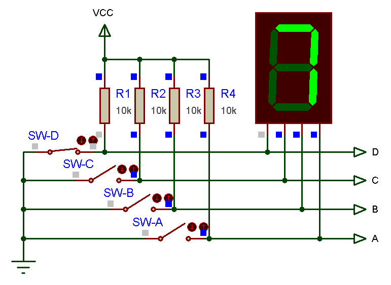

Note que os resistores no circuto acima estão na configuração “pull-up”. 

**Perguntas**:

* Você percebeu que acionar uma chave, leva o nó ao qual a chave está conectada, à nível lógico baixo?
* Notou que quando a chave está desconectada, este nó do circuito permanece em nível lógico alto?
* Você sabe dizer porque os resistores são necessários?
* Você sabe dizer porque estes resistores são de 10 K?
* Que chaves deveriam ser acionadas para fazer aparecer o número “9” no display?

**Ex$_2$)** Circuito similar ([simula_BCD_pull_down.DSN](simula_BCD_pull_down.DSN)) mas com resistores em configuração “pull-down”:

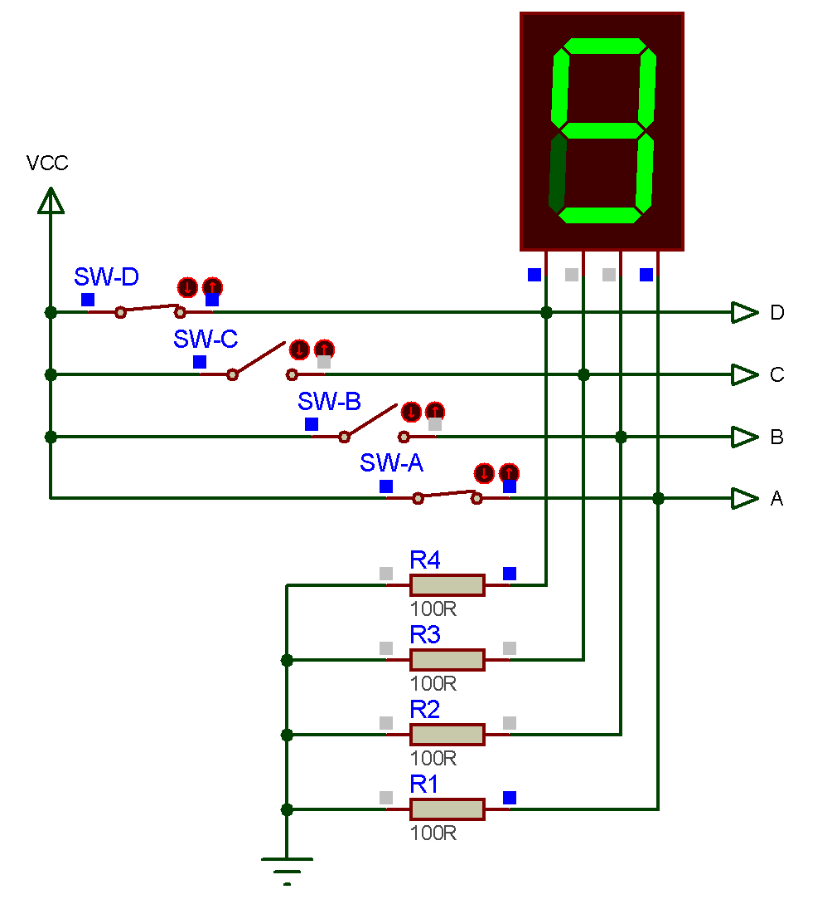

**Perguntas**:

* Você sabe justificar porque os resistores neste circuito são de apenas 100 Ohms?
* Que chaves você acionaria para fazer aparecer o número “5” no display?

> Se você ainda possui dificuldades para entender resistores em configuração “pull-up” e “pull-down” se sugere uma consuta à página: [Gadgetronicx: Guide to Pull up / Pull down resistors and its usage](https://www.gadgetronicx.com/guide-pull-up-down-resistors-usage/) (acessado em 20.04.2021; disponibilizado em 29.03.2018.
>
> E se ainda houver questionamentos a respeito de como acionar um Led em circuitos digitais se aconselha a página: [Electronics Tutorials: The Light Emitting Diode](https://www.electronics-tutorials.ws/diode/diode_8.html) (acessado em 20.04.2021) - esta página ainda ensina a calcular os valores dos resistores usados em série com os leds.

**Ex$_3$**) Simulando operações com **MUX** de 2 canais de entrada:

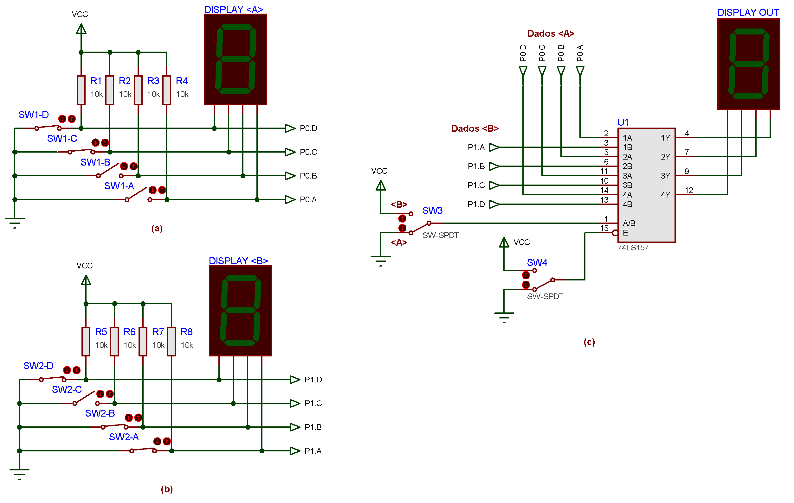

Note que U1 é o CI 74LS157, um MUX (Multiplexador) quádruplo de 2 canais de entrada.

Perceba pela chave SW4 que este MUX está habilitado.

Note que o primeiro canal de dados de entrada “\<A>" está conectado às entradas “A” do MUX (na simbologia adotada pelo Proteus; se fosse simbologia ANSI seriam as entradas I0). Note que o bit menos significativo da palavra \<A> é gerado via porta (nó): P0.A e que pode ser nível lógico pode ser modificado pela chave SW1-A. Note que este bit está ingressando na entrada “1A” do MUX.

Note que o segundo canal de dados de entrada “\<B>" está conectado às entradas “B” do MUX (na simbologia adotada pelo Proteus; se fosse simbologia ANSI seriam as entradas I1). Note que o bit mais significativo da palavra \<B> é gerado via porta (nó): P1.D e que pode ser nível lógico pode ser modificado pela chave SW2-D. Note que este bit está ingressando na entrada “4B” do MUX.

Você percebeu que as entras “A” e “B” do MUX foram organizadas no diagrama elétrico de forma a destacar que são 4 bist ingressando nas entradas “A” e outros 4 bits ingressando nas entradas “B”.

Você notou que os bits das palavras de entrada estão “sincronizados” com as entradas do MUX da seguinte maneira:
$$
\text{palavra "<A>"}\left\{ 
\begin{array}{rcl}
P0.A \; (2^0 \text{bit LSB})&\rightarrow& \text{entrada }1A \; \text{(de U1), ou } I0a \text{ (simbologia ANSI)}\\
P0.B \; (2^1)&\rightarrow& \text{entrada }2A \; \text{(de U1), ou } I0b \text{ (simbologia ANSI)}\\
P0.C \; (2^2)&\rightarrow& \text{entrada }3A \; \text{(de U1), ou } I0c \text{ (simbologia ANSI)}\\
P0.D \; (2^3 \text{bit MSB})&\rightarrow& \text{entrada }4A \; \text{(de U1), ou } I0d \text{ (simbologia ANSI)}\\
\end{array}
\right.
$$
e:
$$
\text{palavra "<B>"}\left\{ 
\begin{array}{rcl}
P1.A \; (2^0 \text{bit LSB})&\rightarrow& \text{entrada }1B \; \text{(de U1), ou } I1a \text{ (simbologia ANSI)}\\
P1.B \; (2^1)&\rightarrow& \text{entrada }2B \; \text{(de U1), ou } I1b \text{ (simbologia ANSI)}\\
P1.C \; (2^2)&\rightarrow& \text{entrada }3B \; \text{(de U1), ou } I1c \text{ (simbologia ANSI)}\\
P1.D \; (2^3 \text{bit MSB})&\rightarrow& \text{entrada }4B \; \text{(de U1), ou } I1d \text{ (simbologia ANSI)}\\
\end{array}
\right.
$$
Então note que os bits LSB estão “alinhados” com as entradas “1A” e “1B” de U1 (ou entradas I0a e I1a na simbologia ANSI); que os bits MSB estão alinhados com as entradas “4A” e “4B” (ou entradas I0d e I1d na simbologia ANSI).

Note que alguma “inversão” nos bits de entrada vai incorrer em erros neste experimento (erros de conexões dos bits de entrada são comuns em montagens práticas! Atenção no caso de uma montagem prática).

**Perguntas**:

* Que número estará aparecendo no "DISPLAY \<A>" ?
  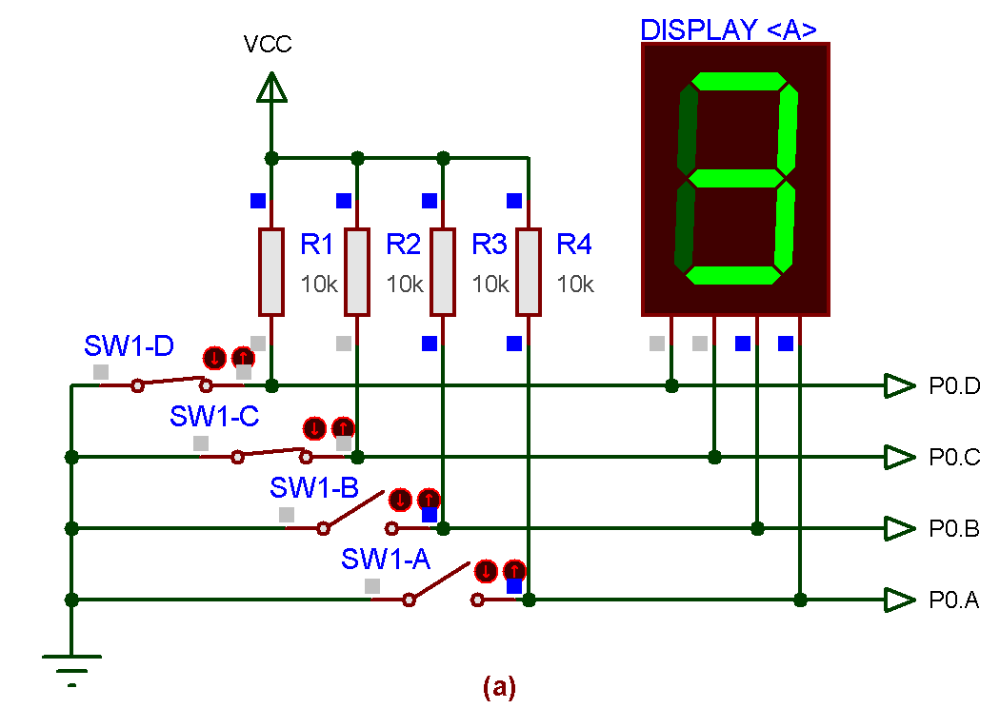

* Que número estará aparecendo no "DISPLAY \<B>" ?
  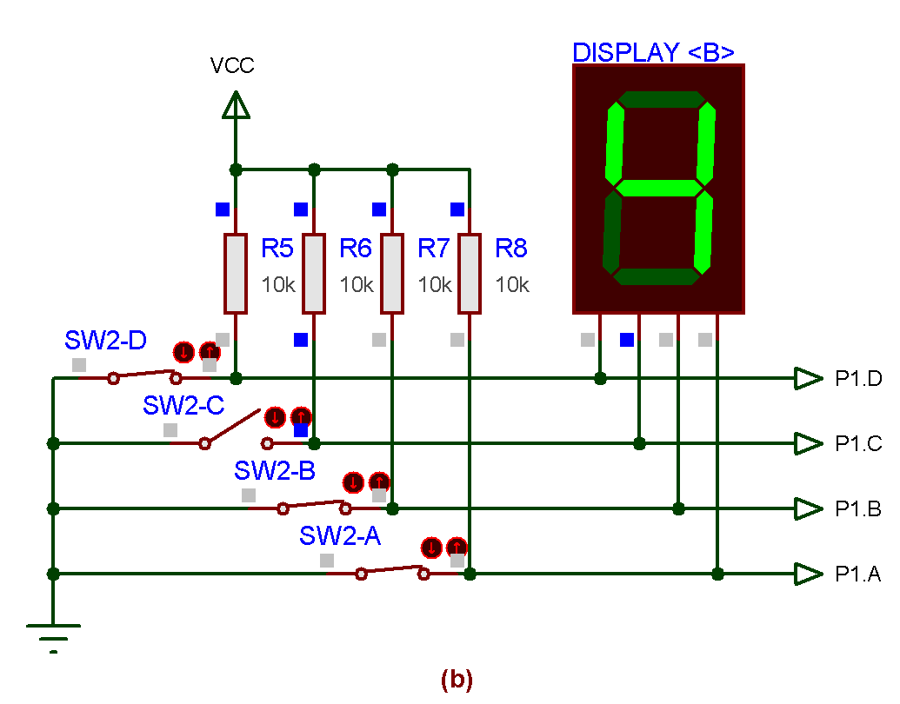

* O que aparece no "DISPLAY OUT" se U1 está desabilitado (SW4 conectado à VCC) ?
  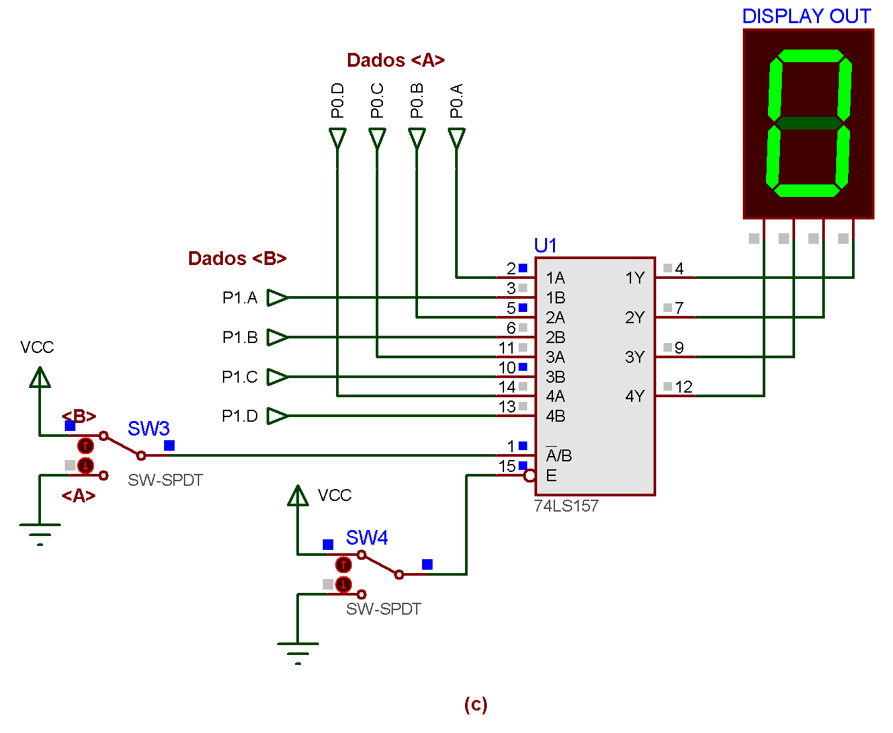

* Que número deve aparece no “DISPLAY OUT” (com o MUX habilitado) ?
  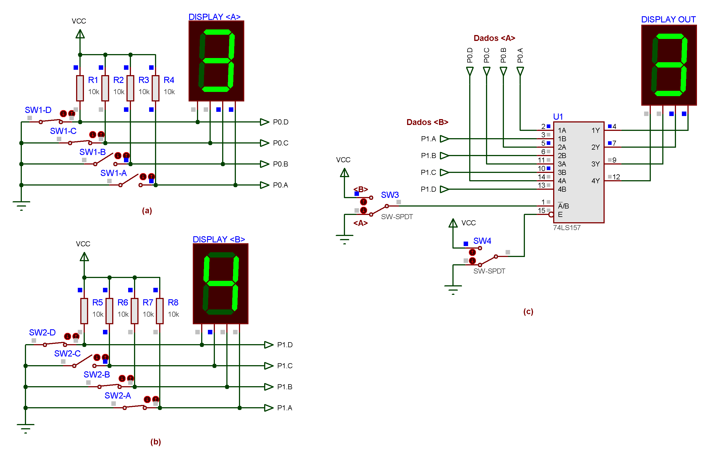

* Que posição deveria assumir a chave SW3 para fazer aparecer a palavra “B” em “DISPLAY OUT”?
  *Resposta*: SW3 deve comutar para VCC (ou posição “\<B>”):
  

* Como modificar o circuto para a palavra \<A>$=C_{(16)}$, \<B>$=3_{(10)}$ e o que aconteceria se SW3 é comutado para GND?
  *Resposta*:

  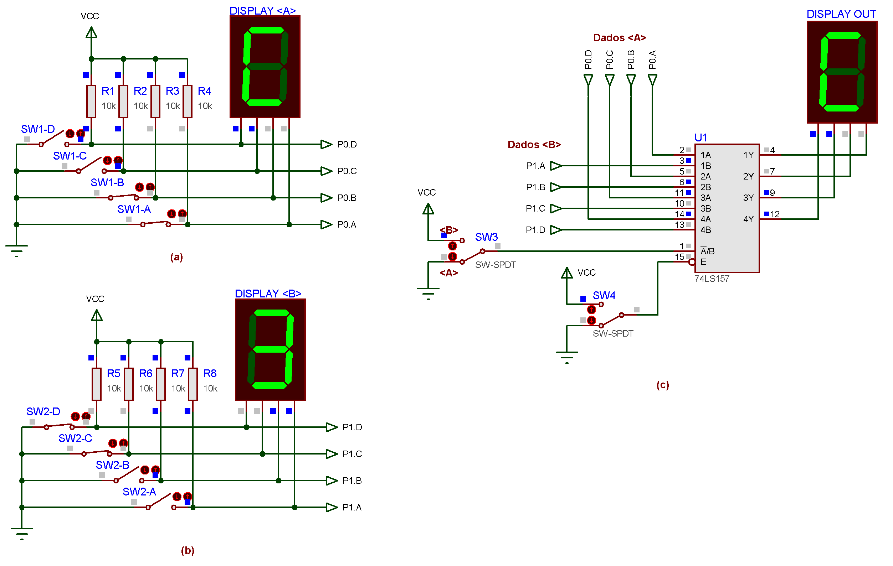

Note que o Proteus permite simular o funcionamento de “**thumbswicthes**”, “**thumbwheels**" ou “**chaves-tambor**”. Este tipo de chave permite que o usuário selecione no seu “painel” um dígito (por chave colocada num display) e nos seus terminais de saída surge a sequência binária correspondente ao dígito selecionado. Este componente está presente em:

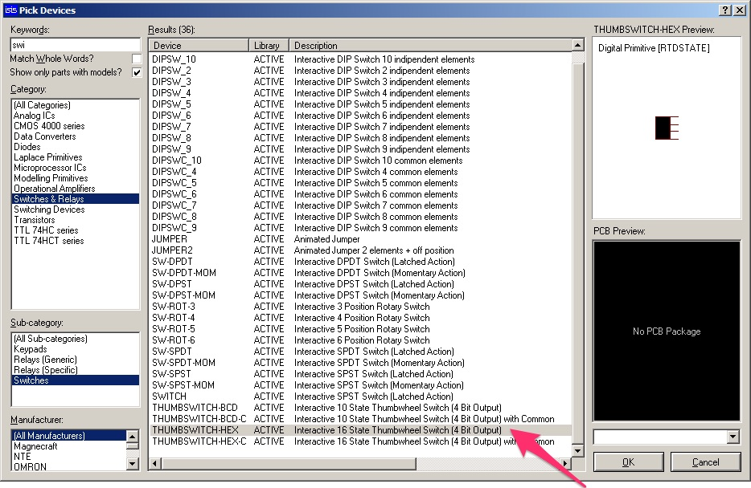

Note que estão disponíveis chaves para criar código BCD ou hexa. Um exemplo de uso aparece à seguir:

| 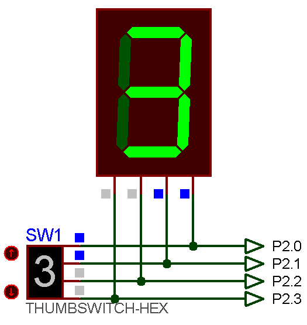 | 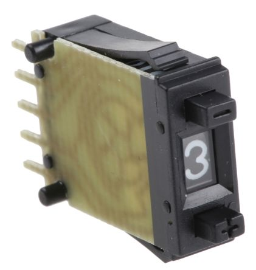 |
| ------------------------------------------------------------ | ------------------------------------------------------------ |
| (a) [Circuito](simula_hexa.DSN) no Proteus                   | (b) Chave real (“pushwheel switch BCD”.)                     |

Repare onde estão localizadas as saídas com os bits LSB (P2.0) e MSB (P2.3). Perceba que infelizmente o Proteus não idêntica os nomes dos pinos das suas chaves tambor (e a falta ou confusão que isto pode gerar).

Na vida real, para esta chave funcionar, devem ser providenciada uma fonte de alimentação (dai a presença de mais de 4 pinos entre seus conectores de saída):

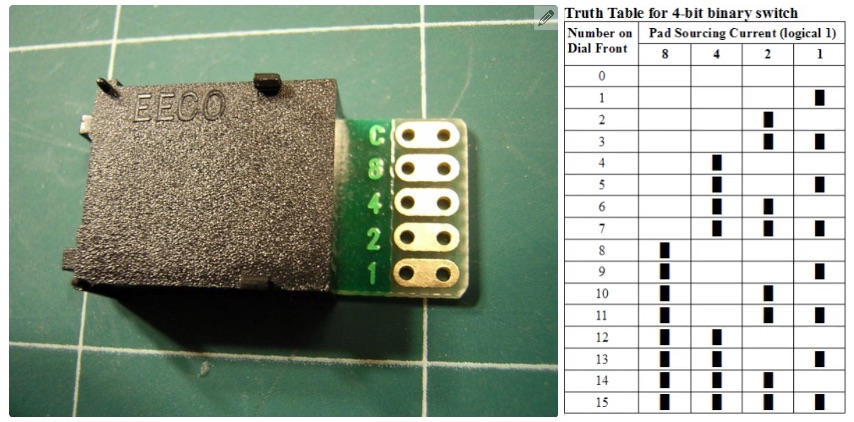

Comumente o terminal “C” (Comum) vai conectado ao GND e então as saídas “1” ($=2^0$) à “8” ($=2^3$) geram os códigos binários na configuração ativo alto:

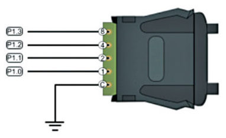

**Ex$_4$)** Modifique o ciruito do (Ex$_3$), trazendo-lhe uma funcionalidade extra. Baseado no circuto anterior, crie um novo circuito que é capaz de comparar as 2 palavras de entrada e mostrar no display de saída, sempre o **maior** número. Note que este novo circuito deve funcionar mesmo que o usuário modifique os níveis lógicos presentes nas entradas A e B. Em resumo o circuito deve realizar a operação: $OUT=M\acute{a}x(A,B)$.

*Dica*: Você pode usar um CI Comparador de Magnitude para lhe auxiliar nesta tarefa.

*Solução*:

Na forma de um diagrama em blocos se deseja algo como:

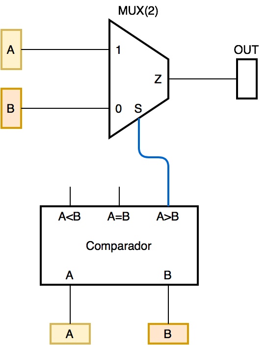

A idéia é simples: note pelo diagrama de blocos que quando $A>B$, apenas a saída “A>B” do CI Comparador vai a nível lógico alto. Como esta saída está conectada à entrada S (Seletc) do MUX, isto fará com que o MUX direcione para saída “OUT” o conteúdo presente nas suas entradas “1”, que no caso, são justamente os bits da palavra A.

Note que é **importante deixar claro onde as palavras A e B ingressam no MUX**: a palavra A ingressa nas portas “1” ou nas portas “0”. Se por distração, a palavra A (no diagrama anterior), for conectada às entradas “0” do MUX, ao invés do MUX enviar para a saída OUT, a maior palavra de entrada, estaria enviando para OUT a saída B, que é menor que A já que o comparador, neste exemplo, está com a saída (A>B) = 1 (indicnado que $A>B)$.

Resta apenas ajustar o comparador para que funcione corretamente (atentar para a entradas de cascateamento $I_{A<B}$, $I_{A=B}$ e $I_{A>B}$).

O ciruito final ([circuito_max_a_b.DSN](circuito_max_a_b.DSN)) aparece no diagrama elétrico abaixo:

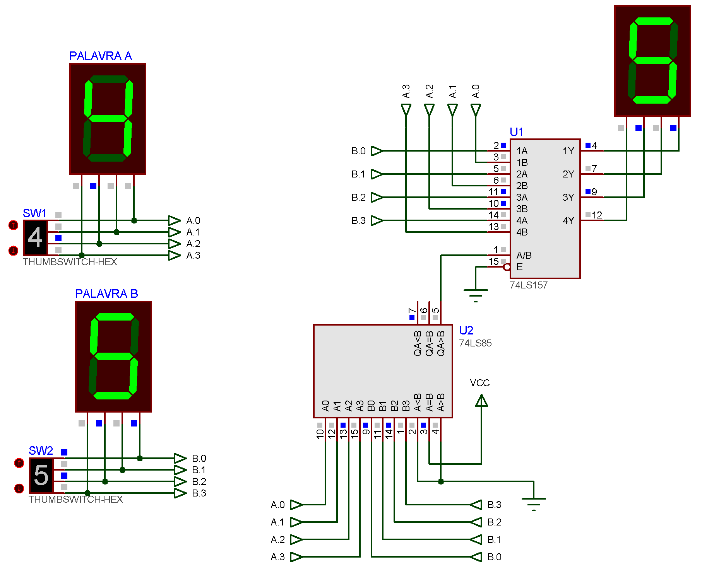

Fim… por enquanto.

---

Fernando Passold, em 20.04.2021

