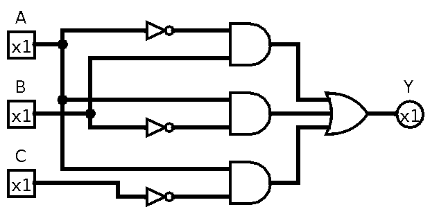
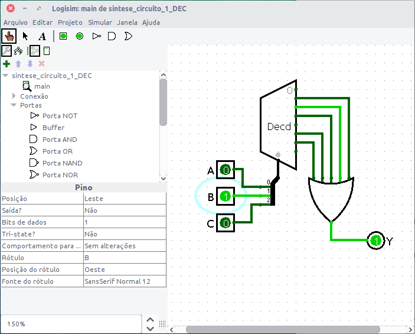

Enest Ojen, Glowing Sea Anemone - Unsplash.

# Exercícios 2

Sobre uso de MUX e DEC para síntese de funções.

Ex$_1$: Suponha que seja necessário projetar um circuito para sintetizar a tabela verdade abaixo:

Tabela verdade:

```
Ref | CBA | Y
----+------+---
  0 | 000 | 0
  1 | 001 | 1
  2 | 010 | 1
  3 | 011 | 1
  4 | 100 | 0
  5 | 101 | 1
  6 | 110 | 1
  7 | 111 | 0
```

Nota-se que são 3 variáveis de entrada, então podemos usar um MUX de 8 canais de entradas (3 linhas de seleção) ou um DEC de 3 para 8 linhas.

**A solução usando MUX** fica:

Analisando a tabela verdade se percebe que:
$$
\begin{array}{rcl}
Y &=& \underbrace{\bar{C}\bar{B}A}_{m_1}+\underbrace{\bar{C}B\bar{A}}_{m_2}+\underbrace{\bar{C}BA}_{m_3}+\underbrace{C\bar{B}A}_{m_5}+\underbrace{CB\bar{A}}_{m_6}\\
  &=& m_1+m_2+m_3+m_5+m_6\\
  &=& \sum_m \{ 1, 2, 3, 5, 6\}
\end{array}
$$
Então o circuito ([sintese_MUX_1.circ](sintese_MUX_1.circ)) fica simplesmente:


Obs: O soft LogiSim não possui MUXes comercias e trabalha com MUXes “generéricos” que exigem o uso de “Distribuidor de Dados” (pode ser útil para criar um barramento de dados ou endereços) para sua entrada de seleçao. No caso do exemplo anterior, o “Distribuidor” deve ser ajustado para:


E notar na primeira figura com o bloco MUX do LogiSim, não foi usada a entrada de Enable.

A simulação deste circuito (ou sua “análise” usando esta opção no LogiSim) gera:


O que permite gerar a tabela verdade completa do circuito:


Note que o LogiSim ignora que o bit MSB seja o “C” e apresenta a tabela verdade por ordem alfabética!

Obs.: Apenas para lembrar: este problema poderia ser solucionado desta forma, usando manipulação algébrica ou Mapas de Karnaugh:

| Opção: “Analisar circuito” >> “Minimizar Expressão” no LogiSim: | Opção: “Costruir Circuito” equivalente do LogiSim            |
| ------------------------------------------------------------ | ------------------------------------------------------------ |
|  |  |


Este circuito poderia ainda ser igualmente sintetizado usando DEC de 3 para 8 linhas:

A **solução usando DEC** fica:

Observando-se a equação extraída para o circuito e lembrando que um DEC realiza em suas saídas algo como:

$O_o=\bar{A_2}\cdot \bar{A_1} \cdot \bar{A_0}$

$O_1=\bar{A_2}\cdot \bar{A_1} \cdot {A_0}$$

$O_1=\bar{A_2}\cdot A_1 \cdot \bar{A_0}$
$\vdots$
$O_7=A_2\cdot A_1 \cdot A_0$

Se realizamos as conexões: 
$$
\begin{array}{rcl}
\text{bit MSB de entrada: } & C \leftarrow A_2 & \text{ (entrada MSB do DEC)}\\
\text{bit de entrada: } & B \leftarrow A_1 & \text{ (entrada do DEC)}\\
\text{bit LSB de entrada: } & A \leftarrow A_0 & \text{ (entrada LSB do DEC)}
\end{array}
$$
Vamos perceber que o DEC estará realizando as operações:

$O_o=\bar{A_2}\cdot \bar{A_1} \cdot \bar{A_0} = \bar{C}\cdot \bar{B} \cdot \bar{A}$

$O_1=\bar{A_2}\cdot \bar{A_1} \cdot {A_0} =  \bar{C}\cdot \bar{B} \cdot {A}$

$O_1=\bar{A_2}\cdot A_1 \cdot \bar{A_0} = \bar{C}\cdot B \cdot \bar{A}$
$\vdots$
$O_7=A_2\cdot A_1 \cdot A_0=C \cdot B \cdot A$

Como queremos que o circuito realize a expressão abaixo:

$Y = \underbrace{\bar{C}\bar{B}A}_{m_1}+\underbrace{\bar{C}B\bar{A}}_{m_2}+\underbrace{\bar{C}BA}_{m_3}+\underbrace{C\bar{B}A}_{m_5}+\underbrace{CB\bar{A}}_{m_6}$

então bastaria “coletar” os minitermos ou saídas do DEC que nos interessam:

$Y=O_1+O_2+O_3+O_5+O_6 \quad \quad$(1)

O detalhe extra é que normalmente os DECs comerciais só pssuem saídas em ativo baixo, então teríamos que “compmensar” as saídas negadas (complementadas), acrescentando uma porta inversora (NOT) à cada saída que nos interessa:

$Y=\overline{\overline{O_1}}+\overline{\overline{O_2}}+\overline{\overline{O_3}}+\overline{\overline{O_5}}+\overline{\overline{O_6}}$

mas lembrando-nos de DeMorgan: $\overline{x}+\overline{y}=\overline{x \cdot y}$, podemos re-escrever a equação anterior como:

$Y=\overline{ \overline{O_1} \cdot \overline{O_2} \cdot \overline{O_3} \cdot \overline{O_5} \cdot \overline{O_6} } \quad \quad$ (2)

ou seja, uma porta NAND de 5 entradas resolve nosso problema:

$Y=NAND \left( \overline{O_1}, \overline{O_2}, \overline{O_3}, \overline{O_5}, \overline{O_6} \right)$

Note que a porta NAND(5) “coletará” as saídas que nos interessam e o circuito final fica:

No LogiSim:



Obs.: Notar que o LogiSim não considera DECs com saída em ativo baixo, só saídas com ativo alto, motivo pelo qual foi usada uma porta OR (eq. (1)) ao invés da porta NAND (eq. (2)).

Obs.: No caso de use de DEC, infelizmente o LogiSim simula o circuito corretamente mas analise de forma incorreta, levantando uma tabela verdade que não corresponde ao esperado!


Usando o DEC 3/8: 74LS138 fica:


---

Ex$_2$ Suponha agora que você deve resolver a tabela verdade apresentada em seguinda, usando apenas 1 MUX de 8 canais de entrada e portas inversoras (se necessário):

```
Ref | DCBA | Y
 0  | 0000 | 0
 1  | 0001 | 1
 2  | 0010 | 0
 3  | 0011 | 0
 4  | 0100 | 1
 5  | 0101 | 1
 6  | 0110 | 0
 7  | 0111 | 1
 8  | 1000 | 0
 9  | 1001 | 0
10  | 1010 | 0
11  | 1011 | 0
12  | 1100 | 1
13  | 1101 | 1
14  | 1110 | 1
15  | 1111 | 1
```

*Solução*:

A princípio, um pode pensar que seria necessário um MUX com 16 linhas de entrada porque a tabela verdade possui 16 linhas $\times$ 4 variáveis de entrada. Mas a verdade é que podemos ser “econômicos” e usar apenas um MUX de 8 canais. 

Para isto, uma das variáveis de entradas deve ser inicialmente “separada” na tabela verdade. Para simplificar a solução, é melhor “separar” a variável mais significativa. Neste caso, facilita separar a varíavel MSB: “D”. O restante das variáveis conectamos ao MUX da forma como seria esperada, “casando” os bits mais significativos das variáveis de entrada com os bits mais signitificativos das entradas de seleção no MUX. Neste caso, conectaríamos:
$$
\begin{array}{rcl}
C &\rightarrow & S_2 \text{ (entrada MSB de Seleção do MUX);}\\
B &\rightarrow & S_1 \text{ (bit de Seleção do MUX);}\\
A &\rightarrow & S_0 \text{ (entrada LSB de Seleção do MUX);}
\end{array}
$$
Ai então você pode perguntar: — mas como se “programaria” esta tabela verdade de 16 linhas numn MUX com apenas 8 linhas de entrada?

A “magica” está no fato de atentar ao que acontece quando se realizam as conexões indicadas anteriormente. Note que propositalmente (facilita muito este projeto), separamos a variável de entrada MSB das conexões às entradas de seleção ao MUX, mas isto não significa que o MUX já não estaria respondendo paras as outras 3 entradas “menos significativas”. Montando uma nova tabela verdade, reduzida em função de só estamos trabalhando com MUX de 3 entradas de seleção, teremos nossa tabela verdade original “dividida” em 2 partes: uma correspondendo à variável de entrada $D=0$ e outra parte correspondendo a variável de entrada $D=1$.


```
Primeira parte da tabela		| Segunda parte da tabela
(D=0)												|	(D=1)
Ref | DCBA | Y              |			Ref | DCBA | Y
----+-=----+---             |			----+-=----+---
 0  | 0000 | 0              |			 8  | 1000 | 0
 1  | 0001 | 1              |			 9  | 1001 | 0
 2  | 0010 | 0			        |     10  | 1010 | 0
 3  | 0011 | 0			        |     11  | 1011 | 0
 4  | 0100 | 1			        |     12  | 1100 | 1
 5  | 0101 | 1			        |     13  | 1101 | 1
 6  | 0110 | 0			        |     14  | 1110 | 1
 7  | 0111 | 1			        |     15  | 1111 | 1
```

Como o MUX de 8 linhas de entrada vai estar recebendo os níveis lógicos das variáveis $C$, $B$ e $A$, e podemos notar algo interessante que ocorre:
$$
\begin{array}{cccl}
\text{Ref}\quad & ABC & Y & \text{Obs.:}\\ \hline
0 & CBA=000 \rightarrow & Y=0 & \leftarrow \text{com }D=0 \text{ ou com }D=1\\
1 & CBA=001 \rightarrow & Y=\overline{D} & \leftarrow Y=1 \text{ quando: } D=0; \quad  Y=0 \text{ quando: } D=1\\
2 & CBA=010 \rightarrow & Y=0 & \leftarrow \text{com }D=0 \text{ ou com }D=1\\
3 & CBA=011 \rightarrow & Y=0 & \leftarrow \text{com }D=0 \text{ ou com }D=1\\
4 & CBA=100 \rightarrow & Y=1 & \leftarrow \text{com }D=0 \text{ ou com }D=1\\
5 & CBA=101 \rightarrow & Y=1 & \leftarrow \text{com }D=0 \text{ ou com }D=1\\
6 & CBA=110 \rightarrow & Y=D & \leftarrow Y=0 \text{ quando: } D=0; \quad  Y=1 \text{ quando: } D=1\\
7 & CBA=111 \rightarrow & Y=1 & \leftarrow \text{com }D=0 \text{ ou com }D=1\\
\end{array}
$$
Então percebemos que realmente não necessitamos usar um grande MUX de 16 canais de entrada. Basta dividir a tabela verdade em 2 partes, preferencialmente usando a variável MSB para realizar a divisão.

O circuito final fica então como mostra a figura abaixo:


---

Fim

Fernando Passold, em 23.04.2021