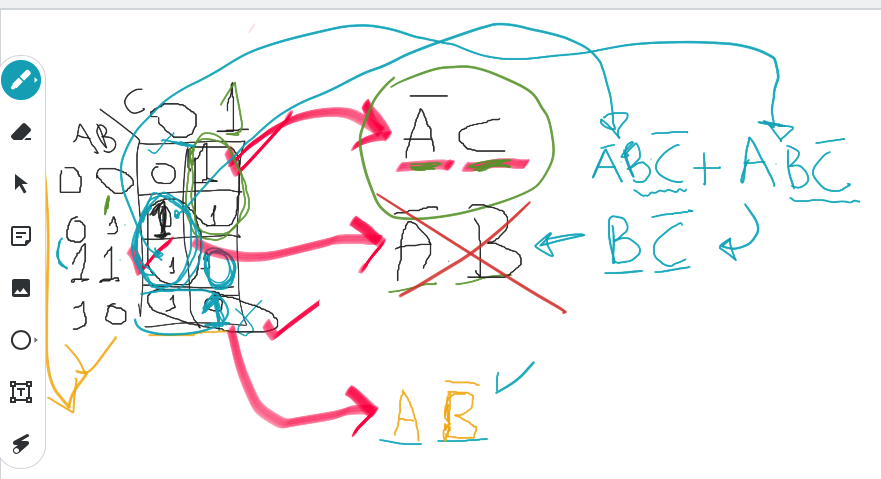
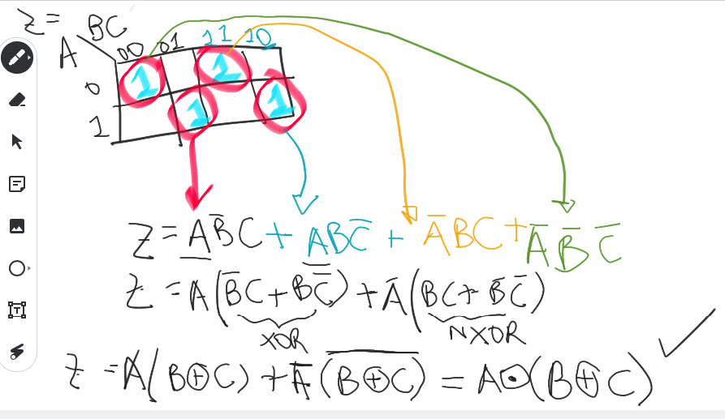
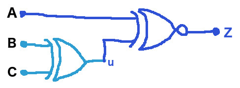
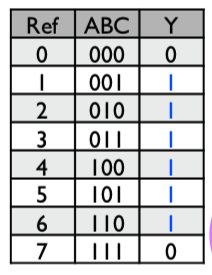
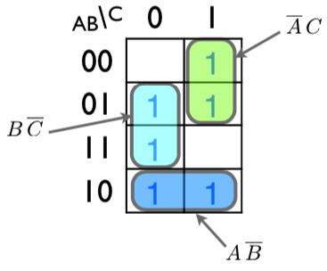
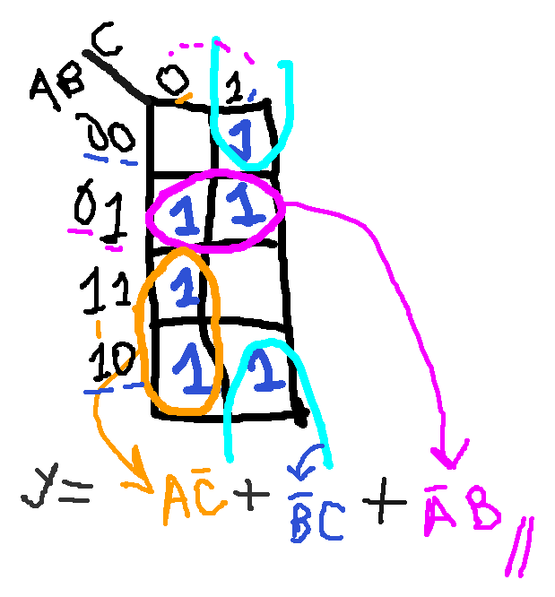
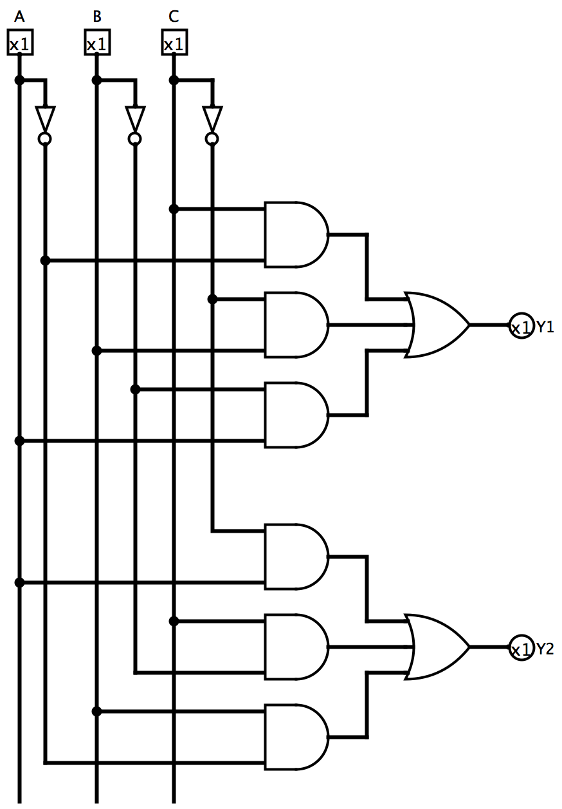
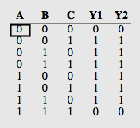

# Exercícios (interativos): Mapas de Karnaugh

Na aula de 30.03.2021 foi realizado encontro síncrono (usando Google Meet) e ativada ferramenta Jamboard para resolução interativa de alguns exercícios referentes à Mapas de Karnaugh envolvendo 3 variáveis.

Segue apresentação de alguns exercícios e resultados obtidos:

Exemplo$_1$:

Exemplo$_2$: Caso no qual um Mapa de Karnaugh pode não ser tão útil: não é possível estabelecer agriupamentos, mas mesmo assim, expressão lógica pode ser simplificada usando-se álgebra de Boole:

Último desenho compartilhado usando Jamboard disponível [aqui](https://jamboard.google.com/d/1bx3sV3WvNVW7h5eD-XZZP6iQdPQcssNyc7p3VmqGMrs/edit?usp=sharing) (mesmo da figura acima).

Transcrevendo solução:

$Z=A \bar{B} C + A B \bar{C} + \bar{A} B C + \bar{A} \bar{B} \bar{C}$

Notamos que podemos colocar em evidência certos termos:

$Z=A\left( \bar{B} C + B \bar{C} \right)+ \bar{A}\left( B C + \bar{B} \bar{C}\right)$

Notamos que as expressões dentro dos parêntesis tendem portas XOR e NXOR:

$Z=A\underbrace{\left( \bar{B} C + B \bar{C} \right)}_{XOR(B,C)} + \bar{A} \underbrace{\left( B C + \bar{B} \bar{C}\right)}_{NXOR(B,C)}$

A expressão anterior pode ser re-escrita como:

$Z=A \left( B \oplus C \right)+\bar{A} \left( \overline{B \oplus B} \right)$

e então percebemos uma outra “coincidência” associada com a expressão anterior. Suponha que $\left( B \oplus C\right)=u$, entáo teremos:

$Z=A u + \bar{A} \bar{u}$

E então percebemos que temos uma nova porta $NXOR(A,u)$:

$Z=\overline{A \oplus u}=A \odot u$

mas como $u=B \oplus C$, teremos então:

$Z=A \odot \left( B \oplus C\right)$

Ou seja um circuito equivalente à:

Note que este circuito foi originado à partir da tabela verdade:

| Ref | ABC | Z |
| --- | --- | --- |
| 0 | 000 | 1 |
| 1 | 001 | 0 |
| 2 | 010 | 0 |
| 3 | 011 | 1 |
| 4 | 100 | 0 |
| 5 | 101 | 1 |
| 6 | 110 | 1 |
| 7 | 111 | 0 |

Exemplo$_3$: **Caso de Redundância**. Neste exemplo, 2 soluções são possíveis. Note que as 2 soluções, apesar de se originarem do mesmo Mapa de Karnaugh, divergem nos agrupamentos realizados, divergem quanto à equação final (simplificada) obtidade e até quanto aos seus diagramas elétricos, porém, apesar das equações e seus circuitos lógicos parecerem que se referem a diferentes tabelas verdades, notar que as 2 soluções partem da mesma tabela, ou seja, geram a mesma função lógica. Este exemplo visa destacar agrupamentos redundantes que devem ser obtidos quando se estão realizando as simplificações usando Mapa de Karnaugh.

| Tabela verdade de origem                                     | Mapa de Karnaugh 1                            | Mapa de Karnaugh 2                                           |
| ------------------------------------------------------------ | --------------------------------------------- | ------------------------------------------------------------ |
|  |  |  |
|                                                              | $Y_1=\bar{A}C+B\bar{C}+A\bar{B}$              | $Y_2=A\bar{C}+\bar{B}C+\bar{A}B$                             |

Diagrama elétrico contemplando os 2 circuitos [LogiSim: [circuito_redundancias_Y1_Y2.circ](circuito_redundancias_Y1_Y2.circ)]:

| Circuito                                                     | Tabela Verdade (análise)                                     |
| ------------------------------------------------------------ | ------------------------------------------------------------ |
|  |  |

**Note**: apesar das equações serem diferentes e os circuitos serem diferentes, a mesma função lógica (ou tabela verdade) é realizada.

---

[🎵](https://youtu.be/T4HdnkzcUFU) Fernando Passold, em 01.04.2021