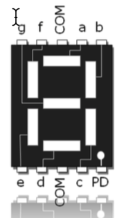
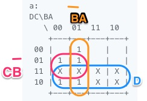
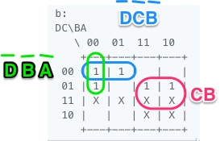
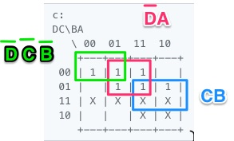
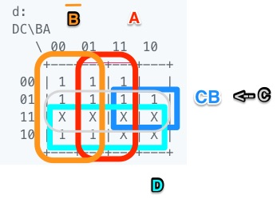
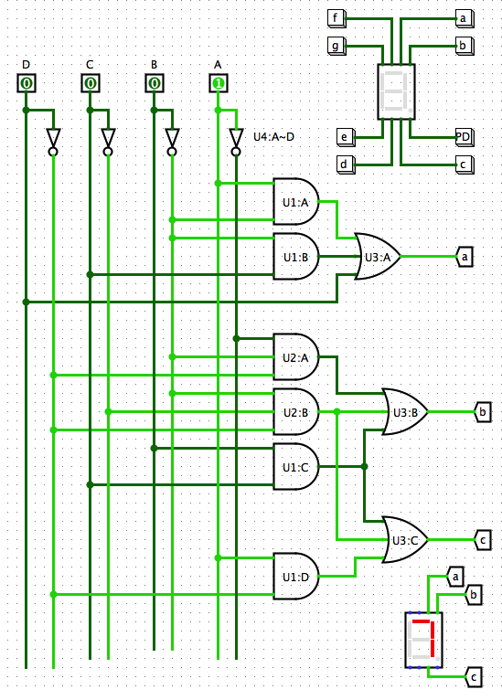

# Lab 6) Projeto #1) DEC Especial para Display 7-Segmentos

### Projeto No 7:

Display:


Tabela verdade do decodificador à ser sintetizado:

```
Ref | Entradas |  Caracter | Segmentos
    | DCBA     |           | abcdefg
0   | 0000     |    "d"    | _1111_1
1   | 0001     |    “a"    | 11111_1
2   | 0010     |    “ "    | _______
3   | 0011     |    "u"    | __111__
4   | 0100     |    "e"    | 11_1111
5   | 0101     |    “G"    | 1_1111_
6   | 0110     |    "d"    | _1111_1
7   | 0111     |    "d"    | _1111_1
8   | 1000     |    "E"    | 1__1111
9   | 1001     |    "E"    | 1__1111
10  | 1010     |     ?     | XXXXXXX 
11  | 1011     |     ?     | XXXXXXX
12  | 1100     |     ?     | XXXXXXX
13  | 1101     |     ?     | XXXXXXX
14  | 1110     |     ?     | XXXXXXX
15  | 1111     |     ?     | XXXXXXX
```

Mapas de Karnaugh:

```
a:
DC\BA
   \ 00  01  11  10
    +---+---+---+---+
 00 |   | 1 |   |   |
 01 | 1 | 1 |   |   |
 11 | X | X | X | X |
 10 | 1 | 1 | X | X |
    +---+---+---+---+
```



$a=D+C\bar{B}+\bar{B}A$.

```
b:
DC\BA
   \ 00  01  11  10
    +---+---+---+---+
 00 | 1 | 1 |   |   |
 01 | 1 |   | 1 | 1 |
 11 | X | X | X | X |
 10 |   |   | X | X |
    +---+---+---+---+
```



```
c:
DC\BA
   \ 00  01  11  10
    +---+---+---+---+
 00 | 1 | 1 | 1 |   |
 01 |   | 1 | 1 | 1 |
 11 | X | X | X | X |
 10 |   |   | X | X |
    +---+---+---+---+
```



```
d:
DC\BA
   \ 00  01  11  10
    +---+---+---+---+
 00 | 1 | 1 | 1 |   |
 01 | 1 | 1 | 1 | 1 |
 11 | X | X | X | X |
 10 | 1 | 1 | X | X |
    +---+---+---+---+
```

$d=\overline{\bar{D} \; \bar{C} \; B \; \bar{A}}$



Tentando uma otimização:

| a:                                    | b:                                    | c:                                    | d:                                    |
| ------------------------------------- | ------------------------------------- | ------------------------------------- | ------------------------------------- |
|  |  |  |  |

Obs.: Agrupar os diferentes mapas de Karnaugh numa mesma página, facilita visualizar termos comuns (agrupamentos comuns) entre segmentos do display.

Desenhando temporariamente o circuito [usando [LogiSim](http://www.cburch.com/logisim/pt/index.html): [projeto_no_7.circ](projeto_no_7.circ)]:



**Lista de material** (temporária):
U1: 74LS08 (4 x AND(2))
U2: 74LS11 (3 x AND(3))
U3: 74LS4075 (3 x OR(3))
U4: 74LS04 (6 x NOT)
etc...

Obs.: Você pode consultar o site da [Texas Instruments/Logic](https://www.ti.com/logic-circuit/gate/overview.html), ou [Wikipedia: List of 7400-series integrated circuits](https://en.wikipedia.org/wiki/List_of_7400-series_integrated_circuits), para descobrir os códigos das pastilhas.

---

Fernando Passold, 09.04.2021

<font size=1>Obs.: este material foi editado usando [Typora](https://typora.io) (editor compatível com [Markdown](https://github.com/adam-p/markdown-here/wiki/Markdown-Cheatsheet)) e foram usados softwares para captura de tela como o [Skitch](https://evernote.com/intl/pt-br/products/skitch) da Evernote (disponível para Mas, [Windows](https://skitch.br.uptodown.com/windows) e Linux </font>