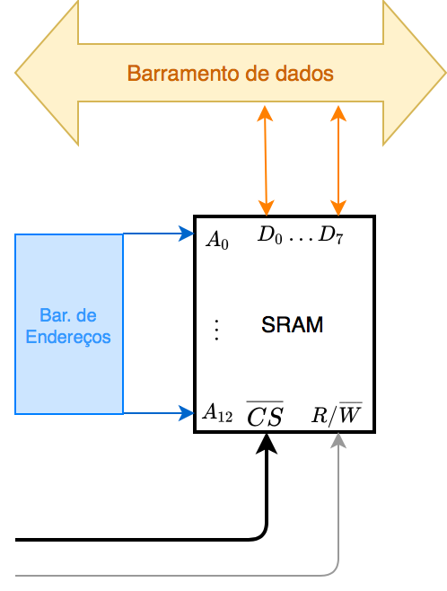

# Exemplo de Uso de DEC

Pasilhas MSI ou Funções Lógicas Básicas $\rightarrow$ “esboço”:


## DECodificadores

Este tipo de bloco serve para habiltar partes de um circuito eletrônico maior, depois que na sua entrada é fornecido o código binário correspondente à parte (circuito) que dever se ativado.

**Exemplo**: Num circuito de expanção de memória, podemos dividir um espaço de 64K posições em “pedaços” de 8K, isto é, compomos um banco de memória usando 8 pastilhas de 8K, perfazendo um espaço de endereçamento de 64K.


Note que uma pastilha de memória possui pinos para endereçamento (servem para indicar onde o dado deve ser alocado), um barramento de dados (os próprios bits de dados) e bits de controle: um pino para ativar (“acordar”) aquela pastilha, normalmente denominado “CS"=*Chip Select* (normalmente ativo baixo), e um pino para indicar se a pastilha de  memória está sendo usada naquele instante para guardar ou recuperar dados (leitura ou escrita), o que em inglês é normalmente denotado por $R/\overline{W}$ significando que nível lógico baixo apresentado neste pino indica operação de escrita (*Write*) e nível lógico alto apresentado neste pino denota operação de leitura (*Read*). Note que quem gera estes dados todos é o processador ou dispositivo que controla esta unidade de memória. 

Então no caso deste exemplo, para poder endereçar 8K posições ou seja: $8 \times 1024=8.192$ posições de memória, necessitaremos $n$-linhas de endereçamento. 

Podemos calcular o número de bits necessários simplesmente e mais facilmente, calculando o valor equivalente à 8.192 em hexadecimal e depois lembrando que cada algarismo hexadecimal exige 4-bits. Então teremos:

```
 8192  | 16
-8192  +------
    0    512  | 16
        -512  +-----
           0    32 | 16
               -32 +-----
                 0    2
```

Ou seja: $8192_{(10)}=2000_{(16)}=10|0000|0000|0000_{(2)}$. Isto significa que cada pastilha de memória trabalha com a posição de memória de $0$ (zero) até $(2000_{(16)}-1)=1FFF_{(16)}$. 

```
        11 11
Ender   32 1098 7654 3210  <-- linhas endereçamento
1FFFH = 01|1111|1111|1111| <-- última posição de memória para os primeiros 8K.
2000H = 10|0000|0000|0000|
```

Ou seja, cada pastilha de memória vai conter 13 pinos para endereçamento: $A_0$ até $A_{12}$.

Note que $2^{13}=8192$.

Podemos ainda supor que cada pastilha  associa 8 bits = 1 byte com cada dado, então, cada pastilha será capaz de acessar 8 KBytes de dados. Estes 8-bits normalmente são organizados na forma $D_0 \ldots D_7$.  Então a pinagem da nossa pastilha de memória ficaria algo como:



Para entender como o DEC consegue “dividir” o espaço de memória de 64K em 8 x 8K podemos montar um “mapa da memória”:

Notar que os 64K de memória exigem um total de $2^{16}=65536$ ($64 \times 1024=65536$), ou seja, 16 linhas de endereçamento, ou linhas de $A_0$ até $A_{15}$. Estas linhas estao presentes na saída do microprocessador.


Note que apenas os 3 bits mais signiticativos do barramento de endereços é que são conectadas às entradas do DEC:
$$
\begin{array}{rcl}
A_{13} & \rightarrow & A_0 \text{ (DEC)}\\
A_{14} & \rightarrow & A_1 \text{ (DEC)}\\
A_{15} & \rightarrow & A_2 \text{ (DEC)}
\end{array}
$$


