# Contador Síncrono Diferente [2019/2]
**Circuitos Digitais II/Lab. de Circuitos Digitais II**

Engenharia Elétrica / Universidade de Passo Fundo

## Objetivos
A ideia deste experimento é comprovar na prática o funcionamento de um circuito contador diferente cuja proposta foi iniciada na disciplina teórica de `Circuitos Digitais II`.

## Descrição do contador

A figura à seguir demostra os diferentes estados que este contador pode assumir:

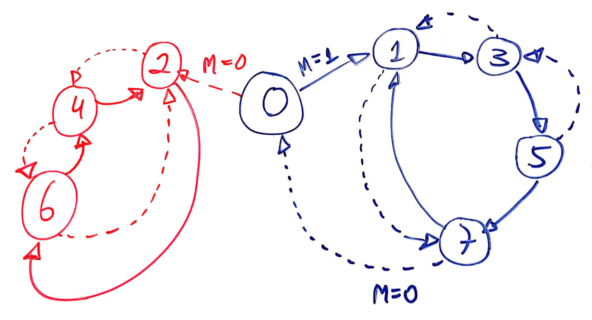 

Este contador inicia em 0 e conforme o nível lógico da entrada externa `MODE` (ou simplesmente `M`, ele modifica seu comportamento. 

Basicamente ele conta apenas números ímpares de maneira crescente ou decrescente (parte em azul ressaltada no diagrama de estados anterior; ou parte do diagrama de estados concentrado no lado direito) ou fica preso num ciclo de contagem crescente ou decrescente de números pares (parte em vermelho ressaltado no diagrama de estados anterior; parte do diagrama de estados concentrado no lado esquerdo). A entrada `M` permite definir o sentido da contagem.

Note pela figura do diagrama, que é possível forçar o contador sair da sequencia de contagem de números ímpares, se no momento em que o mesmo se encontrar no número 7, o usuário manter a entrada `MODE` em `M=0` (nível lógico baixo). Isto força o circuito à voltar para o nó 0 (ou contagem igual à 0) e caso a entrada externa `MODE` seja mantida em nível lógico baixo, o circuito assume uma sequencia de contagem crescente de números pares. Em resumo: se o contador atingiu o estado 7 e a entrada `MODE=0`, o circuito evolui para os próximos estados:

```
       M=0 (daqui para frente)
--> 7 -----> 0 --> 2 --> 4 --> 6 --+
                   ^               |
                   |               |
                   +---------------+
```

Naturalmente que outras sequencias de contagens podem ser obtidas, dentro das possibilidades do circuito resumidas pelo diagrama de estados apresentado na primeira figura.

## Sugestão de Montagem (_Interface de Saída_)

Este circuito possui 8 estados diferentes (de 0 à 7); portanto, serão necessários 3 flip-flops para possibilitar esta combinação de 8 estados (2^3=8). 

Poderíamos conectar um display de 7-segmentos às saídas $Q_i$ dos flip-flops, mas provavelmente seja mais interessante criar uma **interface visual** cuja configuração física coincida com a forma como conta este circuito ou são executadas as sequencias de estados. **Especificamente** sugere-se o uso de 8 leds ao invés de um display de 7-segmentos, dispondo fisicamente os 8 leds na forma indicada na próxima figura:

```
   +-- Led_1 --- Led_3 --- Led_5 --- Led_7 
   |
   | M=1
 Led_0
   | M=0
   | 
   +-- Led_2 --- Led_4 --- Led_6
```

A disposição física dos leds mostrada na figura anterior, facilita compreender e confirmar visualmente se o circuito projetado (e montado) atende ao diagrama de estados apresentado na primeira figura deste roteiro.

O único porém é que necessitaremos acrescentar um DEC de 3/8 conectado às saídas dos Flip_Flop necessários ao circuito para concretizar esta interface, ou seja, irá nos "custar" 1 CI "extra".

## Projeto do circuito

De forma a concretizar o projeto deste contador se faz necessário montar uma tabela de transição de estados para o circuito como um todo. Esta tabela considera a sequencia (diagrama) de estados previstos para este circuito além do flip-flip que será adotado para realização deste contador.

A princípio poderíamos usar FF tipo JK ou tipo D. A adoção de FF's do tipo JK implica a realização (posterior ao levantamento da tabela) de 2 entradas x 3 FF's = 6 Mapas de Karnaugh. Se optarmos por trabalhar com flip-flops tipo D, a quantidade de mapas de Karnaugh necessários baixa para apenas 3 (uma para cada flip-flop, já que o FF tipo D apresenta apenas 1 entrada para seu controle).

A próxima figura revisa o diagrama de estados e a tabela de transição para flip-flop tipo D. Será necessário para completar a tabela de transição de estados do circuito completo.

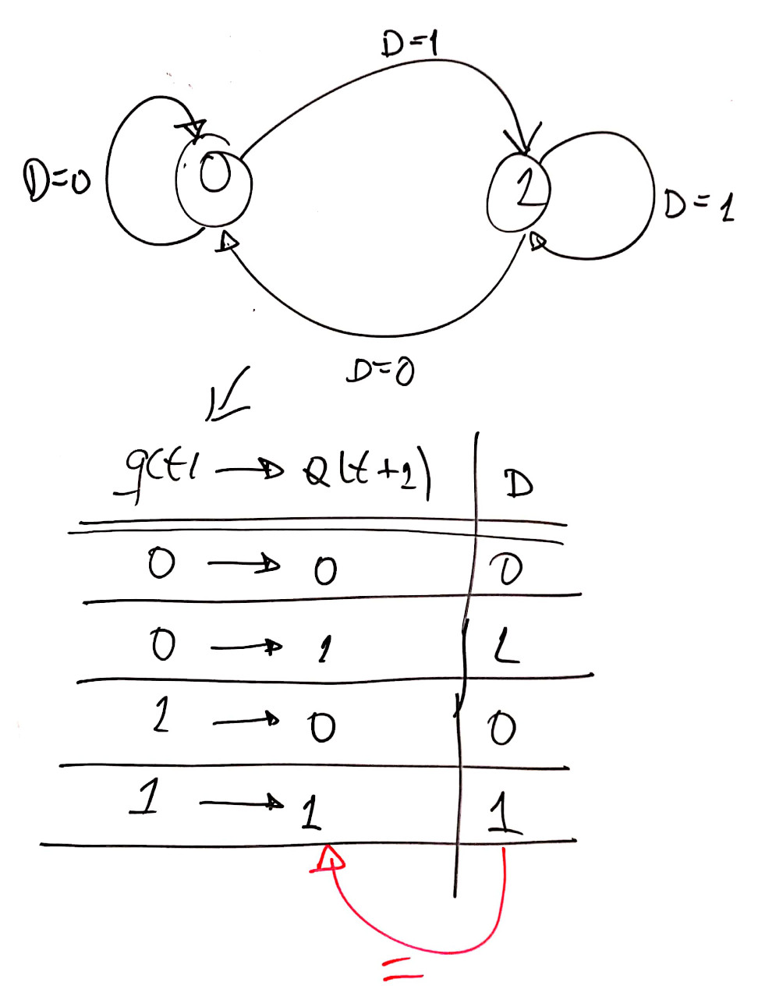

A próxima tabela relaciona os estados que o circuito deve assumir e a forma como os flip-flops tipo D deveriam ser "programados":

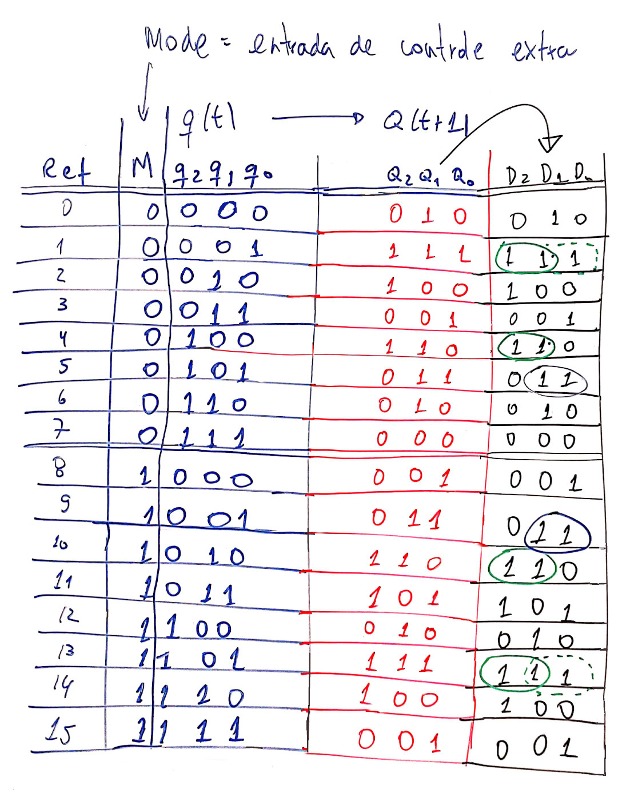

De posse da tabela de transição de estados completa do circuito é possível através de mapas de karnaugh estabelecer a lógica combinacional que deve estar presente nas entradas de controle D dos flip-flop selecionados, o que é mostrado nas próximas 2 figuras.

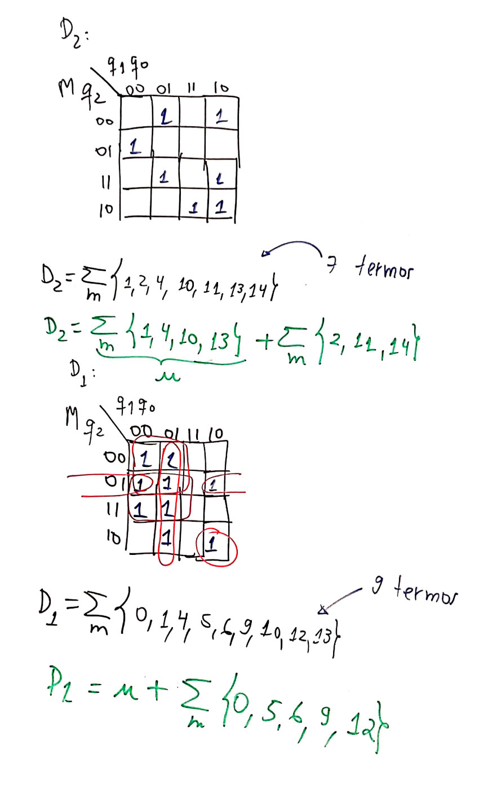

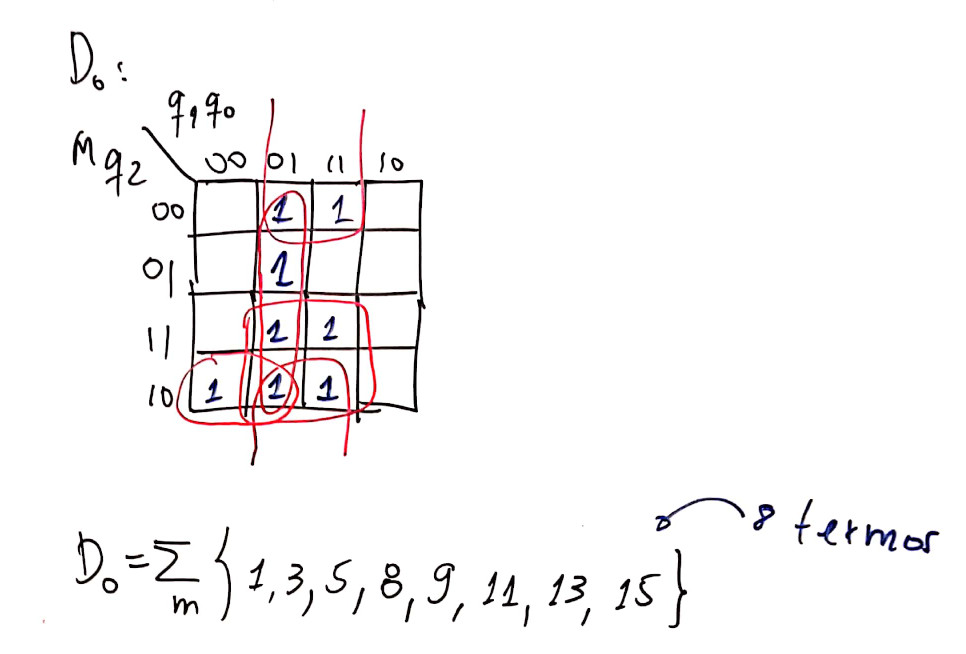

Notamos pelos agrupamentos ressaltados nos Mapas de Karnaugh que as simplificações que podem ser obtidas não são significativas. Se fará necessário empregar muitas portas AND's de 4 entradas (principalmente para controle do FF-1, entrada D1), umas poucas portas AND's de 3 entradas e muitas AND's de 2 entradas, além das portas OR. Notamos ainda (pelos mapas de Karnaugh) que não é possível compartilhar agrupamentos entre os mapas (e sua correspondente equação e circuito lógico para as entradas dos diferentes flip-flops D), o que significa que a lógica combinacional para controle das entradas D usando simples portas lógicas básicas implica um circuito significativamente volumoso, exigindo  muitas pastilhas diferentes.

Devemos lembrar que para sintetizar um circuito lógico combinacional, além de portas lógicas básicas, podemos usar:

- DEC, ou;
- MUX.


### Solução usando DEC

Se adotarmos o uso de DEC, apenas uma pastilha DEC será necessária para sintetizar as 3 funções combinacionais lógicas (D3, D2 e D1). Será necessário um DEC de 4 para 16 linhas ou a pastilha 74LS/F154. 

A próxima figura mostra parte de DEC de 4 para 16 linhas (CI 74LS154 -- um CI de 24 pinos!), lembrando apenas que suas saídas normalmente são ativo baixo -- ver próxima figura:

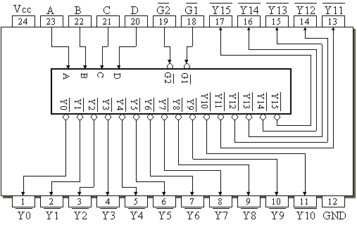

Observando algumas equações obtidas para os FF's D, notamos que necessitaremos ainda de portas NAND de largura de entradas, variável. Uma opção seria "padronizar" o uso de um mesmo tipo de porta NAND ou AND e neste caso, estamos optando por usar apenas portas NAND ou AND de 8 entradas. Resta confirmar se no Almoxarifado do curso estão disponíveis estas portas, antes de avançar nesta opção de solução.

Uma verificação de CIs necessários e presentes no Almoxarifado do curso nos leva aos seguintes fatos:

| Portas | Portas |
| :---: | :---: |
| 4 x AND(2) = 7408 (40+) | 4 x NAND(2) = 7400 (45) |
| 3 x AND(3) = 7411 (40)  | 3 x NAND(3) = 7410 (66) |
| 2 x AND(4) = 7421 (40)  | 2 x NAND(4) = 7420 (26) |
| 1 x AND(8) = ??         | 1 x NAND(8) = 7430 (34) |
Obs.: O valor entre parêntesis indica a quantidade disponível no Almoxarifado em 18/09/2019.

**Detalhe** a equação para o FF-2 rende inicialmente 9 mini termos:

$$
D_2= \sum_m \left\{ 0, 1, 4, 5, 6, 9, 10, 12, 13\right\} \qquad \text{(9 termos)}
$$
isso, se usado lógica "direta". Se for usado lógica inversa, podemos reduzir a  quantidade de entradas necessárias na porta de saída do DEC para:
$$D_2=\overline{\sum_m \left\{2,3,7,8,11,14,15 \right\}} \qquad \text{(7 termos)}$$
ou:

$$
D_2=\overline{ O_2 + O_3 + O_7 + O_8 + O_{11} + O_{14} + O_{15}}
$$

considerando que vamos usar uma porta AND ou NAND de 8 entradas, *D2* fica:
$$
D_2=\overline{ O_2 + O_3 + O_7 + O_8 + O_{11} + O_{14} + O_{15} + 0}
$$

$$
D_2=\overline{O_2} \cdot \overline{O_3} \cdot \overline{O_7} \cdot \overline{O_8} \cdot \overline{O_{11}} \cdot \overline{O_{14}} \cdot \overline{O_{15}} \cdot \overline{0}
$$

$$
D_2=\overline{O_2} \cdot \overline{O_3} \cdot \overline{O_7} \cdot \overline{O_8} \cdot \overline{O_{11}} \cdot \overline{O_{14}} \cdot \overline{O_{15}} \cdot 1
$$

A princípio este resultado nos leva ao uso de uma porta AND(8) que não existe comercialmente na versão TTL, o que significa que será necessário o uso do CI 7430 (1 x NAND(8)) + 1 CI 7404) (6 x NOT).

Uma rápida aferição nos permite concluir que para realizar o circuito deste contador usando DEC serão necessárias as seguintes pastilhas:

| Lista por tipo de porta | Lista por Bancada | Total |
| :---  | :--- | ---: |
| 3 x FF's tipo D | 2 x CIs 74LS74 | 16 x CIs 74LS74 |
| 1 x DEC 4/10    | 1 x CI 74LS154 | 8 x CIs 74LS154 |
| 3 x NAND(8)   | 3 x CIs 74LS30 | 24 x CIs 74LS30 |
| 1 x OR(2)     | 1 x CI 74LS04  | 8 x CIs 74LS04 |
| 1 x DEC 3/8   | 1 x CI 74LS138 | 8 x CIs 74LS138 |
|    | **8 pastilhas** | 64 pastilhas |
|    | por bancada | no total |


### Solução usando MUXes
O problema de usar MUX é que será necessário um MUX de 16 linhas de entrada para cada um dos FF's (CI 74LS150; de 24 pinos!):

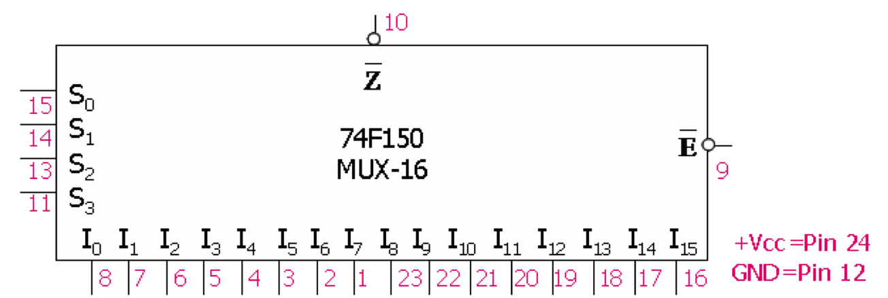

Notar que o CI 74LS150 contempla apenas uma única saída em ATIVO BAIXO.

Podemos simplificar o uso do MUX de 16 canais para outro de 8 canais de entrada (CI 74LS151 -- que é menor: 16 pinos):

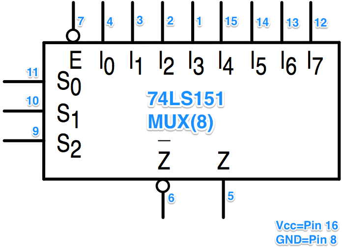

A opção pela adoção de MUXes leva ao seguinte consumo de pastilhas:

| Lista por tipo de porta | Lista por Bancada | Total |
| :---  | :--- | ---: |
| 3 x FF's tipo D | 2 x CIs 74LS74 | 16 x CIs 74LS74 |
| 3 x MUX(8)      | 3 x CI 74LS151 | 24 x CIs 74LS151 |
| 1 x DEC 3/8   | 1 x CI 74LS138 | 8 x CIs 74LS138 |
|    | **6 pastilhas** | 48 pastilhas |
|    | por bancada | no total |

### Solução final

A opção pelo uso de MUXes (de 8 canais de entrada), apesar de exigir 3 pastilhas por bancada, ainda leva a um circuito consideravelmente menor (6 pastilhas contra 8 no total).

Resta só adaptar os MUXes de 8 canais para uso no lugar dos MUXes de 16 canais. Levantando a tabela verdade de "programação" dos MUXes teremos:

Lógica combinacional para D2:

```
                 |    Entradas   | Saída |
Ref'   | Ref     |   M  q2 q1 q0 |  FF-2 | Conexões 
MUX(8) | MUX(16) | [S3] S2 S1 S0 |  D2   | no MUX(8) | Pino
------------------------------------------------------------------
  0    |   0     |   0   0 0 0   |       |     0     | X0 (Pin 4)
  1    |   1     |   0   0 0 1   |   1   |    /M     | X1 (Pin 3)
  2    |   2     |   0   0 1 0   |   1   |     1     | X2 (Pin 2)
  3    |   3     |   0   0 1 1   |       |     M     | X3 (Pin 1)
  4    |   4     |   0   1 0 0   |   1   |    /M     | X4 (Pin 15)
  5    |   5     |   0   1 0 1   |       |     M     | X5 (Pin 14)
  6    |   6     |   0   1 1 0   |       |     M     | X6 (Pin 13)
  7    |   7     |   0   1 1 1   |       |     0     | X7 (Pin 12) 
------------------------------------------------------------------
  0    |   8     |   1   0 0 0   |       |
  1    |   9     |   1   0 0 1   |       |
  2    |  10     |   1   0 1 0   |   1   |
  3    |  11     |   1   0 1 1   |   1   |
  4    |  12     |   1   1 0 0   |       |
  5    |  13     |   1   1 0 1   |   1   |
  6    |  14     |   1   1 1 0   |   1   |
  7    |  15     |   1   1 1 1   |       |
------------------------------------------------------------------
```

Lógica combinacional para D1:

```
                 |    Entradas   | Saída |
Ref'   | Ref     |   M  q2 q1 q0 |  FF-1 | Conexões 
MUX(8) | MUX(16) | [S3] S2 S1 S0 |  D1   | no MUX(8)
------------------------------------------------------------------
 0     |   0     |   0   0 0 0   |   1   |    /M     | X0 (Pin 4)
 1     |   1     |   0   0 0 1   |   1   |     1     | X1 (Pin 3)
 2     |   2     |   0   0 1 0   |       |     M     | X2 (Pin 2)
 3     |   3     |   0   0 1 1   |       |     0     | X3 (Pin 1)
 4     |   4     |   0   1 0 0   |   1   |     1     | X4 (Pin 15)
 5     |   5     |   0   1 0 1   |   1   |     1     | X5 (Pin 14)
 6     |   6     |   0   1 1 0   |   1   |    /M     | X6 (Pin 13)
 7     |   7     |   0   1 1 1   |       |     0     | X7 (Pin 12) 
------------------------------------------------------------------
 0     |   8     |   1   0 0 0   |       |
 1     |   9     |   1   0 0 1   |   1   |
 2     |  10     |   1   0 1 0   |   1   |
 3     |  11     |   1   0 1 1   |       |
 4     |  12     |   1   1 0 0   |   1   |
 5     |  13     |   1   1 0 1   |   1   |
 6     |  14     |   1   1 1 0   |       |
 7     |  15     |   1   1 1 1   |       |
------------------------------------------------------------------
```

Lógica combinacional para D0:

```
                 |    Entradas   | Saída |
Ref'   | Ref     |   M  q2 q1 q0 |  FF-0 | Conexões 
MUX(8) | MUX(16) | [S3] S2 S1 S0 |  D0   | no MUX(8)
------------------------------------------------------------------
 0     |   0     |   0   0 0 0   |       |     M     | X0 (Pin 4)
 1     |   1     |   0   0 0 1   |   1   |     1     | X1 (Pin 3)
 2     |   2     |   0   0 1 0   |       |     0     | X2 (Pin 2)
 3     |   3     |   0   0 1 1   |   1   |     1     | X3 (Pin 1)
 4     |   4     |   0   1 0 0   |       |     0     | X4 (Pin 15)
 5     |   5     |   0   1 0 1   |   1   |     1     | X5 (Pin 14)
 6     |   6     |   0   1 1 0   |       |     0     | X6 (Pin 13)
 7     |   7     |   0   1 1 1   |       |     M     | X7 (Pin 12) 
------------------------------------------------------------------
 0     |   8     |   1   0 0 0   |   1   |
 1     |   9     |   1   0 0 1   |   1   |
 2     |  10     |   1   0 1 0   |       |
 3     |  11     |   1   0 1 1   |   1   |
 4     |  12     |   1   1 0 0   |       |
 5     |  13     |   1   1 0 1   |   1   |
 6     |  14     |   1   1 1 0   |       |
 7     |  15     |   1   1 1 1   |   1   |
------------------------------------------------------------------
```

### Reduzindo ainda mais

E ao invés de usar 3 x FF's tipo D integrados em 2 pastilhas do tipo 74LS74, o melhor é adaptar um Registrador de Deslocamente de Entrada Paralela e Saída Paralela para uso neste contador.

O CI 74LS175 possui 4 x FF’s-D encapsulados no seu interior, seus FF’s já se encontram com seus sinais internos de Clock interligados num único ponto comum (Clock ativado por borda de subida) e ainda uma entrada assíncrona de Master Reset (pino $\overline{\text{MR}}$, ativo baixo). A próxima figura mostra sua pinagem, e a seguinte seu diagrama lógico interno.

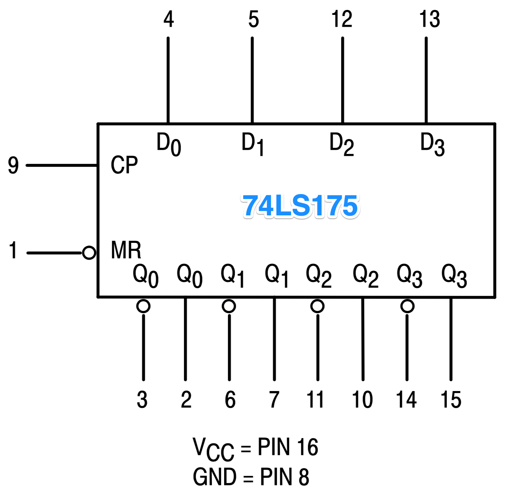

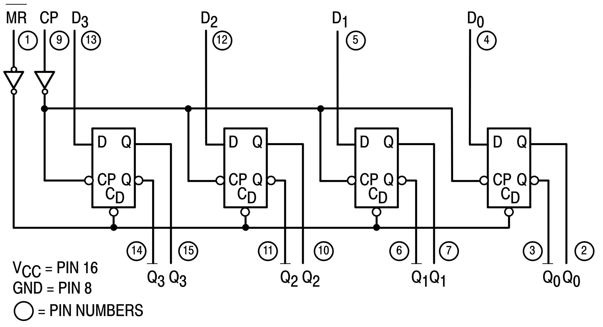


### Circuito final

A próxima figura mostra o diagrama lógico final do contador completo:

**Primeira parte:** bloco dos Flip-Flops (ou Registrador de Deslocamento) + DEC 3/8 (interface de saída: 8 leds):

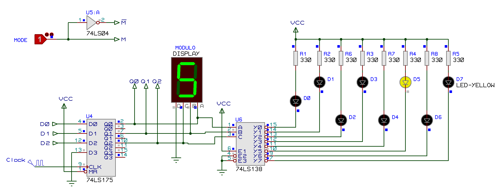

**Segunda parte:** bloco da lógica combinacional que traz "programado" a sequencia de estados que deve ser executada:

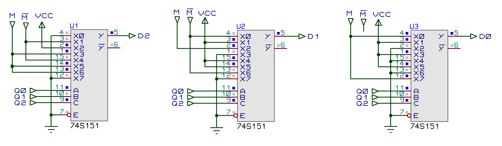

Pinos de Alimentação:

| \_  | U1, U2, U3 | U4 | U5 | U6 |
| :---: | :---:   | :---:      | :---:     | :---:  |
| Pino  | 74LS151 | CI 74LS175 | CI 74LS04 | CI 74LS138 |
| Vcc   | Pin 16  | Pin 16     | Pin 14    | Pin 16 |
| Gnd   | Pin 8   | Pin 8      | Pin 7     | Pin 8  |

Pinagem do Led:

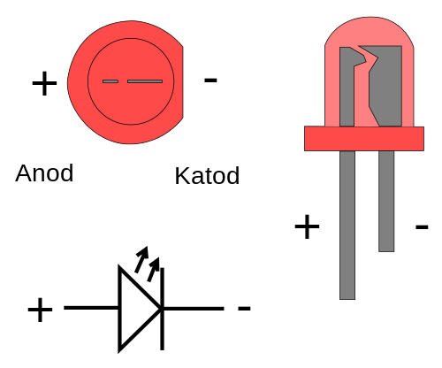


### Lista de Componentes:

- U1, U2, U3 = 3 x CI 74LS151 (MUX de 8 canais);
- U4 = 1 x CI 74LS75 (Reg. Desloc. EP/SP);
- U5 = 1 x CI 74LS04 (6 x NOTs);
- U6 = 2 x 74LS138 (DEC 3/8);
- D0, D1, D2, D3, D4, D5, D6, D7 = 8 x leds mini (alto contraste);
- R1, R2, R3, R4, R5, R6, R7, R8 = 8 x Resistores de 330$\Omega$;
- Gerados de sinais (onda quadrada);
- Fonte de Alimentação (TTL).

### Circuito completo

Arquivo Proteus 7.8: [contador_sincrono_diferente_2019_2_74LS175.DSN](contador_sincrono_diferente_2019_2_74LS175.DSN).

*Fim*.

---
#### Observações finais quanto a edição deste arquivo

Este material foi confeccionado em editor texto compatível com **`MarkDown`**. Neste formato (ou "linguagem"), figuras e equações podem ser exportadas para um arquivo final formato `.html` ou `.pdf` se no arquivo `.md` (arquivo texto compatível com Markdown) forem incorporados comandos como:


```

```

que gera algo do tipo:


Pode-se incluir **figuras** nos formatos: `.jpg`, `.png` e até `.gif` (animados).

As figuras podem eventualmente ser "escalonadas":

 - Antes a inclusão de figuras era feita na forma:

	```

```

 - a idéia é substituir esta linha por:

	```

	```

	- ou (mais explicitamente):

		```

```

	mas normalemten apenas o atributo `width` já permite escalonar a figura de forma conveniente.
Note que o atributo `alt` é opcional (não necessário).


E **equações matemáticas** são incluída usando formato `LaTeX`. Pr exemplo:


```
$$ \zeta = \dfrac{ -\log(OS/100) }{\sqrt{pi^2 + \log(OS/100)^2} }$$
```
gera:
$$ \zeta = \dfrac{ -\log(OS/100) }{\sqrt{pi^2 + \log(OS/100)^2} }$$

No caso deste documenti, o arquivo texto `contador_sync_diferente_2019_2.md` pode ser editado em qualquer editor de textos comum como o `Notepad` (no Windows) ou `TextEditor` (no Mac) ou `gedit` (num sistema Linux). Sugere-se o uso de editores de texto mais poderosos como o [Sublime Text](https://www.sublimetext.com) (multiplataforma) ou adotar diretamente algum editor de arquivos texto compatível com `Markdown` [ [O que é Markdown](https://www.markdownguide.org/getting-started), [Página Wikipedia sobre Markdown](https://en.wikipedia.org/wiki/Markdown)], como por exemplo o editor [Haroopad](http://pad.haroopress.com) (free e multiplataforma) usado para editar/interpretar arquivos texto compatíveis com Markdown. Este editor além de interpretar comandos Markdowns, interpreta equações incorporadas no arquivo texto (`.md`) usando formato **LaTeX**. Veja exemplos nas próximas figuras (se editor além de compatível com Markdown, estiver preparado para lidar com `MathJax` (rendering support library):

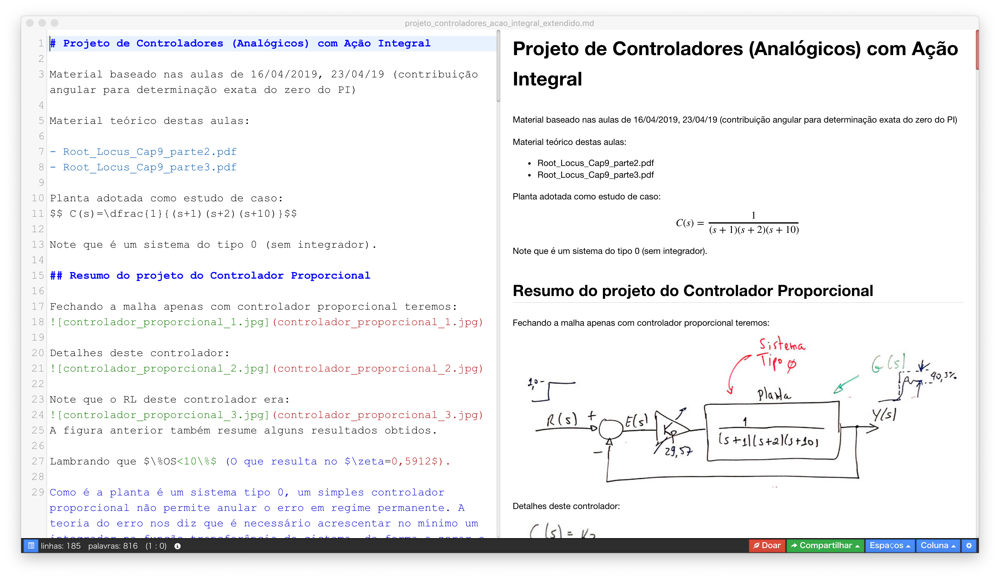

### Mais Referências sobre Markdown

- [Markdown Cheat Sheet](https://www.markdownguide.org/cheat-sheet)
- [Markdown Cheat Sheet (github)](https://github.com/adam-p/markdown-here/wiki/Markdown-Cheatsheet)
- [Markdown Getting Started](https://www.markdownguide.org/getting-started)
- [Dilinger: editor web online de Markdown](https://dillinger.io)
- [Writing Mathematic Fomulars in Markdown](http://csrgxtu.github.io/2015/03/20/Writing-Mathematic-Fomulars-in-Markdown/)
- [Editor online de equações no formato LaTeX: CodeCogs](https://www.codecogs.com/eqnedit.php)
- [Editor online de equações no formato LaTeX: LaTeX4technics](https://www.latex4technics.com)
- [Introdução à expressões matemáticas formato LaTeX do Overleaf](https://www.overleaf.com/learn/latex/Mathematical_expressions)
- [Overleaf: Editor online para documentos formato LaTeX](https://www.overleaf.com)

---
(c) Fernando Passold, 25/09/2019.