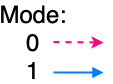

# Projeto de Contador Síncrono 2020.1

Realize o projeto para um contador síncrono capaz de executar a seguinte sequência de entados:

Onde:

Dado:

*Obs.: Tente realizar um projeto o mais prático possível*

---

__Solução:__

Entendendo o problema:

* Quando Mode=0:
  
  
* Quando Mode=1:
  
  
__Passos:__

1. Montar tabela de transição do circuito completo
2. Levantas as equações para comando de cada um dos FF's do circuito (Mapas de Karnaugh ou uso de MUX ou de DEC)
3. Desenhar o circuito
4. Simular

__1) Tabela de transição do circuito completo:__

|        |      | Estado Anterior | Próximo Estado |    |    |    |
|:------:|:----:|:---------------:|:--------------:|:--:|:--:|:--:|
| Estado | Mode |      q2q1q0     |     Q2Q1Q0     | d2 | d1 | d0 |
|    0   |   0  |      0 0 0      |      0 0 1     |    |    |    |
|    1   |   0  |      0 0 1      |                |    |    |    |
|    2   |   0  |      0 1 0      |                |    |    |    |
|    3   |   0  |      0 1 1      |                |    |    |    |
|    4   |   0  |      1 0 0      |                |    |    |    |
|    5   |   0  |      1 0 1      |                |    |    |    |
|    6   |   0  |      1 1 0      |                |    |    |    |
|    7   |   0  |      1 1 1      |                |    |    |    |
|    0   |   1  |      0 0 0      |                |    |    |    |
|    1   |   1  |      0 0 1      |                |    |    |    |
|    2   |   1  |      0 1 0      |                |    |    |    |
|    3   |   1  |      0 1 1      |                |    |    |    |
|    4   |   1  |      1 0 0      |                |    |    |    |
|    5   |   1  |      1 0 1      |                |    |    |    |
|    6   |   1  |      1 1 0      |                |    |    |    |
|    7   |   1  |      1 1 1      |                |    |    |    |

*Dica: usado o [Tables Generator](https://www.tablesgenerator.com/markdown_tables) para criar a tabela anterior.*

__2) Levantando as equações para cada FF:__

$$
d_2=f(Mode, q_2, q_1, q_0)
$$

$$
d_1=f(Mode, q_2, q_1, q_0)
$$

$$
d_0=f(Mode, q_2, q_1, q_0)
$$

__3) Implementação do circuito:__

Parece ser mais prático usar uma única pastilha contendo pelo menos $3 \times FF's-D$.

Opções:

* Usar o CI 74LS175 (Quad FF type D):

  
  
  

* Uso de MUX de 16 canais de entradas:

  
    
* ou MUX de 8 canais:

  
  
Solução usando...

__Diagrama Elétrico Final__

__Simulação__

---

Prof. Fernando Passold, 17/05/2020  