# Projeto Contador Síncrono 2024/1

Suponha que queiramos construir um contador síncrono capaz de executar a seguinte sequência de contagem:

<!--[seq_estados_contador_2024_1](seq_estados_contador_2024_1.png)-->

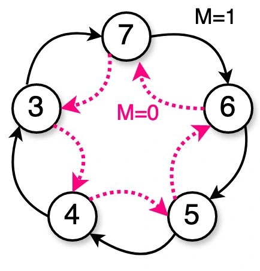

Obs.: A variável $M$ serve para ajustar o sentido da contagem. Funcionaria como a entrada $\overline{U}/D$ de um CI 74LS190.

**Projeto** ?

Notamos que o maior valor assumido nesta contagem é $7_{(10)}=0111_{(2)}$ e o menor valor é $3_{(10)}=0011_{(2)}$, o que significa que $3 \times$ FF's bastam para resolver este circuito. Resta escolher que tipo de FF adotar. Se usarmos FF´s-JK será necessário deduzir $3 \times 2 = 6$ equações (circuitos). Se optarmos por FF´s-D, teremos que deduzir apenas 1 circuito (equação) por FF.

Seque tabela de sequência de contagem deste contador:

```
Ref | m q2 q1 q0 | Q2 Q1 Q0 | d2 d1 d0 | Obs: q(t) --> Q(t+1)
----+------------+----------+----------+---------------------
 0  | 0  0  0  0 |  X  X  X |  X  X  X | 0 --> X
 1  | 0  0  0  1 |  X  X  X |  X  X  X | 1 --> X
 2  | 0  0  1  0 |  X  X  X |  X  X  X | 2 --> X
----+------------+----------+----------+---------------------
 3  | 0  0  1  1 |  1  0  0 |  1  0  0 | 3 --> 4
 4  | 0  1  0  0 |  1  0  1 |  1  0  1 | 4 --> 5
 5  | 0  1  0  1 |  1  1  0 |  1  1  0 | 5 --> 6
 6  | 0  1  1  0 |  1  1  1 |  1  1  1 | 6 --> 7
 7  | 0  1  1  1 |  0  1  1 |  0  1  1 | 7 --> 3
----+------------+----------+----------+---------------------
 8  | 1  0  0  0 |  X  X  X |  X  X  X | 0 --> X
 9  | 1  0  0  1 |  X  X  X |  X  X  X | 1 --> X
10  | 1  0  1  0 |  X  X  X |  X  X  X | 2 --> X
----+------------+----------+----------+---------------------
11  | 1  0  1  1 |  1  1  1 |  1  1  1 | 3 --> 7
12  | 1  1  0  0 |  0  1  1 |  0  1  1 | 4 --> 3
13  | 1  1  0  1 |  1  0  0 |  1  0  0 | 5 --> 4
14  | 1  1  1  0 |  1  0  1 |  1  0  1 | 6 --> 5
15  | 1  1  1  1 |  1  1  0 |  1  1  0 | 7 --> 6
```

Lembrando que a tabela de transição do FF-D é:

```
q(t) --> Q(t+1) | D
----------------+---
  0  --->   0   | 0
  0  --->   1   | 1
  1  --->   0   | 0
  1  --->   1   | 1
```

Seguem os Mapas de karnaught e equações para as entradas dos FF´s adotados neste projeto:


Isto implica usar: 1 $\times$ OR(4) + 3 $\times$ AND(2) + 3 $\times$ NOT (a portas NOT geram: $\overline{q_2}$, $\overline{q_1}$ e $\overline{q_0}$).


Implica usar: $+$ 1 $\times$ OR(5) + 5 $\times$ AND(3) + 1.


Implica usar: $+$ 1 $\times$ OR(3) + 1 $\times$ AND(2) + 1 $\times$ AND(3).

Total:

* 3 $\times$ FF's D $\Rightarrow$ 2 $\times$ 74LS74;
* 1 $\times$ OR(5) + 1 $\times$ OR(4) + 1 $\times$ OR(3) $\Rightarrow$ 2 $\times$ 74LS27 (3 $\times$ NOR(3));
* 4 $\times$ AND(2) $\Rightarrow$ 1 $\times$ 74LS08;
* 6 $\times$ AND(3) $\Rightarrow$ 2 $\times$ 74LS11 (3 x AND(3));
* 5 $\times$ NOT $\Rightarrow$ 1 $\times$ 74LS04;

Um total de 8 pastilhas TTL. 

Próximo passo: desenhar o circuito lógico (diagrama elétrico).

**Mas**... poderíamos ter usado o Logisim para realizar esta parte do projeto (a eletrônica digital combinacional necessária para comandar os FF's): arquivo:  [projeto_2024_1.circ](projeto_2024_1.circ) . Neste caso, esta ferramenta nos sugere:

| D2: | D1: | D0: |
|:---:|:---:|:---:|
| 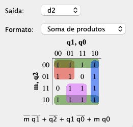 | 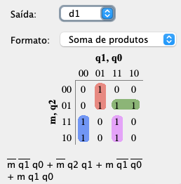 | 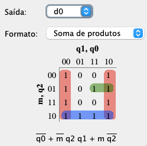 |

Percebemos que a solução sugerida para $d_1$ está melhor (implica: 1 $\times$ OR(4) + 4 $\times$ AND(3)).

O Logisim termina sugerindo o seguinte circuito para a eletrônica combinacional de comando dos FF's:

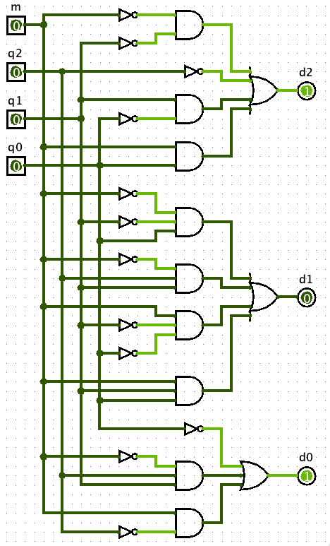

Obs.: Este circuito lógico, principalmente a eletrônica combinacional associada com a entrada $d_1$ (FF-1), exige  um circuito algo grande. 

**Detalhes**

- O que acontece se o circuito anterior for inicializado no estado inicial 0, 1 e 2 ?

Isto é:

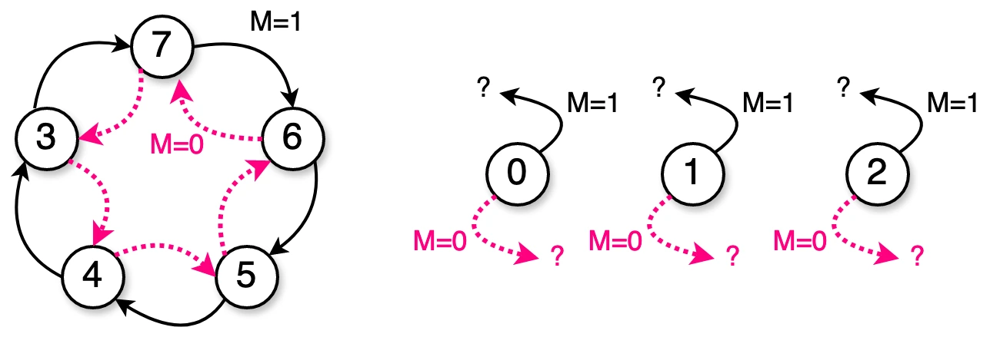

**Resposta**:

Considerando a lógica de controle dos FF's o circuito sugerido pelo Logisim, notamos que:

* Caso do circuito partir em 0:
  * Caso $M=0$: 
    * Analisando o Mapa K referente à D2, percebemos que este estado corresponde à célula $M q_2 q_1 q_0=0000_{(2)}$ e que a mesma foi incorporada num agrupamento, o que siginica que $d_2=1$. 
    * Analisando o Mapa K referente à D1, percebemos que este estado corresponde à célula $M q_2 q_1 q_0=0000_{(2)}$ e que a mesma não foi incorporada num agrupamento, o que siginica que $d_1=0$. 
    * Analisando o Mapa K referente à D0, percebemos que este estado corresponde à célula $M q_2 q_1 q_0=0000_{(2)}$ e que a mesma foi incorporada num agrupamento, o que siginica que $d_0=1$.
    * Resumindo, o próximo estado seria então, $Q(t+1)=101_{(2)}=5_{(10)}$. 
  * Caso $M=1$:
    * Analisando o Mapa K referente à D2, percebemos que este estado corresponde à célula $M q_2 q_1 q_0=1000_{(2)}$ e que a mesma foi incorporada num agrupamento, o que siginica que $d_2=1$. 
    * Analisando o Mapa K referente à D1, percebemos que este estado corresponde à célula $M q_2 q_1 q_0=1000_{(2)}$ e que a mesma foi incorporada num agrupamento, o que siginica que $d_1=1$. 
    * Analisando o Mapa K referente à D0, percebemos que este estado corresponde à célula $M q_2 q_1 q_0=1000_{(2)}$ e que a mesma foi incorporada num agrupamento, o que siginica que $d_0=1$. 
    * Resumindo, o próximo estado seria então, $Q(t+1)=111_{(2)}=7_{(10)}$. 
* Caso do circuito partir em 1:
  * Caso $M=0$:
    * Analisando o Mapa K referente à D2, percebemos que este estado corresponde à célula $M q_2 q_1 q_0=0001_{(2)}$ e que a mesma foi incorporada num agrupamento, o que siginica que $d_2=1$. 
    * Analisando o Mapa K referente à D1, percebemos que este estado corresponde à célula $M q_2 q_1 q_0=0001_{(2)}$ e que a mesma foi incorporada num agrupamento, o que siginica que $d_1=1$. 
    * Analisando o Mapa K referente à D2, percebemos que este estado corresponde à célula $M q_2 q_1 q_0=0001_{(2)}$ e que a mesma não foi incorporada num agrupamento, o que siginica que $d_0=0$. 
    * Resumindo, o próximo estado seria então, $Q(t+1)=110_{(2)}=6_{(10)}$. 
  * Caso $M=1$:
    * Analisando o Mapa K referente à D2, percebemos que este estado corresponde à célula $M q_2 q_1 q_0=1001_{(2)}$ e que a mesma foi incorporada num agrupamento, o que siginica que $d_2=1$. 
    * Analisando o Mapa K referente à D1, percebemos que este estado corresponde à célula $M q_2 q_1 q_0=1001_{(2)}$ e que a mesma não foi incorporada num agrupamento, o que siginica que $d_1=0$. 
    * Analisando o Mapa K referente à D0, percebemos que este estado corresponde à célula $M q_2 q_1 q_0=1001_{(2)}$ e que a mesma foi incorporada num agrupamento, o que siginica que $d_0=1$. 
    * Resumindo, o próximo estado seria então, $Q(t+1)=101_{(2)}=5_{(10)}$. 
* Caso do circuito partir em 2:
  * Caso $M=0$:
    * Analisando o Mapa K referente à D2, percebemos que este estado corresponde à célula $M q_2 q_1 q_0=0010_{(2)}$ e que a mesma foi incorporada num agrupamento, o que siginica que $d_2=1$. 
    * Analisando o Mapa K referente à D1, percebemos que este estado corresponde à célula $M q_2 q_1 q_0=0010_{(2)}$ e que a mesma não foi incorporada num agrupamento, o que siginica que $d_1=0$. 
    * Analisando o Mapa K referente à D0, percebemos que este estado corresponde à célula $M q_2 q_1 q_0=0010_{(2)}$ e que a mesma foi incorporada num agrupamento, o que siginica que $d_0=1$. 
    * Resumindo, o próximo estado seria então, $Q(t+1)=101_{(2)}=5_{(10)}$. 
  * Caso $M$=1.
    * Analisando o Mapa K referente à D2, percebemos que este estado corresponde à célula $M q_2 q_1 q_0=1010_{(2)}$ e que a mesma foi incorporada num agrupamento, o que siginica que $d_2=1$. 
    * Analisando o Mapa K referente à D1, percebemos que este estado corresponde à célula $M q_2 q_1 q_0=1010_{(2)}$ e que a mesma não foi incorporada num agrupamento, o que siginica que $d_1=$0. 
    * Analisando o Mapa K referente à D0, percebemos que este estado corresponde à célula $M q_2 q_1 q_0=1010_{(2)}$ e que a mesma foi incorporada num agrupamento, o que siginica que $d_0=1$. 
    * Resumindo, o próximo estado seria então, $Q(t+1)=101_{(2)}=5_{(10)}$. 

Resumindo, podemos compor o seguinte diagrama de estados final para este circuito:


**Outras soluções de circuito para lógica de controle**:

Lembramos que ==podemos sinterizar uma função lógica combinacional usando MUX ou DEC==. Se optarmos por MUX, seria necessário um MUX com 4 entradas de seleção (correspondendo as variáveis: $m$, $q_2$, $q_1$ e $q_0$), de 16 canais (uma pastilha algo grande, com 24 pinos), ou até podemos adaptar a solução para um MUX de 8 canais e usar a varíavel mais significativa, $m$ para completar a adaptação para circuito combinacional usando um MUX menor (de 8 canais; 16 pinos). 

Temos então que deduzir a "programação" de cada um dos MUXes de 8 canais, um para cada circuito combinacional ncessário aqui (um para a entrada $d_0$ do FF-0, outro para entrada $d_1$ do FF-1 e o terceiro MUX associado com a entrada $d_2$ do FF-2).

Faremos isto na próxima aula (10/05/2024) e tentaremos simular este circuito no Proteus.

* [Video desta parte da aula](https://drive.google.com/open?id=16DWKSjd4tCuvtjTelFM7E0ixNLd6dgPe): projeto deste contador síncrono.

* [Vídeo da primeira parte desta aula](https://drive.google.com/open?id=1BFUu8cKfn5umr2c0I52szMQLBXTpadJI): teoria associada com projeto de contadores (ou máquinas) síncronas.

Obs.: para acessar estes videos eventualmente será necessário você autenticar sua conta @upf.br.

**Continuação** (aula de 10/05/2024)...

Resolvendo o circuito usando

* CI 74LS175 (4 $\times$ FF's D);
* 3 $\times$ MUXES de 8 canais (74LS151) + 1 porta NOT (74LS04) (associada com a variável $M$):

Note que neste caso, todas as transições de estado são "programadas", incluindo as "don´t care", ou seja, antes, tínhamos o projeto assim:

| Transições Definidas | Transições "don´t care" |
|:---:|:---:|
|  | 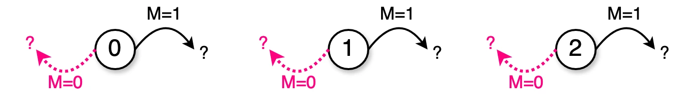 |


Agora necessitamos definir o que acontece se o circuito parte destes estados, porque não podemos programar as entras $I_0$, $I_1$ e $I_2$ do MUX com um nível lóligo indeterminado

Neste caso, foi optado (deliberadamente) por definir como o circuito deve continuar à partir dos estados anteriores, resultando em:

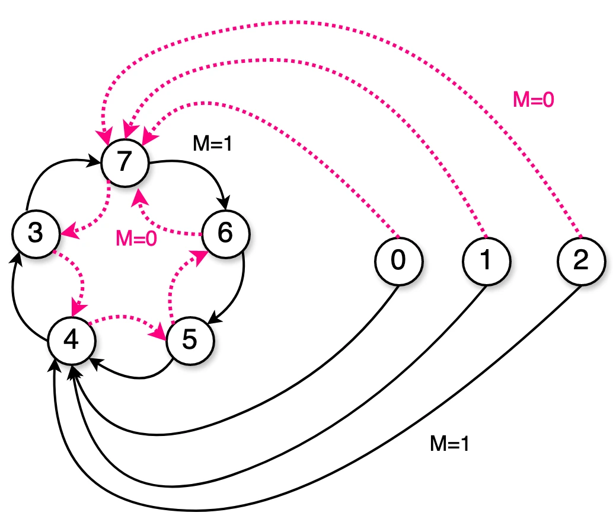

Programando os MUXes:

```
MUX para d2:
     |   | S2 S1 S0 <-- Entradas Select do MUX
 Ref | M | q2 q1 q0 | Q2 Q1 Q0 | d2  | Obs           | Entradas MUX
-----+---+----------+----------+-----+---------------+-------------
   0 | 0 |  0  0  0 |  1  1  1 |  1  | 0 --> 7 (M=0) | I0 = 1
   1 | 0 |  0  0  1 |  1  1  1 |  1  | 1 --> 7 (M=0) | I1 = 1
   2 | 0 |  0  1  0 |  1  1  1 |  1  | 2 --> 7 (M=0) | I2 = 1
-----+---+----------+----------+-----+---------------+-------------
   3 | 0 |  0  1  1 |  1  0  0 |  1  | 3 --> 4 (M=0) | I3 = 1
   4 | 0 |  1  0  0 |  1  0  1 |  1  | 4 --> 5 (M=0) | I4 = /M
   5 | 0 |  1  0  1 |  1  1  0 |  1  | 5 --> 6 (M=0) | I5 = 1
   6 | 0 |  1  1  0 |  1  1  1 |  1  | 6 --> 7 (M=0) | I6 = 1
   7 | 0 |  1  1  1 |  0  1  1 |  0  | 7 --> 3 (M=0) | I7 = M
====================================================================
 8/0 | 1 |  0  0  0 |  1  0  0 |  1  | 0 --> 4 (M=1)
 9/1 | 1 |  0  0  1 |  1  0  0 |  1  | 1 --> 4 (M=1)
10/2 | 1 |  0  1  0 |  1  0  0 |  1  | 2 --> 4 (M=1)
-----+---+----------+----------+-----+---------------+-------------
11/3 | 1 |  0  1  1 |  1  1  1 |  1  | 3 --> 7 (M=1)
12/3 | 1 |  1  0  0 |  0  1  1 |  0  | 4 --> 3 (M=1)
13/5 | 1 |  1  0  1 |  1  0  0 |  1  | 5 --> 4 (M=1)
14/6 | 1 |  1  1  0 |  1  0  1 |  1  | 6 --> 5 (M=1)
15/7 | 1 |  1  1  1 |  1  1  0 |  1  | 7 --> 6 (M=1)
```

```
MUX para d1:
     |   | S2 S1 S0 <-- Entradas Select do MUX
 Ref | M | q2 q1 q0 | Q2 Q1 Q0 | d1 | Obs           | Entradas MUX
-----+---+----------+----------+----+---------------+-------------
   0 | 0 |  0  0  0 |  1  1  1 |  1 | 0 --> 7 (M=0) | I0 = /M 
   1 | 0 |  0  0  1 |  1  1  1 |  1 | 1 --> 7 (M=0) | I1 = /M
   2 | 0 |  0  1  0 |  1  1  1 |  1 | 2 --> 7 (M=0) | I2 = /M
-----+---+----------+----------+----+---------------+-------------
   3 | 0 |  0  1  1 |  1  0  0 |  0 | 3 --> 4 (M=0) | I3 = M
   4 | 0 |  1  0  0 |  1  0  1 |  0 | 4 --> 5 (M=0) | I4 = M
   5 | 0 |  1  0  1 |  1  1  0 |  1 | 5 --> 6 (M=0) | I5 = /M
   6 | 0 |  1  1  0 |  1  1  1 |  1 | 6 --> 7 (M=0) | I6 = /M
   7 | 0 |  1  1  1 |  0  1  1 |  1 | 7 --> 3 (M=0) | I7 = 1
==================================================================
 8/0 | 1 |  0  0  0 |  1  0  0 |  0 | 0 --> 4 (M=1)
 9/1 | 1 |  0  0  1 |  1  0  0 |  0 | 1 --> 4 (M=1)
10/2 | 1 |  0  1  0 |  1  0  0 |  0 | 2 --> 4 (M=1)
-----+---+----------+----------+----+---------------+-------------
11/3 | 1 |  0  1  1 |  1  1  1 |  1 | 3 --> 7 (M=1)
12/4 | 1 |  1  0  0 |  0  1  1 |  1 | 4 --> 3 (M=1)
13/5 | 1 |  1  0  1 |  1  0  0 |  0 | 5 --> 4 (M=1)
14/6 | 1 |  1  1  0 |  1  0  1 |  0 | 6 --> 5 (M=1)
15/7 | 1 |  1  1  1 |  1  1  0 |  1 | 7 --> 6 (M=1)
```

```
MUX para d0:
     |   | S2 S1 S0 <-- Entradas Select do MUX
 Ref | M | q2 q1 q0 | Q2 Q1 Q0 | d0 | Obs           | Entradas MUX
-----+---+----------+----------+----+---------------+-------------
   0 | 0 |  0  0  0 |  1  1  1 |  1 | 0 --> 7 (M=0) | I0 = /M
   1 | 0 |  0  0  1 |  1  1  1 |  1 | 1 --> 7 (M=0) | I1 = /M
   2 | 0 |  0  1  0 |  1  1  1 |  1 | 2 --> 7 (M=0) | I2 = /M
-----+---+----------+----------+----+---------------+-------------
   3 | 0 |  0  1  1 |  1  0  0 |  0 | 3 --> 4 (M=0) | I3 = M
   4 | 0 |  1  0  0 |  1  0  1 |  1 | 4 --> 5 (M=0) | I4 = 1
   5 | 0 |  1  0  1 |  1  1  0 |  0 | 5 --> 6 (M=0) | I5 = 0
   6 | 0 |  1  1  0 |  1  1  1 |  1 | 6 --> 7 (M=0) | I6 = 1
   7 | 0 |  1  1  1 |  0  1  1 |  1 | 7 --> 3 (M=0) | I7 = /M
==================================================================
 8/0 | 1 |  0  0  0 |  1  0  0 |  0 | 0 --> 4 (M=1)
 9/1 | 1 |  0  0  1 |  1  0  0 |  0 | 1 --> 4 (M=1)
10/2 | 1 |  0  1  0 |  1  0  0 |  0 | 2 --> 4 (M=1)
-----+---+----------+----------+----+---------------+-------------
11/3 | 1 |  0  1  1 |  1  1  1 |  1 | 3 --> 7 (M=1)
12/4 | 1 |  1  0  0 |  0  1  1 |  1 | 4 --> 3 (M=1)
13/5 | 1 |  1  0  1 |  1  0  0 |  0 | 5 --> 4 (M=1)
14/6 | 1 |  1  1  0 |  1  0  1 |  1 | 6 --> 5 (M=1)
15/7 | 1 |  1  1  1 |  1  1  0 |  0 | 7 --> 6 (M=1)
```

*Obs.:* durante resolução sem aula, a programação $d_0$ para as linhas *Ref* = 12, 13 e 15 estava equivocada!

**Diagrama elétrico e simulação**:

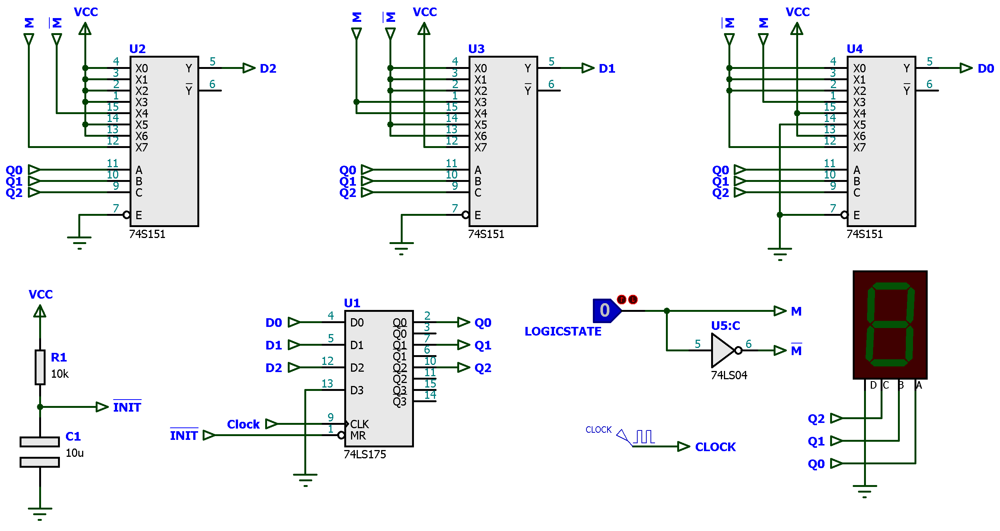

Este circuito ( [contador_diferente_2024_1.pdsprj](contador_diferente_2024_1.pdsprj) - Proteus 8.13 SP0 ) ocupa simplesmente 5 pastilhas.

Segue uma simulação:

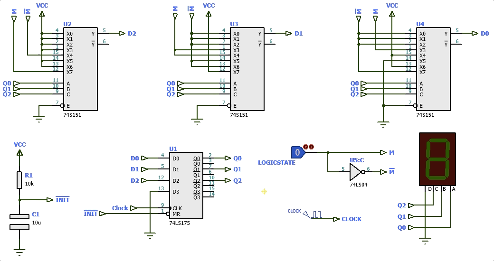

**Detalhe**: a pastilha 74LS175 não permite um "Parallel Load", isto é, não permite inicializar seus FF´s em qualquer estado. Temos disponível apenas o *Master Reset* (pino $\overline{MR}$). 

O Proteus permite forçar a inicialização da pastilha 74LS175, se, depois de selecionarmos a mesma (botão direito do mouse sobre a pastilha), selecionamos Propriedades e alteramos o valor da caixa de texto "Inicial Output State of Lath" para o valor desejado (no caso, por padrão, estão o valor $0_{(10)}=0000_{(2)}$). Ver figura abaixo:

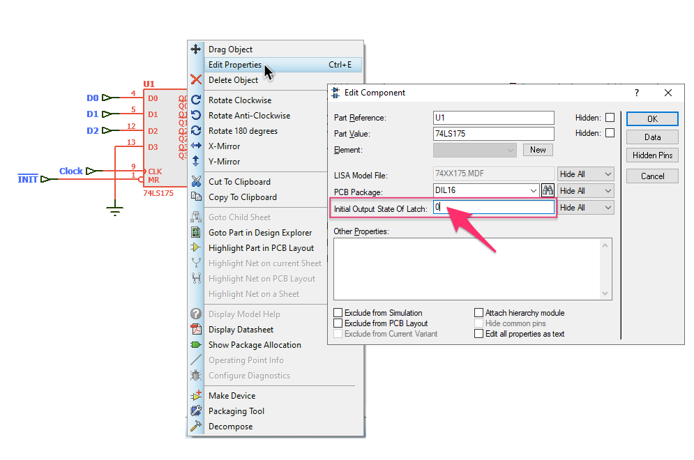

Ou podemos optar por criar um circuito usando pastilhas 74LS74 + outras portas lógicas básicas para incorporar uma função similar ao "Parallel Load":

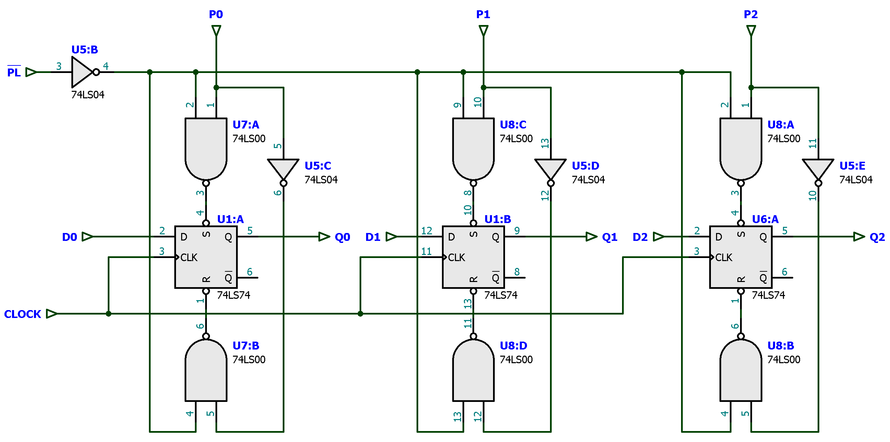

Mais ums poucas modificações no circuito anterior e então teremos:

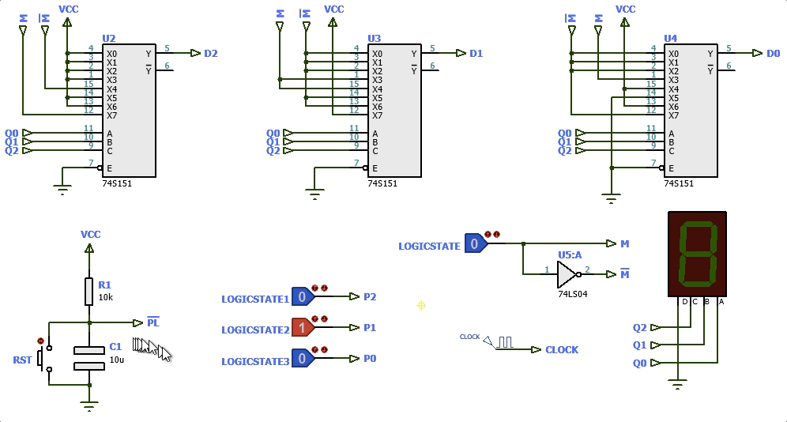

Esta última solução ( circuito:  [contador_diferente_2024_1_PL.pdsprj](contador_diferente_2024_1_PL.pdsprj) ) exige 8 pastilhas.

---

Fernando Passold, em 03/05/2024.

