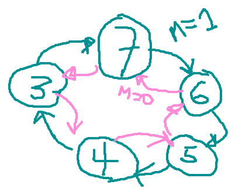

# Projeto Contador Síncrono 2024/1

Suponha que queiramos construir um contador síncrono capaz de executar a seguinte sequência de contagem:



Obs.: A variável $m$ serve para ajustar o sentido da contagem. Funcionaria como a entrada $\overline{U}/D$ de um CI 74LS190.

**Projeto** ?

Notamos que o maior valor assumido nesta contagem é $7_{(10)}=0111_{(2)}$ e o menor valor é $3_{(10)}=0011_{(2)}$, o que significa que $3 \times$ FF's bastam para resolver este circuito. Resta escolher que tipo de FF adotar. Se usarmos FF´s-JK será necessário deduzir $3 \times 2 = 6$ equações (circuitos). Se optarmos por FF´s-D, teremos que deduzir apenas 1 circuito (equação) por FF.

Seque tabela de sequência de contagem:

```
Ref | m q2 q1 q0 | Q2 Q1 Q0 | d2 d1 d0 | Obs
----+------------+----------+----------+--------
 0  | 0  0  0  0 |  X  X  X |  X  X  X | 0 --> X
 1  | 0  0  0  1 |  X  X  X |  X  X  X | 1 --> X
 2  | 0  0  1  0 |  X  X  X |  X  X  X | 2 --> X
----+------------+----------+----------+--------
 3  | 0  0  1  1 |  1  0  0 |  1  0  0 | 3 --> 4
 4  | 0  1  0  0 |  1  0  1 |  1  0  1 | 4 --> 5
 5  | 0  1  0  1 |  1  1  0 |  1  1  0 | 5 --> 6
 6  | 0  1  1  0 |  1  1  1 |  1  1  1 | 6 --> 7
 7  | 0  1  1  1 |  0  1  1 |  0  1  1 | 7 --> 3
----+------------+----------+----------+--------
 8  | 1  0  0  0 |  X  X  X |  X  X  X | 0 --> X
 9  | 1  0  0  1 |  X  X  X |  X  X  X | 1 --> X
10  | 1  0  1  0 |  X  X  X |  X  X  X | 2 --> X
----+------------+----------+----------+--------
11  | 1  0  1  1 |  1  1  1 |  1  1  1 | 3 --> 7
12  | 1  1  0  0 |  0  1  1 |  0  1  1 | 4 --> 3
13  | 1  1  0  1 |  1  0  0 |  1  0  0 | 5 --> 4
14  | 1  1  1  0 |  1  0  1 |  1  0  1 | 6 --> 5
15  | 1  1  1  1 |  1  1  0 |  1  1  0 | 7 --> 6
```

Lembrando que a tabela de transição do FF-D é:

```
q(t) --> Q(t+1) | D
----------------+---
  0  --->   0   | 0
  0  --->   1   | 1
  1  --->   0   | 0
  1  --->   1   | 1
```

Seguem os Mapas de karnaught e equações para as entradas dos FF´s adotados neste projeto:


Circuito lógico (diagrama elétrico):

Obs.: Este circuito lógico, principalmente a eletrônica combinacional associada com a entrada $d_1$ (FF-1), exige (pela expressão encontrada acima), um circuito algo grande. 

**Mas...**

Lembramos que podemos sinterizar uma função lógica combinacional usando MUX ou DEC. Se optarmos por MUX, seria necessário um MUX com 4 entradas de seleção (correspondendo as variáveis: $m$, $q_2$, $q_1$ e $q_0$), de 16 canais (uma pastilha algo grande, com 24 pinos), ou até podemos adaptar a solução para um MUX de 8 canais e usar a varíavel mais significativa, $m$ para completar a adaptação para circuito combinacional usando um MUX menor (de 8 canais; 16 pinos). 

Temos então que deduzir a "programação" de cada um dos MUXes de 8 canais, um para cada circuito combinacional ncessário aqui (um para a entrada $d_0$ do FF-0, outro para entrada $d_1$ do FF-1 e o terceiro MUX associado com a entrada $d_2$ do FF-2).

Faremos isto na próxima aula (10/05/2024) e tentaremos simular este circuito no Proteus.

* [Video desta parte da aula](https://drive.google.com/open?id=16DWKSjd4tCuvtjTelFM7E0ixNLd6dgPe): projeto deste contador síncrono.

* [Vídeo da primeira parte desta aula](https://drive.google.com/open?id=1BFUu8cKfn5umr2c0I52szMQLBXTpadJI): teoria associada com projeto de contadores (ou máquinas) síncronas.

Obs.: para acessar estes videos eventualmente será necessário você autenticar sua conta @upf.br.

---

Fernando Passold, em 03/05/2024.

