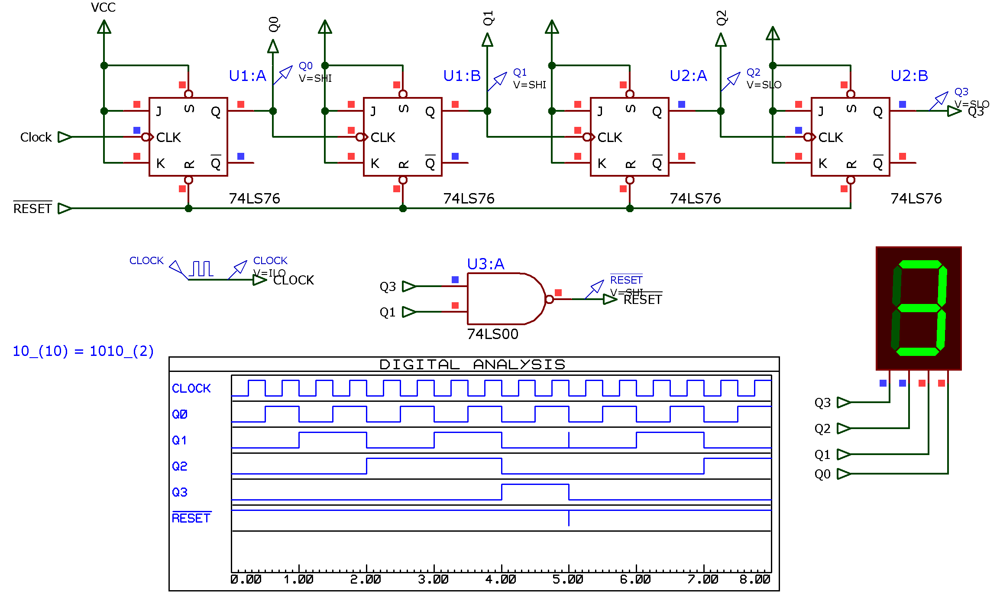
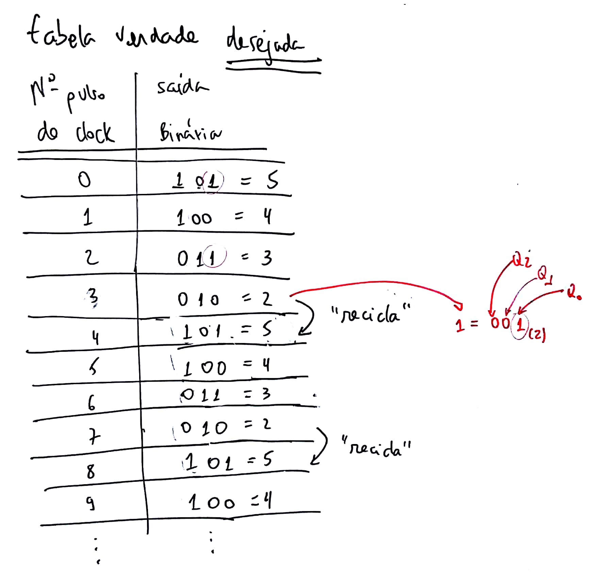
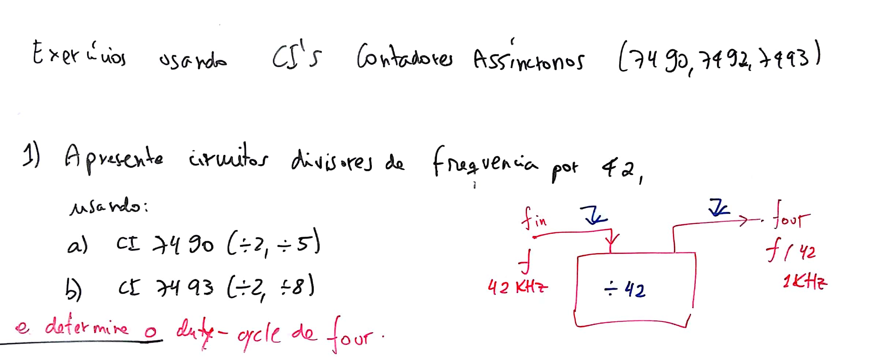
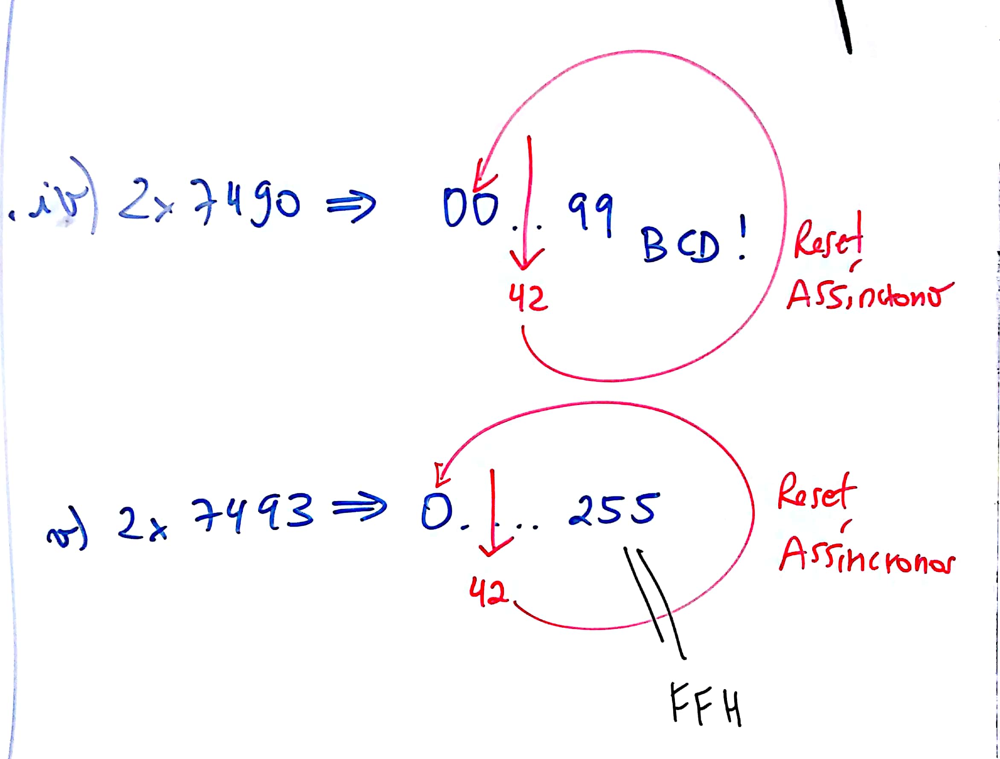
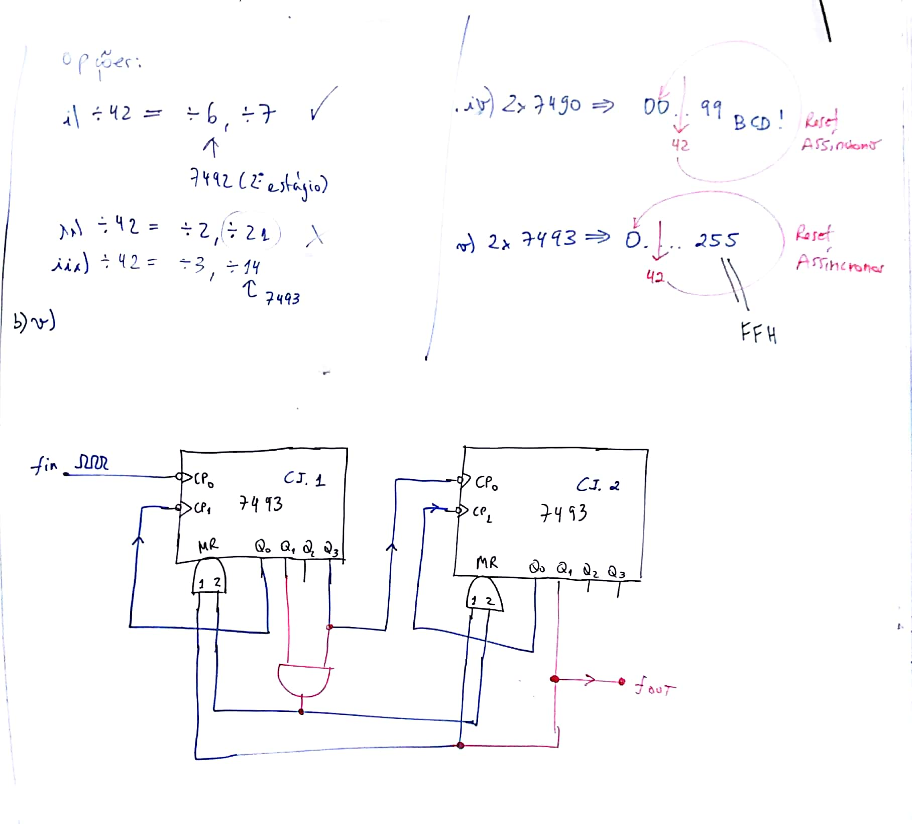
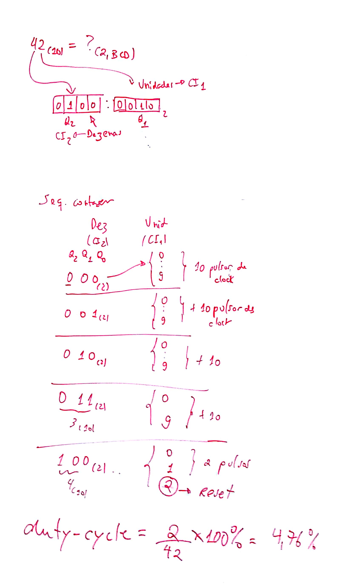
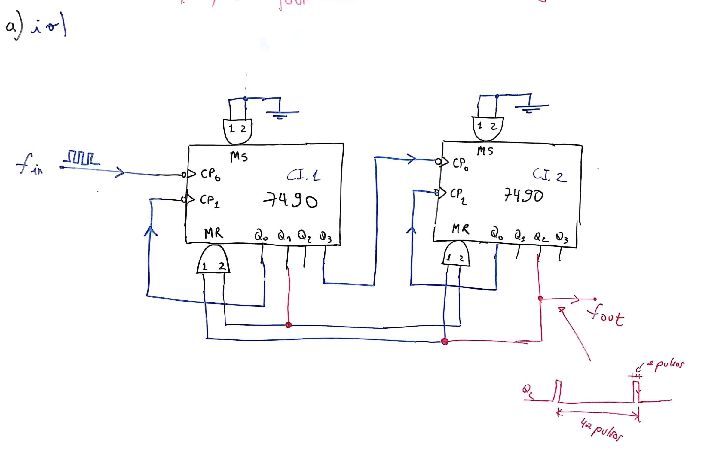

# Exemplos Projetos Contadores Assíncronos:

__Exemplo\_1__: Contador assíncrono cresente de 0 à 9:

*Solução*: 

1. O maior valor atingido na contagem é $9_{(10)}=1001_{(2)}$, então 4 FF's são necessários.
2. Montar um circuito assíncrono crescente com 4 FF's. Inicialmente ele contaria de 0 até 15.
3. Modificar o circuito para um sinal de $\overline{RESET}$ ser gerado assim que atingisse o número $10_{(10)}=1001_{(2)}$. 

Circuito final:

 [contador_assync_mod10_crescente.DSN](contador_assync_mod10_crescente.DSN) (arquivo criado originalmente no Proteux 7.8 SP2).



---

__Exemplo\_2__: projetar contador assícrono (usando FF's JK borda de descida) capaz de realizar a sequencia de contagem abaixo:
_(Aula de 14/04/2028)_


Note: é um contador __decrescente__!

Cuidado com soluções "_decoradas_":


Solução simples:

Estrutura de contador assíncrono descrescente $\rightarrow$ [Video no Youtube](https://youtu.be/rnTzJK1IDaM).


Solução: contador decrescente de 5 até 2:


Repare como deve ser detectado o ponto de reciclagem (e notar que este circuito gera sequencia decescente de contagem: ficar atento a sequencia binária assumida!)

Note a sequencia de contagem:



Circuito simulado no Proteus:

 [contador_assync_decrescente_5_to_2.DSN](contador_assync_decrescente_5_to_2.DSN) 


Observações:

1. À primeira solução foi acrescentado um circuito de "Power-up" formado pelo resistor e capacitor, de forma que quando a alimentação fosse fornecida ao circuito, o mesmo iniciasse no número 5 e não outro ponto qualquer da contagem. 

2. Note que enquanto o capacitor demora para carregar, é gerado um nível lógico baixo na saída $\overline{INIT}$. O tempo em que o sinal $\overline{INIT}$ vai permancer em nível lógico baixo é diretamente proporcional à constante de tempo RC deste circuito. Quanto maiores os resistor e capacitor, maior este período de tempo:

   | Circuito com C=1000 uF                                       | Circuito com C=100 uF                                        |
   | ------------------------------------------------------------ | ------------------------------------------------------------ |
   |  |  |

   Note que foi acrescentada uma porta Schmidtt-triger na saída do circuito RC para "transformar" o sinal analógico de tensão de carregamento do capacitor num sinal compatível com níveis TTL (notar o $V_{T+}$ do CI 74LS14 $\approx$ 2,4 Volts). 
   O período de tempo em que o sinal $\overline{INIT}$ deve permanecer em nível lógico é igual ao $t_{W(L)}$ dos FF's adotados. Na média uns 20 ns, o que implica um capacitor bem pequeno da ordem de centenas de pF. Apenas não se recomenda trabalhar com resistores muito maiores que 10 KOhms.

3. Note ainda que como queríamos que circuito iniciasse no número 5 e que toda vez que atingisse o final de contagem fosse "reprogramado" no número 5, o sinal de $\overline{PRESET}$ que é responsável por ajustar os FF's do circuito no número 5, deve fazer isto quando a contagem atinge o número 1 e quando sinal de $INIT$ é ativado. Ou na forma de uma equação:
   $PRESET=5+INIT$
   $\overline{PRESET}=\overline{5+INIT} \quad \leftarrow \quad$aplicando-se Demorgan resulta:
   $verline{PRESET}=\overline{5} \cdot \overline{INIT} \quad \leftarrow \quad$ ou seja, uma porta AND resolve a "junção" destes 2 sinais;


---

## Usando pastilhas de CIs contadores Assíncronos

__Exemplo\_3__: Use pastilhas 74LS90 e/ou 74LS93 para criar um divisor de frequencia por 42:



Note a __diferença__ na contagem realizada entre a pastilha 7490 x 7493:



Soluções possíveis:



__Note__: contador 74LS__93__ forma contagem binária na sua saída (não decimal!):

$42_{(10)} \Rightarrow \text{?}_{(2)}$:

```
 42 | 16
    ----------
-32    2
---
 10
```


$42_{(10)}=2A_{(16)}=0010:1010_{(2)}$

_Por isto que devemos detectar: Q1=1 e Q3=1 no estágio "LSB" e Q1=1 no estágio "MSB" do ciruito contador._


__- E como seria a solução usando 74LS__90 __(Contador Decimal)__?

_E preocupação extra: como fica o "duty-cycle"?_



Note um detalhe __"preocupante"__ nesta solução:




Em comparação, o duty-cycle usando o 74LS__93__ fica:


__Outras soluções:__


---
Fernando Passold, em 12/04/2020; 27/08/2021.