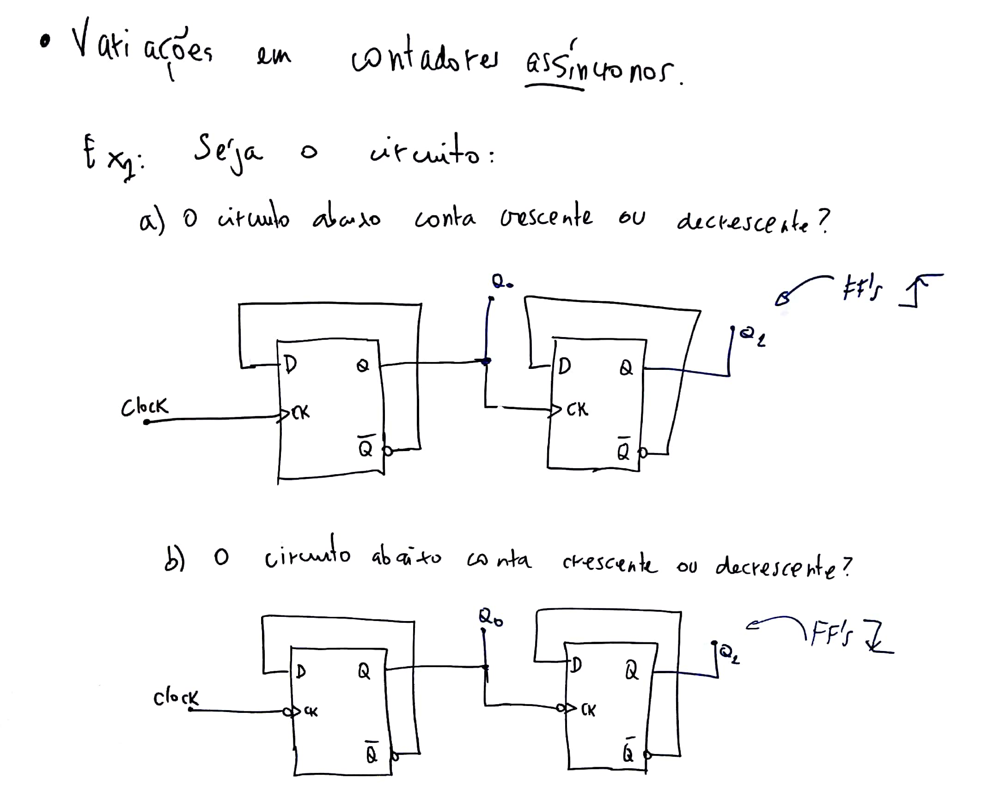
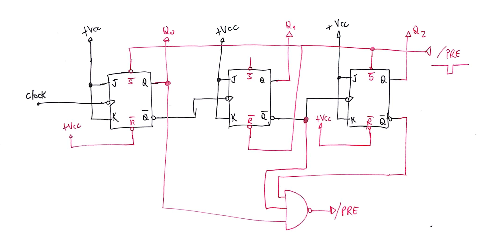
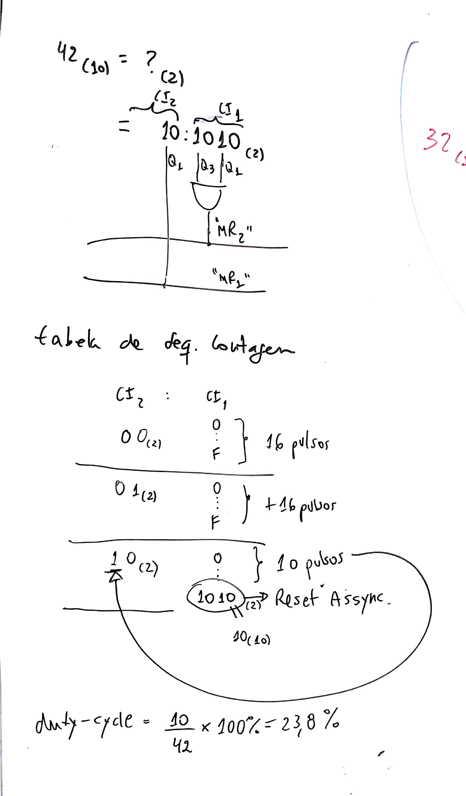
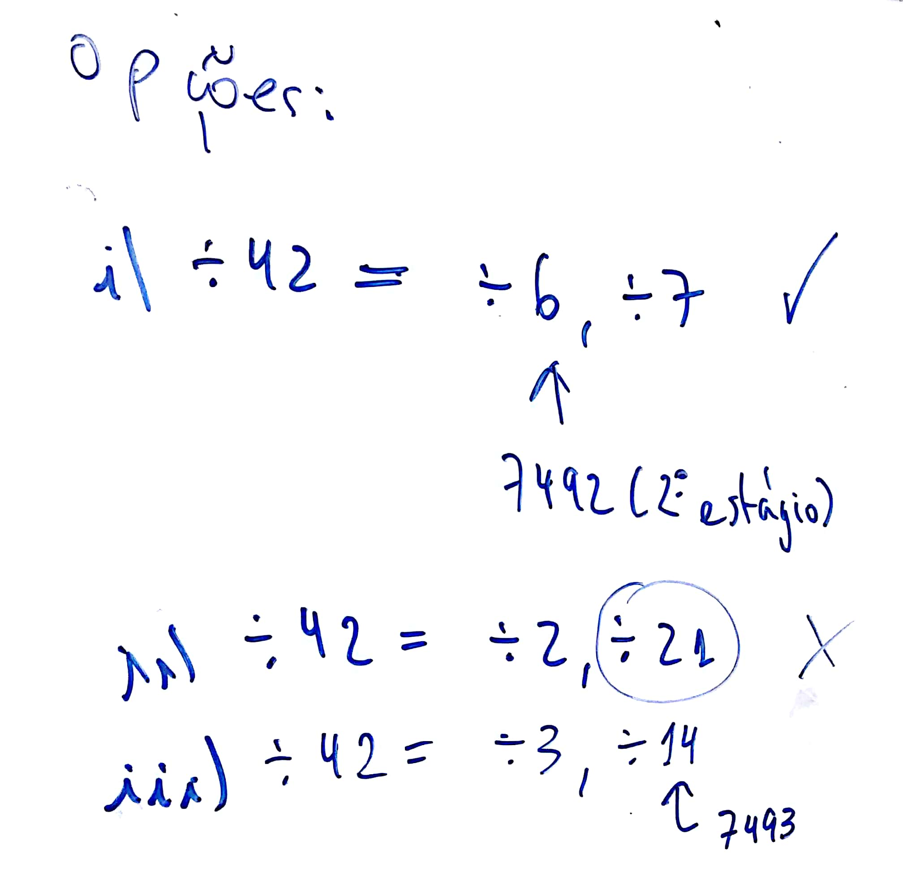

# Exemplos Projetos Contadores Assíncronos:

__Exemplo\_1__: Contador assíncrono cresente de 0 à 9:

---

__Exemplo\_2__: projetar contador assícrono (usando FF's JK borda de descida) capaz de realizar a sequencia de contagem abaixo:
_(Aula de 14/04/2028)_


Note: é um contador __decrescente__!

Cuidado com soluções "_decoradas_":



Solução simples:

Estrutura de contador assíncrono descrescente:

_[Video no Youtube](https://youtu.be/rnTzJK1IDaM):_
<iframe  width="1192" height="720" src="https://youtu.be/rnTzJK1IDaM" frameborder="0" allowfullscreen>
</iframe>

Solução: contador decrescente de 5 até 2:



Repare como deve ser detectado o ponto de reciclagem (e notar que este circuito gera sequencia decescente de contagem: ficar atento a sequencia binária assumida!)

Note a sequencia de contagem:


---
## Usando pastilhas de CIs contadores Assíncronos

__Exemplo\_3__: Use pastilhas 74LS90 e/ou 74LS93 para criar um divisor de frequencia por 42:


Note a __diferença__ na contagem realizada entre a pastilha 7490 x 7493:


Soluções possíveis:


__Note__: contador 74LS__93__ forma contagem binária na sua saída (não decimal!):

$42_{(10)} \Rightarrow \text{?}_{(2)}$:

```
 42 | 16
    ----------
-32    2
---
 10
```


$42_{(10)}=2A_{(16)}=0010:1010_{(2)}$

_Por isto que devemos detectar: Q1=1 e Q3=1 no estágio "LSB" e Q1=1 no estágio "MSB" do ciruito contador._


__- E como seria a solução usando 74LS__90 __(Contador Decimal)__?

_E preocupação extra: como fica o "duty-cycle"?_


Note um detalhe __"preocupante"__ nesta solução:


Em comparação, o duty-cycle usando o 74LS__93__ fica:



__Outras soluções:__



---
Fernando Passold, em 12/04/2020