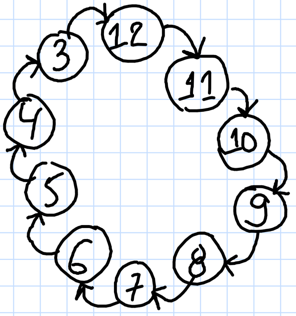
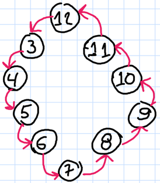
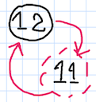
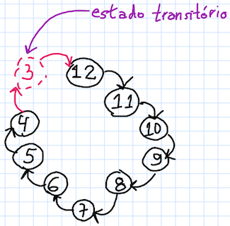
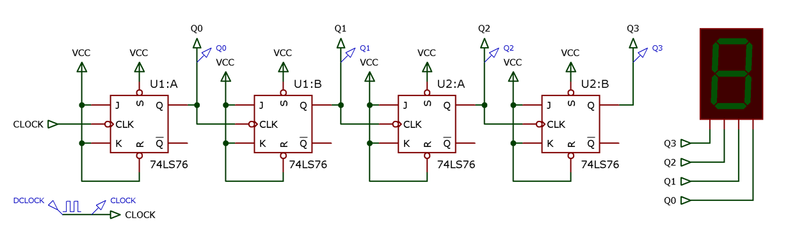
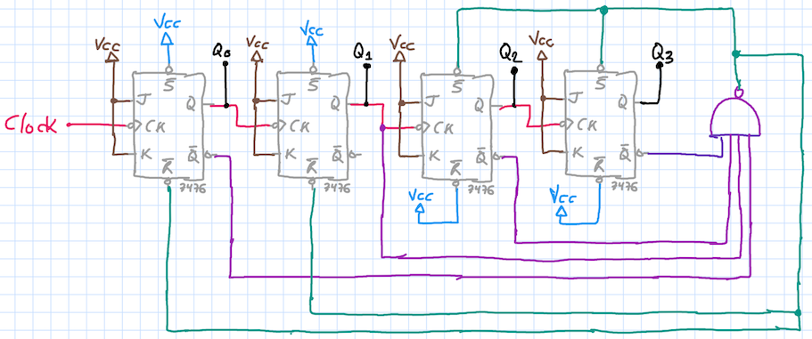
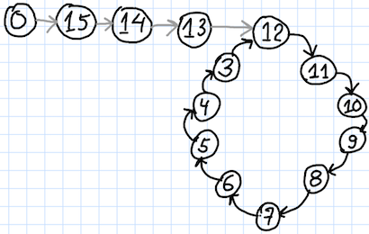
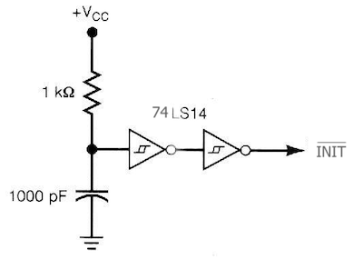
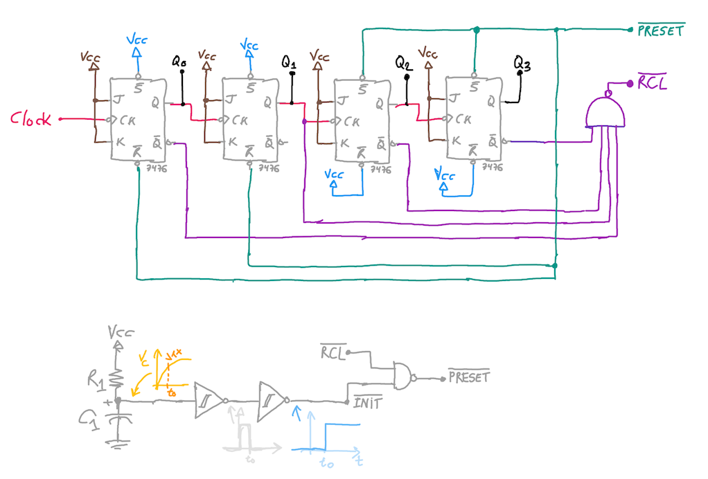

# Projeto Contadores Assíncronos

## Cuidados:

Suponha o projeto de um contador assíncrono que deva executar a seguinte sequencia:

__Contador\_1__:



ou

__Contador\_2__:



_Observações:_

1. Note, o primeiro conta __decrescente__ e o segundo __crescente__.
2. Para segundo contador, o que conta crescente: contagem inicia em __3__ (e não em 12) e termina (deve aparecer o número) em __12__. 

  Isto siginifica: detectar o ponto de contagem seguinte ao último que deve ser assumido pelo contador; deve ser gerado um pulso neste instante de tempo para forçar os FF's da estrutura a assumir certa combinação binária. No caso, deve ser detectado o número $13_{(10)}=1101_{(2)}$, o que significa o uso de uma porta AND de 3 entradas conectado às saídas Q3, Q2 e Q0. Esta porta seguida de uma NOT (ou simplesmente uma porta NAND de 3 entradas) deve ser usada para forçar o estado $3_{(10)}=0011_{(2)}$, ou seja, o FF-3 e FF-2 devem ser resetados e o FF-0 e FF-1 devem ser setados.


3. Já para o primeiro contador temos:

  
  
  Contagem decrescente: o contador deve contar até o número 3 (então os FF's devem setados ou resetados) quando a contagem atinge o número 2. E neste caso, seus FF's devem ser forçados (usando as entradas assíncronas) à assumir o estado $12_{(10)}=1100_{(2)}$ (ou seja, FF-3 e FF-2 devem ser setados e o FF-1 e FF-O devem ser resetados). 
  
  Repare que para detectar o _final da contagem_ em $2_{(10)}=0010_{(2)}$ não basta detectar apenas quando Q1=1, porque este contador __conta decrescente__, o que significa que se for criada uma lógica apenas para detectar este ponto de contagem teremos vários problemas -- ver tabela de sequencia de contagem assumida por contador assíncrono decrescente MOD-16 ("_full_"):
   
```
Dec | Hex   |  Bin
    |       |  3210 <-- saídas dos FF's
15  |  0F   |  1111 
14  |  0E   |  1110 
13  |  0D   |  1101 
12  |  0C   |  1100 <-- Preset
11  |  0B   |  1011 
10  |  0A   |  1010 
 9  |  09   |  1001 
 8  |  08   |  1000 
 7  |  07   |  0111 
 6  |  06   |  0110 
 5  |  05   |  0101 
 4  |  04   |  0100 
 3  |  03   |  0011 
 2  |  02   |  0010 <-- detectar para reciclagem 
 1  |  01   |  0001 
 0  |  00   |  0000 
```


Então neste caso, devemos necessariamente observar quando ocorre a combinação binária referente à: $2_{(10)}=0010_{(2)}$. E vamos perceber que será necessário trabalhar com a seguinte lógica para geração do "_PRESET_":

$$
PRESET=\overline{Q_3} \cdot \overline{Q_2} \cdot Q_1 \cdot \overline{Q_0}
$$  
 
ou seja, não basta apenas detectar Q1=1, temos que gerar o _PRESET_ quado Q3=0 e Q2=0 e Q0=0, ou:

$$
\overline{PRESET}=\overline{\overline{Q_3} \cdot \overline{Q_2} \cdot Q_1 \cdot \overline{Q_0}} 
$$


Note que:

* não serve fazer: $PRESET=\overline{Q_2}\cdot Q_1$ porque as combinações Q2=0 e Q1=1 ocorrem durante instantes de contagem anteriores: 11, 10, 3 e 2 -- o contador decresceria do 12 até 11 e reiniciaria a contagem, mas usando próprio número 11 para a reciclagem, o que significa que vizualmente o contador daria a impressão de estar parado no número 12. O número 11 é um estado transitório que existe durante um espaço muito curto de tempo, o necessário para os FF's assumam um número diferente de 11. Esse comportamento (errado) pode ser retratado pelo próximo diagrama de estados:

  

* também não serveria realizar: $PRESET=\overline{Q_3} \cdot \overline{Q_2} \cdot Q_1$, porque a combinação na qual Q3=0, Q2=0 e Q1=1 ocorre no instante de contagem 3, justo antes do 2 que é quando deveria ser realizado o reciclagem. Se o projetista insistisse nesta solução seria obtido outra sequencia de contagem: veja figura com novo diagrama de estados, que não é o desejado neste caso.

  
 
O circuito de um contador assíncrono __decrescente__ MOD-16 é mostrado abaixo:

  

Este circuto teria que ser modificado para:



_Obs.: Note que no circuito anterior não foi incorporado nenhum circuito de inicialização; sendo assim, se os seus FF's iniciarem RESETADOS, a seguinte sequencia de contagem será assumida:_



A única forma de garantir que o circuito inicie no estado 12 é incorporando um circuito RC + portas lógicas básicas para gerar um $\overline{PRESET_2}$ logo que o mesmo é energizado. Algebricamente ficaria:

$$
PRESET=INIT+RCL
$$

onde $RCL$ é o sinal que detecta quando se faz necessário a reciclagem do circuito. Seu complemento, ou $\overline{RCL}$ corresponde à saída NAND do circuito anterior (parte em lilás).

Convertendo todos os sinais para ATIVO BAIXO:

$$
\overline{PRESET}=\overline{INIT+RCL}
$$

$$
\overline{PRESET}=\overline{INIT} \cdot \overline{RCL} \quad \leftarrow \quad \text{porta NAND(2)}
$$

onde $\overline{PRESET}$ é o mesmo sinal (ou parte verde-musgo do circuito) já deduzido anteriormemente que força os FF's no estado $Q_3Q_2Q_1Q_0=1100_{(2)}=12_{(10)}$.

Só se faz necessário gerar o sinal $\overline{INIT}$ (ativo baixo) à partir de um circuito RC:



Incorporando o circuito RC ao circuito anterior, temos:



_Obs.: Neste caso, se garante que o ciruito inicia na posição 12._

---
Fernando Passold, em 20/04/2020