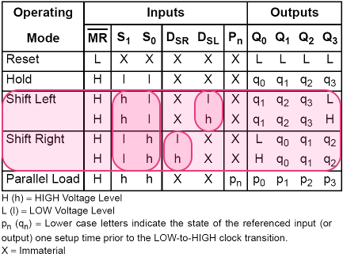
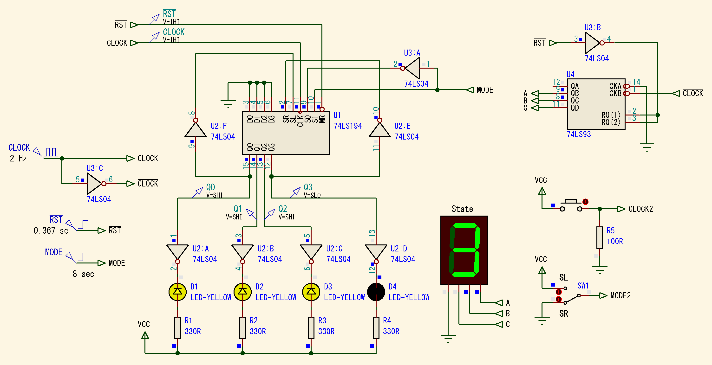
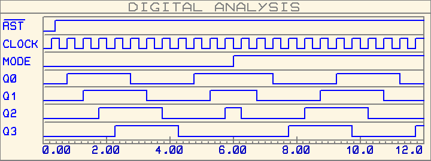
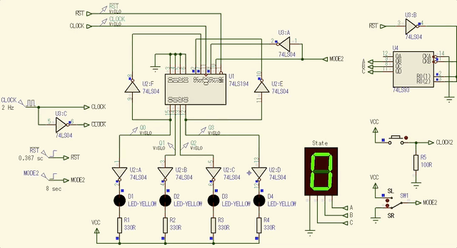
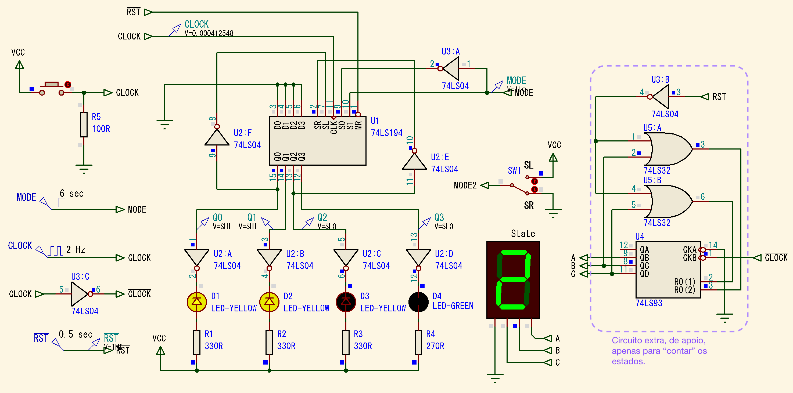
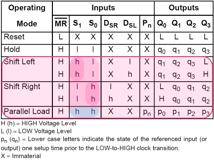
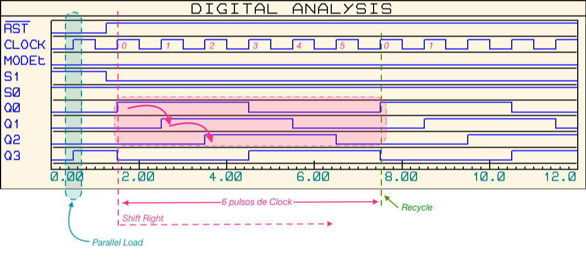
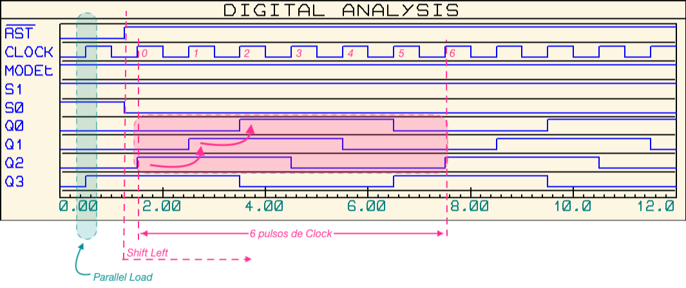
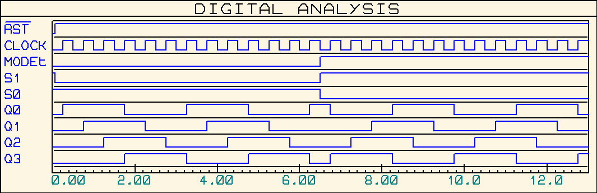

# Exemplo de Uso de Registrador de Deslocamento

> Aula de 16.10.2019

## Exemplo_1: Contador Jonhson de 8 estágios.

O caso aqui é realizar um contador Jonhson de 8 estágios, ou 8 estados, baseado no CI Registrador de Deslocamento Universal de Bidirecional, 74LS194. 

Para tanto, deve haver uma entrada externa chamada MODE cujo nível lógico controla o sentido da sequencia de acionamento das saídas do contador Jonhson:

* Se MODE=0, o contador deve realizar Deslocamento para Direita (ou _Shitf Right_);
* Se MODE=1, o contador deve realizar Deslocamento para Esquerda (ou _Shitf Left_).

Observando a tabela funcional do 74LS194, notamos que:

Para lograr o sentido de deslocamento desejado se faz necessário, realizar a seguintes conexões da entrada externa MODE às entradas S1 e S0 que controlam seu sentido de deslocamento. Então:

* Se MODE=0, se deseja _Shift Rigth_, então S1=1; S0=0;
* Se MODE=1, se deseja _Shift Left_, então S1=0; S0=1.

Notamos que os níveis lógicos necessários entre as entradas S1 e S0 são complementares entre si, ou seja, uma porta inversora colocada entre estas 2 entradas resolve o problema. E se percebe pelos itens anteriores que facilita conectar: $MODE \rightarrow S1$ e $S0 \leftarrow \overline{MODE}$. 

Além disto, para o CI 74LS194 se comportar como contador Jonhson falta realizar as realimentações externas:

* $DSR \leftarrow \overline{Q3}$; (_DSR é o pino que permite acessar a entrada (síncrona) D do FF-0, primeira saída do 74LS194_)
* $DSL \leftarrow \overline{Q0}$; (_DSL é o pino que permite acessar a entrada D do FF-3, último FF do 74LS194_)

O circuito final fica então:

No circuito da figura anterior, o pequeno bloco baseado no contador 7493 está ai apenas como um circuito de apoio, de forma a tentar mostrar no display de 7-segmentos o estado atual de um todal de 8 estados, já que contador 74LS93 está configurado como MOD-8.

As formas de onda demonstrando o correto funcionamento deste circuito é mostrado na figura à seguir:

Note que inicialmente é realizado um RESET nos FF's do 74LS194 usando o sinal $\overline{RST}$ que inicia em nível lógico baixo e permanece no mesmo os primeiros 367 milisegundos, findo os quais, este sinal permanece em nível lógico alto. Este pulso inicial em nível lógico BAIXO garante o Reset de todos os FF's internos do 74LS194.

Depois do pulso inicial de Reset o circuito continua operando em M=0, ou Deslocamento para Direita (_Shift Right_) pelos primeiros 6 segundos. Passados estes 6 segundos, esta entrada muda para nível lógico ALTO, forçando o 74LS194 a realizar então Desclocamento para Esquerda (_Shift Left_).

Perceba pelas formas de onda, que as saídas dos FF's se mantêm no mesmo nível lógico durante 4 pulsos de _Clock_, caracterizando o comportamento esperado para este registrador Johson: 8 estados diferentes, ou seja, qualquer saída (_enquanto a entrada MODE não têm seu nível lógico alterado_) permanece em nível lógico ALTO por 4 pulsos de clock e depois permanece mais 4 pulsos de clock em nível lógico BAIXO, findo os quais, o ciclo de comuntação das saídas do 74LS194 recomeça sua sequencia (ou _recicla_). 

Ou mais especificamento, a simulação abaixo mostra apenas deslocamento para direita (_Shift Right_) -- entrada MODE=0 todo o tempo:

Outra simulação mostrando como o circuito se comporta realizando apenas deslocamento para esquerda (_Shitf Left_) é mostrado à seguir:

## Exemplo_2: Contador Jonhson de 6 estágios (Bidirecional).

A idéia é realizar um contador Jonhson de 6 estágios bi-direcional usando o CI Registrador de Deslocamento Universal 74LS194.

Para tanto, serão necessários 3 FF's. Então usamos apenas 3 FF's dos 4 presentes do 74LS194. Apresenta-se 2 opções:

* Usar as saídas Q0, Q1 e Q1;
* ou usar as saídas Q1, Q2 e Q3.

Devemos nos atentar para as realimentações necessárias para transformar o 74LS194 num contador Johson.

### 1a-Versão

Usaremos as saídas Q0, Q1 e Q2. Para tanto, inicialmente vamos implementar as realimentações da seguinte forma:

1. Quando estamos realizando deslocamento para direita (_shift right_), ou SL, a última saída usada, no caso, Q2 deve ser conectada à entrada do primeiro Flip-Flop do 74LS194, ou FF-0, pino DSR (_Data for Shift Right_), via porta NOT.
2. Quando estamos realizando deslocamento para esquerda (_shift left_), ou SR, a última saída usada, neste caso, Q0 deve ser conectada à entrada do último Flip-Flop (usado) do 74LS194, ou FF-2, via pino DSR (_Data for Shift Right_), usando uma porta NOT. **E aqui que iniciam os problemas**: note que a saída da porta NOT deveria ser conectada de alguma forma à entrada D do FF-2, porém, o CI 74LS192 não nos dá acesso direto à esta entrada. O pino DSL (_Data for Shit Left_) apenas permite acessar o pino D do último FF do 74LS194, ou FF-3. Mas para o contador que queremos implementar, necessitamos acessar a entrada D do FF-2.

Se realizarmos a conexão (incorreta, pelo que já foi previsto no 2o-item anterior(2)), uma primeira versão deste circuito fica:

Notamos que enquanto o usuário realizar deslocamento para a direita (SR), não vamos perceber nenhum problema no circuito:

Entretanto, se o circuito for iniciado com deslocamento para esquerda (SL) -- ver figura abaixo, o problema se torna perceptível.

Este erro se verifica **mesmo** que o circuito inicie com deslocamento à direita e depois seja comutado para deslocamento à esquerda, o que ocorre depois do instante de tempo t = 6 segundos que é quando mudamos a entrada externa MODE para _Shift Letf_, conforme mostra a simulação abaixo:

**-- Como podemos corrigir o problema?**

### 2a-versão

Se montarmos uma tabela representando a sequencia de saída formada no 74LS194 percebemos que no caso do deslocamento para esquerda, ele "demora" um pulso de _clock_ para ocorrer, porque o bit (da realimentação) não ingressa no FF-2 e sim no FF-3. Assim, ocorre 1 "atraso de" 1 pulso de clock para a sequencia de deslocamento à esquerda ser verificada. 

E note que este contador, para _shift left_ assume 8 estágios e não 6 como desejado. Lembrar que externamente só acessamos as saídas Q0, Q1 e Q2.

**Uma solução**: "adiantar" a realimentação: ao invés da entrada SL ser alimentada pela saída Q0, vamos conectar SL à saída (complementada) de Q1. A idéia é "adiantar" o sinal usado para reciclagem.

Neste caso, o circuito fica:

E a sequencia de contagem fica:

### 3a-versão (e última)

Nesta versão, funcional 100% definimos as realimentações como:

* $DSR \leftarrow \overline{Q2}$; (para Deslocamento à Direita: _saída do último FF de interesse é realimentado, de forma complementada, para a entrada D do primeiro FF, FF-0, pino DSR_)
* $DSL \leftarrow \overline{Q1}$; (Deslocamento à esquerda: _para compensar o "atraso" provocado pelo ingresso da realimentação um FF **antes** do desejado (DSL dá acesso à entrada D do FF-3, e não à entrada D do FF-2 que seria o desejável), "adiantamos" o momento da realimentação conectando a entrada DSL à saída complementada do FF-1 (e não do FF-0, como havia sido previsto inicialmente na primeira versão)_)

E ainda realizamos **"PL"** (_Parallel Load_) no estado: **Q0Q1Q2Q3 = 0001(2)**, para evitar um "atraso" na inicialização do circuito se o mesmo iniciar com MODE=1 (_Shift Left_).

Resta apenas "aprimorar" a lógica originalmente prevista para o "Reset", já que agora, não realizamos Reset e sim PL.

Obervando a tabela verade do 74LS194, percebemos que:

Num instante de tempo inicial, para realizar "PL" necessitamos S1=1 e S0=1 e depois deste instante inicial, S1 e S0 sempre assumem níveis lógicos diferentes entre si, dependendo da variável externa M.

Usando álgebra de Boole para resolver a lógica necessária para as entradas S1 e S0 temos:

* $S_1=\underbrace{RST}_{\text{Apenas inicialmente}}+\underbrace{M}_{\text{Após inicializado}}=\overline{\overline{RST}}+M$
* $S_0=RST+\overline{M}=\overline{\overline{RST}}+\overline{M}$

Lembrando que quando $M=1$ deve ser realizado SR (_Shift Right_) e quando $M=0$ deve ser realizado SL (_Shift Left_). 

Uma porta OR associada para a entrada S1 e outra porta OR associada com a entrada S0 resolve o problema, além de ser necessário contar um sinal de _Reset_ (RST) em nível lógico alto (ou ativo alto).

O circuito final fica então:

Quando o circuito inicia com MODE=0 (_Shift Right_), podemos observar a seguinte simulação:

E as seguintes formas de onda podem ser observadas:

Quando o circuito inicia com MODE=1 (_Shift Left_), podemos observar a simulação abaixo:

E estas outras formas de onda podem ser observadas:

Este circuito pode ter sua entrada MODE modificada a partir de t = 6 segundos, conforme mostra a simulação abaixo:

Com as seguintes formas de onda:

E trabalhando comandado pelo usuário pode resultar em:

_Obs.:_ Na prática, os pulsos de _Clock_ **não podem** ser simulados com um simples circuito baseado um chave de pressão. Seria necessário acrescentar um circuito de _debouncing_ baseado em monoastável, ou acrescentar um circuito RC + _Scmiddt-trigger_ para filtrar os ruídos de chaveamente de uma chave real.

(c) Fernando Passold, em 19.10.2019