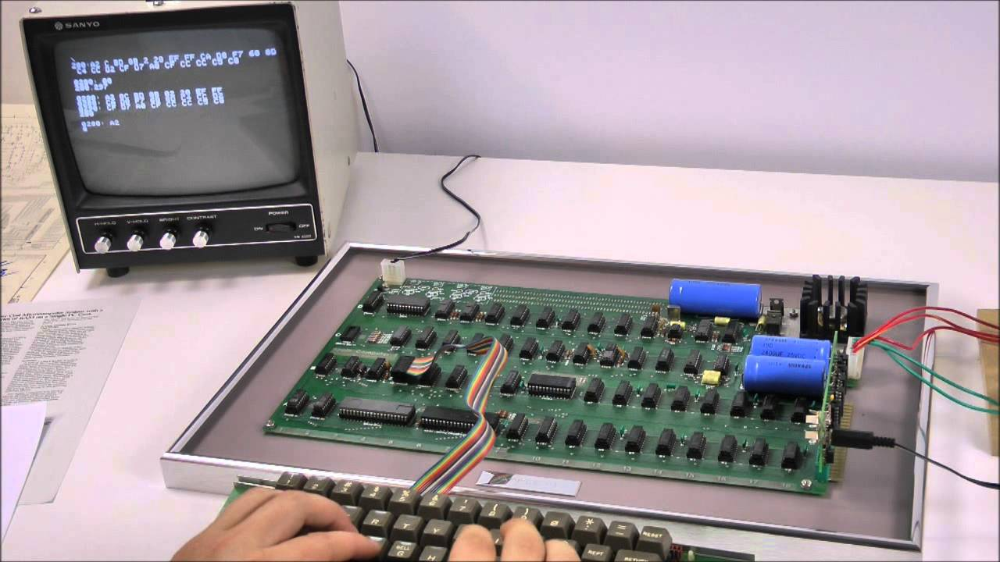
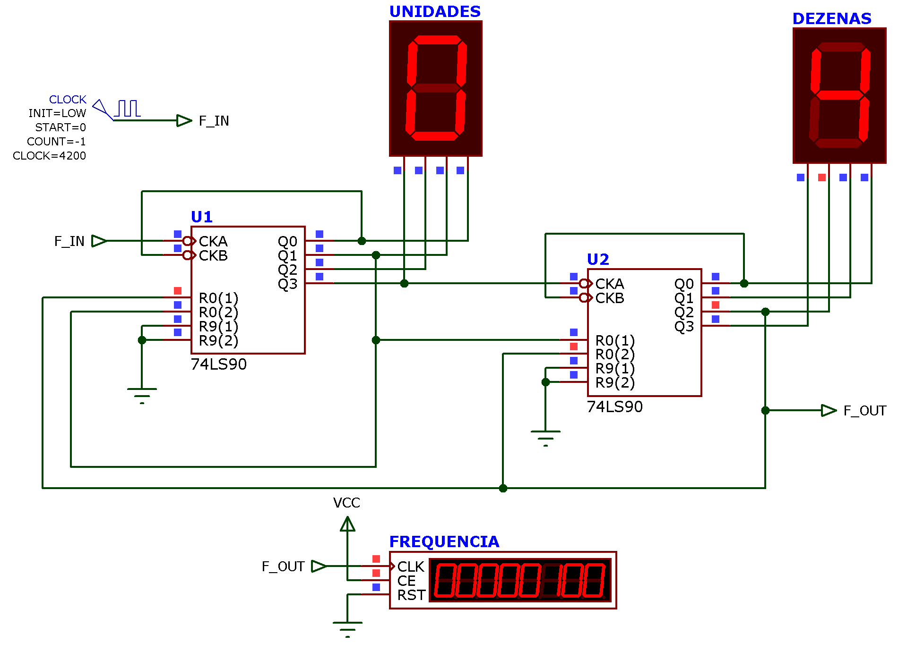
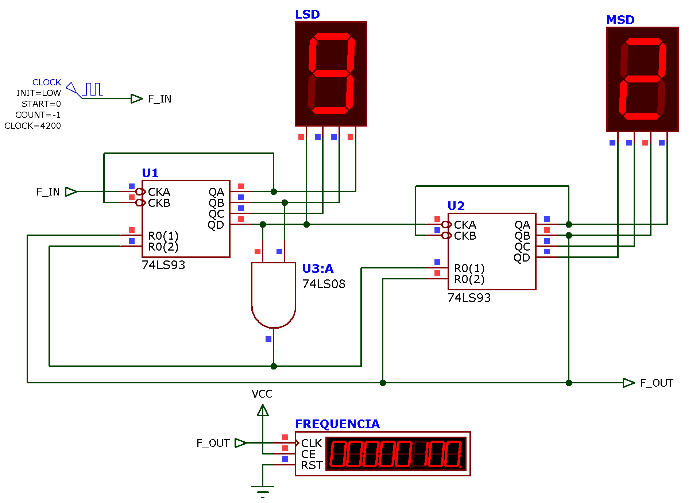
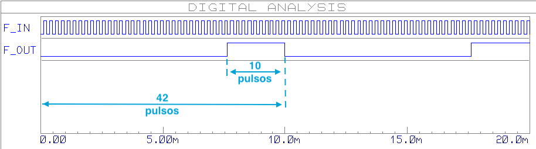

# Contadores Assíncronos de Módulo n

[arquivo PDF (teoria)]

Seguem anotações/Comentários em sala de aula sobre tópico:

----

## Análises/Respostas para circuitos ou problemas propostos em certos slides:


### Slide 29: Contador módulo 12 --> 0 ~ 11

= contador divisor de frequencia por 12.

*Solução*: usando 74LS**93** (MOD-16: 0 ~ 15=F)

Reset ou "Master Reset" quando atinge o número $12_{(10)}=1100_{(2)}$.

**Q3=1**; **Q2=1**; Q1=0 e Q0=0;

0...9 --> 10=A --> 11=b --> 0 -->  

---

### Slide 38: Exercício 3 --> Circuito **dividor de frequencia por 42**.

**Opção c)** 42 divisivel por 6 --> 42/6 = 7 ---> $\div 42 = \div 6, \quad \div 7$;

**Opção a)** Usando CI 74**90** --> 2 x 7490 --> 1o. Momento: $\div 100$ [circuito: [contador_MOD_100_74LS90.DSN](contador_MOD_100_74LS90.DSN) ]- -> 2o. Momento: Programar um "Master Reset" quando contagem atinge  $42_{(10)}=4|2_{(10)}={\underbrace{0100}_{Dezenas}|\underbrace{0010}_{Unidades}} \space_{(2,\,BCD)}$.

Circuito final:  [contador_div42_74LS90.DSN](contador_div42_74LS90.DSN) 



Obs.: para mostrar o Frequência no Proteus:

1. Na aba lateral esquerda, selecione "Instrumentos" e entre os instrumentos, selecione: "Counter Timer":
   

2. Arraste este instrumento até o ponto desejado no diagrama elétrico e modifique suas propriedades do padrão "Time (secs)" para "Frequency":

   | Propriedade "default"                                        | Ajuste para Frequencímetro                                   |
   | ------------------------------------------------------------ | ------------------------------------------------------------ |
   |  |  |

3. Note que é necessário "habilitar" este intrumento. Setando a entrada **CE** = Count Enable e desativando a entrada **RST** = Reset.

###### Determinando "duty-cycle" do circuto anterior:

Parte da Tabela verdade do contador:

```
 Saídas U2:      |  Saídas U1:      | Resultado
 Q3  Q2  Q1  Q0  |  Q3  Q2  Q1  Q0  | contagem
-----------------+------------------+--------------------
  0   0   0   0  |   0   0   0   0  |  0
  0   0   0   0  |   0   0   0   1  |  1
        :        |         :        |  :
  0   0   1   1  |   1   0   0   1  | 39
  0   1   0   0  |   0   0   0   0  | 40
  0   1   0   0  |   0   0   0   1  | 41
 0/0 1/0 0/0 0/0 |  0/0 0/0 1/0 0/0 | 42/0 - Instante do recycle
```

Note: $F_{OUT}$ está sendo coletada na saída Q2 de U2. 

Reparo que $Q_2$ de U2 permanece em nível lógico ALTO somente durante 2 pulsos de Clock (F_IN) num ciclo de contagem e 42 pulsos --> $duty\, cycle=\dfrac{2}{42}\times 100\%=4,761904762%$.

---

**Opção b)** Usando CI 74**93** --> 2 x 7490 --> 1o. Momento: $\div 16, \, \div16 = \div 256$ --> 2o. Momento: Programar um "Master Reset" quando contagem atinge $42_{(10)}={\underbrace{0010}_{2}:\underbrace{1010}_{A}}\space_{(2)}$.

Circuito final:  [contador_div42_74LS93.DSN](contador_div42_74LS93.DSN) 



Deduzindo duty-cycle do circuito acima:

Parte da Tabela verdade do contador:

```
 Saídas U2:      |  Saídas U1:      | Resultado
 Q3  Q2  Q1  Q0  |  Q3  Q2  Q1  Q0  | Contagem
-----------------+------------------+--------------------
  0   0   0   0  |   0   0   0   0  |  0
  0   0   0   0  |   0   0   0   1  |  1
        :        |         :        |  :
  0   0   0   1  |   1   1   1   1  | 1F_(16)=31_(10)
  0   0   1   0  |   0   0   0   0  | 20_(16)=32_(10)
        :        |         :        |  :
  0   0   1   0  |   1   0   0   0  | 28_(16)=40_(10)
  0   0   1   0  |   1   0   0   1  | 29_(16)=41_(10)
 0/0 0/0 1/0 0/0 |  1/0 0/0 1/0 0/0 | 2A/0 - Instante do recycle [2A_(16)=42_(10)]
```

Note: $F_{OUT}$ está sendo coletado na saída Q1 de U2. 

Repare que $Q_1$ de U2 permanece em nível lógico ALTO somente durante 10 pulsos de Clock ($F_{IN}$) num ciclo de contagem de 42 pulsos --> $duty\, cycle=\dfrac{10}{42}\times 100\%=23,80952381%$.

Também é possível usar a ferramenta "Graphs/Digital" para mostrar na tela um diagrama de formas de onda e confirmar visualmente o duty-cycle gerado na saída $F_{OUT}$:



Note na figura acima, que a janela de tempo de simulação foi alterada para mostrar os primeiros 20 ns de funcionamento do circuito, com $F_{IN}$ ajustado para 4200 Hz.


---

### Slide 44: analisando/entendendo o efeito visual produzido pelo circuito.

Levanta-se equações:

$\overline{A}=\overline{Q_0}$ ou led A se ativa quando contagem = 0;

$\overline{E}=\overline{Q_4} \quad \Rightarrow$ ou led E se ativa quando contagem = 4;

$\overline{B}=\overline{Q_7}\cdot \overline{Q_1} \quad \therefore \quad B = \overline{\overline{Q_7}\cdot \overline{Q_1}} \quad$$ou: B=\overline{\overline{Q_7}}+\overline{\overline{Q_1}}=Q_7+Q_1 \quad \Rightarrow$ o led B se ativa nos instantes de contagem 1 e 7;

$\overline{C}=\overline{Q_6}\cdot \overline{Q_2} \quad \therefore \quad C = Q_6+Q_2 \quad \Rightarrow$ ou seja, o led C se ativa nos instantes de contagem 2 e 6;

$\overline{D}=\overline{Q_5}\cdot \overline{Q_3} \quad \therefore \quad D = Q_5+Q_3 \quad \Rightarrow$ ou seja, o led C se ativa nos instantes de contagem 5 e 3;

Monta-se tabela verdade do circuito:

```
No Pulso | Contad |   Led's 
 Clock   | Q3Q2Q1 | E D C B A
---------+--------+-----------
    0.   |  0 0 0 |         X
    1    |  0 0 1 |       X
    2.   |  0 1 0 |     X
    3.   |  0 1 1 |   X
    4.   |  1 0 0 | X
    5.   |  1 0 1 |   X
    6.   |  1 1 0 |     X
    7.   |  1 1 1 |       X
    8.   |  0 0 0 |         X
    9.   |  0 0 1 |       X
```

Obs: Led "X" significa Led ativado.

Conclusão: este circuito gera um efeito visual de "vai-e-vêm" sobre 5 leds.

---

Prof. Fernando Passold, em 10/09/2021.
