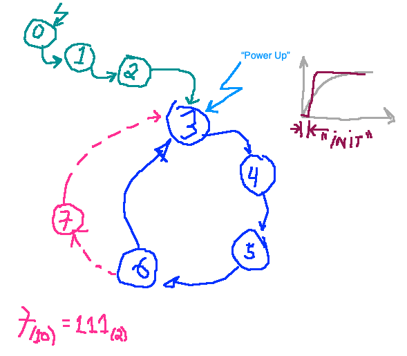
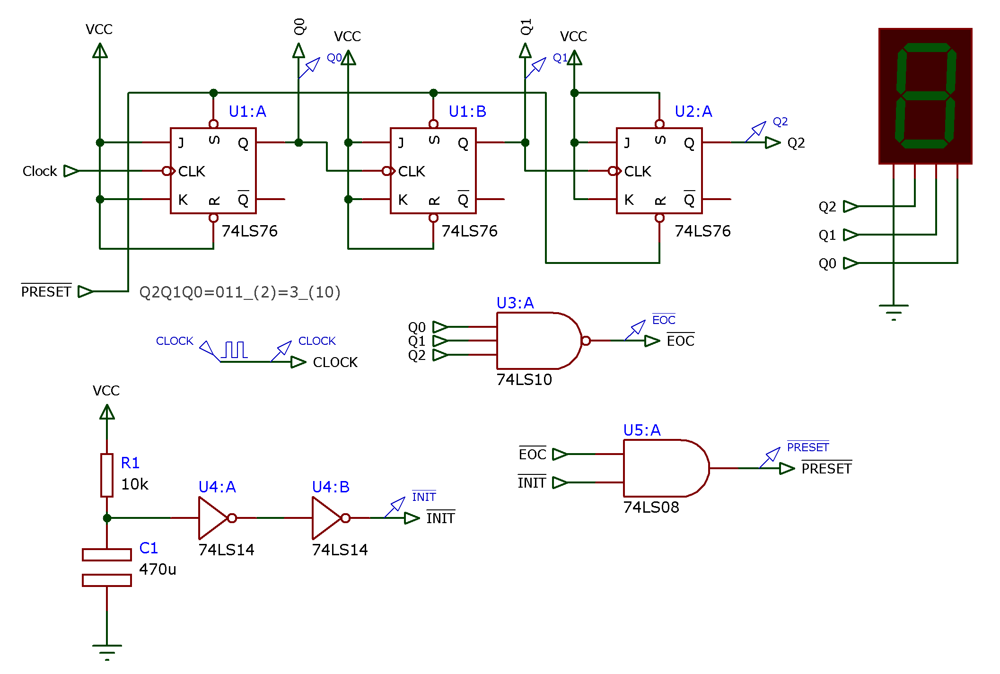
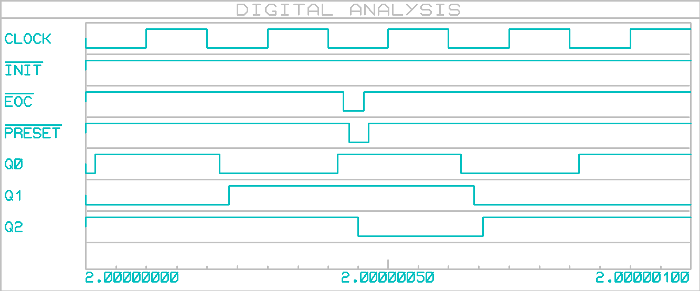

Conteúdo que falta:

- Exercícios com contadores usando FF's discretos;
- Estudar CI's contadores assíncronos: 7490, 7492 e 7493.

---

## Exercícios da 1a-parte de contadores:

### Ex_1) Contador assíncrono de 3 --> 6 (cíclico).

Projete um contador assíncrono capaz de realizar a seguinte sequencia de contagem:


*Solução*:

$3_{(10)}=11_{(2)}$

$6_{(10)}=110_{(2)}$ --> Quantos FF's são necessários? 3 x FF's.

Maior contagem: $Q_2 Q_1 Q_0 = 6_{(10)}=110_{(2)}$.

Qual FF usar?

Usaremos o 74LS76 --> **FF-JK**, borda de subida ou de descida... --> Supondo que seja **borda de descida**.

Descobrindo a "arquitetura" (conexões) necessárias para formar um contador crescente:


O circuito final usa 3 FF's.

Se não forem usadas entradas assíncronas, vamos ter contador "MOD-8": conta de 0 até 7 [ [contador_assync_up_mod8.DSN](contador_assync_up_mod8.DSN) ]:

.gif)

Redesenhando diagrama de estados para contagem desejada:





Como queremos que o circuito já inicie sob certa condição inicial (pulso de $\overline{PRESET}$, ativo BAIXO), se faz necessário que o este sinal seja gerado quando o circuito é iniciado (pulso de $\overline{INIT}$) e também quando o final da contagem é atingido (sinal $\overline{EOC}$). Em resumo, o sinal de PRESET deve ser gerado quando o circuito é iniciado (sinal INIT) e quando o ponto de recycle é necessário (sinal EOC). Com um pouco de álgebra de Boole:

$PRESET=EOC+INIT$  *(raciocinando o Preset em "Ativo ALTO")*

$\overline{PRESET}=\overline{EOC+INIT}$  *(Deduzindo PRESET em ativo BAIXO)*

$\overline{PRESET}=\overline{EOC}\cdot \overline{INIT}$

Circuito: [ [contador_assync_up_3_to_6.DSN](contador_assync_up_3_to_6.DSN) ] -- 1a. versão, sem circuito de Preset no Power Up, isto é, circuito inicia contagem no número 0 avançando até o número 3 logo após sua alimentação; depois não conta mais os números 0, 1 e 2.


Vídeo:

<video src="contador_assync_up_3_to_6.mp4"></video>


2a-versão: com circuito de Power-Up que força Preset (estado inicial em 3): [ [contador_assync_up_3_to_6_ve2.DSN](contador_assync_up_3_to_6_ve2.DSN) ]



Animação:


Formas de onda:



Obs.: Note que para exbir as formas de onda acima, o bloco de gerador de sinais (Clock) foi ajustado para gerar onda quadrada na frequência de 5 MHz (para ressaltar a duração dos sinais $\overline{INIT}$, $\overline{EOC}$ e $\overline{PRESET}$):


E a janela (intervalo) de tempo usado para simulação também foi ajustado de forma a mostrar as formas de onda à partir de 2 segundos (depois que passou o intervalo de geração do sinal de $\overline{INIT}$, proporcional à R1 e C1) e durante apenas + 1 ns (lembrar que sinal de clock estava oscilando à 5 MHz, o que corresponde a um período de: 1/5000000=0,0000002 seg; 5 pulsos de clock = 5 * 0,0000002 = 0,000001 seg ou 1 ns):


---

### Ex_2: contador assíncrono de 5 --> 2 (cíclico).

Agora projete outro circuito capaz de realizar a seguinte sequencia:


*Solução*:

Redesenhando o diagrama de estados:

```
REF | Q2Q1Q0
----+-------
 7. | 1 1 1
 6. | 1 1 0
 5. | 1 0 1
 4. | 1 0 0
 3. | 0 1 1
 2. | 0 1 0
 1. | 0 0 1
 0. | 0 0 0
```

*Solução*:

Circuito final:  [contador_assync_down_5_to_2_ve2.DSN](contador_assync_down_5_to_2_ve2.DSN) :


*Comentários*: 

1. Note que o sinal de $\overline{PRESET}$ é usado para forçar FF's no número 5. 
2. Note que o sinal $\overline{EOC}$ (*End Of Count*= final da contagem) é gerado quando o contador atinge o número $1_{(10)}=001_{(2)}$, mas como este contador conta de maneira decrescente, estas 3 combinações de bits devem ser detectadas, ou seja, $EOC=\overline{Q_2} \cdot \overline{Q_1} \cdot Q_0$.
3. Por fim, foi acrescentado um circuito de inicialização que gerar o sinal $\overline{INIT}$ (ativo BAIXO) para forçar o "PRESET" dos FF's em 5. Assim, quando o circuito é alimentado, ele inicia no número 5.

Formas de onda:


---

Fernando Passold, em 03/09/2021

