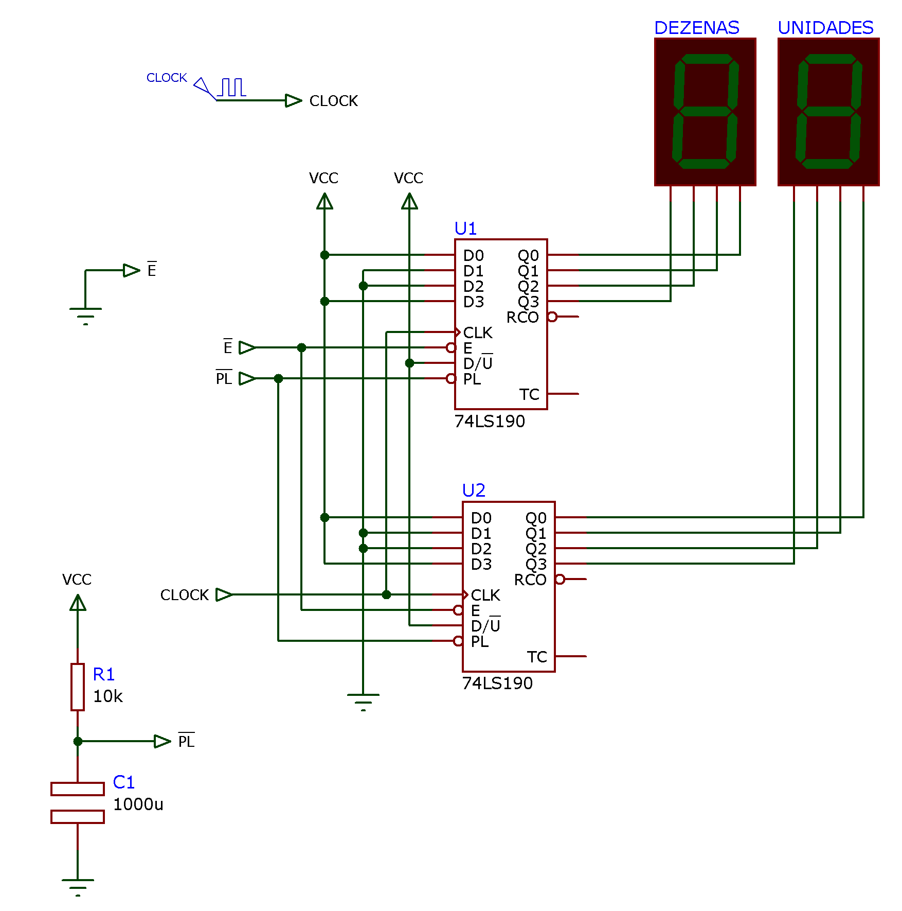
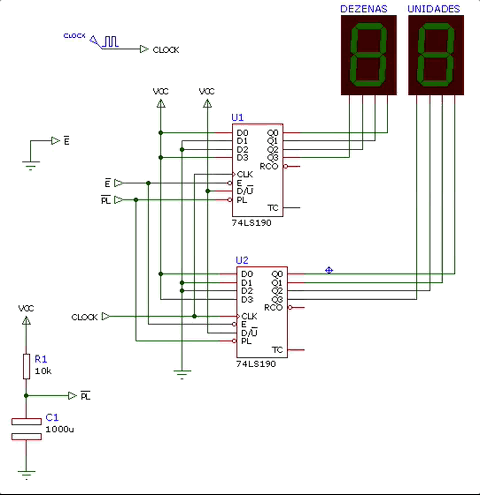
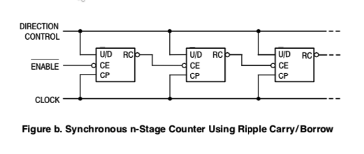
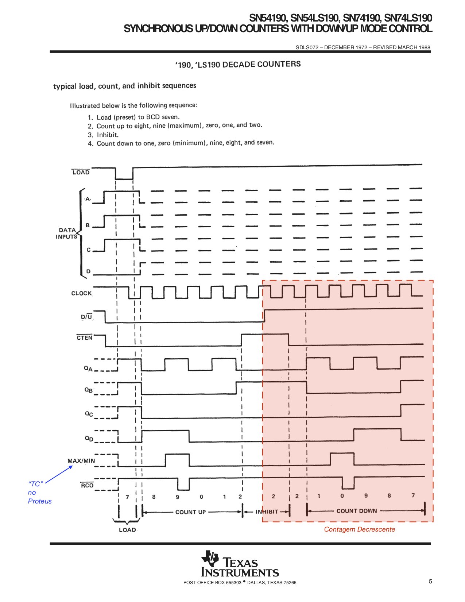
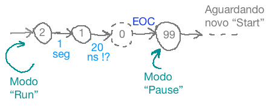
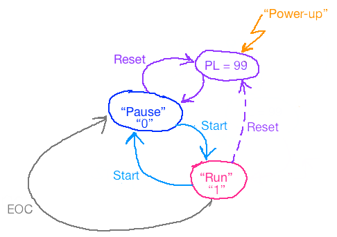
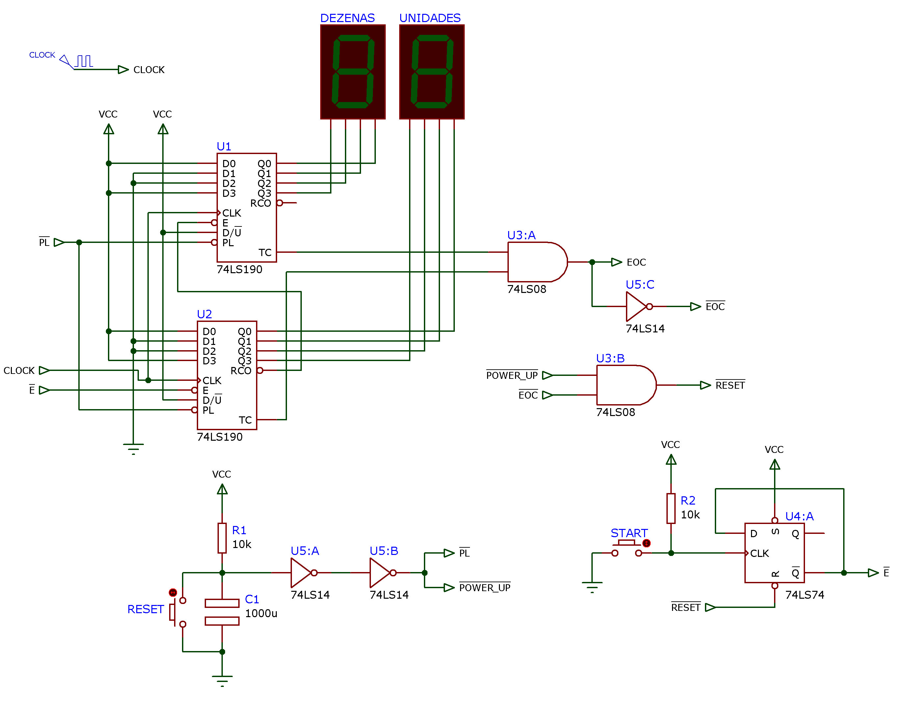

Exemplo de um projeto de circuito digital sequencial/combinacional:

### Cronômetro de contagem regressiva:

Suponha que queremos projetar um contador regressivo capaz de contar de 99 à 0, com ao menos um botão de `Start` que também serve para pausar o circuito, ou seja, o usuário pressiona a primeira vez para iniciar a contagem, se pressionar durante a contagem, ela se detêm (fica pausada) e se este botão for novamente a contagem prossegue até o seu final: 00.

---

Resolvendo o problema:

**Requisitos de projeto:**

* Contar de $99 \longrightarrow 0$ (decrescente);
* O "status" da contagem deve ser mostrado em displays de 7-segmentos;
* botão de `Start/Stop` (comportamento "toggle")

Nota: provavelmente serão necessionários mais botões.

**Iniciando a solução**

Este circuito deverá conter contadores capazes de contagem regressiva (decrescente) e capaz de contar ou gerar código BCD na sua saída (já que o resultado da contagem deve ser mostrado em displays de 7-segmentos).

Lembramos que já existe pronto a pastilha 74LS190 que facilita bastante a parte do contador neste projeto.

**Realizando o contador**:

Um primeiro passo pode ser apenas conectar 2 CIs 74LS190 de forma apropriada para gerar a contagem de forma desejada.

Segue primeira versão deste contador [ [cronometro_1.DSN](cronometro_1.DSN) ]:

Note que este circuito já prevê uma inicialização, usando rede RC (R1 e C1) para gerar um sinal de "Parallel Load" (ativo baixo = $\overline{PL}$) logo que o mesmo recebe alimentação. Isto garante que o circuito já inicia em 99. Note que a entrada $D/\overline{U}$ Dos CIs 74LS190 foram conectados ao nível lógico alto para forçar a contagem descrescente. E temos que prever um sinal de "Enable" para o botão `Start/Sop` exigido no projeto. Mas para o caso deste primeiro teste, esta entrada (ativo baixo = $\overline{E}$) foi temporariamente conectada ao terra. (nível lógico baixo).

Uma simulação deste circuito gera o resultado mostrado na figura abaixo:

E então notamos que nos "esquecemos" de "cascatear" as 2 pastilhas. Os contadores estão simplesmente trabalhando em "paralelo".

Para descobrir como cascatear as 2 pastilhas contadores recorremos ao Data Sheet da mesma. No Data Sheet da Motorola encontramos a seguinte observação:

Atualizando o diagrama elétrico anterior, temos uma nova versão [ [cronometro_2.DSN](cronometro_2.DSN) ]:

Esta versão com as pastilhas cascateadas corretamente funciona conforme o esperado:

Mas apesar desta versão estar com os contadores corretamente cascateados, uma vez atingido o final da contagem, o mesmo recicla, já que por enquanto não foi previsto um circuto que "trava" sua operação. "Travar" a operação significa aqui bloquear o sinal de clock às pastilhas, e para isto, as mesmas já disponibilizam a entrada Enable ($\overline{E}$), e já prevendo seu uso, nosso circuto já disponibilizou a entrada de Enable (Clock), sinal $\overline{E}$ ingressando no pino homônimo na pastilha U2. Resta agora raciocinar como faremos para gerar o sinal $\overline{E}$ corretamente.

Note que a pastilha 74LS190, indica nos seus terminais $\overline{RCO}$ e $TC$ que o final da contagem foi atingido e que um recycle, novo ciclo de contagem está a ponto de recomeçar.

Observando novamente os DataSheets do 74LS190, notamos no material da Texas Instruments, as formas de onda que explicam como estes 2 terminais funcionam. A próxima figura detalha o ciclo de contagem decrescente:

Neste material percebemos que o pino $TC$ (*Terminal Count*) indica o final de contagem decrescente, modificando seu nível lógico que normalmente fica em nível lógico BAIXO para nível lógico ALTO quando a contagem alcança o número 0. As simulações anteriores também comprovam que este pino muda para nível lógico BAIXO apenas enquanto a contagem está no ponto 0 (fim da contagem no caso de contagem decrescente).

Raciocinamendo melhor como um circuito de cronometro deveria funcionar, podemos esboçar um diagrama de estados para o mesmo. Primeira versão:

Este diagrama descreve de forma gráfico como queremos que nosso circuito se comporte. Note que já estamos prevendo um sinal chamado "$EOC$" (*End-Of-Cont*) inidicando o final de contagem.

Notamos também que este diagrama possui apenas 2 estados: o estado "Pause" e o estado "Run" e que o botão `Start/Pause` deveria permitir que o circuito alterne entre estes 2 estados. 

Raciocinando um pouco mais, notamos que configurar um simples **Flip-Flop na configuração "Toggle"** que receba como pulsos de Clock, o sinal gerado pelo botão `Start/Pause` permite implementar facilmente estão função. Cada vez que o usuário pressionar este botão, este FF alernará seu estado entre o modo "Run" e "Pause". E podemos usar o circuito de inicialização RC já previsto anteriormente para ajustar este FF para iniciar o circuito no modo "Pause" (aguardando que o usuário pressione o botão `Start` para dar início à contagem regressiva).

Neste ponto, devemos definir combinações lógicas diferentes para cada um dos estados do circuito. Parece ser mais lógico supor algo como:

* **Estado "Run"**: FF de controle setado (saída principal $Q=1$);
* **Estado "Pause"**: FF de controle resetado (saída principal $Q=0$).

E percebemos que nosso circuito deve iniciar no estado "Pause" e transitar para este estado em 2 situações:

1. Quando o final da contagem é atingido (sinal $EOC$), e
2. Quando o circuito é inicializado (podemos supor um sinal chamado $POWER\_UP$).

Note que esta transição não necessita ser síncrona, ou seja, tão logo os sinais $EOC$ ou $POWER\_UP$ estejam ativos, o $RESET$ (assíncrono) deste FF pode ser gerado.

Especificando este sinal no formato de uma equação teremos:

$RESET=EOC+POWER\_UP$

ou seja, uma simples porta OR poderia resolver o problema.

Mas... nosso circuito não trabalha com estes sinais na lógica "Ativo Alto" e sim ao contrário. O "Parallel Load" das pastilhas 74LS190 é ativo baixo e normalmente o Reset assíncrono dos FFs também é ativo baixo.

Adaptando ao nosso caso a equação anterior, teremos então:

$\overline{RESET}=\overline{EOC+POWER\_UP}$

Lembrando de DeMorgan: $\overline{x+y}=\overline{x} \cdot \overline{y}$, chegamos a solução final:

$\overline{RESET}=\overline{EOC} \cdot \overline{POWER\_UP}$

ou seja, uma simples porta AND vai permitir resolver nosso problema.

Então chegamos à **terceira versão** deste circuito [ [cronometro_3.DSN](cronometro_3.DSN) ]:

> Observação: o circuito com o push-button (não identificado no diagrama acima) gera bordas de subida na entrada de clock de U4:A de uma forma "ideal". Isto é, este circuito implementado no Proteus (simulação) funcionará muito bem, mas na prática, esta chave gera ruído (independente da sua qualidade) e seria necessário complementar esta parte com um circuito de debouncing" para evitar que este botão, da forma desenhada anteriormente, na prática gere vários pulsos de clock ao invés de uma única borda de subida como faz crer o ciruito simulado no Proteus.

Podemos simular este circuito e até pensar que o problema (do cronômetro) foi finalizado:

Mas então percebemos ainda algumas falhas...

E esta "falha" está de certa forma retratada no nosso primeiro diagrama de estados:

Note que quando o final da contagem for atingido, o circuito irá transitar para o estado "Pause" devido ao sinal $EOC$, mas não está claro neste diagrama de estados, como o usuário deve fazer para re-iniciar o cronômetro. 

Note ainda que este diagrama de estados só prevê a carga paralela com o número 99 (início da contagem), quando o mesmo é inicializado, mas não está claro que uma vez atingido o final da contagem, como os contadores vão ser novamente inicializados com o número 99. Aliás, da forma como está desenhado este diagrama de estados, uma vez que o circuito atinge o final de contagem, ele entra no estado "Pause" e mesmo que o usuário pressione novamente o botão `Start/Stop`, o mesmo não vai recomeçar sua contagem porque está "parado" no número 0 e os FF's dos contadores não sofreram um novo "Parallel Load" com o número 99.

Por outro lado, alguém poderia pensar que o próprio sinal $EOC$ poderia ser usado para "pausar" o FF que controla os estados do circuito e para gerar o "Parallel Load" para os contadores, mas neste caso, temos um "efeito colateral". Se o circuito for resolvido desta forma, quando o contador atingir o número 0, o usuário mau vai conseguir identificar o número "00" no display e logo depois notará que contador já "avançou" para o número 99 e que está pausado aguardando um novo "Start". Apesar desta versão do circuto até poder ser considerada "funcional", ele não é muito "simpática" com o usuário. Uma vez atingido o final da contage, seu usuário vai demorar um pouco para perceber e entender que o final da contagem foi atingido, porque o que ele verá será uma transição como:

Ou seja, o número "00" no display aparecerá muito rapidamente no display, durante um intervalo de tempo até imperceptível para o olho humano, e logo após estará aparecendo o número 99, com o circuito pausado. 

Temos que vislumbrar alguma transição mais "elegante" para usuário. É melhor que o número "00" apareça no ciruito quando o mesmo atingir o final da contagem, então o sinal $EOC$ não poderá ser usado para o "Parellel Load". Mas ainda necessitamos um "Parallel Load" se, uma vez atingido o final da contagem, o usuário pressionar novamente o botão `Start`.

Esboçando uma **segunda versão de um diagrama de estados** para o circuito, podemos chegar à:

Neste diagrama, estamos prevendo que caso o usuário pressione o botão `Start` quando o circuito atinge o final da contagem (sinal $EOC$ ainda ativado), antes do FF de controle transitar do estado "Pause" para "Run", seria realizado um "Parallel Load" com o número 99.

Note que este útimo diagrama também tenta prever que o sinal de inicialização ("Power-up") já realize o "Parallel Load". 

Mas este diagrama também deixa entrever, que logo após o Parallel Load, o circuito já inicia sua contagem decrescente sem esperar que o usuário pressione o botão `Start/Pause`.  

Então percebemos que este diagrama de estados ainda não é o ideal.

Pensando um pouco mais, podemos imaginar uma solução simples para este problema. 

Note que apenas 1 botão para este circuito parece mesmo muito pouco, uma forma muito restrita de "interface" com o usuário. Uma solução bem mais simples que ajudar a resolver o problema é simplesmente acrescentar um **segundo botão**: `Reset` que faz o Parallel Load dos contadores com o número 99. Este botão é fácil de implementar se lembrarmos que basta forçar a recarga do capacitor usado no circuito de "Power-Up" (pressionar o botão resulta num curto-circuito nos terminais do capacitor; sua descarga imediata para o terra).

Note ainda que o sinal gerado por este botão também pode ser adotado para forçar o FF de controle do circuito, para o modo "Pause", ou seja, se o usuário pressionar o botão de `Reset`, os contadores são imediatamente carregados com o número 99 (note que a entrada "Parallel Load" dos CIs 74LS190 é assíncrona) e depois disto, o circuito entra no modo "Pause" aguardando que o usuário re-inicie a contagem regressiva somente se o mesmo pressionar o botão `Start/Pause`.

Então teremos nossa terceira versão de um diagrama de estados para este circuito:

Note que o tereceiro estado "Parallel Load" (PL=99 na figura) dura muito pouco tempo. Aliás, o próprio tempo que o usuário pressiona o botão de `Reset`. 

Nesta versão o talvez único inconveniente seja que, uma vez pressionado o botão `Reset`, o circuito imediatamente realiza o Parallel Load e ajusta seu FF de controle para o estado "Pause", não importa se isto aconteceu no meio de uma contagem (durante o estado "Run").

Completando o diagrama elétrico [ [cronometro_6.DSN](cronometro_6.DSN) ]:

Uma simulação mostrando como o circuito opera desde que foi energizado resulta em:

Note que o circuito inicial com o Parallel Load e depois aguarda o botão de `Start`. Se este botão for pressionado novamente, ele permite pausar a contagem. E se pressionado novamente, permite prosseguir a contagem.

Na simulação acima se percebe que pressionar o botão `Reset` força o circuito ao seu estado "inicial" de Parallel Load.

A próxima simulação já parte com circuito contando em 44 e mostra como ele se comporta quando atinge o final da contagem e como o usuário pode forçar o re-inicio no mesmo pressionando o botão `Reset`. 

Obervação final: Poderá ser notado nas simulações que o botão `Start` pode passar a ilusão de que não funciona instantes após o Parallel Load. Mas deve ser notado que estamos usando um valor de resistor e capacitor bem elevados no circuito RC, o que causa este "sintoma". Para corrigir este problema basta reduzir o valor de capacitor principalmente. Note que os sinais $\overline{PL}$ e $POWER\_UP$ só necessitam durar o maior valor de $T_{W(L)}$ indicado para as pastilhas 74LS74 ou 74LS190 (algo em torno de 10 à 40 ns). 

---

Fim.

Prof. Fernando Passold, em 28/11/2021

