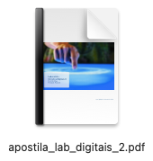

# Lab. Circuitos Digitais II

Disciplina prática voltada para experimentos reais com eletrônica digital sequencial.

| Material | Obs: |
| :---: | :--- |
|  | Apostila disponível: [[apostila_lab_digitais_2.pdf](apostila_lab_digitais_2.pdf)]  18.5 Mbytes;  80 páginas;  15 experimentos. |

Estão contempladas as seguintes atividades práticas:

1 Biestável RS Básico com portas NAND
	1.1 Objetivos
	1.2 Fundamentos Teóricos 
	1.3 Parte Prática
	1.4 Formulário à Completar

2 Latch e Flip-Flop tipo D. 
	2.1 Objetivos.
	2.2 Fundamentos Teóricos
	2.3 Parte Prática
	2.4 Questões

3 Contador Assíncrono usando Flip-Flop tipo D 15
	3.1 Objetivos
	3.2 Fundamentos Teóricos
	3.3 Parte Prática
		3.3.1 Primeira Montagem
		3.3.2 Segunda Montagem
	3.4 Questões
	3.5 Sugestões
	3.6 Anexo1: Como usar Gerador de Sinais
	3.7 Anexo2: Gerador de Pulso de Clock

4 Contador Assíncrono Módulo−n com Reset Manual
	4.1 Objetivos
	4.2 Fundamentos Teóricos
	4.3 Parte Prática
	4.4 Questões

5 Contador Assíncrono U p/Down
	5.1 Objetivos
	5.2 Fundamentos Teóricos 
	5.3 Parte Prática
	5.4 Questões

6 Divisor de frequência
	6.1 Objetivos
	6.2 Fundamentos Teóricos 
	6.3 Parte Prática
	6.4 Questões

7 Aplicação de Ripple Counter
	7.1 Objetivos
	7.2 Fundamentos Teóricos
	7.3 Parte Prática
	7.4 Questões

8 O Contador Síncrono 74190
	8.1 Objetivo 
	8.2 Fundamentos Teóricos 
	8.3 Parte Prática
	8.4 Perguntas

9 Aplicação de Contador Síncrono 74190
	9.1 Objetivo
	9.2 FundamentosTeóricos
	9.3 PartePrática
	9.4 Perguntas 

10 Máquina síncrona “Exótica”
	10.1 Introdução
	10.2 Projeto
	10.3 Circuito(PartePrática)
		10.3.1 Módulo de Chaves
		10.3.2 Interface de Saída
	10.4 Formas de onda
	10.5 Teste sugerido

11 Projeto Contador Síncrono [2022/1]
	11.1 Introdução
	11.2 EmbasamentoTeórico
	11.3 Projeto
		11.3.1 Análise do caso do estado (inicial) "7”
	11.4 Explorando Outras Soluções
	11.5 Solução usando MUXes
	11.6 Problema: estado inicial dos FF’s
		11.6.1 Solução à nível de Simulação
	11.7 Possível solução para inicialização dos FF’s 
	11.8 Circuito final com "Parallel Load”

12 Contador Johnson usando Reg. de Deslocamento 74LS164
	12.1 Fundamentos Teóricos
	12.2 Parte Prática
	12.3 Questões

13 Contador em Anel usando Registrador de Deslocamento 74194
	13.1 Fundamentos Teóricos
	13.2 Parte Prática
	13.3 Questões

14 Contador Johnson Bidirecional usando Registrador Bidirecional
	14.1 Fundamentos Teóricos
	14.2 Parte Prática
	14.3 Perguntas

15 Circuito Transmissor/Receptor Serial Síncrono
	15.1 Fundamentos Teóricos 
	15.1.1 Circuito Transmissor (TX)
	15.1.2 Circuito Receptor (RX) 
	15.2 Parte Prática 
	15.3 Questões 

Fim.

---

Fernando Passold, 2024.