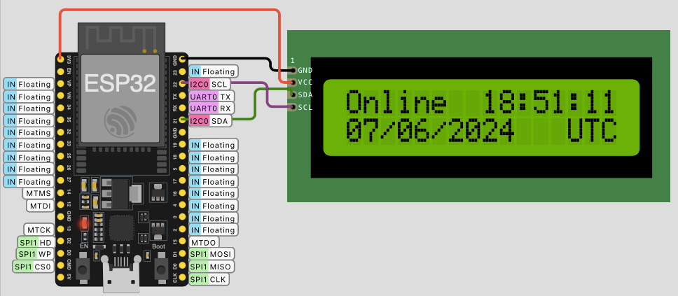

# Wokwi

[Esta plataforma web on-line](https://wokwi.com) permite simular:

* [Placas Arduino](https://wokwi.com/arduino)
* [Placas ESP32](https://wokwi.com/esp32)
* [Placas STM32](https://wokwi.com/stm32)
* [Placa Rasp Pi Pico](https://wokwi.com/pi-pico)


Exemplo: [ESP32 NTP Examplo.ino](https://wokwi.com/projects/321525495180034642):



Diagrama: diagram.json:

```json
{
  "version": 1,
  "author": "Anonymous maker",
  "editor": "wokwi",
  "parts": [
    { "type": "board-esp32-devkit-c-v4", "id": "esp", "top": -76.8, "left": 43.24, "attrs": {} },
    {
      "type": "wokwi-lcd1602",
      "id": "lcd1",
      "top": -70.4,
      "left": 188,
      "attrs": { "pins": "i2c" }
    }
  ],
  "connections": [
    [ "esp:TX", "$serialMonitor:RX", "", [] ],
    [ "esp:RX", "$serialMonitor:TX", "", [] ],
    [ "lcd1:SDA", "esp:21", "green", [ "v-4.49", "h-28.8", "v23.89" ] ],
    [ "lcd1:GND", "esp:GND.2", "black", [ "h-16.67", "v162.78" ] ],
    [ "lcd1:VCC", "esp:3V3", "red", [ "h-9.6", "v-57.5", "h-134.55" ] ],
    [ "lcd1:SCL", "esp:22", "purple", [ "h-19.2", "v-18.9" ] ]
  ],
  "dependencies": {}
}
```

código: ESP32 NTP Exemplo.ino:

```c++
// Learn about the ESP32 WiFi simulation in
// https://docs.wokwi.com/guides/esp32-wifi

#include <WiFi.h>
#include <Wire.h>
#include <LiquidCrystal_I2C.h>

LiquidCrystal_I2C LCD = LiquidCrystal_I2C(0x27, 16, 2);

#define NTP_SERVER     "pool.ntp.org"
#define UTC_OFFSET     0
#define UTC_OFFSET_DST 0

void spinner() {
  static int8_t counter = 0;
  const char* glyphs = "\xa1\xa5\xdb";
  LCD.setCursor(15, 1);
  LCD.print(glyphs[counter++]);
  if (counter == strlen(glyphs)) {
    counter = 0;
  }
}

void printLocalTime() {
  struct tm timeinfo;
  if (!getLocalTime(&timeinfo)) {
    LCD.setCursor(0, 1);
    LCD.println("Connection Err");
    return;
  }

  LCD.setCursor(8, 0);
  LCD.println(&timeinfo, "%H:%M:%S");

  LCD.setCursor(0, 1);
  LCD.println(&timeinfo, "%d/%m/%Y   %Z");
}

void setup() {
  Serial.begin(115200);

  LCD.init();
  LCD.backlight();
  LCD.setCursor(0, 0);
  LCD.print("Connecting to ");
  LCD.setCursor(0, 1);
  LCD.print("WiFi ");

  WiFi.begin("Wokwi-GUEST", "", 6);
  while (WiFi.status() != WL_CONNECTED) {
    delay(250);
    spinner();
  }

  Serial.println("");
  Serial.println("WiFi connected");
  Serial.print("IP address: ");
  Serial.println(WiFi.localIP());

  LCD.clear();
  LCD.setCursor(0, 0);
  LCD.println("Online");
  LCD.setCursor(0, 1);
  LCD.println("Updating time...");

  configTime(UTC_OFFSET, UTC_OFFSET_DST, NTP_SERVER);
}

void loop() {
  printLocalTime();
  delay(250);
}
```

Adendos:

Libraries.txt:

```
LiquidCrystal I2C

```

Library Manager:

* Installed Libraries:
  * LiquidCrystal I2C

---

Outros exemplos:

*  [ESP32 Bluetooth Scanning example](https://wokwi.com/projects/397088651077551105):
* 

----

<script language="JavaScript">
<!-- Hide JavaScript...
var LastUpdated = document.lastModified;
document.writeln ("🌊 Fernando Passold, página criada em 07/06/2024 15:50, atualizada em " + LastUpdated); // End Hiding -->
</script>

