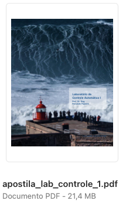

<!-- title: Lab de Controle 1 -->

# Lab de Controle Automático 1

Disciplina prática associada com a teórica de [**Controle Automático II**](https://fpassold.github.io/Controle_2/index.html).

São aulas práticas usando kits da Feedback (empresa inglesa).

Experimentos previstos:

* Parte I: Servo-sistema CC
    * 1 Introdução ao Kit MS150 da Feedback
    * 2 Amplificador Operacional
    * 3 Características do Motor CC
    * 4 Estudo do Canal de Erro
    * 5 Controle de Posição Simples
    * 6 Sistema de Controle de Posição em Malha Fechada
    * 7 Sistema Simples de Controle de Velocidade
    * 8 Banda Morta e Resposta a Degrau
    * 9 Realimentação de Velocidade em Malha de Controle de Posição

* Parte II: Servo-sistema CA
    * 10 Erro num sistema síncrono
    * 11 O Demodulador (MD150S)
    * 12 Servo-sistema com link síncrono

[**Apostila**](apostila_lab_controle_1.pdf) disponível em **formato PDF** (135 páginas, formato A4, frente e verso, 21.4 Mbytes) --> clique [aqui](apostila_lab_controle_1.pdf) para baixar

---

Prof. Fernando Passold, em 03/08/2023
