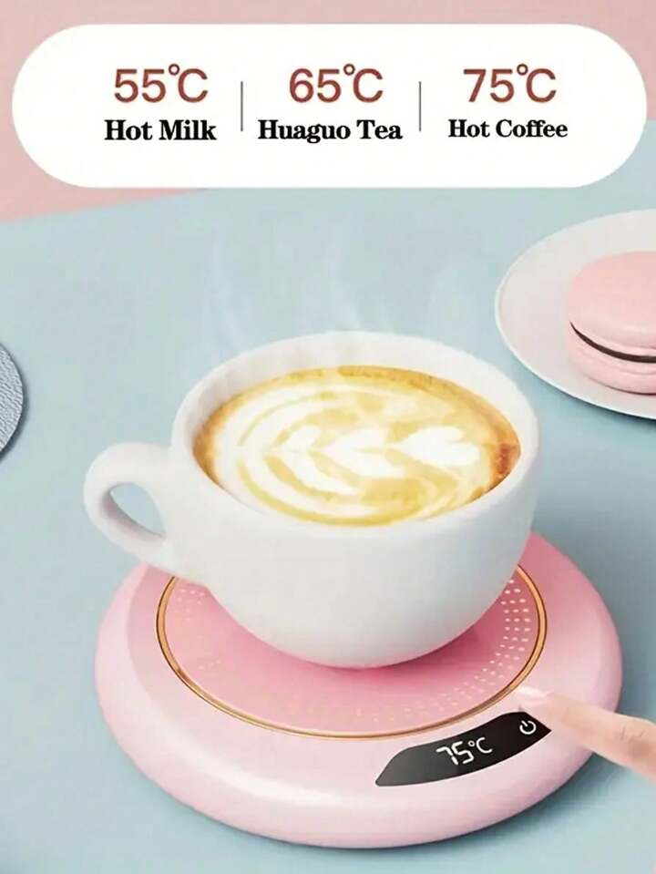
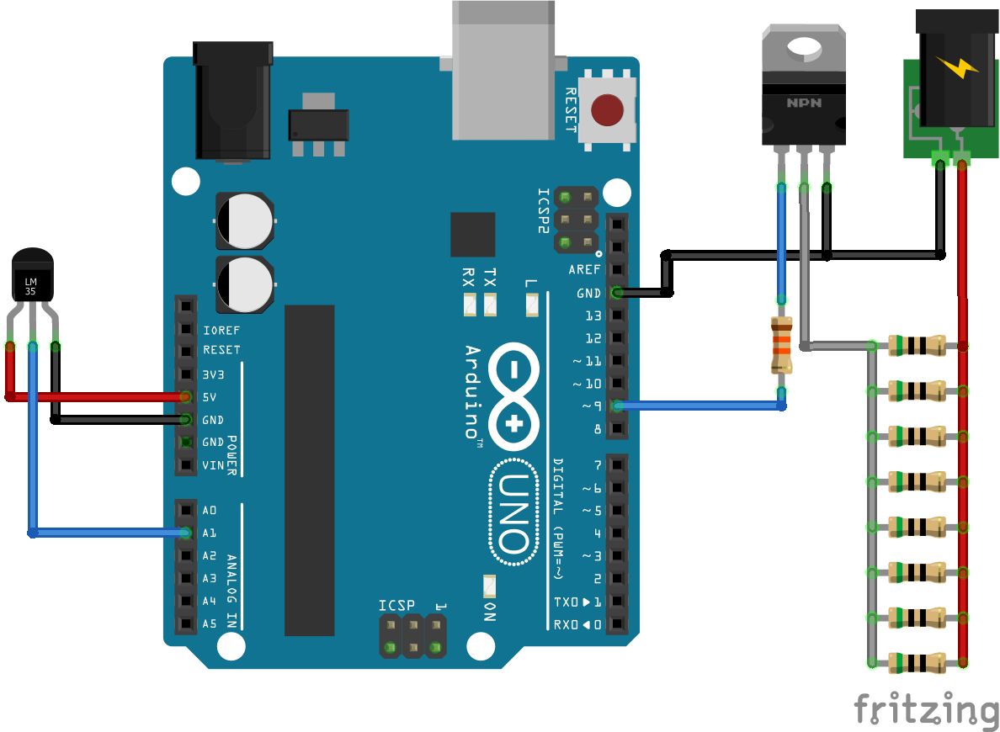
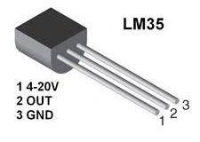
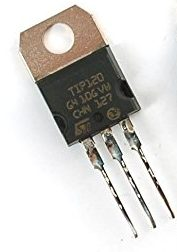
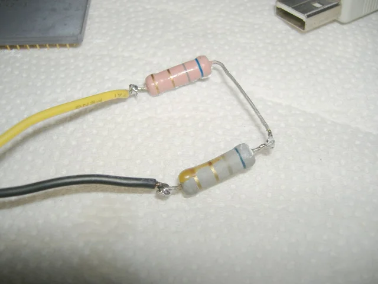
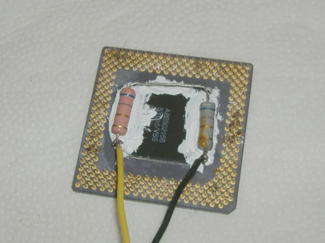
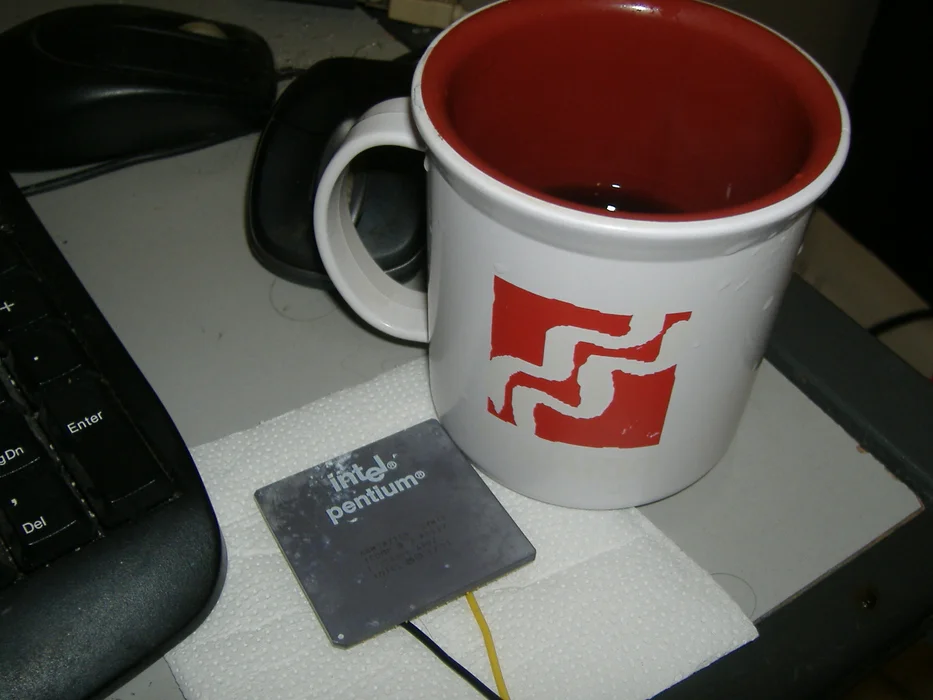

# Aquecedor de Xicara de Café

**Inspiração**: manter xícara de café aquecido, similar a equipamentos como:

Para tanto, podemos montar um circuito similar à:

**Alguns cálculos**:

A unidade de energia SI é o Joule. 4,186 Joule = **1 caloria** ou cal. 

A caloria, cal, é definida como a quantidade de energia (calor) necessária para aumentar a temperatura de um grama de água em $1^o$C. Uma quilo-caloria, 1 Kcal, equivale a **1000** pequenas calorias. 

Um copo de água = cerca de 450 gramas.

Uma xícara grande de café $\cong$ 200 ml =  200 gramas.

Vamos tentar estimar qual a "perda térmica" ou decaimento de temperatura se nossa xícara de café for deixada resfriando à temperatura ambiente.

Obedecendo a lei de Resfriamento de Newton e considerando que estamos usando uma xícara de cerâmica polida:

$\dfrac{dT}{dt}=-k(T-T_{amb})$

Onde:
$T=$ temperatura inicial do café (em $^o$C);
$T_{amb}=$ temperatura do ambiente (em $^o$C);
$k=$ constante de resfriamento (em min$^{-1}$);
$\frac{dT}{dt}=$ taxa de variação de temperatura (em °C/min).

A constante $k$ depende das propriedades térmicas do café, da xícara e das condições ambientais. Para uma xícara de cerâmica polida, valores típicos de $k$ variam de 0,01 a 0,05 min$^{-1}$. Vamos assumir um valor intermediário, $k=0,03$  min$^{-1}$, como uma estimativa. Então:

$T(t)=T_{amb}+(T_{inicial}-T_{amb})e^{-k \cdot t}$

O café, para não perder seu sabor deve ser preparado à 97 $^o$C e depois deve ser servido à 65 $^o$C. Se for considerado uma temperatura ambiente de 20 $^o$C, teremos:

$T(1)=20+(65-20)e^{-0,03 \times 1}$

$T(1)=20+45e^{-0,03}$

$T(1)=20+45 \times 0,9704$

$T(1)=20+43,668$

$T(1)=63,67$  $^o$C 

Ou seja, passados 1 minuto, a temperatura da xícara de café teria baixado de:

$\Delta T=T_{inicial}-T(1)$

$\Delta T=65-63,67$

$\Delta T = 1,33$ $^o$C.

Podemos então compensar esta queda de temperatura estimando a energia que seria necessária acrescentar ao sistema para compensar esta queda:

$Q=m\,c\,\Delta T$

onde: 
$Q=$ energia térmica em Joules (J);
$m=$ massa à ser aquecida (em Kg);
$c=$ calor específico do elemento à ser aquecido (J/g$^o$C). No caso da água: $c=$ 4,186 J/g°C ou 4186 J/kg°C.
$\Delta T=$ variação de temperatura em graus Celcius ($^oC$).

$Q=0,2 \times 4186 \times 1,33 $

$Q= 1113,5$ (J) 

Como:

$E=P \times t$

Onde:
$E=$ energia em Joules (J):
$P=$ potência em watts (W);
$t=$ intervalo de tempo (em segundos).

Então:

$P=\dfrac{E}{t}$

ou seja: Watts = Joule / segundos

Então, passados 1 minutos, algum elemento de aquecimento teria que dissipar:

$P=\dfrac{1113,5}{60}=18,558$ (W).

Sendo um pouco conservadores, vamos limitar esta potência dissipada em 2,5 Watts. Isto implicaria em:

$E=60 \times 2,5 = 150$ (J)

$\Delta T = \dfrac{Q}{m\,c}$

$\Delta T = \dfrac{150}{0,2 \times 4186}$

$\Delta T = 0,17917$ $^oC$

ou seja, estaríamos prevendo uma queda de 0,18 $^oC$ passados 1 minuto.

**Circuito do Aquecimento**:

Então só precisamos montar um circuito elétrico capaz de dissipar 2,5 Watts. Podemos fazer isto usando resistores de potência. Mas vamos tentar alimentar nosso circuito com tensão de 5 Volts, consumindo no máxiumo uns 500 mA que a corrente máxima normalmente admitida em saídas USB de computadores. Na prática, vamos usar um "eliminador de bateria" para evitar sobre-carregar a porta USB do computador. A alimentação destes resistores será feita via fonte de energia externa (como mostrado no circuito da figura anterior).

Um boa opção é usar **2 resistores em série de $6,8\Omega$**. Neste caso, teremos:

$i=\dfrac{V}{R}=\dfrac{5}{2\times 6,8}=\dfrac{5}{13,6}=0.36765 \quad$(A) = 367,65 mA.

Esta corrente está abaixo dos 500 mA, o que significa que poderíamos usar uma porta USB do computador para alimentar este circuito.

Cada resistores detes vai dissipar:

$P=V\times I=2,5 \times 0,36765 = 0,91912$ (W)

Isto significa que cada resistor destes deve ser capaz de dissipar 1 W de calor.

em conjunto, serão dissipados $2 \times 0,91912=1,8382$ (W).

Usando estes resistores, vamos estar produzindo calor um pouco abaixo do necessário. 
Estimando a "perda" (queda de temperatura) á cada minutos, teremos:

A energia que seria dissipada em 1 minuto (60 segundos) seria de:

$E=P \times t$

Onde:
$E=$ energia em Joules (J);
$P=$ Potência em watts (W);
$t=$ intervalo de tempo em segundos (s).

$E=1,8382 \times 60$

$E=110,29$ (J)

Considerando questões de transferência de calor e mudança de temperatura:

$Q=m\,c\,\Delta T$

$\Delta T = \dfrac{Q}{m\,c}$

onde $m=$ 0,2 Kg e $c=$ 4186 J/kg°C (calor específico da água/café).

$\Delta T = \dfrac{110,29}{0,2 \times 4186}$

$\Delta T \cong$ 0,13174 $^o$C.

Portanto, se considerarmos que a energia dissipada pelo resistor é absorvida pelo café, a temperatura do café deve diminuir cerca de 0,13 graus Celsius em 1 minuto. Na prática, a redução de temperatura será um pouco maior devido às perdas de calor para o ambiente, mas este cálculo fornece uma estimativa da contribuição direta do resistor para a variação de temperatura.

**Pinagens de alguns componentes**:

LM35: sensor de temperatura:

Transístor de potência usado para comutar os resistores:

Associação série de resistores de 6,8 Omhs $\times$ 1 Watts:

Estes resistores poderiam ser montados numa superfície metálica própria para dissipar o calor:

Para obter algo como:

**Inspiração**

Autodesk Instructable: **[USB Heater (or How to Upgrade Your Coffee Cup)](https://www.instructables.com/USB-Heater-or-How-to-Upgrade-Your-Coffee-Cup/)**. (Acessado em 19/05/2024).

----

