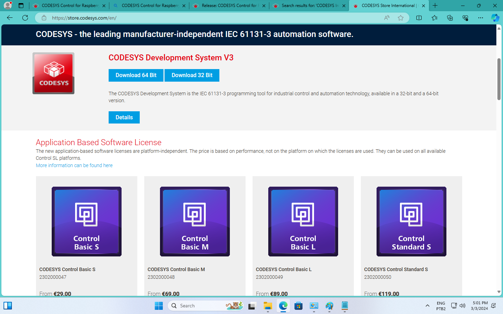

# Instalação do CODESYS num PC/Windows

App´s disponíveis:

* CODESYS Control for Raspberry Pi SL --> https://store.codesys.com/codesys-control-for-raspberry-pi-sl.html?___store=en
* CODESYS CONTROL FOR RASPBERRY PI MC SL --> https://www.codesys.com/news-events/press-releases/article/release-codesys-control-for-raspberry-pi-mc-sl-4500.html
* CODESYS Development System V3 --> https://store.codesys.com/en/
  The CODESYS Development System is the IEC 61131-3 programming tool for industrial control and automation technology, available in a 32-bit and a 64-bit version.

Vamos instalar o "CODESYS Development System V3" porque o mesmo disponibiliza algumas ferramentas para programação de CLP´s, entre elas o **desejado**: "CODESYS Control for Raspberry Pi SL", ver figura abaixo:

Rolando a página aparece:

No caso do computador deste tutorial, estamos optando pela versão de 64-bits --> . Note que para baixar qualquer arquivo do grupo CODESYS é exigido um cadastramento prévio grátis e login.

Será baixado o arquivo `CODESYS 64 3.5.19.50.exe` de 1.4 GB (o download pode demorar, o servidor do CODESYS Store é lento ou pouco otimizado).

