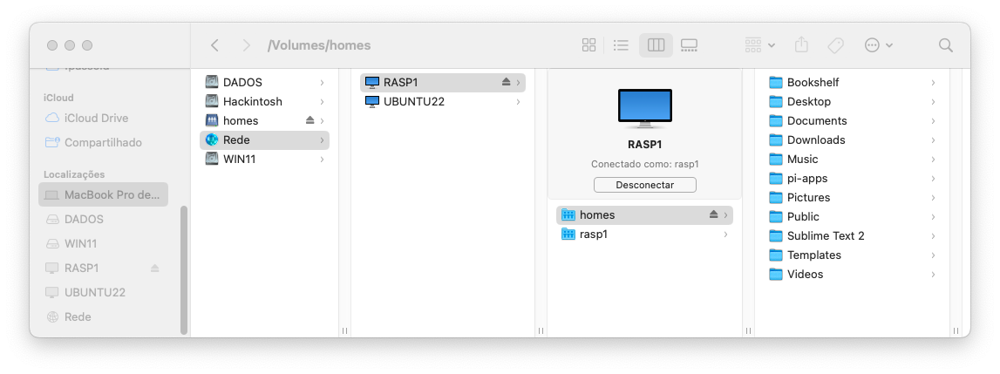

# SSH para um Raspberry

Para descubrir o número IP da sua placa Rasp, abra uma janela de terminal no Rasperry OS e digite:

```bash
$ hostame
rasp
$
```

ou:

```bash
$ hostname -I
169.254.52.187 192.168.0.127
```

E então, no outro computador faça:

Uma vez conhecido o número de IP da placa Rasp, abrir uma janela de comandos ou terminal e fazer:

```bash
fernandopassold@MacBook-Pro-de-Fernando ~ % ssh rasp1@192.168.0.127
rasp1@192.168.0.127's password:
Linux raspberrypi 6.1.0-rpi4-rpi-v7 #1 SMP Raspbian 1:6.1.54-1+rpt2 (2023-10-05) armv7l

The programs included with the Debian GNU/Linux system are free software;
the exact distribution terms for each program are described in the
individual files in /usr/share/doc/*/copyright.

Debian GNU/Linux comes with ABSOLUTELY NO WARRANTY, to the extent
permitted by applicable law.
Last login: Sun Oct 29 02:24:19 2023
rasp1@rasp1:~ $
rasp1@rasp1:~ $ neofetch
  `.::///+:/-.        --///+//-:``    rasp1@rasp1 
 `+oooooooooooo:   `+oooooooooooo:    --------------------------- 
  /oooo++//ooooo:  ooooo+//+ooooo.    OS: Raspbian GNU/Linux 12 (bookworm) armv7l 
  `+ooooooo:-:oo-  +o+::/ooooooo:     Host: Raspberry Pi 3 Model B Rev 1.2 
   `:oooooooo+``    `.oooooooo+-      Kernel: 6.1.0-rpi4-rpi-v7 
     `:++ooo/.        :+ooo+/.`       Uptime: 17 mins 
        ...`  `.----.` ``..           Packages: 1713 (dpkg) 
     .::::-``:::::::::.`-:::-`        Shell: bash 5.2.15 
    -:::-`   .:::::::-`  `-:::-       Resolution: 1360x768 
   `::.  `.--.`  `` `.---.``.::`      Terminal: /dev/pts/1 
       .::::::::`  -::::::::` `       CPU: BCM2835 (4) @ 1.200GHz 
 .::` .:::::::::- `::::::::::``::.    Memory: 190MiB / 921MiB 
-:::` ::::::::::.  ::::::::::.`:::-
::::  -::::::::.   `-::::::::  ::::                           
-::-   .-:::-.``....``.-::-.   -::-                           
 .. ``       .::::::::.     `..`..
   -:::-`   -::::::::::`  .:::::`
   :::::::` -::::::::::` :::::::.
   .:::::::  -::::::::. ::::::::
    `-:::::`   ..--.`   ::::::.
      `...`  `...--..`  `...`
            .::::::::::
             `.-::::-`

rasp1@rasp1:~ $ uptime
 19:54:26 up 37 min,  3 users,  load average: 0.00, 0.00, 0.00
rasp1@rasp1:~ $ uname -a
Linux raspberrypi 6.1.0-rpi4-rpi-v7 #1 SMP Raspbian 1:6.1.54-1+rpt2 (2023-10-05) armv7l GNU/Linux
rasp1@rasp1:~ $ lsb_release -d
No LSB modules are available.
Description:	Raspbian GNU/Linux 12 (bookworm)
rasp1@rasp1:~ $
rasp1@rasp1:~ $ cat /etc/debian_version
12.1
rasp1@rasp1:~ $ echo $USER
rasp1
rasp1@rasp1:~ $  
```

Obs.: A senha para a placa RASP1 é "rasp1".

Computadores Apple costumam localizar mais rapidamente placas Rasp (infelizmente este pode não ser o caso numa rede Windows):



No Windows talvez será necessário instalar o **[PuTTY](https://www.putty.org)** (terminal para conexões remotas).

Eventualmente poderá ser necessário configurar o PuTTY para trabalhar com caracteres UTF-8 para evitar problemas com acentuação. Se o Rasp foi bem configurado para Português Brasil, o comando `$ echo $LANG` deve retornar: `pt_BR`.

---

Fernando Passold, em 07/03/2024.