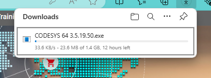

# Codesys

##  Breve descrição

Trata-se de software desenvolvido pelo grupo CODESYS, Kempten, Alemanha.

O CODESYS Control para Raspberry Pi SL contém um aplicativo **CODESYS Control** para todos os Raspberry Pi, incluindo o **Módulo de Computação (*Compute Module*)** (consulte http://www.raspberrypi.org/), bem como a capacidade de usar os módulos de extensão e vários dispositivos/breakouts com interface de comunicação SPI, I²C ou 1 fio.

Este produto pode ser instalado com o plug-in **CODESYS Deploy Tool** incluído através do Sistema de Desenvolvimento CODESYS no sistema Linux do Raspberry Pi. Após cada reinicialização, o sistema de tempo de execução será iniciado automaticamente. 

:warning: Após inicializado o runtime do CODESYS numa placa Rasp, se nenhuma licença completa válida puder ser encontrada, o CODESYS Control será executado por duas horas sem limitações funcionais antes de desligar.

:warning: A combinação de Raspberry Pi e do CODESYS Runtime é para uso privado, teste e fins de ensino. O uso comercial não é permitido. Não liberado para uso em contêineres ou máquinas virtuais (VMs)! O CODESYS Control para Raspberry Pi SL 4.11.0.0 não suporta GPIOs para o Raspberry Pi 5.

Informações detalhadas podem ser encontradas na [Ajuda Online](https://content.helpme-codesys.com/en/CODESYS Control/_rtsl_start_page.html). Recomenda-se em especial iniciar pelo item "[Getting Started](https://content.helpme-codesys.com/en/CODESYS%20Control/_rtsl_first_steps.html)".

---

## Requisitos

* Raspberry Pi $\ge$ 2B
* Cartão SD $\ge$ 8 GM (Sistema operacional Raspbian + runtime do Codesys)

## Vantagens:

* Permite programação usando norma IEC 61131-3 3rd Edition “PLC Programming Languages” de 07/2021 -- [Detalhes](https://www.codesys.com/index.php?eID=tx_securedownloads&p=277&u=0&g=0&t=1709131940&hash=39e58a88b2819a6f82038925962d2603732ce789&file=/fileadmin/Download/ALL/Manuals/ComplianceTable.pdf).
* Suporta:
  * Câmera Raspberry Pi
  * Interface I²C, com SenseHat, SRF02, Adafruit PWM, MPU6050 Gyro, MPU9150 Gyro, AK8975 Compass
  * Interface SPI, com MCP3008, MCP23S17, PiFace Digital, Display de Controle PiFace
  * Interface de um fio, com DS20B18
  * GPIO do Rasp.

## Desvantagens

==Carece de módulos A/D, D/A, PWM, ou "Rack"== para instalação de módulos externos (necessários para ligação do Rasp ao equipamento à ser controlado).

Diferente de um CLP industrial, considerar que uma placa Raspberry não é construída para ser tolerante à interferências eletromagnéticas originadas de motores elétricos, inversores de frequência e nem foi projetada para trabalhar 24 horas, 7 dias por semana a até 70 $^o$C.

## Instalação

* [Video ilustrando instalação](https://youtu.be/uNpAhK9QdWQ?si=EiSeT_KHeO_KqkoF) (Publicado há +1 ano, 27/02/2023)
* Página principal do "Codesys Store". Baixar "[CODESYS Control for Raspberry Pi SL](https://store.codesys.com/en/codesys-control-for-raspberry-pi-sl.html)" (runtime Engine for PLC extension; free for non-comercial use: seu funcionamento fica limitado a no máximo 2 horas contínuas de execução). (CODESYS Control for Raspberry PI 4.11.0.0.package: 98,5 MB) - **Atenção**: para poder baixar o arquivo, é necessário se cadastrar (gratuitamente). Será baixado um "package" (ver forma de instalar mais abaixo).
* Atenção: Pré-requisito: [Raspberry Pi OS (**32-bits**)](https://www.raspberrypi.com/software/) --> esta versão atualmente seria a "[Raspberry Pi OS with desktop](https://downloads.raspberrypi.com/raspios_armhf/images/raspios_armhf-2023-12-06/2023-12-05-raspios-bookworm-armhf.img.xz)" (Debian 12 = Bookworm, 5/12/2023, 1.31 Gb) ou =="[Raspberry Pi OS (Legacy) with desktop](https://downloads.raspberrypi.com/raspios_oldstable_armhf/images/raspios_oldstable_armhf-2023-12-06/2023-12-05-raspios-bullseye-armhf.img.xz)" (Debian 11 = Bullseye, 32-bits, 5/12/2023, 937 MB) <-- parece ser melhor instalar a versão 11 do Debian (principalmente em placas mais antigas Rasp II ou Rasp III)==.
* As próximas linhas supõem que o Raspberry Pi OS já esteja instalado no Raspberry :exclamation:

---

## Download do CODESYS

Para tanto, se faz necessário baixar o [CODESYS Development System V3](https://us.store.codesys.com), preferenciaclmente à partir da sua loja nos Estados Unidos (conexão mais rápida, média de 250 KB/s, ETA até 2 horas). 


Será necessário realizar cadastro e login na "Store" do grupo Codesys para poder baixar este software:


:warning: Baixar este software da loja internacional é impraticável devido à baixa velocidade de conexão (em torno de 23 KB/s). Considere que este programa ocupa aproximadamente 1,6 GBytes, o que leva a um ETA de 12 horas ou mais. Considere fortemente realizar o download à partir da sua loja nos Estados Unidos (conexão mais rápida, média de 250 KB/s, ETA até 2 horas). 



Uma vez realizado seu cadastro (numa conta nos Estados Unidos) e logado, busque por "CODESYS Develop System V3" na aba Enginnering > Integrated Vevelopment Environment ou tente [clicando aqui](https://us.store.codesys.com/codesys.html). 

### Instalação no Raspbery

O grupo do CODESYS disponibilizou um [video no YouTube: CODESYS on Raspberry Pi - First Steps](https://youtu.be/RPoPscbo3Kc?si=iVxw1z9ZCJUaQJyG) ilustrando este tipo de instalação, à partir de um PC rodando Windows!!!

Uma vez bootado o Rasperry OS, é muito interessante atualizar seu sistema. Para tanto, sbrir uma janela de terminal e executar:

```bash
$ sudo apt get update
$ sudo apt get upgrade
```

Os comandos acima atualizam o sistema Raspberry (e podem ser exectuados regularmente, mais de uma vez).

Se faz necessãrio **ativar a comunicação SSH** da placa Rasp.

Descobrir endereço IP do seu Rasp:

```bash
$ ifconfig
```

<!--
**Instalação do Codesys e Controller**

Como é um "pacote", talvez funcione fazer:

```bash
sudo apt install ./CODESYS Control for Raspberry PI 4.11.0.0.package
```

Eventualmente seria útil descobrir se não faltam bibliuotecas no Rasp:

```bash
$ sudo dpkg -i ./CODESYS Control for Raspberry PI 4.11.0.0.package
```

Ou melhor que o `dpkg` é usar `gdebi` para instalar pacotes, já que este último no momento de instalar um pacote verifica problemas de dependências com outras bibliotecas e tenta resolver estas dependências. Notar que o gdebi não vêm por padrão em distribuições Debian, então:

```bash
$ sudo apt install gdebi
```

e depois fazer:

```bash
$ sudo gdebi ./CODESYS Control for Raspberry PI 4.11.0.0.package
```

--->

---

## Instalação do CODESYS *runtime* no Rasp

Para instalar o *runtime* do Codesys no Rasp, se faz necessário [instalar o "Controller"](https://content.helpme-codesys.com/en/CODESYS%20Control/_rtsl_install_runtime_on_controller.html) numa máquina Windows ou Linux (pode ser numa VM).

### Usando Windows

* No Windows, será necessário instalar o "Codesys Control RTE V3" (versão 32 ou 64 bits). Por padrão, o diretório de trabalho do mesmo é `C:\ProgramData\CODESYS\CODESYSControlRTEV3`.
  **Obs.**: aparentemente para executar este módulo no Windows se faz necessário desabilitar na BIOS do computador o "Hyperthreading" (o que pode evitar futuras execuções de VMs de outros SO´s nesta máquina).
* Depois, instalar o "Codesys Controle Win V3"
* Estes 2 app's podem ser instalados via "Codesys Installer"" -->> !???
  * Uma vez executando este "installer", será necessário indicar quais "pacotes" devem ser instalados.
  * Selecionar: "CODESYS Control for Raspberry Pi" -- esta opção pode ser descoberta usando o campo de pesquisa por um pacote sinalizado pelo ícone de uma lupa.
  * Uma vez selecionado o pacote clicar em instalar e aguardar a finalização.
  * Provavelmente além do CODESYS for Raspberry Pi, serão instalados os pacotes:
    * CODESYS Edge Gateway for Linux;
    * CODESYS Control SL Extension Package.
  * Para finalizar a instalação poderá ser necessário concordar com termos de licenciamento de software.
  * Esta instalação tarda não muito mais que 1 minuto.

Uma vez instalado o CODESYS no Windows, executar o mesmo.

#### Executando o CODESYS no Windows

Uma janela grande quase vazia poderá ser visualizada onde consta uma janela interna com o título "Cpodesys V3.5 SP18 Patch 4" (por exemplo). Esta janela (parece uma página WEB) traz informações sobre novidades e detalhes de licenciamento do Codesys.

Para iniciar um projeto, neste app, ir para a barra de menu (topo da tela), buscar a opção "File" e clicar em "New Project". Será exigido um nome para o projeto, use por exemplo "teste1" -- observe que provavelmente em outra parte na janela de diáologo que se abre, já aparece selecionado como padrão "Standart Project" (mantenha esta opção).

Uma nova janela aparece com 2 menus pull-down. 

O primeiro menu pull-down permite você selecionar o dispostivo que será programado. Pode ser selecionado a opção "CODESYS Control Win V3 x64 ..." o que implica que o seu CLP será executado dentro do próprio Windows. Mas note que (se selecionado) devem aparecer as opções:

* CODESYS Control for Raspberry Pi MC SL e ;
* CODESYS Control for Raspberry Pi SL".

O "MC" significa Motion Control, um opção interessante de controle de servo-motores (e sugerida neste caso).

Note que um segundo menu pull-down surge abaixo da opção anterior, que permite você selecionar a linguagem de programação pretendita. Por padrão, a linguagem Ladder (Logic Diagram) aparece selecionada.

Uma vez selecionado o dispositivo e a linguagem, a janela maior inicial deve deseaparecer e no lado esquerdo deve aparecer um diagrama estilo árvore mostrando itens disponíveis para programação do seu CLP. Note que aparecem opções para comunicação do Rasp com dispositivos SPI e I2C (típicos de sensores digitais). 

Deve aparecer ainda uma opção "GPIOs_A_B" que serve para configurar as portas I/O que serão usadas do conector GPIO do seu Rasp.

Mas note que ==até aqui o Codesys runtime não foi instalado no Raspberry==.

Então será necessário ir na barra de Menu, selecionar a opção "Tool" e a opção "Update Raspberry Pi". Isto fará surgir uma janela no canto esquerdo exigindo o nome de usuário e senha necessários para acessar o Rasp. Normalmente o usuário é "pi" e a senha "raspberry" (se você não modificou estas informações no momento da instalação do Raspberry OS).

Note ainda que na janela anterior aparece no seção "Select Target", um campo para informar o número IP do seu Rasp. Você pode tentar clicar na opção "Scan" para tentar identificar sua placa Rasp na sua rede. Na lista de dispositivos IP aparece o endereço MAC do seu Rasp. Eventualmente pode ser útil saber o MAC do seu Rasp. Eventualmente aparecem 2 números IP para o mesmo Rasp, um para conexão via cabo Ethernet e outro para conexão via WiFi (caso da placa Raspberry Pi IIIB).

**Para encontrar/conectar com placa Rasp**:

Os números IP e MAC da sua placa Rasp podem ser obtidos, abrindo-se uma janela de comandos no Raspberry e executando:

```bash
$ if config
```

Obs.: Normalmente a conexão ethernet aparece precedida pelo códio eth0, ou mesmo eno1. A conexão IP via Wifi pode aparecer com o código wls1.

Outra forma é usar o comando:

```bash
$ hostname -I
```

Se você por acaso desejar [mais detalhes](https://pimylifeup.com/raspberry-pi-ip-address/) da conexão no Rasp, usar:

```bash
$ sudo nmap -sn <número_IP>
```

Este último comando informa até os tempos de latência (atrasos de comunicação) envolvidos com cada número IP.

**Transferindo o CODESYS *runtime* para placa Rasp**:

Uma vez informado no Codesys (no Windows) o número IP (a conexão) à ser realizada com seu Rasp, selecionar o botão "Install" nesta seção "Select Target". A transferência deste runtime só é necessária uma única vez. Não se faz necessário repetir esta transferência nas próximas vezes.

Quando o runtime é transferido aparece outra caixa de diálogo perguntando se é desejado instalar o runtime de forma:

* Standart, ou
* Multicore (suportando apenas em placas Rasp 2 e 3)

Normalmente a opção "multicore" funciona.

Eventualmente na primeira transferência/instalação do runtime, será  instalado também o pacote:

* CODESYS Edge Gateway for Linux <-- confirmar esta opção de instalação (transferência de arquivos).

Uma vez finalizada a transferência, este runtime deve ser habilitado. Para tanto, nesta mesma janela (canto esquerdo com provável título Raspberry PI),na sua parte inferior, deve aparecer a seção "Runtime", com o botão "Start" que deve ser clicado.

Na versão "Developer" (free) do runtime, o mesmo pode estará funcional por 2 horas. Passado este perído, nesta janela será necessário cilcar no botão "Stop" e depois no botão "Start" novamente para reiniciar a runtime. Ou em último caso, o Rasp pode ser re-iniciado clicando-se bo botão "Reboot Target".

**Realizando um teste inicial**:

Para teste inicial, pode ser criado um simples programa (opção "PRG") contendo algo como:

```
VAR
	BtLiga : BOOL;
	SaidaLampada : BOOL;
END_VAR
```

Na parte superior da janela que aparece no lado direito da tela.

E na parte inferior desta janela (espaço para o diagrama Ladder), implementar algo como:

```
|  BtLiga                           SaidaLampada
|---| |----------------------------------( ) 
```

Note que este editor é do tipo auto-completar (menus pull-down para facilitar codificação).

Uma vez codificado este teste, buscar na barra de menu, o ícone (na 2a-linha do Menu, de metade para o canto direito), o ícone para Login (ALT-F8).

Eventualmente pode aparecer uma caixa de diáologo alertando para "No active path defined. Do you Want to set it". Nesta caixa de diáologo clicar no botão "Sim". Uma nova janela gráfica aparece ilustrando a conexão do seu PC com o Rasp. Esta etapa usa a rotina de "Gateway" e fica buscado pela conexão IP com seu Rasp. Caso ocorra alguma falha de conexão, a tecla ESC pode ser pressionada. Mesmo que neste etapa ocorra um erro do tipo "dispositivo não encontrado", normalmente a janela "Select Device" surge permitindo que você scaneie o IP de conexão adotado. Normalmente sua placa Rasp deve ser encontrada. Basta neste caso, clicar no botão "Ok" desta janela.

Eventualmente se a primeira vez que um código está sendo transferido, uma senha pode ser exigida. Surge uma janela informando a necessidade de "user management". Neste caso, o provável é que este gerenciado ainda não tenha sido ativado. E neste caso, uma nova senha de administração (do "CLP") será exigida. Ciclar simplesmente no botão "Sim" e então deve surgir a tela "Add Device User", que pede o nome do usuário e uma senha. Sugere-se para nome de usuário "admin" e para senha uma palavra qualquer fácil de ser lembrando. Note que reconfigurar este usuário e senha pode ser bastante complicado (e não está relacionado com o nome do usuário e senha definidos na placa Rasp para o Raspberry OS). Sugestão simples: usar como senha: "admin".

Depois disto uma nova janela "Device User Login" deve surgir exigindo o nome do usuário e senhas definidos anteriormente. Clicarl no botão "Ok".

Isto deve garantir a conexão do Codesys sendo executado no Windows com o runtime sendo executado no Rasp. Esta aba "device" pode então ser fechado.

Será necessário clicar novamente no ícone "Login" e então finalmente seu novo código será transferido para o Rasp. Eventualmente uma janela de alerta pode ser exibida informando que nenhuma aplicação existe no "Device" ou já foi transferida antes para a mesma.

Uma vez transferido o código, o Codesys entra normalmente no modo "Stop", ficando pronto para rodar o código.

Será necessário mudar para o modo "Run" (em certo ícone da barra de menu, ou fazer CTRL+F7).

Uma vez o código sendo executado, o mesmo pode ser testando no Codesys rodando no Windows. Basta clicar sobre o símbolo do botão Liga na seção de programação Ladder (`BtLiga`). No diagrama Ladder, o símbolo associado com a lâmpada será ativada. Fisicamente nada será observado no Rasp porque até este momento, não foi associada nenhuma porta I/O com a suposta lâmpada (poderia ser um Led devidamente conectado através de um resistor à algum pino do GPIO do Rasp, lembrando que as tensões neste barramento variam entre 0 e 3,3 Volts).

Existe um Led que vêm por padrão em placas Rasp associado com a porta XX do GPIO.

O botão Liga neste caso ainda é "fictício" (não real) porque não foi associada nenhum pino do GPIO do Rasp e configurado como entrada.

Ref.: Vídeo YouTube de [PLC & Drives](https://www.youtube.com/@plcedrives) --> [Codesys [011] - Saiba como transformar o Raspberry Pi em um CLP Codesys](https://youtu.be/uNpAhK9QdWQ?si=DMa4rO_vbnWBUydw).

---

###  Usando Linux

#### Usando máquina Linux na mesma rede do Rasp

* Iniciar a runtime do Codesys no Rasp.
* Clicar em Tools --> Update <device>
* Em "Select target", selecionar botão "Scan":
  * Uma caixa de diálogo deve surgir listando endereços IP de dispositivos compatíveis com o Codesys na rede.
  * Selecione o seu dispositivo

#### Descobrindo IP da placa Rasp

* Realizar login como `root` sem senha!

* Abrir uma janela de terminal/console e executar:

  `$ ifconfig`

  Este comando deve retornar o endereço IP do Rasp.

#### Usando uma máquina Windows

* No Windows, buscar no ambiente da rede pelo disposistivo com nome do tipo "raspberry". Hum... :warning: (placas Rasp não constumam aparecer na rede Windows)

  

*\< Falta completar >*

---

Fernando Passold, em 03/03/2024.