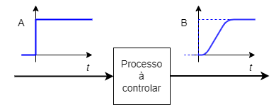
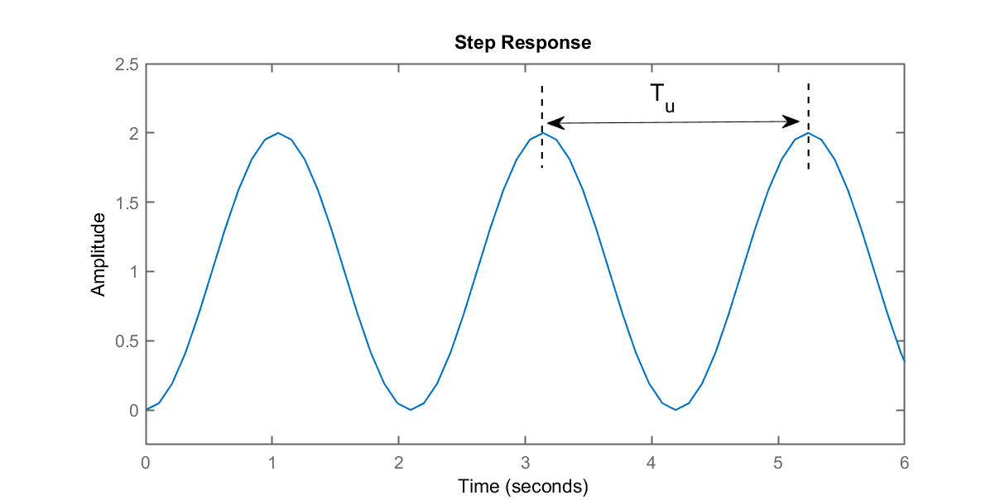
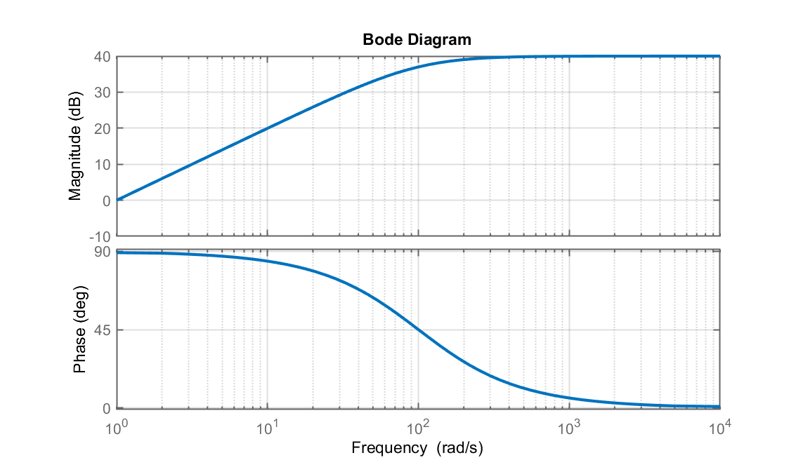
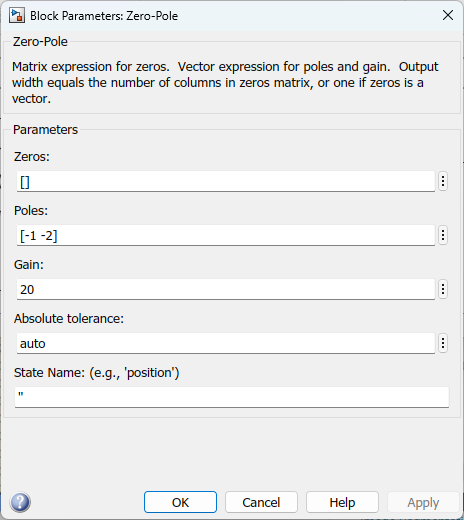

# Lab 1) PID (alógico) e sintonização

**Objetivo**: a ideia desta aula é recapitular detalhes importantes sobre o controlador PID analógico, adotar algum método de sintonia e simular o método e o PID sobre uma planta hipotética.

## O PID Analógico

Controladores PID (Proporcional + Integral + Derivativo) são amplamente adotados na indústria. Sua função de transferência no formatpo bastante didático é:

$$
{\displaystyle \mathrm {u} (t)=K_{p}{e(t)}+K_{i}\int _{0}^{t}{e(\tau )}\,{d\tau }+K_{d}{\frac {de(t)}{dt}}}
$$

Sua transformada de Laplace leva à:

$$
C(s)=K_p + \dfrac{K_i}{s} + K_d \cdot s = K_c \left( 1 + \dfrac{1}{T_i \cdot s} + T_d \cdot s \right)
$$

ou ainda:

$$
C(s)=K_c \left( \dfrac{T_d\,T_i\,s^2 + T_i\,s + 1}{T_i \,s} \right) = \dfrac{K_d\,s^2 + K_p\,s + K_i}{s}
$$

onde: $K_p=$ ganho proporcional; $K_i=$ ganho integral; $K_d=$ ganho derivativo; $K_c=$ ganho geral do PID; $T_i=$ constante de tempo integral; $T_d=$ constante de tempo derivativo.

## Métodos de Sintonia baseados em Ziegler-Nichols

O procedimento de seleção dos parâmetros do controlador PID de modo a serem atendidas as especificações de desempenho é conhecido como “sintonia do controlador”. Nichols e Ziegler (em 1942) propuseram regras práticas para sintonia de controladores PID, baseados na resposta experimental da planta à ser controlada.

**Referência**:
* Ziegler, J.G & Nichols, N. B. (1942). "Optimum settings for automatic controllers" ([PDF](https://web.archive.org/web/20170918055307/http://staff.guilan.ac.ir/staff/users/chaibakhsh/fckeditor_repo/file/documents/Optimum%20Settings%20for%20Automatic%20Controllers%20(Ziegler%20and%20Nichols,%201942).pdf). Transactions of the ASME. 64: 759–768. Archived from the original ([PDF](http://staff.guilan.ac.ir/staff/users/chaibakhsh/fckeditor_repo/file/documents/Optimum%20Settings%20for%20Automatic%20Controllers%20(Ziegler%20and%20Nichols,%201942).pdf) on 2017-09-18.
* [Ziegler–Nichols Tuning Rules for PID](https://www.mstarlabs.com/control/znrule.html), Microstar Laboratories (disponível em 13/10/2022). 
 

### Método 1 (Resposta ao Degrau da Planta em MA)

Este método é aplicado quando a planta não envolve integradores nem polos complexos conjugados dominantes, ou seja, sua resposta é do tipo super-amortecida ou criticamente amortecida. Nestes casos, o sistema responde de forma similar a um simples sistema de 1a-ordem com exceção da curvatura existente no início da resposta. Algo como:



Neste tipo de resposta, alguns parâmetros importantes nos interessam:


Nos interessam: o tempo de atraso, $L$ e a constante de tempo $T$.

Baseado nestes valores, Ziegler e Nichols sugerem a seguinte tabela para sintonia de um PID:

|   | $K_c$ | $T_i$ | $T_d$ |
| ---: | :---: | :---: | :---: |
| P | $T/L$ | $\infty$ | 0 |
| PI | $0,9 \cdot T/L$ | $L/0,3$ | 0 |
| PID | $1,2 \cdot T/L$ | $2 \cdot L$ | $0,5 \cdot L$ |

Desta forma, o PID fica:

$$
\begin{array}{rcl}
C(s) &=& K_c \left( 1 + \dfrac{1}{T_i\,s} + T_d\,s \right)\\
&=& 1,2 \, \dfrac{T}{L} \left( 1 + \dfrac{1}{2L \, s} + \dfrac{1}{2}L\,s \right)\\
&=& 0,6 T \dfrac{\left( s + \dfrac{1}{L} \right)^2}{s}
\end{array}
$$

### Método 2: Busca por $K_u$

Neste segundo método, fecha-se a malha com um simples ganho proporcional (mesmo se já houver um PID no sistema, basta "reseter" as ações de contorle integral e derivativas) e neste caso, se varia o ganho do controlador até que o sistema propositalmente entre em oscilação. Neste caso, a idéiua é posicionar os pólos complexos dominantes de malha-fechada, propostitalmente sobre o eixo $j\omega$ do plano-s. A transformada inversa de Laplace para um sistema que em malha-fechada apresenta pólos complexos, com parte real nula, inmplica numa onda sinosoidal com certa defasagem, ou seja, uma "oscilação sustentada". 


No caso de um PID, se ajusta seus valores para: $T_i=\infty$ e $T_d=0$, acabando-se por usar apenas ação de controle proporcional. Aumenta-se então o valor de $K_p$ de 0 até $K_u$ (*Ultimate gain*, ou ganho crítico). Quando $K_p=K_u$ a saída da planta deve assumir e manter oscilações com amplitudes constantes, como mostrado na próxima figura.



Onde $T_u=$ período da oscilação.

Neste caso, Ziegler-Nichols sugerem outra combinação de valores para sintonia de um PID:

| Controlador | $K_c$ | $T_i$ | $T_d$ |
| :---: |  :---: |  :---: |  :---: | 
| P | $0,50 \cdot K_u$ | $\infty$ | 0 |
| PI | $0,45 \cdot K_u$ | $0,83 \cdot T_u$ | 0 |
| PID | $0,60 \cdot K_u$ | $0,5 \cdot K_u$ | $0,125 \cdot T_u$ |

ou:

| Controlador | $K_c$ | $T_i$ | $T_d$ |
| :---: |  :---: |  :---: |  :---: | 
| P | $0,5 \cdot K_u$ | 0 | 0 |
| PI | $0,45 \cdot K_u$ | $1,2\cdot(K_p/T_u)$ | 0 |
| PID | $0,60 \cdot K_u$ | $2 \cdot (K_p/T_u)$ | $(K_pT_u)/8$ |

**Obs.:** outras tabelas para ajuste dos parâmetros do PID baseados no método de Ziegler-Nichols podem ser facilmente encontradas. Por exemplo, a página [Wiki em português](https://pt.wikipedia.org/wiki/Controlador_proporcional_integral_derivativo) (menos completa) ou página [Wiki em inglês](https://en.wikipedia.org/wiki/PID_controller) (mais completa). O detalhe é que é comum que os valores sugeridos por Zieglher-Nichols levem à **overshoots iniciais da ordem de 50%**. Motivo pelo qual, outros autores, sugerem diferentes valores para ajuste inicial dos parâmetros do PID:

| Controlador |	$K_{p}$ | $T_{i}$ |	$T_{d}$ | $K_{i}$ | $K_{d}$ |
| ---: | :---: | :---: | :---: | :---: | :---: | 
| P	| $0.50K_{u}$ | – |	– | – |	– |
| PI |	$0.45\,K_{u}$ | $0.8{\dot{3}}\,T_{u}$ | 	– |	$0.54\,(K_u/T_u)$ | 
| PD |	$0.80\,K_{u}$ |	– |	$0.125\,T_{u}$ |	– |	$0.100\,K_{u}\,T_{u}$ |
| PID clássico |	$0.60\,K_{u}$ |	$0.50\,T_{u}$ |	$0.125\,T_{u}$ |	$1.2\,(K_{u}/T_{u})$ | $0.075\,K_{u}\,T_{u}$ |
| Regra Integrador de Pessen |	$0.70\,K_{u}$ | $0.40\,T_{u}$ |	$0.150\,T_{u}$ |	$1.75\,(K_{u}/T_{u})$ |	$0.105\,K_{u}\,T_{u}$ |
| Algum overshoot | $0.3\dot{3}\,K_{u}$ |  $0.50\,T_{u}$ | $0.33\dot{3}\,T_{u}$ |  $0.{6}\dot{6}\,(K_{u}/T_{u})$ |	$0.11\dot{1}\,K_{u}\,T_{u}$ |
| Sem overshoot | $0.20\,K_{u}$ |	$0.50\, T_{u}$ |	$0.33\dot{3}\,T_{u}$ |	$0.40\,(K_{u}/T_{u})$ |	$0.06\dot{6}\,K_{u}\,T_{u}$ |


Tabela originalmente diponível em: https://en.wikipedia.org/wiki/Ziegler%E2%80%93Nichols_method (em 13/10/2022).

## Método 3: Método do relé

Neste caso, se fecha a malha do sistema com um simples controlador proporcional e se programa seu chaveamento entre 2 valores (o que seria on "on"/"off") conforme o erro seja positivo ou negativo. Este tipo de controlador também é conhecido como controlador "*bang-bang*".


De forma mais simples, sua lei de controle fica como:

$$
u(t) = 
\begin{cases}
U_1 & \text{se: } e(t)>0\\
U_2 & \text{se: } e(t)\le 0
\end{cases}
$$

ou seja, o sinal de controle $u(t)$ aplicado à planta, varia entre 2 valores fixos: $U_1=$ maior valor e $U_2=$ menor valor; $e(t)=$ sinal de erro. Não necessariamente o valor de $U_1=\text{"on"}=100\%$ e $U_2=\text{"off"}=0\%$.

Aplicar este tipo de sinal de controle à um sistema, o levará uma oscilação. A ideia aqui é justamente se capturar o período desta oscilação, que coincide justamente com $T_u$. Com base em outros dados associados com este método (ver figura anterior) se pode inferir o *ultimate gain*, ou $K_u$:

$$
K_u = \dfrac{4\,b}{\pi \, a}
$$

onde: $a=$ amplitude da oscilação (faixa da oscilação) dos valores aplicados na entrada da planta ("*process variable*"); e $b=$ amplitude de oscilação (faixa de oscilação) do sinal de saída da planta.

De posse de $K_u$ e $T_u$ busca-se pelos valores sugeridos para os parâmetros do PID baseados no método de Ziegler-Nichols.

### Melhorias no PID tradicional

**Mas**... na prática o PID pode não ser usado exatamente deste forma. Ocorrem 2 problemas na utilização do PID neste formato (simples):
* **Saturação da ação integral**: resultado do efeito acumulado de integração no integrador principalmente evidenciado quando o sistema à ser controlado possui algum elemento de saturação. Este efeito é conhecido como efeito “wind-up”.
* **Sensibilidade à ruídos**: a parte derivativa pode deixar este controlador substancialmente sensível para sinais sensoriados ruidosos (caso de taco geradores por exemplo).

### PID com Filtro Derivativo

O problema da susceptibilidade do PID para com informações ruidosas provenientes de uma planta pode ser solucionado com o uso proposital de um filtro derivativo.

Se analisamos o diagrama de Bode da ação Derivativa pura de um PID percebemos o seguinte diagrama:


Analisando-se melhor a figura acima, percebemos, pelo diagrama de magnitude, que o ganho de uma ação derivativa pura só aumenta à taxa de 20 db/década, sem limite e conforme a frequência aumenta, o que na prática significa que componentes (sinal de erro) de alta frequência, serão amplificados. O que pode deixar o sinal de atuação (saída) do PID muito oscilatório (ruidoso).

Uma forma simples de atenuar este comportamento é limitar o ganho para frequências elevadas. A equação do PID passa à ser:

$$
C(s)=K_p + K_i \, \dfrac{1}{s} + K_d \left( \dfrac{N}{1+\dfrac{N}{s} } \right)
$$

Note pela expressão anterior, que a ação derivativa incorpora agora um filtro, ou seja:

$$
D(s)=K_d \, \left( \dfrac{N}{1+\dfrac{N}{s}} \right) = K_d \, \left[ \dfrac{N \cdot s}{(s+N)} \right]
$$

onde $N=$ coeficiente do filtro.

Suponha que $N=100$ e observe o que ocorre com a expressão anterior:

$$
D(s)=\dfrac{100 \cdot s}{(s+100)}
$$

ou seja, um sistema com:
* zero na origem (a ação derivativa pura);
* polo em $s=-100$;
* ganho (quando $\omega \to \infty$) igual à $20 \log_{10}(100)=40$ dB.

O diagrama de bode desta última expressão rende:



Ou seja, analisando-se o diagrama de magnitude, ser percebe que agora o **ganho é limitado em altas frequências** ao valor de $N$ (ou seja de 100; $20\cdot \log_{10}(100)=40$ dB) e esta limitação ocorre à partir da frequência de $\omega_c=N$ (100 rad/s). Para frequências abaixo de $\omega_c$ esta expressão atua como uma ação derivativa pura. Esta estratégia acaba então limitando em algo o resultado de ações derivativas sobre sinais (de erro) ruidosos.

Comparando o Diagrama de Bode de um PID com ação derivativa pura e outro com ação derivativa filtrada, teremos algo como:


Note que o bloco “PID” disponibilizado pelo Matlab/Simulink já incorpora a ação derivativa com filtragem:


A idéia agora é testar estas abordagens e sintonizar um PID para certa planta.

## Planta adotada para simulações com PID

A seguinte planta será adotada para testar o PID:

$$
G(s)=\dfrac{20}{(s+1)(s+2)}
$$

Ingressando com a mesma no Matlab:

```matlab
>> G=tf( 20, poly([-1 -2]) )

G =
 
          10
  -------------------
  0.5 s^2 + 1.5 s + 1
 
Continuous-time transfer function.

>> zpk(G) % conferindo...

ans =
 
      20
  -----------
  (s+2) (s+1)
 
Continuous-time zero/pole/gain model.

>> dcgain(G) % ganho DC da planta
ans =
    10
```

Note que esta planta apresenta um ganho DC não nulo, isto é, ser for injetado um degrau unitário na sua entrada, sua saída vai tender para $y(\infty)=10$.

### Sintonia de PID usando Método 1

A próxima figura mostra o comportamento da planta quando se aplica um degrau unitário entrada da planta (em malha-aberta):


Pode-se capturar os seguintes valores desta resposta:
* $L=0,3$;
* $T=1,7$.

Procedendo com a simulação do PID para este caso:

```matlab
>> % Extraíndo dados do gráfico
>> L=0.3; T=1.7;
>> Kc=1.2*T/L; Ti=2*L; Td=0.5*L;
>> Ki=Kc/Ti; Kd=Kc*Td;
>> % Listando [Kc Ki Kd]:
>> [Kc Ki Kd]
ans =
          6.8       11.333         1.02
>> 
```

A equação final do PID com filtro derivativo, considerando $N=100$ fica:

$$
C(s)=6,8 + \dfrac{11,333}{s} + 1,02 \left( \dfrac{100}{1+\frac{100}{s} } \right)
$$

Ingressando no Matlab:

```matlab
>> s=tf('s');
>> PID2=6.8+11.3333/s+1.02*(100/(1+(100/s)))

PID2 =
 
  108.8 s^2 + 691.3 s + 1133
  --------------------------
         s^2 + 100 s
 
Continuous-time transfer function.

>> zpk(PID2)

ans =
 
  108.8 (s^2 + 6.354s + 10.42)
  ----------------------------
           s (s+100)
 
Continuous-time zero/pole/gain model.

>> zero(PID2)
ans =
      -3.1771 +    0.56814i
      -3.1771 -    0.56814i
>> pole(PID2)
ans =
     0
  -100
>>
```

Note o segundo polo corresponde a frequência de corte do filtro derivativo.

Um PID com ação derivativa pura fica:

```matlab
>> PID1=6.8+11.3333/s+1.02*s

PID1 =
 
  1.02 s^2 + 6.8 s + 11.33
  ------------------------
             s
 
Continuous-time transfer function.

>> zpk(PID1)

ans =
 
  1.02 (s+3.339) (s+3.328)
  ------------------------
             s
 
Continuous-time zero/pole/gain model.

>> zero(PID1)
ans =
       -3.339
      -3.3276
>> pole(PID1)
ans =
     0
>> 
```

Neste caso, notamos apenas um polo na origem que corresponde à ação integrativa pura.

Podemos levantar um diagrama de Bode comparando o impacto destes PIDs no sistema:

```matlab
>> % Cálculos para primeiro PID (ação derivativa pura)
>> ftma_PID1=PID1*G;
>> zpk(ftma_PID1)

ans =
 
  20.4 (s+3.339) (s+3.328)
  ------------------------
       s (s+2) (s+1)
>>
>> % Cálculos para segundo PID (ação derivativa filtrada)
>> ftma_PID2=PID2*G;
>> zpk(ftma_PID2)

ans =
 
  2176 (s^2 + 6.354s + 10.42)
  ---------------------------
     s (s+100) (s+2) (s+1)
 
Continuous-time zero/pole/gain model.

>> figure; bode (G, PID1, PID2, ftma_PID)
```

O último comando vai render a seguinte figura:


Podemos agora fechar a malha para os PIDs:

```matlab
>> ftmf_PID1=feedback(ftma_PID1,1);
>> ftmf_PID2=feedback(ftma_PID2,1);
>> figure; step(ftmf_PID1, ftmf_PID2)
```

Obtemos a seguinte resposta para a planta com os PIDs:


Esta planta também poderia ser simulada usando-se o Simulink:


Onde a planta foi ingressada na forma de: Biblioteca do Simulink>>Continuos>>Zero-Pole:



## Tarefas

1. Simule a planta $G(s)$ com o PID usando o Matlab/Simulink para a mesma entrada degrau unitário e observe os resultados.
Sugere-se ainda variar os ganhos do PID para comprovar se sucede o que sugere a próxima tabela:

| Parâmetro | Tempo de subida |	Overshoot | Tempo de assentamento |	Erro regime permanente | Estabilidade |
| :---: | :---: | :---: | :---: | :---: | :---: | 
| $K_{p} \; \uparrow$ | Diminui | Aumenta | Pequena mudança | Diminui | Degrada |
| $K_{i} \; \uparrow$ | Diminui | 	Aumenta |	Aumenta |	Eliminado |	Degrada |
| $K_{d} \; \uparrow$ | Pequena alteração | Diminui |	Diminui |	Sem efeito |	Melhora se $K_d$ é pequeno |

Existe uma simulação de comportamento de sistema conforme se variam os parâmetros de um PID que pode ser vista na página [Wiki sobre PID](https://en.wikipedia.org/wiki/PID_controller) (em inglês):


[[[[](http://)](http://)](http://)](http://)
2. Simule a planta $G(s)$ com o PID usando o Matlab/Simulink mas desta vez com uma entrada senoidal que deve variar sua amplitude entre 0 e 2 com período de oscilação de 1,5 segundas e observe os resultados.
3. Idem ao item (2) anterior, mas agora acrescente (some) um sinal ruidoso à saída da planta, simulando um sensor ruidoso e observe os resultados obtidos para um PID sem filtro derivativo e com filtro derivativo. Considere que o ruído possua amplitude de apenas 0,1 (valor do pico) e que oscila numa frequência de $10000/(2\pi)$ Hz. Mostre num gráficos os sinais de saída dos 2 controladores (do PID com ação derivativa pura e do PID com ação derivativa filtrada).
4. Repita o procedimento de sintonia do PID considerando agora a planta: $G_2(s)=\dfrac{20}{s^2 + 4s + 8}$. Mostre o procedimento de sintonia adotado acompanhado de suas figuras e mostre o resultado final obtido com o PID sintonizado.

**Obs.:** para realizar o item (3) sugere-se o seguinte diagrama de blocos no Simulink:


Fim.

----

## Observações

Você pode tentar usar o seguinte comando para gerar figuras .png à partir dos diagramas de blocos gerados via Simulinl:

```matlab
>> % gerar imagem PNG à partir de "aula1_a.slx"
>> print('-saula1_a', '-dpng', '-r200', 'aula1_a.slx.png')
>> print('-saula1_a', '-djpeg', '-r150', 'aula1_a.slx.jpg')
```

----

Prof. Fernando Passold, em 13/10/2022


