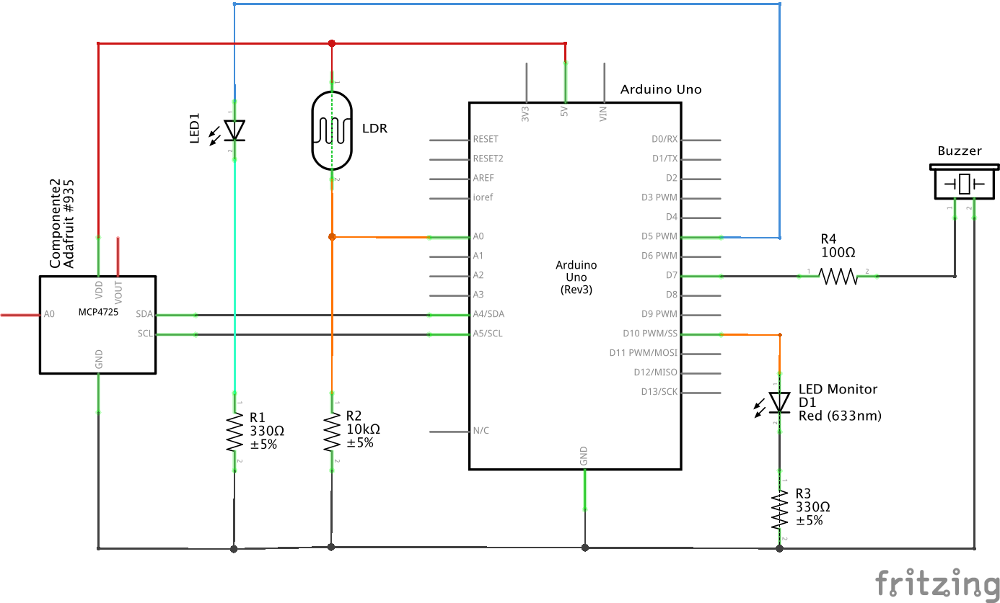
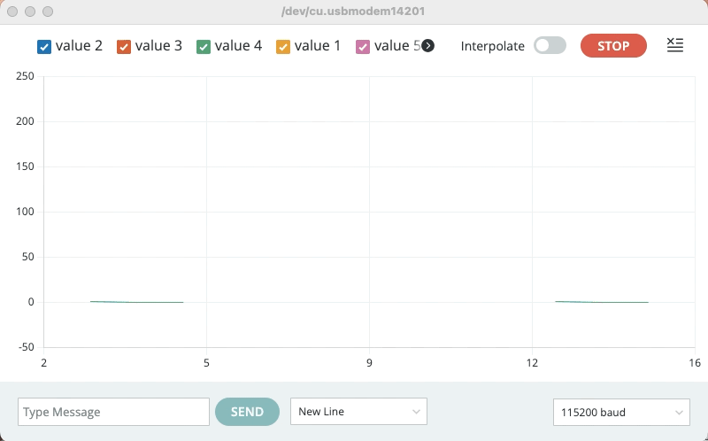

# Teste de PID Digital em Arduíno Uno

**Breve descrição**:

Este algoritmo foi desenvolvido para placa Arduino Uno, juntamente com um pequeno "shield" desenvolvido especialmente para testes ([outras placas de interfaceamento](setup_arduino_PID.html) com o sistema físico real estão atualmente em desenvolvimento/construção, 15/04/2024). 

**Hardware**:

* placa Arduino Uno;
* módulo DAC I2C externo (MPC4725) - previsto mas não usado ainda neste teste!
* 1 $\times$ LDR (16 K$\Omega$);
* 2 $\times$ resistores de 330 Ohms x 1/8 W (para acionar led's);
* 1 $\times$ resistor de 100 Ohms x 1/8 W (para uso com Buzzer);
* 1 $\times$ resistor de 10 KOhms x 1/8W (para uso com LDR);
* 2 $\times$ leds comuns;

**Diagrama elétrico**:



Comentários:

* LDR conectado ao A/D 0 do Arduíno usando usando resistor série de 10 K$\Omega$;
* Leds conectados aos pinos 5 e 6 do Arduíno Uno (saídas PWM na frequência de 980 Hz, usando timer0); Estes leds "simulam" o resultado do algoritmo de controle (modo manual/automático);
* Led conecado ao pino 10 do Arduíno Uno para atuar como "monitor" do algoritmo de controle (led pisca na frequencia de 1 Hz, indicando execução da ISR associada com o algoritmo de controle);
* ISR associada ao timer2 programado para executar o **algoritmo de controle** (lei de controle: até PID paralelo com filtro derivativo) na **frequência de 100 Hz**.

**Software/Interface com usuário**:

Foi prevista uma **interface com usuário: via Comunicação serial/USB**. Isto é, o usuário pode modificar em tempo de execução o modo de operação da placa (modo manual/automático), pode alterar parâmetros do PID, modificar referência ("*set-point*") entre outas opções.

Existe a função 'process_instruction()' capaz de processar comandos recebidos via porta serial como:

* `s`= pedido de "status" do sistema, indicando dados atuais capturados e parâmetros atuais do PID;
* `v`= realiza "toggle" entre modo "verbouse" ou não. Caso o modo "verbouse" esteja desativado, o sistema não dá retorno à respeito dos comandos enviados (apesar de interpretá-los). Com 'verboouse' desligado este sistema envia continuamente linhas de dados em 3 colunas: SP: $r[k]$,	PV: $y[k]$,	MV: $u[k]$, com cada dado numérico (float com 2 casas decimais) separados por vírgula, espaço em branco e caracter TAB. Se o modo "verbouse" estiver ativado, o sistema para de enviar esta informação e passa a dar retorno sobre cada comando repassado via porta serial.
  Obs.: Notar que esta versão do código prevê a placa Arduino com um buzzer usada para prestar um feedback auditivo quanto aos comandos recebidos via porta serial.
* `a`= realiza um "toggle" entre modo manual/automático do sistema; ($\text{a} \ge 1$ ativa modo automático, $\text{a} \le 0$: desliga modo automático, passa para manual);
  Obs.: No modo manual o usuário pode especificar diretamente o valor de controle, MV ou $u[kT]$, usando o comando `u` (ver adiante).
* `p 100` = ajusta ganho proporcional do PID com valor 100 (aceita valores float);
  Obs.: Algoritmo inicia com $K_p=1$.
* `d 0.5` = ajusta ganho derivativo do PID com valor 0,5; (`d 0` = implica "desligar" ação derivativa');
  Obs.: Algoritmo inicia com $K_d=0$ (ação derivativa desligada).
* `i 1.2`= indica "setar" ganho integral com valor 1,2; (`i 0` = implica "desligar" ação integral);
  Obs.: Algorimto inicia com $K_i=0$ (ação integral desativada).
* `r 200` = modifica "set-point" (SP ou referência) para o valor 200. Necessário antes de ativar algoritmo de controle (caso contrário $r[k]=0$).
* `u 200` = permite modificar a variável manipulada (MV) para um valor no intervalo $[0 .. 255]$ que corresponde ao valor aceito nativamente pela rotina de controle do duty-cycle do Arduino (instrução `analogWrite()`). Note que o este comando permite alterar potência do sistema sendo controlado pela placa quando o sistema está no modo "manual": `a 0.`
* `l 0.2`= ajusta parâmetro $\alpha$ do filtro exponencial de 1a-ordem (ação derivativa).
  Atenção: $0 < \alpha < 1$.
  Se $\alpha=0$, o sinal medido é ignorado (a saída do filtro, $f[kT]=0$; equivale à zerar a ação derivativa):
  Se $\alpha=1$, o sinal de $e[kT]$ ou $y[kT]$ não será filtrado; implica derivada numérica ressaltando ruídos.
* `k`= Ativa/desativa "Derivative Kick", isto é, indica que o PID usará o sinal $e[kT]$ (Derivative Kick desligado) ou $y[kT]$ (Derivative Kick ligado) para proceder com cálculo da ação derivativa fitrada.
* `m`= "mute", permite ligar/desligar o feedback auditivo (cancela o buzzer).

Obs.: Se o modo 'verbouse' estiver ativado, enquanto a string enviada pela porta serial estiver sendo processada, poderá ser notado uma pausa na atualização de valores do processo que estavam sendo enviados pela porta serial.

Segue **código exemplo** ( [teste_algo5_1.5.ino](teste_algo5_1.5.ino) - versão 1.5 - atualizado em 22/05/2024 - **PID paralelo formato de posição**):

```c++
/*************************
Teste de algoritmo de controle, ISR executando à 100Hz atrelado ao timer2
+ leitura da porta serial e interpretação de comandos
= para comando de PWM associado com led no pino 5 ou 6 (980 Hz; timer0)
Fernando Passold, em 18/04/2024
Revisado em 21/05/2024.

"Dicionário" de comandos interpretados pela porta serial:
p 100.5 = define ganho Proporcional em 100.5
i 50 = define ganho Integral em 50
d 0.005 = define ganho derivativo em 0.005
a = toggle entre modo manual e modo automático
a0 - a 0 = "desliga" modo automático
a 1 = "liga" modo automático
v = toggle no modo verboouse (debug)
v 0 = desliga modo verbouse
v 1 = liga modo verbouse
r 50 = define Referencia em 50
u 50 = define sinal de controle (se automático desligado) em 50
u = faz PWM = 0 ("desliga")
s = “status”: publica valores atuais de sp, Kp, Ki e Kd

Detalhes da montagem:
- led para "testar" algoritmo de controle conectado no pino 5 ou 6
- led que pisca indicando execução do algoritmo de controle, no pino 10
- todos os leds em config ativo alto
*********************************/

// declaração variáveis globais:
bool ledState = 0;            // para fazer variar nível lógico led monitor
const byte LED_MONITOR = 10;  // toglles a cada 0,5 segundos monitorando algo controle (ISR)
const byte LED_PWM = 5;       // Led à ser "controlado", no pino 5 (ou 6)
const byte BUZZER = 7;        // Buzzer, feedback adutivo comandos recebidos pela placa
const byte analogPin = A0;    // pino (A/D) que recebe sinal analógico

int ledCounter = 0;  // conta até 50 para então picar Led monitor
// variável associada com "debug" --> "verbouse": retorna info via porta serial

bool verbouse = true;   // gerar texto confirmando comando recebido pela porta serial
bool mute = false;      // indica ativar ou não o buzzer (feedback auditivo)

// const MAX_U = 4095;         // caso do DAC MPC [0, 2^12=4096-1]
const int MAX_U = 255;  // caso do PWM do Arduino, [0, 255]


/****
Obs.: se verbouse desativado, o que deve ser visto na porta serial é algo como:
sp: r[k],   pv: y[k],   mv: u[k]
340.0000,   328.0000,   12.0000
340.0000,   328.0000,   12.0000
Isto para possível interação com Matlab, Python, Processing para manipulação de dados
*****/

// variáveis associadas com algoritmo de controle
bool control = false;  // comuta entre modo automático (>=1) e manual (<=0)
bool AvoidDerivativeKick = true;  // Ativa/desativa "derivative kick": derivada de e[kT] ou y[kT]
float sp = 0;          // set-point, referência, r[k]
float pv = 0;          // process-variable, saída do processo, y[k]
int mv = 0;            // manipulated-variable, saída do controlador, u[k]
float u, u1, u2;       // u[k], u[k-1], u[k-2]
float y, y1, y2;       // y[k], y[k-1], y[k-2]
float e, e1, e2;       // e[k], e[k-1], e[k-2]
float f, f1, f2;       // f[k], f[k-1], f[k-2]: sinal filtrado do erro
float sum_i;           // soma da ação integral;
float Kp, Ki, Kd;      // ganhos parte proporcional, integral, derivativa
float alpha = 0.1;     // associado com filtro derivativo
float T = 0.01;        // período de amostragem adotado (em segundos)

// variáveis associadas com dados (string) capturada via porta serial
String inputString;
char option;
float value;
int numericIndex = 0;
unsigned int lastTime, period;

void Init_Control() {
  // inicializa variáveis associadas com lei de controle
  u = 0;
  u1 = 0;
  u2 = 0;
  y = 0;
  y1 = 0;
  y2 = 0;
  e = 0;
  e1 = 0;
  e2 = 0;
  f = 0;
  f1 = 0;
  f2 = 0;
  mv = 0;
  sum_i = 0;
}

void BeepErro(void) {
  // 1 x beep algo longo, comando não reconhecido
  digitalWrite(BUZZER, HIGH);
  delay(200);
  digitalWrite(BUZZER, LOW);
}

void BeepOk(void) {
  // 2 x beeps médios, intervalo curto, aviso de comando reconhecido
  digitalWrite(BUZZER, HIGH);
  delay(100);
  digitalWrite(BUZZER, LOW);
  delay(50);
  digitalWrite(BUZZER, HIGH);
  delay(100);
  digitalWrite(BUZZER, LOW);
}

void publica_estado(char const msg[], bool estado) {
  Serial.print(msg);
  Serial.print(": ");
  if (estado)
    Serial.println("ON (true)");
  else
    Serial.println("OFF (false)");
}

void publica_parametro(char const msg[], float valor) {
  /****
  Obs.: a declaração const antes de msg[] é para tornas esta declaração válida em C ou C++,
  senão: warning: ISO C++ forbids converting a string constant to 'char*'
  Ref.: https://stackoverflow.com/questions/20944784/why-is-conversion-from-string-literal-to-char-valid-in-c-but-invalid-in-c
  ******/
  Serial.print(msg);
  Serial.print(" = ");
  Serial.println(valor, 4);
}

void publica_status(void) {
  float aux;  // copia de algumas variáveis atualizadas muito rapidamente, à cada 100 Hz...
  Serial.println("# Status do sistema ###################################");
  Serial.print("PV: y[k] = ");
  aux = pv;
  Serial.print(aux, 2);
  Serial.print(", MV: u[k] = ");
  aux = (float)mv;
  Serial.print(aux, 2);
  Serial.print(", SP: r[k] = ");
  aux = sp;
  Serial.println(aux, 2);
  Serial.print(" Modo = ");
  if (control)
    Serial.println("AUTO");
  else
    Serial.println("Manual");
  publica_parametro("   Kp", Kp);
  publica_parametro("   Ki", Ki);
  publica_parametro("   Kd", Kd);
  publica_parametro("alpha", alpha);
  publica_estado("AvoidDerivativeKick", AvoidDerivativeKick);
  publica_estado("Verbouse", verbouse);
}

void setup() {
  // inicializa pinos dos leds e começa com eles desligados
  pinMode(BUZZER, OUTPUT);
  digitalWrite(BUZZER, HIGH);
  // delay(50);
  // digitalWrite(BUZZER, LOW);
  pinMode(LED_BUILTIN, OUTPUT);
  digitalWrite(LED_BUILTIN, LOW);
  pinMode(LED_MONITOR, OUTPUT);
  digitalWrite(LED_MONITOR, LOW);
  pinMode(LED_PWM, OUTPUT);
  analogWrite(LED_PWM, 0);  // garante que este led inicia apagado
  // inicializa saída de controle, mv
  Init_Control();
  Kp = 1.0;
  Ki = 0;
  Kd = 0;
  control = false;  // controle automático desligado
  verbouse = true;  // ativado debug
  mute = false;
  // initialize timer2
  noInterrupts();  // disable all interrupts
  TCCR2A = 0;      // set entire TCCR2A register to 0
  TCCR2B = 0;      // same for TCCR2B
  TCNT2 = 0;       // initialize counter value to 0
  // set compare match register for 100 Hz increments
  OCR2A = 155;             // set counter up to 155
  TCCR2A |= (1 << WGM21);  // turn on CTC mode
  // setting prescaler with 1024
  TCCR2B |= (1 << CS22) | (1 << CS21) | (1 << CS20);
  TIMSK2 |= (1 << OCIE2A);  // enable timer2 compare interrupt
  interrupts();             // enable all interrupts
  Serial.begin(115200);     //  setup serial
  while (!Serial) {
    ;  // Aguarda até que a porta serial esteja pronta - normalmente 10 ms
  }
  digitalWrite(BUZZER, LOW);
  publica_status();
  Serial.println("Modo \"verbouse\" ativado.");
  Serial.println("Aguardando comandos...");
  BeepOk();
  Serial.println(" ");
}

void limita_valor(int *valor) {
  // Bloco "Saturador", trabalha com variáveis int
  // altera diretamente conteúdo da variável valor;
  // passagem de parâmetros, sem cópia, por referência
  // uso: limita_valour(&duty);
  if (*valor > MAX_U) *valor = MAX_U;
  if (*valor < 0) *valor = 0;
}

// tratamento de interrupção - algoritmo de controle (timer2)
ISR(TIMER2_COMPA_vect) {  //timer2 interrupt @ 100 Hz
  // atualiza seção do led monitor (o que pisca)
  ledCounter++;
  if (ledCounter >= 50) {
    ledState = !ledState;
    digitalWrite(LED_MONITOR, ledState);
    digitalWrite(LED_BUILTIN, ledState);  // faz piscar led da placa do Arduino
    ledCounter = 0;
  }
  // inicia seção da lei de controle
  pv = analogRead(analogPin);  // y[k] = info do sensor (A/D de 12-bits: [0..4095])
  y = (float)pv;
  // note que variável pv é atualizada sempre
  // e que saída PWM é sempre re-programada
  if (control) {
    // processa lei de controle
    e = sp - pv;  // e[k] = r[k] - y[k]
    // ação proporcional - sempre ativada!
    u = Kp * e;
    if (Ki > 0) {
      // ação integral
      sum_i = sum_i + (T * (e + e1)) / 2;  // integração trapezoidal
      // prever saturação ação integral?
      // Obs.: não implementação limitação da saturação integral
      u = u + Ki * sum_i;
    }
    if (Kd > 0) {
      // ação derivativa filtrada
      // filtrando sinal de erro ou da saída da planta
      // filtro passa-baixas exponencial 1a-ordem
      if (AvoidDerivativeKick) {
        // trabalha derivada filtrada sobre y[kT]
        f = alpha * y + (1 - alpha) * f1;  // filtragem sinal da planta, y[kT]
      } 
      else {
        // trabalha derivada filtrada sobre e[kT]
        f = alpha * e + (1 - alpha) * f1;  // filtragem sinal do erro, e[kT]
      }
      u = u + Kd * ((f - f1) / T);       // derivada sinal filtrado do erro
    }
    // saída do sinal para processo: valor atualizado
    // u = u[kt] (float)
  }
  mv = (int)u;  // mv é a valor efetivamento jogado para "fora" da placa, via DAC ou PWM
  limita_valor(&mv);
  analogWrite(LED_PWM, mv);  // valores entre 0 ~ 255 (0 ~ 100%) de dutty-cycle
  // atualiza variáveis associados com atrasos, deixa preparadas para próxima chamada
  f2 = f1;
  f1 = f;
  e2 = e1;
  e1 = e;
  u2 = u1;
  u1 = mv;  // necessáriuo para evitar um "bump" qdo sai de manual --> automático
  y2 = y1;
  y1 = y;
}

void reinit_auto(void) {
  // atualiza variáveis quando sai do modo manual para automático
  // atualiza sinal de controle atual para último valor ajustado pelo usuário:
  u1 = u;
  u2 = 0;
  // atualiza amostrar atrasadas para evitar "lixo" nas mesmas:
  e = 0;
  e1 = 0;
  e2 = 0;
  f = 0;
  f1 = 0;
  f2 = 0;
  control = true;
  verbouse = false;  // automaticamente desativa modo verbouse; passa a publicar dados do sistema
  Serial.println(" ");
  Serial.println("Ativando Modo AUTOmático:");
  Serial.println("sp: r[k],\tpv: y[k],\tmv: u[k]");
  Serial.println(" ");
}

void Update_bool_variable(bool *bool_var) {
  // previous_state = *bool_var;
  if (numericIndex > 0) {
    // significa que usuário informou algum "valor"
    if (value <= 0)
      *bool_var = false;  // valores nulos e negativos --> false
    else
      *bool_var = true;  // valores positivos --> true
  } else {
    *bool_var = !(*bool_var);  // simplesmente alterna valor (toggle)
  }
}

void process_instruction(char option, float value) {
  // Realizar a ação com base na opção repassada
  // int duty;
  bool previous_state;
  switch ((int)option) {
    case 'v':  // toggle no modo verbouse
      previous_state = verbouse;
      Update_bool_variable(&verbouse);
      if ((verbouse) && (!previous_state)) {
        Serial.println(" ");  // garante que pula uma linha em branco antes de cortar publicação de dados
      }
      if ((!verbouse) && (previous_state)) {
        Serial.println(" ");
      }
      publica_estado("Modo Verbouse", verbouse);
      if (!mute) BeepOk();
      break;
    case 'a':
      previous_state = control;
      Update_bool_variable(&control);
      if ((control) && (!previous_state)) {
        // significa que saiu do modo manual para automático, necessário atualizar certos valores
        // para evitar "kicks" no sinal de controle u[kT]
        reinit_auto();
      }
      if (!control) {
        Serial.println(" ");  // pula linha em branco
        Serial.println("Entrando em modo Manual");
        verbouse = true;  // ativa verbouse automaticamente
      }
      if (!mute) BeepOk();
      break;
    case 'u':
      u = value;
      mv = (int)u;                                             // ajustar diretamente u[k] e MV                                    // atualiza valor para algo de controle
      if (verbouse) publica_parametro("MV: u[k]", (float)mv);  // publica_MV(duty);
      if (!mute) BeepOk();
      break;
    case 'r':  // ajusta r[k] = set point, sp
      sp = value;
      if (verbouse) publica_parametro("SP: r[k]", sp);  // publica_sp();
      if (!mute) BeepOk();
      break;
    case 's':            // publica "status" (alguns valores atuais)
      publica_status();  // independente do verbouse ativado ou não
      if (!mute) BeepOk();
      break;
    case 'p':  // ajustar ganho proporcional
      Kp = value;
      if (verbouse) publica_parametro("Kp", Kp);  // publica_Kp();
      if (!mute) BeepOk();
      break;
    case 'd':
      Kd = value;
      if (verbouse) publica_parametro("Kd", Kd);  // publica_Kd();
      if (!mute) BeepOk();
      break;
    case 'i':
      Ki = value;
      if (verbouse) publica_parametro("Ki", Ki);
      if (!mute) BeepOk();
      break;
    case 'l':
      alpha = value;
      if (verbouse) publica_parametro("Coef. filtro, alpha", alpha);
      if (!mute) BeepOk();
      break;
    case 'm':
      mute = !mute;
      if (!mute) BeepOk();
      break;
    case 'k':
      Update_bool_variable(&AvoidDerivativeKick);
      if (verbouse) publica_estado("AvoidDerivativeKick", AvoidDerivativeKick);
      if (!mute) BeepOk();
      break;
    // Adicione mais casos conforme necessário
    default:
      if (verbouse) {
        Serial.println("**Comando não reconhecido**");
      }
      if (!mute) BeepErro();
      break;
  }
}

void process_token(String inputString) {
  /***** Lida com string de entrada via serial, exemplos:
String recebida = [p 50], trim String = [p 50], numericIndex=2, option = [p], value = 50.0000
Prop, p = 50 (19.61%)
> String recebida = [s], trim String = [s], numericIndex=0, option = [s], value = 0.0000
  ******/
  if (verbouse) {
    Serial.print("# String recebida = \"");
    Serial.print(inputString);
    Serial.print("\", ");
    // Remove espaços em branco da string
    inputString.trim();
    Serial.print("trim(String) = \"");
    Serial.print(inputString);
    Serial.print("\", ");
  }
  // Tentar encontrar o índice do primeiro caractere numérico
  numericIndex = 0;
  for (int i = 0; i < inputString.length(); i++) {
    if (isdigit(inputString[i]) || inputString[i] == '.') {
      numericIndex = i;
      break;
    }
  }
  if (verbouse) {
    Serial.print("numericIndex=");
    Serial.print(numericIndex);
    Serial.print(", ");
  }
  // Extrai a parte inicial da string
  String initialPart = inputString.substring(0, numericIndex);
  // Separa o primeiro caractere da parte inicial (letra ou palavra)
  // option = initialPart[0]; <-- algum bug em inputString.substring(0, numericIndex); se
  // se numericIndex = 0
  option = inputString[0];
  // Converte a parte numérica da string para float
  value = inputString.substring(numericIndex).toFloat();
  if (verbouse) {
    Serial.print("option='");
    Serial.print(option);
    Serial.print("', ");
    Serial.print("value=");
    Serial.println(value, 4);
  }
}

void loop() {
  // put your main code here, to run repeatedly:
  float aux;
  if (Serial.available() > 0) {  // Verifica se há dados disponíveis para leitura
    // String inputString = Serial.readStringUntil('\n');
    inputString = Serial.readStringUntil('\n');
    process_token(inputString);
    process_instruction(option, value);
    inputString = '\0';
  }  // fim tratamento buffer porta serial (se cheio)
  if (!verbouse) {
    // atualiza porta serial com dados do proceso:
    // colunas: r[k] y[k] u[k]
    // Notar que algumas detas variáveis são atualizadas mais rapidamente que a USART
    aux = sp;  // r[k]
    Serial.print(aux, 2);
    Serial.print(", \t");
    aux = pv;  // y[k]
    Serial.print(aux, 2);
    Serial.print(", \t");
    aux = mv;  // u[k]
    Serial.println((aux * 100.0 / MAX_U), 2); //  publica percentagem [0..100%]
  }
}
```

```
Sketch uses 10632 bytes (32%) of program storage space. Maximum is 32256 bytes.
Global variables use 757 bytes (36%) of dynamic memory, leaving 1291 bytes for local variables. Maximum is 2048 bytes.
```

**Exemplo de uso**:

Este algoritmo quando executado, gera (na porta serial ou "**Monitor Serial**" da IDE do Arduíno), algo como:

```
Status do sistema:
PV: y[k] = 0.00, MV: u[k] = 0.00, SP: r[k] = 0.00
 Modo = Manual
   Kp = 1.0000
   Ki = 0.0000
   Kd = 0.0000
alpha = 0.1000
Modo "verbouse" ativado.
Aguardando comandos...
 
> String recebida = [s], trim String = [s], numericIndex=0, option = [s], value = 0.0000
Status do sistema:
PV: y[k] = 334.00, MV: u[k] = 0.00, SP: r[k] = 0.00
 Modo = Manual
   Kp = 1.0000
   Ki = 0.0000
   Kd = 0.0000
alpha = 0.1000
> String recebida = [r 340], trim String = [r 340], numericIndex=2, option = [r], value = 340.0000
SP: r[k] = 340.0000
> String recebida = [a], trim String = [a], numericIndex=0, option = [a], value = 0.0000
Modo verbouse: desativado
 
Ativando Modo AUTOmático:
sp: r[k],	pv: y[k],	mv: u[k]
 
340.0000, 	328.0000, 	12.0000
340.0000, 	328.0000, 	12.0000
340.0000, 	345.0000, 	0.0000
340.0000, 	345.0000, 	0.0000
...
340.0000, 	335.0000, 	5.0000
340.0000, 	335.0000, 	5.0000
340.0000, 	335.0000, 	0.0000
340.0000, 	352.0000, 	0.0000
340.0000, 	352.0000, 	0.0000
340.0000, 	352.0000, 	0.0000
340.0000, 	352.0000, 	0.0000
340.0000, 	355.0000, 	0.0000
340.0000, 	355.0000, 	0.0000
340.0000, 	355.0000, 	0.0000
340.0000, 	355.0000, 	1.0000
340.0000, 	339.0000, 	1.0000
340.0000, 	339.0000, 	1.0000
340.0000, 	339.0000, 	1.0000
 
Entrando em modo Manual
Modo verbouse: ATIVADO

```

Se for ativado o "**Serial Plotter**" obtemos algo como:



Obs.: No caso acima, o modo automático foi ativado e o LDR foi "bloqueado" (tampado para não receber nenhuma informação luminosa). E inicialmente o **Serial plotter** fica "parado" enquanto a placa está sendo "setada" (comando `r 200` para estabelecer a referência, $r(t)=200$) e posteriormente a placa foi colocada no modo automático (enviado comando`a`) e depois retirada do modo automático (enviado `a` novamente). Quando esta placa entra e saí do modo automático, o "modo verbouse" é automaticamente comutado.

<iframe width="640" height="360" src="https://www.youtube.com/embed/s9fz2Yxb7VI" title="Teste PID Digital em Arduino Uno." frameborder="0" allow="accelerometer; autoplay; clipboard-write; encrypted-media; gyroscope; picture-in-picture" allowfullscreen></iframe>

[teste algoritmo PID em Arduíno Uno - YouTube](https://www.youtube.com/watch?v=s9fz2Yxb7VI) (8 segundos). 

Fim (página iniciada em 18/04/2024; atualizada em 22/05/2024) [:musical_note:](https://youtu.be/sLXBnT2fJ1o?si=ZLXCkT8u5R9iONTI).

---

<script language="JavaScript">
<!-- Hide JavaScript...
var LastUpdated = document.lastModified;
document.writeln ("Fernando Passold, atualizado em " + LastUpdated); // End Hiding -->
</script>

