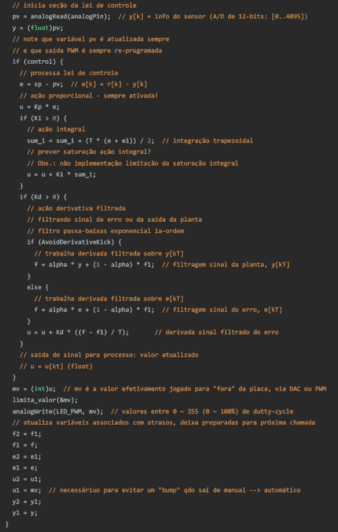

# Teste de PID Digital em Arduíno Uno

**Breve descrição**:

Este algoritmo foi desenvolvido para placa Arduino Uno, juntamente com um pequeno "shield" desenvolvido especialmente para testes ([outras placas de interfaceamento](setup_arduino_PID.html) com o sistema físico real estão atualmente em desenvolvimento/construção, 15/04/2024). 

**Hardware**:

* placa Arduino Uno;
* módulo DAC I2C externo (MPC4725) - previsto mas não usado ainda neste teste!
* 1 $\times$ LDR (16 K$\Omega$);
* 2 $\times$ resistores de 330 Ohms x 1/8 W (para acionar led's);
* 1 $\times$ resistor de 100 Ohms x 1/8 W (para uso com Buzzer);
* 1 $\times$ resistor de 10 KOhms x 1/8W (para uso com LDR);
* 2 $\times$ leds comuns;

**Diagrama elétrico**:


Comentários:

* LDR conectado ao A/D 0 do Arduíno usando usando resistor série de 10 K$\Omega$;
* Leds conectados aos pinos 5 e 6 do Arduíno Uno (saídas PWM na frequência de 980 Hz, usando timer0); Estes leds "simulam" o resultado do algoritmo de controle (modo manual/automático);
* Led conecado ao pino 10 do Arduíno Uno para atuar como "monitor" do algoritmo de controle (led pisca na frequencia de 1 Hz, indicando execução da ISR associada com o algoritmo de controle);
* ISR associada ao timer2 programado para executar o **algoritmo de controle** (lei de controle: até PID paralelo com filtro derivativo) na **frequência de 100 Hz**.

**Software/Interface com usuário**:

Foi prevista uma **interface com usuário: via Comunicação serial/USB**. Isto é, o usuário pode modificar em tempo de execução o modo de operação da placa (modo manual/automático), pode alterar parâmetros do PID, modificar referência ("*set-point*") entre outas opções.

Existe a função 'process_instruction()' capaz de processar comandos recebidos via porta serial como:

* `s`= pedido de "status" do sistema, indicando dados atuais capturados e parâmetros atuais do PID;
* `v`= realiza "toggle" entre modo "verbouse" ou não. Caso o modo "verbouse" esteja desativado, o sistema não dá retorno à respeito dos comandos enviados (apesar de interpretá-los). Com 'verboouse' desligado este sistema envia continuamente linhas de dados em 3 colunas: SP: $r[k]$,	PV: $y[k]$,	MV: $u[k]$, com cada dado numérico (float com 2 casas decimais) separados por vírgula, espaço em branco e caracter TAB. Se o modo "verbouse" estiver ativado, o sistema para de enviar esta informação e passa a dar retorno sobre cada comando repassado via porta serial.
  Obs.: Notar que esta versão do código prevê a placa Arduino com um buzzer usada para prestar um feedback auditivo quanto aos comandos recebidos via porta serial.
* `a`= realiza um "toggle" entre modo manual/automático do sistema; ($\text{a} \ge 1$ ativa modo automático, $\text{a} \le 0$: desliga modo automático, passa para manual);
  Obs.: No modo manual o usuário pode especificar diretamente o valor de controle, MV ou $u[kT]$, usando o comando `u` (ver adiante).
* `p 100` = ajusta ganho proporcional do PID com valor 100 (aceita valores float);
  Obs.: Algoritmo inicia com $K_p=1$.
* `d 0.5` = ajusta ganho derivativo do PID com valor 0,5; (`d 0` = implica "desligar" ação derivativa');
  Obs.: Algoritmo inicia com $K_d=0$ (ação derivativa desligada).
* `i 1.2`= indica "setar" ganho integral com valor 1,2; (`i 0` = implica "desligar" ação integral);
  Obs.: Algorimto inicia com $K_i=0$ (ação integral desativada).
* `r 200` = modifica "set-point" (SP ou referência) para o valor 200. Necessário antes de ativar algoritmo de controle (caso contrário $r[k]=0$).
* `u 200` = permite modificar a variável manipulada (MV) para um valor no intervalo $[0 .. 255]$ que corresponde ao valor aceito nativamente pela rotina de controle do duty-cycle do Arduino (instrução `analogWrite()`). Note que o este comando permite alterar potência do sistema sendo controlado pela placa quando o sistema está no modo "manual": `a 0.`
* `l 0.2`= ajusta parâmetro $\alpha$ do filtro exponencial de 1a-ordem (ação derivativa).
  Atenção: $0 < \alpha < 1$.
  Se $\alpha=0$, o sinal medido é ignorado (a saída do filtro, $f[kT]=0$; equivale à zerar a ação derivativa):
  Se $\alpha=1$, o sinal de $e[kT]$ ou $y[kT]$ não será filtrado; implica derivada numérica ressaltando ruídos.
* `k`= Ativa/desativa "Derivative Kick", isto é, indica que o PID usará o sinal $e[kT]$ (Derivative Kick desligado) ou $y[kT]$ (Derivative Kick ligado) para proceder com cálculo da ação derivativa fitrada.
* `m`= "mute", permite ligar/desligar o feedback auditivo (cancela o buzzer).

Obs.: Se o modo 'verbouse' estiver ativado, enquanto a string enviada pela porta serial estiver sendo processada, poderá ser notado uma pausa na atualização de valores do processo que estavam sendo enviados pela porta serial.

Segue abaixo exemplo de parte do código ( <a href="PID_digital_arduino.png" target="_blank">PID_digital_arduino.ino</a> -- versão de 22/05/2024 - **PID paralelo formato de posição**):



```
Sketch uses 10632 bytes (32%) of program storage space. Maximum is 32256 bytes.
Global variables use 757 bytes (36%) of dynamic memory, leaving 1291 bytes for local variables. Maximum is 2048 bytes.
```

**Exemplo de uso**:

Este algoritmo quando executado, gera (na porta serial ou "**Monitor Serial**" da IDE do Arduíno), algo como:

```
Status do sistema:
PV: y[k] = 0.00, MV: u[k] = 0.00, SP: r[k] = 0.00
 Modo = Manual
   Kp = 1.0000
   Ki = 0.0000
   Kd = 0.0000
alpha = 0.1000
Modo "verbouse" ativado.
Aguardando comandos...
 
> String recebida = [s], trim String = [s], numericIndex=0, option = [s], value = 0.0000
Status do sistema:
PV: y[k] = 334.00, MV: u[k] = 0.00, SP: r[k] = 0.00
 Modo = Manual
   Kp = 1.0000
   Ki = 0.0000
   Kd = 0.0000
alpha = 0.1000
> String recebida = [r 340], trim String = [r 340], numericIndex=2, option = [r], value = 340.0000
SP: r[k] = 340.0000
> String recebida = [a], trim String = [a], numericIndex=0, option = [a], value = 0.0000
Modo verbouse: desativado
 
Ativando Modo AUTOmático:
sp: r[k],	pv: y[k],	mv: u[k]
 
340.0000, 	328.0000, 	12.0000
340.0000, 	328.0000, 	12.0000
340.0000, 	345.0000, 	0.0000
340.0000, 	345.0000, 	0.0000
...
340.0000, 	335.0000, 	5.0000
340.0000, 	335.0000, 	5.0000
340.0000, 	335.0000, 	0.0000
340.0000, 	352.0000, 	0.0000
340.0000, 	352.0000, 	0.0000
340.0000, 	352.0000, 	0.0000
340.0000, 	352.0000, 	0.0000
340.0000, 	355.0000, 	0.0000
340.0000, 	355.0000, 	0.0000
340.0000, 	355.0000, 	0.0000
340.0000, 	355.0000, 	1.0000
340.0000, 	339.0000, 	1.0000
340.0000, 	339.0000, 	1.0000
340.0000, 	339.0000, 	1.0000
 
Entrando em modo Manual
Modo verbouse: ATIVADO

```

Se for ativado o "**Serial Plotter**" obtemos algo como:


Obs.: No caso acima, o modo automático foi ativado e o LDR foi "bloqueado" (tampado para não receber nenhuma informação luminosa). E inicialmente o **Serial plotter** fica "parado" enquanto a placa está sendo "setada" (comando `r 200` para estabelecer a referência, $r(t)=200$) e posteriormente a placa foi colocada no modo automático (enviado comando`a`) e depois retirada do modo automático (enviado `a` novamente). Quando esta placa entra e saí do modo automático, o "modo verbouse" é automaticamente comutado.

<iframe width="640" height="360" src="https://www.youtube.com/embed/s9fz2Yxb7VI" title="Teste PID Digital em Arduino Uno." frameborder="0" allow="accelerometer; autoplay; clipboard-write; encrypted-media; gyroscope; picture-in-picture" allowfullscreen></iframe>

[teste algoritmo PID em Arduíno Uno - YouTube](https://www.youtube.com/watch?v=s9fz2Yxb7VI) (8 segundos). 

Fim (página iniciada em 18/04/2024; atualizada em 22/05/2024) [:musical_note:](https://youtu.be/sLXBnT2fJ1o?si=ZLXCkT8u5R9iONTI).

---

<script language="JavaScript">
<!-- Hide JavaScript...
var LastUpdated = document.lastModified;
document.writeln ("Fernando Passold, atualizado em " + LastUpdated); // End Hiding -->
</script>

