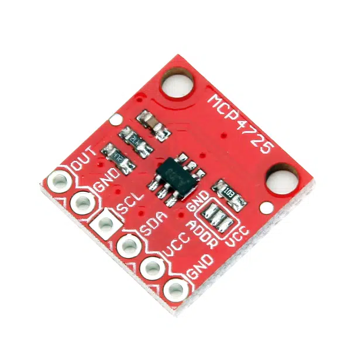

# Trabalhar com o Módulo DAC

A placa Arduino One não possui conversor D/A. A idéia é então usar o módulo I2C MPC 4725 :



Este módulo contêm um conversor D/A de 12-bits, o que significa que aceita valores de entrada entre 0 à $(2^{12}-1)=4095$, gerando tensão de saída (Pino OUT) respectivamente entre 0 à 5 Volts (quando a placa é alimentada com 5 Volts no pino VCC).

Este módulo se comunica com um microcontrolador externo usando I2C via pinos SCL e SDA, onde 

No entanto para acessar este módulo via IDE tradicional do Arduino se faz necessário instalar sua biblioteca:

## Instalação das Bibliotecas para trabalho com MPC4725.

Revisando páginas exemplo na internet usando este módulo perbemos que o mesmo foi originalmente disponibilizado pela empresa **Adafruit**: [MCP4725 Breakout Board - 12-Bit DAC with I2C Interface](https://www.adafruit.com/product/935). Esta mesma empresa disponibilizou uma biblioteca (em código C) para trabalhar com este módulo: [GitHub Public: Adafruit_MCP4725](https://github.com/adafruit/Adafruit_MCP4725).

Para instalar as bibliotecas fazer:

1. Acesse a página no [GitHub Public: Adafruit_MCP4725](https://github.com/adafruit/Adafruit_MCP4725), clique no botão [DOWNLOADS] no canto superior direito, e baixe o arquivo .zip. Outro local que dá acesso a esta biblioteca é: https://github.com/adafruit/Adafruit_MCP4725/archive/master.zip ou [Arduino.cc >> Adafruit_MCP4725-2.0.0.zip](https://downloads.arduino.cc/libraries/github.com/adafruit/Adafruit_MCP4725-2.0.0.zip?_gl=1*1u3djrw*_ga*MTgzMTk4MjI0LjE2OTk3Mjc5MjU.*_ga_NEXN8H46L5*MTY5OTczOTU0MS4zLjEuMTY5OTczOTczMy4wLjAuMA..).
2. Pode ser útil comprovar que este arquivo compactoido contêm os arquivos:  `Adafruit_MCP4725.cpp` (arquivo que codifica os métodos da classe `Adafruit_MCP4725`) e `Adafruit_MCP4725.h` (arquivo que inclui as definições de métodos da classe `Adafruit_MCP4725`).
3. Você pode mover a a pasta da biblioteca Adafruit_MCP4725 para a sua pasta: `/Users/<user>/Documents/Arduino/libraries/`**ou mais fácil:**
4. Para acrescentar componentes à biblioteca do Arduíno pode ser usando o [Gerenciador da Biblioteca (*Library Manager*)](https://www.arduino.cc/en/Guide/Libraries) do mesmo. **É possível instalar a biblioteca diretamente à partir do arquivo `.zip`**. Basta na IDE do  Arduino, navegar na barra do menu até "Sketch > Incluir Biblioteca > Adicionar Biblioteca .ZIP" (*Sketch > Include Library > Add .ZIP Library*), como mostra a figura abaixo:


5.  Também será necessário baixar a bibluoteca `Adafruit_BusIO`. Se pode tentar usar o Gerenciador da Biblioteca, ou baixar o arquivo .zip à partir de: https://github.com/adafruit/Adafruit_BusIO (Localizar a opção `<> Code v` e clicar na mesma, fazendo abrir a abra "Local" e escolhendo por fim "Download ZIP").

6.  Ao final deste processo, você deve ter instalado algo do tipo (à partir da pasta: `/Users/<user>/Documents/Arduino/`):

    ```bash
    ├── libraries
    │   ├── Adafruit_BusIO
    │   │   ├── Adafruit_BusIO_Register.cpp
    │   │   ├── Adafruit_BusIO_Register.h
    │   │   ├── Adafruit_I2CDevice.cpp
    │   │   ├── Adafruit_I2CDevice.h
    │   │   ├── Adafruit_I2CRegister.h
    │   │   ├── Adafruit_SPIDevice.cpp
    │   │   ├── Adafruit_SPIDevice.h
    │   │   ├── CMakeLists.txt
    │   │   ├── LICENSE
    │   │   ├── README.md
    │   │   ├── component.mk
    │   │   ├── examples
    │   │   │   ├── i2c_address_detect
    │   │   │   │   └── i2c_address_detect.ino
    │   │   │   ├── i2c_readwrite
    │   │   │   │   └── i2c_readwrite.ino
    │   │   │   ├── i2c_registers
    │   │   │   │   └── i2c_registers.ino
    │   │   │   ├── i2corspi_register
    │   │   │   │   └── i2corspi_register.ino
    │   │   │   ├── spi_modetest
    │   │   │   │   └── spi_modetest.ino
    │   │   │   ├── spi_readwrite
    │   │   │   │   └── spi_readwrite.ino
    │   │   │   ├── spi_register_bits
    │   │   │   │   └── spi_register_bits.ino
    │   │   │   └── spi_registers
    │   │   │       └── spi_registers.ino
    │   │   └── library.properties
    │   └── Adafruit_MCP4725
    │       ├── Adafruit_MCP4725.cpp
    │       ├── Adafruit_MCP4725.h
    │       ├── README.md
    │       ├── code-of-conduct.md
    │       ├── examples
    │       │   ├── sinewave
    │       │   │   └── sinewave.ino
    │       │   └── trianglewave
    │       │       └── trianglewave.ino
    │       ├── library.properties
    │       ├── license.txt
    │       └── trianglewave.png
    ```

7.  Será necessário **re-iniciar a IDE do Arduino** para estas bibliotecas poderem ser reconhecidas.

*Obs.:* esta biblioteca requer a biblioteca `<Wire.h>` do Arduino para poder trabalhar com I2C.

Como deve ter sido percebido, dentro da pasta `/libraries` há exemplos de como acessar com estes módulos.

## Acesando fisicamente o módulo I2C MPC4725

Os seguintes pinos físicos do módulo devem ser assim conectados:

*   pino VCC à alguma saída "5V" do Arduino (este pino também aceita 3,3 Volts);
*   pino GND ao GND do Arduíno;
*   pino SDA (Data) --> pino A4 do Arduino;
*   pino SCL (Clcok) --> pino A5 do Arduino (aparentemente já existe resistor 10K pullup para 5 Volts no DAC, e esta saída já trabalha com um sinal de 440 KHz).
*   pino VOUT = saída analógica do módulo.

## Acessando por software o módulo I2C MPC4725:

Este módulo se conecta a um microcontrolador usando comunicação I2C. A princípio, este módulo pode ser encontrado em 6 endereços (ID) diferentes: 0x60, 0x61, 0x62, 0x63, 0x64, 0x65.

Se pino A0 do DAC está desconectado --> normalmente este módulo é encontrado no endereço: 0x62.

Se pino A0 do DAC está conectado à Vdd --> este módulo é encontrado em: 0x63

Ref.: https://learn.adafruit.com/mcp4725-12-bit-dac-tutorial/wiring

Sugestão de programação:

**Antes** do bloco:

```c++
void setup() {
    // put your setup code here, to run once:
    
}
```

Você deve acrescentar as linhas:

```c++
#include <Wire.h>               // necessário para comunicação I2C
#include <Adafruit_MCP4725.h>   // necessário para acessar o DAC

Adafruit_MCP4725 dac;   // para instanciar o objeto "dac" pertencente a classe "Adafruit_MCP4725"

// pode ser útil declarar a variável global booleana abaixo
bool DAC_found = false; // indica problemas para acessar DAC
```

**Depois** disto para acessar o módulo, deve fazer:

1.  Na seção `void setup(){`:

```c++
void setup(){
    Serial.begin(9600); // ativa porta serial
    delay(100);  // espera porta inicializar
    Serial.println("");
    Serial.println("Buscando Módulo DAC MCP4725");
	delay(50);
    for (uint8_t ender = 0x60; ender <= 0x65; ender++){
    	Serial.print("Testando endereço: 0x");
    	Serial.print(ender, HEX);
    	DAC_found = dac.begin(ender);
    	if (DAC_found){
      		Serial.println(" <-- Encontrado, Ok");
      		digitalWrite(pino_monitor_DAC, HIGH);
      		break; // sai do for
        }
	    Serial.println("");
    }
	if (!DAC_found){
    	Serial.print("Ops... Modulo DAC MCP4725 não encontrado");
  	}
    // seguem outros comandos seus...
}
```

2.  A ISR que vai comandar o módulo DAC, fica algo como:

```c++
ISR(TIMER2_COMPA_vect){ 
    //timer2 interrupt 
    // suas linhas de programa...
 	DAC_found = dac.setVoltage(valor, false);
	// outras linhas de programa...
    // Você poderia fazer algo como:
    // if (!DAC_found) WarnLostDAC();
    // a rotina 'WarnLostDAC()' desabilita uso desta interrupção, seta flag avisando de problemas.
}
```

Fim.

