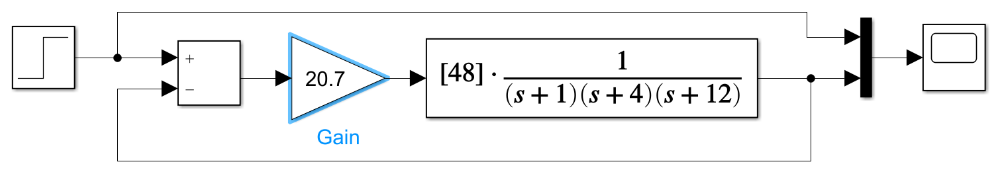
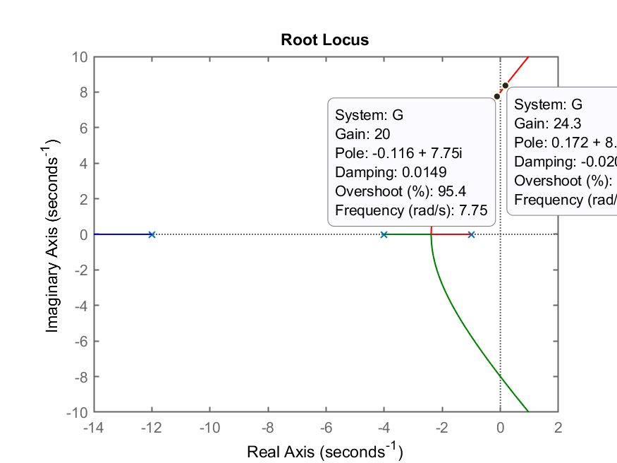
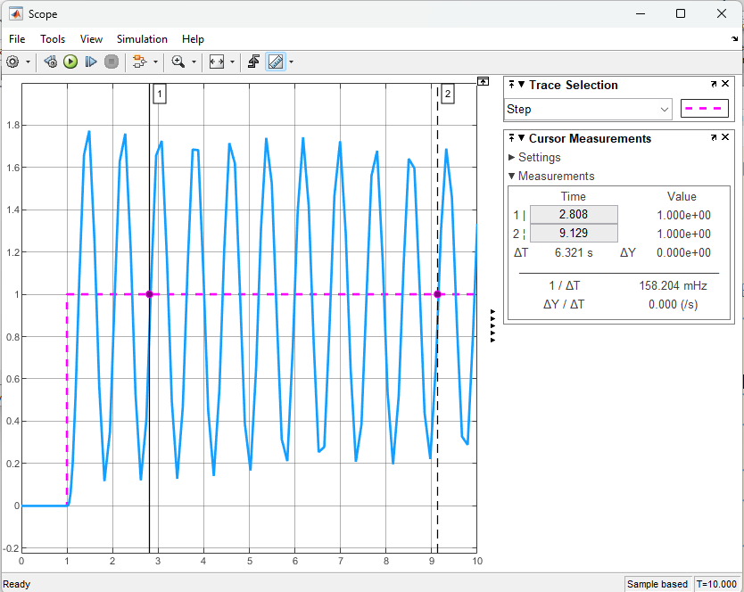
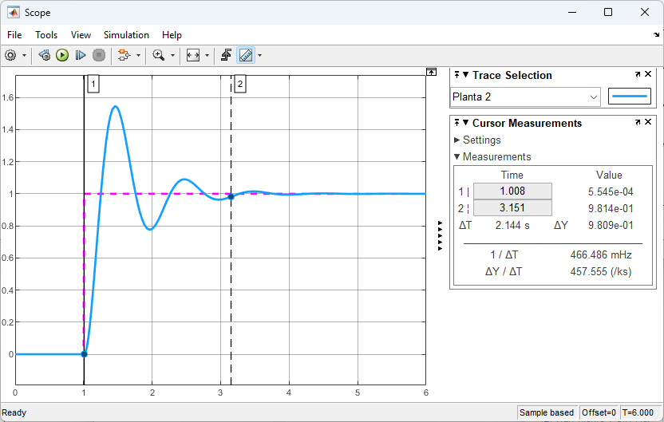

Photo by <a href="https://unsplash.com/@invent?utm_source=unsplash&utm_medium=referral&utm_content=creditCopyText">Colin Maynard</a> on <a href="https://unsplash.com/collections/1245/sea?utm_source=unsplash&utm_medium=referral&utm_content=creditCopyText">Unsplash</a>

# Métodos de Sintonia de PID

## Método 2) Buscando $K_u$

Usando Simulink, foi gerado o diagrama de blocos mostrada a seguir (arquivo [[planta_1_Ku.slx]](planta_1_Ku.slx)):


A idéia é aumentar o ganho até descobrir o valor máximo, $K_u$, que coloca o sistema numa oscilação sustentada.

Para acelerar este processo e como neste caso, trata-se de uma simulação onde usamos (sabemos) o modelo matemático da planta, podemos usar a teoria de controle automático para descobrir de forma mais rápida o valor do ganho máximo. Podemos traçar o Root Locus deste sistema e descobrir $K_u$.

Então no Matlab:

```matlab
>> G=tf(20,poly([-1 -2])) % sismples sistema de 2a-ordem

G =
 
       20
  -------------
  s^2 + 3 s + 2
 
Continuous-time transfer function.

>> rlocus(G)
```

O que rende o gráfico a seguir:


Notamos pelo RL gerado, que o $K_u=\infty$ para esta planta. Consequentemente este método não serve para este tipo de sistema.

### Outra planta: modelo de 3a-ordem

Modificando ligeiramente a planta, acrescentando um 3o-polo.

```matlab
>> G=tf(48,poly([-1 -4 -12])); % simples sistema de 3a-ordem
>> zpk(G)

          48
  ------------------
  (s+12) (s+4) (s+1)
 
Continuous-time zero/pole/gain model.

>> % Descobrindo y(\infty) para entrada degrau, MA, desta planta
>> dcgain(G)
ans =
     1
```

Entrando com esta planta no Simulink, (arquivo [[planta_2_Ku.slx]](planta_2_Ku.slx)), a ideia é ir incrementando o ganho proporcional até o sistema entrar numa oscilação sustentada:



Da mesma forma que anteriormente, para acelerar a busca pelo $K_u$ vamos recorrer ao Root Locus deste sistema.
o $K_u$

```matlab
>> figure; rlocus(G)
>> axis([-14 2 -10 10]) % Zoom na região de interesse
```

E assim obtemos o seguinte Root Lucos que destaca uma faixa de ganhos para $Ku$.



Notamos que $20 < K_u < 24,3$. Agora, só nos resta fazer testes e buscar pela oscilação sustentanda.

Por fim, testando $K_u=21,7$:

```matlab
>> Ku=21.7;
>> ftmf=feedback(Ku*G,1);
>> figure; step(ftmf)
```

Usando $K_u \cong 21,4$ no diagrama de blocos editado no Simulink, obtemos a saída:


Ativando a oção "measurements" na janela de Scope do Simulink e separando uns 8 ciclos de oscilação (para melhorar a precisão no cálculo de $T_u$, período de oscilação), obtemos:



Notamos que dentro dos 8 ciclos oscilamos temos um intervalo de tempo igual à $\Delta t = 6,321$ segundos, então:

```matlab
>> Tu=6.321/8
Tu =
      0.79012
>> % O que, por curiosidade rende a seguinte freq. de oscilação:
>> fu=1/Tu
fu =
       1.2656
```

Usando a tabela de Ziegler-Nichols para lembrar os valores sugeridos para os parâmatros $K_p$ (ganho proporcional), $K_i$ (ganho integrativo) e $K_d$ (ganho derivativo) para o PID selecionado no Simulink (que usa estrutura parelela), teremos:

| Controlador |	$K_{p}$ | $T_{i}$ |	$T_{d}$ | $K_{i}$ | $K_{d}$ |
| ---: | :---: | :---: | :---: | :---: | :---: | 
| P	| $0.50K_{u}$ | – |	– | – |	– |
| PI |	$0.45\,K_{u}$ | $0.8{\dot{3}}\,T_{u}$ | 	– |	$0.54\,(K_u/T_u)$ | 
| PD |	$0.80\,K_{u}$ |	– |	$0.125\,T_{u}$ |	– |	$0.100\,K_{u}\,T_{u}$ |
| PID clássico |	$0.60\,K_{u}$ |	$0.50\,T_{u}$ |	$0.125\,T_{u}$ |	$1.2\,(K_{u}/T_{u})$ | $0.075\,K_{u}\,T_{u}$ |
| Regra Integrador de Pessen |	$0.70\,K_{u}$ | $0.40\,T_{u}$ |	$0.150\,T_{u}$ |	$1.75\,(K_{u}/T_{u})$ |	$0.105\,K_{u}\,T_{u}$ |
| Algum overshoot | $0.3\dot{3}\,K_{u}$ |  $0.50\,T_{u}$ | $0.33\dot{3}\,T_{u}$ |  $0.{6}\dot{6}\,(K_{u}/T_{u})$ |	$0.11\dot{1}\,K_{u}\,T_{u}$ |
| Sem overshoot | $0.20\,K_{u}$ |	$0.50\, T_{u}$ |	$0.33\dot{3}\,T_{u}$ |	$0.40\,(K_{u}/T_{u})$ |	$0.06\dot{6}\,K_{u}\,T_{u}$ |

> Tabela originalmente diponível em: https://en.wikipedia.org/wiki/Ziegler%E2%80%93Nichols_method (em 13/10/2022).

Realizando os cálculos no Matlab (considerando o "PID clássico", que trabalha com os valores originalmente propostos por Ziegler-Nichols):

```matlab
>> Kp=0.6*Ku
Kp =
        13.02
>> Ki=1.2*(Ku/Tu)
Ki =
       32.957
>> Kd=0.075*Ku*Tu
Kd =
       1.2859
```

Porém temos que considerar que a implementação do PID prevista no Matlab/Simulink já traz um filtro derivativo, estudado na aula anterior. Este parâmetro para o filtro atua como o máximo ganho injetado por esta ação Derivativa, mas também corresponde à frequência do corte do filtro derivativo, ou seja, a frequência à partir da qual, este filtro não trabalha mais realizado uma ação Derivativa. Se faz necessário que esta frequência de corte ocorra num valor "elevado", numa região de frequências à partir da qual não são mais esperadas oscilações rápidas do sistema à ser controlado. 

Como neste caso, temos acesso ao modelo matemático da planta, podemos analisar o Diagrama de Bode da planta para entender sua faixa dinâmica e decidir por um falor adequado para o filtro derivativo:

```matlab
>> bode(G)
>> grid
```


Pelo gráfico anterior, percebemos que podemos manter o coeficiente $N$ do filtro derivativo em 100 ($N=f_c=100$ [rad/s]).

Passando os valores dos ganhos calculados anteriormente para o PID do diagrama de blocos:


Estes valores geram a seguinte resposta ao degrau:


Percebe-se um overshoot elevado, maior que 50%, quase 60%, como esperado quando se aplicam os valores iniciais gerados para o PID sugeridos por Ziegler-Nichols (a linha "PID clássico") na tabela anterior.

Teríamos que realizar agora um "**ajuste fino**" deste PID.

Mas neste caso, voltaremos para a tabela de valores sugeridos por Z-N e vamos optar pela linha "PID algum overshoot" para verificar o quanto a resposta se modifica. Recalculando os parâmetros do PID:

```matlab
>> Kp=(1/3)*Ku
Kp =
       7.2333
>> 2/3
ans =
      0.66667
>> Ki=(2/3)*(Ku/Tu)
Ki =
       18.309
>> Kd=0.111*Ku*Tu
Kd =
       1.9032
```

Injetando estes novos valores no PID, obtemos agora um novo resultado:


Notamos um overshoot realmente bem menor e:

* $\%OS \cong 17\%$,
* tempo de assentamento, $t_s=2,342$ segundos.

Comparando com o PID anterior:



Notamos um $t_s=2,144$ segundos (o valor $\Delta T$ no quadro measurements da janela de Scope desta simulação). Note que foi usado o critério dos 2% (ou seja, note: 2 |  $y(t)=9,814 \times 10^{-1}=0,9814$ no quadro measurements).

Isto significa que é possível manter praticamente o mesmo $t_s$ encontrado noi primeiro ajuste, mas com $\%OS$ bem menor. Neste caso, a seintonia feita usando "PID: algum overshoot" foi a que permitiu alcançar os melhores resultados.

----

Para a próxima aula, está previsto testar/aplicar o método do relé para sintonia do PID.

[[Fim]](https://soundcloud.com/skrillex/ragga-twins-bad-man-skrillex-remix?in=user145374929/sets/jack-skrillex-e-diplo-1)

----

<font size="1"> Fernando Passold, em 20/10/2022.</font> 