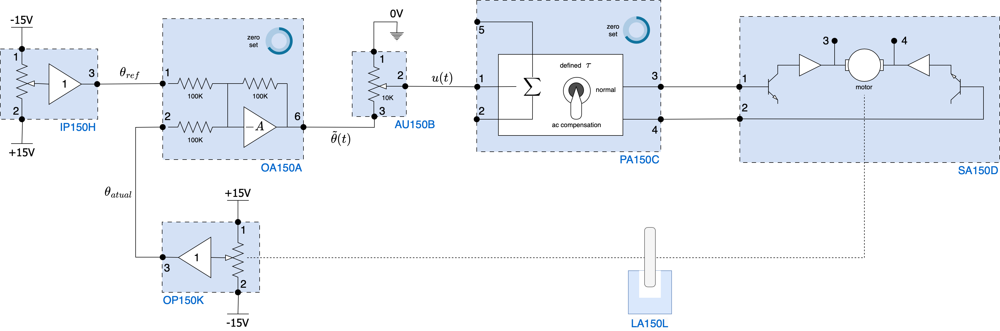
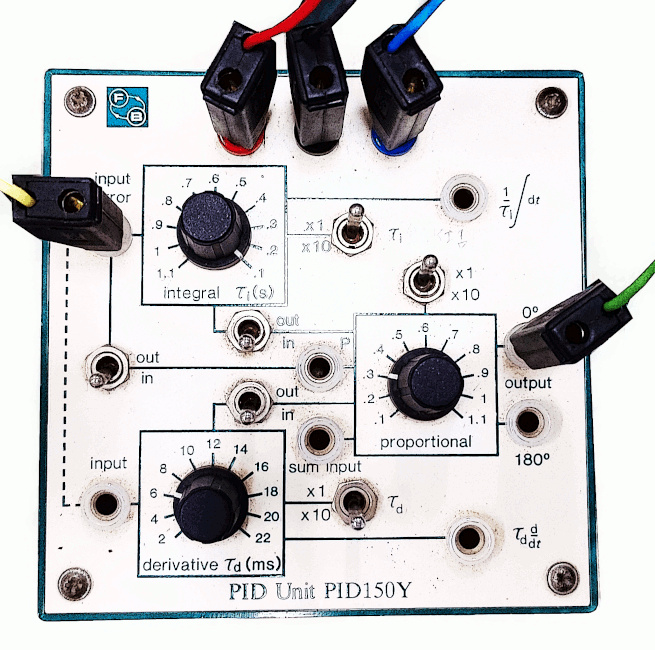

# Sintonia de PID em Controle de Posição (angular)

<!-- Laboratório previsto para data de 11/04/2023.-->

A ideia neste laboratório é realizar controle de posição em malha-fechada, baseado em controlador analógico PID. **Incluindo a sintonia do controlador PID** para este processo.

<!--A próxima figura passa uma ideia da estrutura mecânica que tentaremos controlar.-->

<!---->

<!--A primeira figura ainda mostra o tacogerador acoplado ao sistema (módulo GT150X). Na realidade, o mesmo está sendo usado como uma carga para o motor (além do freio magnético que também aparece na figura mas não está previsto para ser usado), mas também está sendo aproveitado como um ``moto-redutor'' (motor com caixa de redução). Assim, o motor pode rotacionar mais e mais rápido sem comprometer tão rapidamente a faixa de leitura do nosso sensor de posição (potenciômetro, módulo OP150K).-->

A próxima figura mostra as ligações usadas para realizar um **controle proporcional** de posição em malha-fechada usando o kit da Feedback:

<!-- Manual da Feedback, Lab 6, fig 3.6.5 -->
<!-- ou no material do Mikhail, fig. 6.4 -->

O diagrama de ligações pode ser redesenhado da seguinte forma, para compreender melhor a malha de realimentação:

Note pela figura anterior, que um potenciômetro (módulo OP150K) será usado como sensor de posição angular (lembrar que sua faixa de operação fica limitada entre $-160^o < \theta < 160^o$). Outro potenciômetor, IP150H atua como divisor de tensão gerando a referência (posição angular desejada). Algo como:

Perceba que **as polaridades** geradas pelos módulos IP150H e OP150K entram propositalmente **invertidas** no módulo do Amp.Op. (OA150A), que desempenha o papel associado com o "cálculo'' do sinal de erro, $e(t)$. Ambos os módulos IP150H e OP150K são simples potenciometros atuando como divisores de tensão. 

O módulo OA150A realiza (na sua saída 6):

$\text{Erro} = \tilde{\theta}=\theta_{ref} - \theta_{atual}$

A saída do OA150A antes de ser entregue diretamente ao driver de potência (módulo SA150D), passa antes por um **ajuste de ganho** (módulo AU150B), que permite "dosar" (reduzir a tensão do erro) que depois é repassado para o módulo pré-amplificador PA150C. O potenciômetro AU150B atua definindo o "**ganho proporcional**" desejado (neste caso: $0 \le K_p \le 1$). 

O módulo PA150C que recebe o sinal do potenciômetro gera tensões diferenciadas (saídas 3 e 4) necessárias para comandar as entradas 1 e  2 do driver de potência (SA150D), o que permite um "jogo de balanço corrente'' na armadura do motor e consequente giro no sentido horário ou anti-horário do motor. A figura abaixo esclarece o funcionamento do módulo pré-amplificador PA150C:

No caso deste laboratório, nossa intenção é realizar o controle de posição fechando a malha usando o PID, **trocamos o módulo AU150A** (potenciômetro responsável pela definção do ganho proporcional)**, pelo módulo do PID**.

A montagem anterior, considerando a incorportação do PID analógico fica algo como:

O módulo do PID (PID150Y) aparece destacado na figura abaixo:

Notamos que podemos selecionar através de chaves quando é desejada a ação Proporcional, Integral e Derivativa. E existem outras chaves para variar a amplitude do ganho proporcional ou amplitude dos tempos derivativos e integrativos.

## Ajuste do PID

Se sugere o [uso do **método 2**](aula2/aula2b.html) para ajuste inicial do PID. Isto implica inicialmente desligar propositalmente as ações integrativas e derivativas, mantendo apenas a ação proporcional. 

O estudante deve então ajustar o potenciômetro asscoiado com o ganho da ação Proporcional (e eventualmente comutar a chave para ajuste da escala de ganho da ação proporcional) para encontrar o valor do ganho máximo $K_u$ que coloca o sistema na condição de oscilação sustentada. 

| Ganho $K < K_u$ | Ganho $K=K_u$ |
| :---: | :---: |
|  |  |

A oscilação produzida na saída do sistema deverá ser observada com a **ajuda de um osciloscópio**, uma vez que o mesmo será necessário para determinar o período da oscilação, $T_u$. **LIgação do kit ao osciloscópio**: conectar o canal 1 do osciloscpópio na saída do potenciômetro que define a referência para o sistema (módulo IP150H, saída 3) e o canal 2 na saída do potenciômetro usado como sensor de posiçao (módulo OP150K, saída 3).

A medida que o estudante aumenta o valor do ganho, pode comprovar resultados gráficos na tela do osciloscópio, similares aos mostrados abaixo:

<!---->

A figura acima retrata o resultando obtido quando o sinal de referência passa a ser gerado por um **gerador de sinais**, conectado à entrada 1 do módulo OA150B (que calcula o erro; realiza a comparação). Este gerador **passa a gerar o sinal de referência**, $\theta_{ref}$. Para isto ele deve ser ajustado da seguinte forma:

* onda quadrada (simula uma entrada degrau comutando entre 2 valores extremos);

* frequência de oscilação de: 0,2 Hz:

  

* amplitude de pico de: 2,5 Volts (o que gera um sinal comutando entre $-2,5$ Vots até $+2,5$ Volts) que equivale a fazer a referência comutar entre $-30^o$ até $+30^o$. Note que esta frequência de 0,2 Hz, faz a onda quadrada se manter em cada um destes níveis de tensão por 5 segundos ($1/0,2$):

  

* *offset* ajustado em 0 (zero) Volts:

  

O gerador facilita bastante no processo de sintonia do PID pois faz variar de forma "automática" a referência.

Note que o canal 1 do osciloscópio deve ser conectado à saída do gerador ou entrada 1 do módulo OA150B.

Já o canal 2 do osciloscópio deve ser conectado na saída 3 do potenciômetro sensor de posição (módulo OP150K) ou Na entrada 2 do módulo comparador (OA150A).

O que o usuárioa deve fazer agora é "desligar" (chaves na posição "out") as ações Integrativas e Derivativas do PID (módulo PID150Y) e manter "ligada" apenas a chave correspondente à ação Proporcional, como mostrado na figura abaixo:

Em seguida, o usuário deve ir aumentando o ganho Proporcional. No osciloscópio serão observadas ondas como:

<!---->

<iframe width="640" height="360" src="https://www.youtube.com/embed/-YUX-g4TUmY" title="Osciloscópio durante processo de sintonia." frameborder="0" allow="accelerometer; autoplay; clipboard-write; encrypted-media; gyroscope; picture-in-picture" allowfullscreen></iframe>

Á medida que o ganho proporcional é aumentado, o *overshoot* aumenta e a amplitude das oscilações acaba se mantendo:

| $K_p=0,3$                               | $K_p=0,4$                          |
| --------------------------------------- | ---------------------------------- |
|  |  |

O processo fica oscilando como mostra a figura abaixo:

<iframe width="640" height="360" src="https://www.youtube.com/embed/HB7AqIxj-aE" title="Processo durante procedimento de sintonia." frameborder="0" allow="accelerometer; autoplay; clipboard-write; encrypted-media; gyroscope; picture-in-picture" allowfullscreen></iframe>

Depois que o estudante encontra o valor prático de $K_u$ (ultimate gain) e $T_u$ (período de oscilação; determinado com ajuda do osciloscópio), se faz necessário acessar alguma **Tabela de Ziegler-Nichols** para testar valores sugeridos para os parâmetros $K_p=K_c$ (ganho proporcional), $\tau_i$ (tempo de integração) e $\tau_d$ (tempo derivativo) para um primeiro teste do PID analógico:

|                Controlador |       $K_{p}$       |        $T_{i}$        |       $T_{d}$        |            $K_{i}$            |           $K_{d}$           |
| -------------------------: | :-----------------: | :-------------------: | :------------------: | :---------------------------: | :-------------------------: |
|                          P |     $0.50K_{u}$     |           –           |          –           |               –               |              –              |
|                         PI |    $0.45\,K_{u}$    | $0.8{\dot{3}}\,T_{u}$ |          –           |       $0.54\,(K_u/T_u)$       |                             |
|                         PD |    $0.80\,K_{u}$    |           –           |    $0.125\,T_{u}$    |               –               |    $0.100\,K_{u}\,T_{u}$    |
|           ==PID clássico== |    $0.60\,K_{u}$    |     $0.50\,T_{u}$     |    $0.125\,T_{u}$    |     $1.2\,(K_{u}/T_{u})$      |    $0.075\,K_{u}\,T_{u}$    |
| Regra Integrador de Pessen |    $0.70\,K_{u}$    |     $0.40\,T_{u}$     |    $0.150\,T_{u}$    |     $1.75\,(K_{u}/T_{u})$     |    $0.105\,K_{u}\,T_{u}$    |
|            Algum overshoot | $0.3\dot{3}\,K_{u}$ |     $0.50\,T_{u}$     | $0.33\dot{3}\,T_{u}$ | $0.{6}\dot{6}\,(K_{u}/T_{u})$ | $0.11\dot{1}\,K_{u}\,T_{u}$ |
|              Sem overshoot |    $0.20\,K_{u}$    |    $0.50\, T_{u}$     | $0.33\dot{3}\,T_{u}$ |     $0.40\,(K_{u}/T_{u})$     | $0.06\dot{6}\,K_{u}\,T_{u}$ |

> Tabela originalmente diponível em: https://en.wikipedia.org/wiki/Ziegler%E2%80%93Nichols_method (acessado em 13/10/2022).

Neste primeiro teste do PID são esperado *overshoots* elevados, algo como:

Inicialmente podem ser encontrados resultados como:

Neste caso: $\%OS=\dfrac{3,68-2,56}{2,56}\times 100\%=43,75\%$.

Depois, uma **sintonia fina** dever ser conduzida para determinar os valores finais dos parâmetros do PID para tentar limitar o $\%OS \le 30\%$.

O estudante deve **apresentar** as telas capturadas do osciloscópio para comprovar os ajustes realizados usando o PID: o primeiro ajuste refletindo a simples adoção dos valores sigeridos por Ziegler-Nichols e uma segunda tela mostrando o resultado da "sintonia fina" do PID.

## Questões

1. Apresentar o esquema de ligações elétricas dos módulos Feedback incorporando o controlador PID.
2. Apresentar um diagrama em blocos equivalente do sistema realizada na prática.
3. Apresentar o valor encontrado para $K_u$ e $T_u$, mostrando a tela capturada na saída do osciloscópio comprovando a oscilação sustentada.
4. Apresentar os cálculos dos parâmetros iniciais do PID: $K_c$, $T_i$ e $T_d$. O módulo PID150Y parece contemplar um PID no formato ISA, onde alterar o ganho $K_c$ também implica alterar os valores iniciais encontrados para $T_i$ e $T_d$.
5. Mostrar o resultado obtido na prática com a sintonia inicial do PID baseada no método 2. Mostrar a tela do osciloscópio.
6. Realizar o posterior "ajuste fino'' do PID, variando seus parâmetros para limitar o sobressinal a no máximo 10%.

Fim.

---

Fernando Passold, em 11/04/2023
