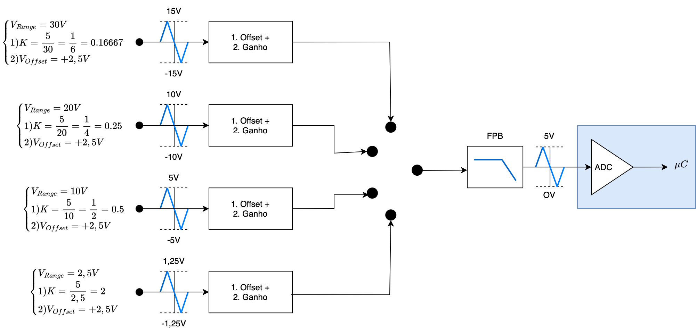
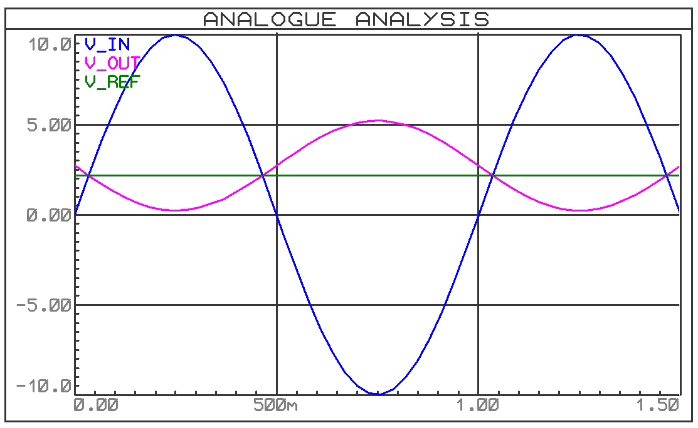
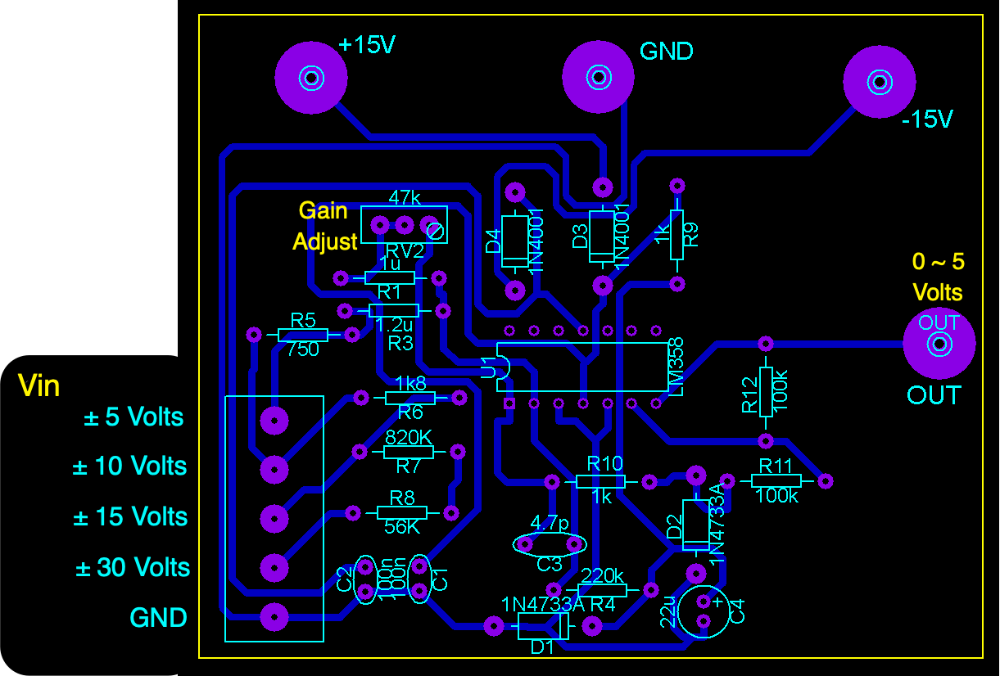
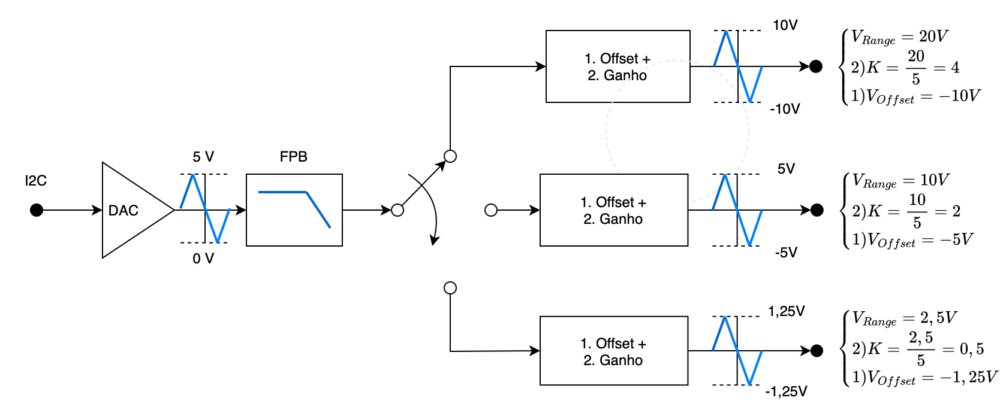
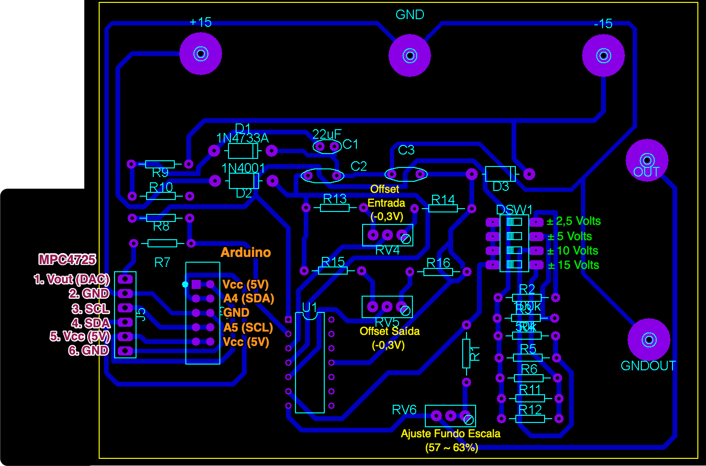
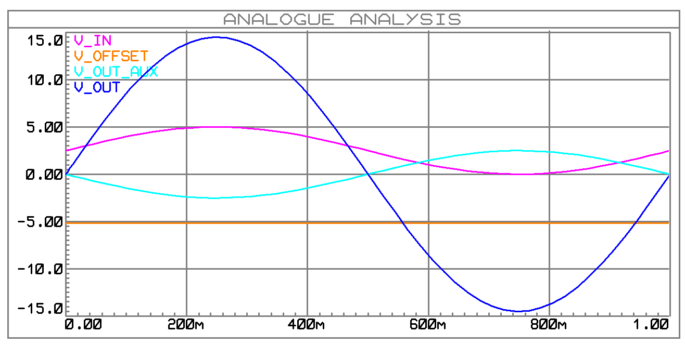
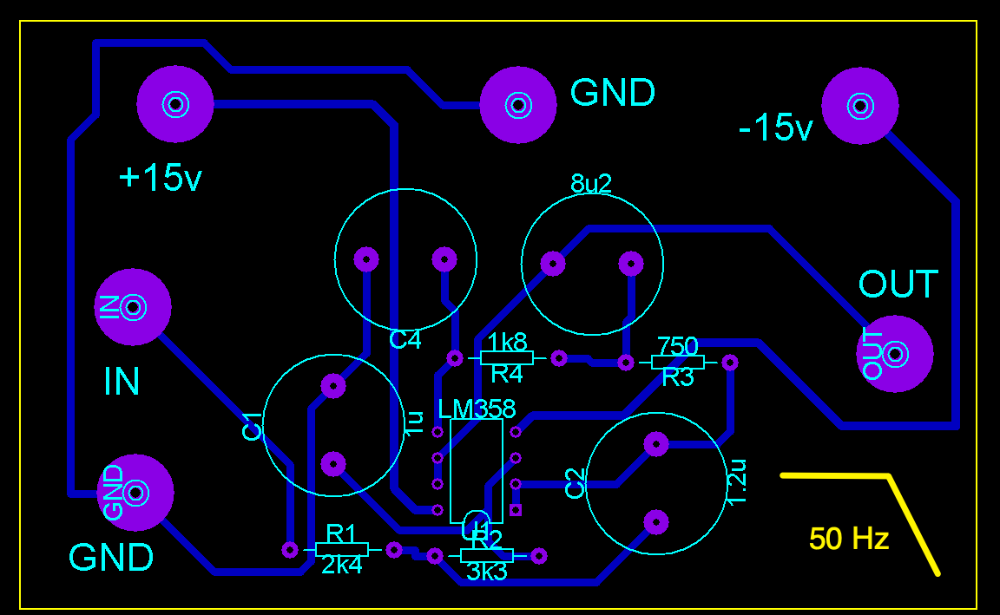
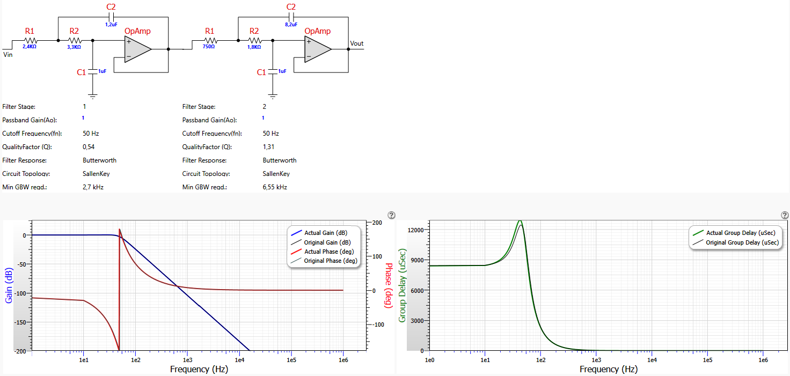

# Placas extras para uso com Kits Feedback

- [Placas extras para uso com Kits Feedback](#placas-extras-para-uso-com-kits-feedback)
  - [Justificativa](#justificativa)
  - [Placa para Adequar sinais para canais A/D de Arduino Uno](#placa-para-adequar-sinais-para-canais-ad-de-arduino-uno)
  - [Placa de Saídas Analógicas](#placa-de-saídas-analógicas)
  - [Filtro Passa Baixas](#filtro-passa-baixas)

## Justificativa

No início de 2024/1 foi desenvolvido um conjunto de placas eletrônicas para possibilitar práticas de controle digital usando os kits Analógicos MS150 da Feedback, como mostrado abaixo (mais detalhes, clicar [aqui](https://fpassold.github.io/Lab_Controle_2/PID_Arduino/setup_arduino_PID.html)):

Este kit está previsto para trabalhar apenas com sinais analógicos. Não com sinais digitais.

Para fazê-lo operar com sinais digitais, devem ser previtos conversores A/D e D/A com diferrentes faixas de tensão. Por exemplo, seu driver de potência, mpodulo SA150D aceita tensões de entrada variando entre $\pm 10$ Volts quando o motor está submetido a alguma carga ou menos ($\pm 2,5$ Volts com motor operando à vazio). O sensor de posição, módulo OP150K é um simples potenciômetro trabalhando como divisor de tensão gerando tensões analógicas na sua saída variando entre $\pm 15$ Volts. O problema é que placas microcontroladas não costumam trabalhar com sinais obedecendo á estas faixas de excursãi de sinais., Faz-se necessário o uso de circuitos/placas extras.

## Placa para Adequar sinais para canais A/D de Arduino Uno

**Placa prevista para uso com A/D's**

Placas Arduino Uno possuem entradas analógicas com conversores analógicos para digitais de 10-bits, mas sua entrada analógica fica limitada à faixa de 0 á 5 Volts.O fundo de escala coincidindo com a tensão de alimentação destas placas.

Então foi desenvolvida uma placa que permite trabalhar com diferentes faixas de tensões de entrada:

Neste diagrama aparece um filtro passa-baixas que se preferiu disponibilizar como uma placa eletrônica separada.

A idéia desta placa é restringir sinais analógicas com grandes faixas de variação de tensão, por exemplo, um sinal de entrada (V\_IN) variando entre $-10$ V até $+10$ V e enquadrar sua saída (V\_OUT) para a limitada faixa de 0 até 5 Volts:

A aparência final da placa que permite trabalhar com estas diferentes faixas de tensão de entrada aparece abaixo:

Note que existem diferentes pinos para as diferentes faixas de entrada de tensão analógica.

Esta placa necessita alimentação externa simétrica, disponibilizada pela fonte de alimentação já usada para os kits Feeedback. Sua única saída "OUT" enquadra as diferentes faixas de tensão de entrada, na limitada faixa de 0 à 5 Volts, garantindo ainda proteção para a entrada analógica de placas Arduíno.

## Placa de Saídas Analógicas

**Placa de D/A com diferentes faixas de tensões de saída**

Placas do tipo Arduino Uno não contam com conversores digitais para analógicos nas mesmas. Então foi previsto o uso do módulo DAC I2C MCP 4725, de 12-bits:

Mais sobre este módulo e como instalar bibliotecas de software para trabalhar com a mesma, clicar [aqui](https://fpassold.github.io/Lab_Controle_2/PID_Digital/modulo_DAC.html).

Esta placa transforma um sinal analógico variando de 0 até Vcc (5 Volts no caso de placas Arduiino) para 12-bits, e repassa este valor usando saída digital I2C. Placas Arduino Uno possuem pinos dedicados para comunicação I2C com periférios. O detalhe é que a tensão de entrada nesta placa fica restrito à faixa de 0 até 5 Volts, então outro circuito eletrônico foi desenvolvido para ampliar as faixas de entrada analógicas:

A figura abaixo retrata a placa desenvolvida para este fim:

Esta placa também é alimentada com tensões simétricas ($-15$ V, 0 V e $+15$ V) obtidas á partir da fonte de alimentação usada pelos kits Feedback. Possui 1 terminal de saída "OUT" e prevê o encaixe do módulo MPC 4725 na mesma e sua conexão com os canais de comunicação I2C de placas Arduino.

Abaixo aparece uma simulação do sinal de saída desta placa caso seu usuário tenha optado por tensão de saída (V\_OUT) na faixa de $-15$ V até $+15$ V, através da chave DIP DSW1:

Note que o módulo MPC 4725 só é capaz de gerar tensões entre 0 à 5 Volts (linha magenta claro, sinal V\_IN) e esta placa dá um granho e acrescenta um *offset* para possibilitar a saída (V\_OUT) na faixa de $-15$ V até $+15$ Volts.

## Filtro Passa Baixas

Acompanhando as placas anteriores, está previsto, de forma separada, placas de filtros analógicos com frequência de corte de 50Hz, Butterworth de 4a-ordem:

A próxima figura mostra alguns detalhes de projeto deste filtro (ganho = 1 ou 0 dB; passband ripple = 1 dB; passband freq = 50 Hz; corner freq. Attenuation = -3 dB):

Com estas placas acredita-se que fica muito mais fácil e prática executar práticas de controle automático digital com kits analógiocs MS150 da Feedback.

Obs.: As placas só foram finalizadas lá pelo dia 14/06/2024.

---

🌊 [Fernando Passold](https://fpassold.github.io/)[ 📬 ](mailto:fpassold@gmail.com), 

