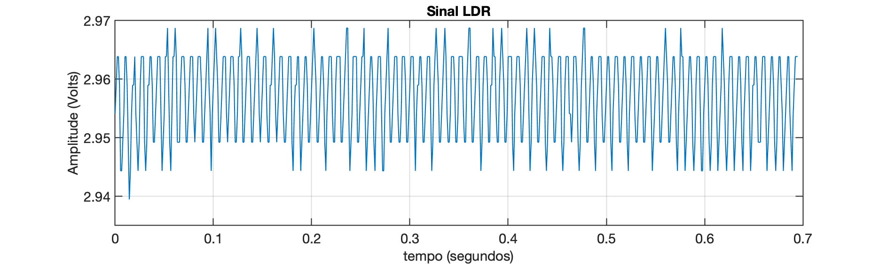

# Capturando e Analisando Dados

A idéia é exportar os dados capturados através do Arduíno e enviados pela porta serial do PC num arquivo texto para posterior análise (leitura e visualizações) usando o Matlab.

## Capturando dados da porta serial

Primeiramente vamos usar um simples código em Python capaz de ler dados de uma porta serial, 2 colunas de dados "float" (4 casas decimais) e gravar estes dados num arquivo texto, seguindo o mesmo formato (uma cópia), até que o usuário digite uma tecla e isto provoque o fim da captura de dados e fechamento do arquivo texto com os dados capturados.

Para ler dados de uma porta serial e gravar esses dados em um arquivo texto, você pode usar a biblioteca `pyserial` para a comunicação serial. Aqui está um exemplo de como você pode fazer isso:

1. Primeiro, certifique-se de que você tem a biblioteca `pyserial` instalada. Você pode instalá-la usando o seguinte comando:
    ```sh
    pip install pyserial
    ```

2. Aqui está o código Python para ler os dados da porta serial e gravar em um arquivo texto até que o usuário pressione uma tecla:

Código: <a href="capture_serial_data.py" target="_blank">capture_serial_data.py</a>

```python
import serial
import threading
import os

# Configurações da porta serial
porta_serial = '/dev/cu.usbmodem14201'  # Substitua pelo nome da porta serial correta no seu conputador (este código fio executado no macOS)
taxa_baude = 115200 #9600

# Função para parar a captura quando uma tecla for pressionada
def espera_tecla():
    input("Pressione Enter para parar a captura de dados...\n")
    global capturando
    capturando = False

# Função principal para ler da porta serial e escrever no arquivo
def captura_dados():
    try:
        with serial.Serial(porta_serial, taxa_baude, timeout=1) as ser:
            with open('dados_capturados_LDR.txt', 'w') as arquivo:
                while capturando:
                    linha = ser.readline().decode('utf-8').strip()
                    if linha:
                        print(linha)
                        arquivo.write(linha + '\n')
    except serial.SerialException as e:
        print(f"Erro ao acessar a porta serial: {e}")
    except OSError as e:
        print(f"Erro ao abrir o arquivo: {e}")

# Variável global para controlar a captura
capturando = True

# Inicia a captura de dados em uma thread separada
thread_captura = threading.Thread(target=captura_dados)
thread_captura.start()

# Espera o usuário pressionar uma tecla para parar a captura
espera_tecla()

# Aguarda a thread de captura finalizar
thread_captura.join()

print("Captura de dados finalizada.")
```

### Explicação do Código

1. **Importações e Configurações**:
    - Importamos as bibliotecas necessárias: `serial` para comunicação serial, `threading` para gerenciamento de threads e `os` para manipulações do sistema operacional.
    - Configuramos a porta serial (`porta_serial`) e a taxa de baude (`taxa_baude`).

2. **Função `espera_tecla`**:
    - Esta função simplesmente espera que o usuário pressione Enter para definir a variável global `capturando` como `False`, o que irá parar a captura de dados.

3. **Função `captura_dados`**:
    - Abre a porta serial e o arquivo texto para escrita.
    - Em um loop, lê linhas da porta serial, decodifica-as e escreve no arquivo até que `capturando` seja definido como `False`.

4. **Controle da Captura**:
    - Usamos uma variável global `capturando` para controlar o loop de captura.
    - Iniciamos a captura em uma thread separada para que o programa possa continuar rodando enquanto captura os dados.
    - Chamamos `espera_tecla` para esperar a entrada do usuário.
    - Após a entrada do usuário, esperamos a thread de captura finalizar com `join()`.

### Execução
Para executar este código:
1. Certifique-se de que sua porta serial está correta.
2. Execute o script Python.
3. O programa começará a capturar dados da porta serial e escrever no arquivo `dados_capturados.txt`.
4. Pressione Enter para parar a captura.

Este código deve funcionar no macOS e também em outras plataformas, desde que a biblioteca `pyserial` esteja instalada e configurada corretamente.

**Teste**:

Executando:

```bash
% python capture_serial_data.py
Memória livre disponível (bytes): 1498
Número máximo de leituras possíveis: 749
Vamos tentar realizar: 674 leituras
Iniciando a captura de dados...
Tempo de início (ms): 7
Tempo de término (ms): 756
Tempo total (ms): 749
Período de amostragem (ms): 1.1113
Leituras capturadas:
444
529
558
575
583
589
:
603
605
606
607
607
607
Captura concluída.
```

Arquivo exemplo gerado:  [dados_capturados_LDR.txt](dados_capturados_LDR.txt):

```
Filtro média móvel 10 amostras
Memória livre disponível (bytes): 1498
Número máximo de leituras possíveis: 749
Vamos tentar realizar: 674 leituras
Iniciando a captura de dados...
Tempo de início (ms): 7
Tempo de término (ms): 756
Tempo total (ms): 749
Período de amostragem (ms): 1.1113
Leituras capturadas:
444
529
558
575
583
589
:
603
605
606
607
607
607
Captura concluída.
```

Obs.: Note que foi criado um programa em C para o Arduíno ( [captura_dados_delay_1ms.ino](captura_dados_delay_1ms.ino.txt) ) para capturar dados do seu conversor A/D à taxa de 1 ms (sem usar ISR). Isto é, o código aloca dinamicamente a maior quantidade de memória disponível para um vetor onde os dados amostrados serão temporariamente armazenados. Este código mostra o instante inicial em que foi iniciada e finalizada a captura de dados, e assim é possível determinar a taxa de amostragem atingida. Depois que a captura de dados é finaliza, os dados armazenados neste vetor e outras informações relevantes são exportadas pela porta serial. Considerar que enviar dados pela porta serial pode consumir mais tempo que o menor período de amostragem que poderia ser obtido usando o Arduíno.

## FFT sobre dados capturados

Recordando de [Usando função *fft* do Matlab](https://fpassold.github.io/Process_Sinais/usando_fft_matlab.html)...

O arquivo gerado anteriormente ([dados_capturados_LDR.txt](dados_capturados_LDR.txt)) pode ser editado (num editor de textos comum) para ficar apenas com 2 colunas numéricas separadas por espaço em branco. O Matlab pode ser usado para ler este arquivo usando o comando:

```matlab
>> x=load('dados_LDR_1ms.txt');
```

Supondo que neste caso, foi criado um novo arquivo chamado: [dados_LDR_1ms.txt](dados_LDR_1ms.txt). O comando anterior lê os dados do arquivo para o vetor $x$. Este arquivo contêm os dados apenas do sinal bruto, sem nenhum escalonamento (valores inteiros variando entre 0 à 1023 já que o A/D do Arduíno é de 10-bits). Este arquivo em particular contêm 674 amostras que em teoria foram capturados à uma taxa de 1 ms (1 KHz). Gastou-se 749 mili-segundos para gerar estes dados, o que significa que o código usado no Arduíno para captura destes dados, não trabalhou na taxa desejada de 1 mili-segundo entre amostras, mas sim:

$T=\dfrac{756-749}{length(x)}=0,0011113$ segundos ou, $f_s=\dfrac{1}{T}=899,87$ Hz.

A figura abaixo mostra o resultado temporal desta amostra de dados:



Obs.: O sinal brutro (variando entre 0 à 1024) foi re-escalonado para a faixa de 0 à 5 Volts.

Enfim, considerando-se esta taxa de amostragem, ignorando algumas amostras iniciais (`x=x(49:length(x));`), resultando em 626 pontos amostrados, foi obtido o seguinte espectro deste sinal:


Nota-se o componente DC de $\cong 3$ Volts (conforme esperado) e outros componentes menores até a faixa dos 1,5 Hz:


```matlab
>> % Separando os 10 maiores picos da FFT
>> [Maiores,Index]=sort(P1,'descend');
>> [f(1,Index(1:10))'  P1(Index(1:10))]		
ans =
            0       2.9572
       120.75     0.003467
       119.31    0.0022281
       122.19    0.0009229
       240.06   0.00086962
       117.87   0.00086652
       123.62   0.00063583
       116.44   0.00057221
       125.06   0.00051692
          115   0.00050425
>> %  Freq(Hz)  Pico(Volts)
```

Percebe-se um pico de 3,467 mV de pico ocorrendo em 120,75 Hz e outros próximos desta frequência:


Porém note que este pico em 120 Hz é de apenas 3,5 mV, uma amplitude muito baixa se comparado com o nível CD do sinal (frequência zero) de aproximadamente 3,0 Volts;  $\cong \dfrac{(0,003467\times 100\%)}{3,0}=0,12\%$ (ou $ 20 \times \log_{10}(3/0,003467)=58,743$ dB). 

Note ainda que a "resolução" (passo) frequencial do gráfico espectral está em: $\dfrac{f_s}{L}=\dfrac{899,87}{626}=1,4375$ Hz.

Uma análise mais "visual" do sinal no domínio tempo parece revelar um "ripple" de 14,648 mV de pico ocorrendo na frequência aproximada de 128,55 Hz, ou a cada 7 amostras aproximadamente:


```matlab
>> 608-602	% instantes de amostragem
ans =
     6
>> 6*5/1024
ans =
     0.029297

>> ans/2
ans =
     0.014648
>> delta_k=140-133
delta_k =
     7
>> delta_k=158-151
delta_k =
     7
>> f_ripple=1/(7*T)
>> f_ripple =
       128.55
```

O que significa que eventualmente um filtro de média móvel de 7 ou 8 passos seria suficiente para filtrar o componente oscilatório presente neste sinal.


---

<font size="2">🌊 [Fernando Passold](https://fpassold.github.io/)[ 📬 ](mailto:fpassold@gmail.com), <script language="JavaScript"><!-- Hide JavaScript...
var LastUpdated = document.lastModified;
document.writeln ("página criada em 19/06/2024; atualizada em " + LastUpdated); // End Hiding -->
</script></font>

